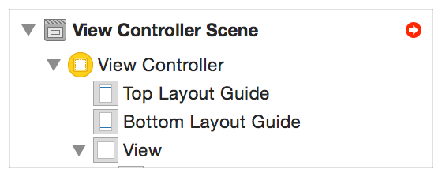

> 导航：[总目录](../../../README.md) · [documentation](../../../_indexes/documentation.md) · [Auto Layout Guide](index.md)

## Unsatisfiable Layouts

Unsatisfiable layouts occur when the system cannot find a valid solution for the current set of constraints. Two or more required constraints conflict, because they cannot all be true at the same time.

### Identifying Unsatisfiable Constraints

Often, Interface Builder can detect conflicts at design time. On these occasions, Interface Builder displays the error in a number of ways:

- All the conflicting constraints are drawn on the canvas in red.
- Xcode lists the conflicting constraints as warnings in the issue navigator.
- Interface Builder displays a red disclosure arrow in the upper right corner of the document outline.

  

  Click the disclosure arrow to display a list of all the Auto Layout issues in the current layout.

  Interface Builder can often recommend fixes for these issues. For more information, see Resolving Layout Issues for a View Controller, Window, or Root View in Auto Layout Help.

> [!NOTE]
> 

When the system detects a unsatisfiable layout at runtime, it performs the following steps:

1. Auto Layout identifies the set of conflicting constraints.
2. It breaks one of the conflicting constraints and checks the layout. The system continues to break constraints until it finds a valid layout.
3. Auto Layout logs information about the conflict and the broken constraints to the console.

This fallback system lets the app proceed, while still attempting to present something meaningful to the user. However, the effect of breaking constraints can vary greatly from layout to layout, or even from build to build.

In many cases, the missing constraints may not have any visible effect. The view hierarchy appears exactly as you expected. In other cases, the missing constraints can cause entire sections of the view hierarchy to be misplaced, missized, or to disappear entirely.

It is often tempting to ignore errors when they don’t have an obvious effect—after all, they don’t change the app’s behavior. However, any change to the view hierarchy or SDK could also alter the set of broken constraints, suddenly producing an obviously broken layout.

Therefore, always fix unsatisfiable constraint errors when you detect them. To help ensure that you catch nonobvious errors during testing, set a symbolic breakpoint for `UIViewAlertForUnsatisfiableConstraints`.

### Preventing Unsatisfiable Constraints

Unsatisfiable constraints are relatively easy to fix. The system tells you when unsatisfiable constraints occur and provides you with a list of conflicting constraints.

As soon as you know about the error, the solution is typically very straightforward. Either remove one of the constraints, or change it to an optional constraint.

There are, however, a few common issues worth examining in more detail:

- Unsatisfiable constraints often occur when programmatically adding views to the view hierarchy.

  By default, new views have their [translatesAutoresizingMaskIntoConstraints](https://developer.apple.com/documentation/uikit/uiview/1622572-translatesautoresizingmaskintoco) property set to `YES``true`. Interface Builder automatically sets this property to `NO``false` when you begin drawing constraints to a view in the canvas. However, when you’re programmatically creating and laying out your views, you need to set the property to `NO``false` before adding your own, custom constraints.
- Unsatisfiable constraints often occur when a view hierarchy is presented in a space that is too small for it.

  You can usually predict the minimum amount of space that your view has access to and design your layout appropriately. However, both internationalization and dynamic type can cause the view’s content to be much bigger than expected. As the number of possible permutations grows, it becomes increasingly difficult to guarantee that your layout will work in all situations.

  Instead, you may want to build in failure points, so that your layout fails in a predictable, controlled manner.

  Consider converting some of your required constraints into high-priority optional constraints. These constraints lets you control where your layout will break when a conflict occurs.

  For example, give your failure point a priority of `999`. Under most circumstances, this high-priority constraint acts as if it were required; however, when a conflict occurs, the high-priority constraint breaks, protecting the rest of your layout.

  Similarly, avoid giving views with an intrinsic content size a required content-hugging or compression-resistance priority. Typically, a control’s size acts as an ideal failure point. The control can be a little bigger or a little smaller without having any meaningful effect on the layout.

  Yes, there are controls that should only be displayed at their intrinsic content size; however, even in these cases it is usually better to have a control that is a few points off rather than just letting your layout break in unpredictable ways.

[Types of Errors](TypesofErrors.md#apple-f4xwc4dqnrsv64tfmyxwi33df52wszbpkridimbqgeydqnjtfvbuqmjxfvjvomi)

[Ambiguous Layouts](AmbiguousLayouts.md#apple-f4xwc4dqnrsv64tfmyxwi33df52wszbpkridimbqgeydqnjtfvbuqmjyfvjvomi)
