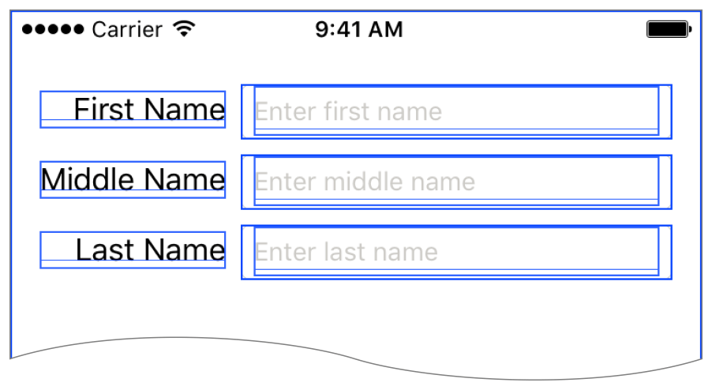
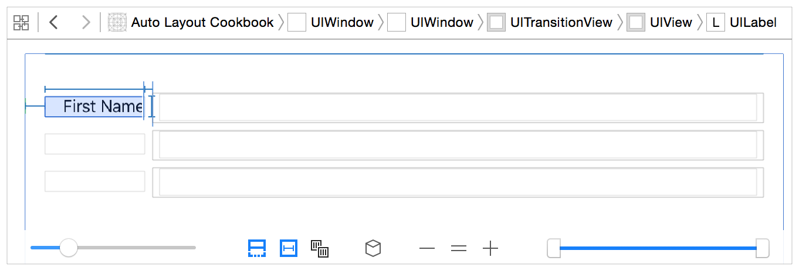

> 导航：[总目录](../../../README.md) · [documentation](../../../_indexes/documentation.md) · [Auto Layout Guide](index.md)

## Debugging Tricks and Tips

The following topics describe techniques for gathering and organizing information about your layout, as well as descriptions of some surprising behaviors you may encounter. You may not need to use these techniques on every layout, but they can help you work your way through even the most difficult problems.

### Understanding the Logs

Information about views can be printed to the console, either because there is an unsatisfiable layout or because you have explicitly logged constraints using the [constraintsAffectingLayoutForAxis:](https://developer.apple.com/documentation/uikit/uiview/1622432-constraintsaffectinglayoutforaxi) or [constraintsAffectingLayoutForOrientation:](https://developer.apple.com/documentation/appkit/nsview/1525968-constraintsaffectinglayout) debugging method.

Either way, you can find a lot of useful information in these logs. Here is the sample output from an unsatisfiable layout error:

1. `2015-08-26 14:27:54.790 Auto Layout Cookbook[10040:1906606] Unable to simultaneously satisfy constraints.`
2. `Probably at least one of the constraints in the following list is one you don't want. Try this: (1) look at each constraint and try to figure out which you don't expect; (2) find the code that added the unwanted constraint or constraints and fix it. (Note: If you're seeing NSAutoresizingMaskLayoutConstraints that you don't understand, refer to the documentation for the UIView property translatesAutoresizingMaskIntoConstraints)`
3. `(`
4. `"<NSLayoutConstraint:0x7a87b000 H:[UILabel:0x7a8724b0'Name'(>=400)]>",`
5. `"<NSLayoutConstraint:0x7a895e30 UILabel:0x7a8724b0'Name'.leading == UIView:0x7a887ee0.leadingMargin>",`
6. `"<NSLayoutConstraint:0x7a886d20 H:[UILabel:0x7a8724b0'Name']-(NSSpace(8))-[UITextField:0x7a88cff0]>",`
7. `"<NSLayoutConstraint:0x7a87b2e0 UITextField:0x7a88cff0.trailing == UIView:0x7a887ee0.trailingMargin>",`
8. `"<NSLayoutConstraint:0x7ac7c430 'UIView-Encapsulated-Layout-Width' H:[UIView:0x7a887ee0(320)]>"`
9. `)`
11. `Will attempt to recover by breaking constraint`
12. `<NSLayoutConstraint:0x7a87b000 H:[UILabel:0x7a8724b0'Name'(>=400)]>`
14. `Make a symbolic breakpoint at UIViewAlertForUnsatisfiableConstraints to catch this in the debugger.`
15. `The methods in the UIConstraintBasedLayoutDebugging category on UIView listed in <UIKit/UIView.h> may also be helpful.`

This error message shows five conflicting constraints. Not all of these constraints can be true at the same time. You need to either remove one, or convert it to an optional constraint.

Fortunately, the view hierarchy is relatively simple. You have a superview containing a label and a text field. The conflicting constraints set the following relationships:

1. The label’s width is greater than or equal to 400 points.
2. The label’s leading edge is equal to the superview’s leading margin.
3. There is an 8-point space between the label and the text field.
4. The text field’s trailing edge is equal to the superview’s trailing margin.
5. The superview’s width is set to 320 points.

The system attempts to recover by breaking the label’s width.

> [!NOTE]
> 

Of these constraints, the last one was created by the system. You cannot change it. Furthermore, it creates an obvious conflict with the first constraint. If you superview is only 320 points wide, you can never have a 400-point-wide label. Fortunately, you don’t have to get rid of the first constraint. If you drop its priority to 999, the system still tries to provide the selected width—coming as close as it can while still satisfying the other constraints.

Constraints based on a view’s autoresizing mask (for example, constraints created when [translatesAutoresizingMaskIntoConstraints](https://developer.apple.com/documentation/uikit/uiview/1622572-translatesautoresizingmaskintoco) is `YES``true`) have additional information about the mask. After the constraint’s address, the log string shows `h=` followed by three characters, and `v=` followed by three characters. A `-` (hyphen) character indicates a fixed value, while an `&` (ampersand) indicates a flexible value. For the horizontal mask (`h=`), the three characters indicate the left margin, width, and right margin. For the vertical mask (`v=`), they indicate the top margin, height, and bottom margin.

For example, consider the log message:

1. `<NSAutoresizingMaskLayoutConstraint:0x7ff28252e480 h=--& v=--& H:[UIView:0x7ff282617cc0(50)]>"`

This message consists of the following parts:

- `NSAutoresizingMaskLayoutConstraint:0x7ff28252e480`: The constraint’s class and address. In this example, the class tells you that it is based on the view’s autoresizing mask.
- `h=--& v=—&`: The view’s autoresizing mask. This is the default mask. Horizontally it has a fixed left margin, a fixed width, and a flexible right margin. Vertically it has a fixed top margin, a fixed height, and a flexible bottom margin. In other words, the view’s top left corner and size remain constant when the superview’s size changes.
- `H:[UIView:0x7ff282617cc0(50)]`: The visual format language description of the constraint. In this example, it defines a single view with a constant width of 50 points. This description also contains the class and address of any views affected by the constraint.

### Adding Identifiers to the Logs

Although the previous example was relatively easy to understand, longer lists of constraints quickly become hard to follow. You can make the logs easier to read by providing every view and constraint with a meaningful identifier.

If the view has an obvious textual component, Xcode uses that as an identifier. For example, Xcode uses a label’s text, a button’s title, or a text field’s placeholder to identify these views. Otherwise, set the view’s Xcode specific label in the Identity inspector. Interface Builder uses these identifiers throughout its interface. Many of them are also displayed in the console logs.

For the constraints, set their `identifier` property, either programmatically or using the Attribute inspector. Auto Layout then uses these identifiers when it prints information to the console.

For example, here is the same unsatisfiable constraint error with the identifiers set:

1. `2015-08-26 14:29:32.870 Auto Layout Cookbook[10208:1918826] Unable to simultaneously satisfy constraints.`
2. `Probably at least one of the constraints in the following list is one you don't want. Try this: (1) look at each constraint and try to figure out which you don't expect; (2) find the code that added the unwanted constraint or constraints and fix it. (Note: If you're seeing NSAutoresizingMaskLayoutConstraints that you don't understand, refer to the documentation for the UIView property translatesAutoresizingMaskIntoConstraints)`
3. `(`
4. `"<NSLayoutConstraint:0x7b58bac0 'Label Leading' UILabel:0x7b58b040'Name'.leading == UIView:0x7b590790.leadingMargin>",`
5. `"<NSLayoutConstraint:0x7b56d020 'Label Width' H:[UILabel:0x7b58b040'Name'(>=400)]>",`
6. `"<NSLayoutConstraint:0x7b58baf0 'Space Between Controls' H:[UILabel:0x7b58b040'Name']-(NSSpace(8))-[UITextField:0x7b589490]>",`
7. `"<NSLayoutConstraint:0x7b51cb10 'Text Field Trailing' UITextField:0x7b589490.trailing == UIView:0x7b590790.trailingMargin>",`
8. `"<NSLayoutConstraint:0x7b0758c0 'UIView-Encapsulated-Layout-Width' H:[UIView:0x7b590790(320)]>"`
9. `)`
11. `Will attempt to recover by breaking constraint`
12. `<NSLayoutConstraint:0x7b56d020 'Label Width' H:[UILabel:0x7b58b040'Name'(>=400)]>`
14. `Make a symbolic breakpoint at UIViewAlertForUnsatisfiableConstraints to catch this in the debugger.`
15. `The methods in the UIConstraintBasedLayoutDebugging category on UIView listed in <UIKit/UIView.h> may also be helpful.`

As you can see, these identifiers allow you to quickly and easily recognize your constraints in the log.

### Visualizing Views and Constraints

Xcode provides tools that help you visualize the views and the constraints in your view hierarchy.

To see the views in the simulator:

1. Run the app in the simulator.
2. Switch back to Xcode.
3. Choose Debug > View Debugging > Show Alignment Rectangles. This setting outlines the edges of your views.

   

The alignment rectangles are the edges used by Auto Layout. Turning this option on lets you quickly spot any alignment rectangles that are unexpectedly resized.

If you need even more information, click the Debug View Hierarchy button () in Xcode debug bar. Xcode then displays an interactive view debugger, giving you a number of tools for exploring and interacting with the view hierarchy. When debugging Auto Layout issues, the “Show clipped content” and “Show constraints” options are particularly useful.

Enabling the “Show clipped content” option displays the location of views that may have accidentally been positioned off screen. Enabling the “Show constraint” option shows all the constraints affecting the currently selected view. Both options provide a quick sanity check when things begin behaving oddly.

For more information, see [Debug Area Help](http://help.apple.com/xcode).

### Understanding Edge Cases

Here are a few edge cases that can cause Auto Layout to behave in unexpected ways:

- Auto Layout positions views based on their alignment rectangles, not their frame. Most of the time, these values are identical. However, some views may set a custom alignment rectangle to exclude parts of the view (for example, badges) from the layout calculations.

  For more information, see Aligning Views with Auto Layout in _[UIView Class Reference](https://developer.apple.com/documentation/uikit/uiview)_.
- In iOS, you can use a view’s [transform](https://developer.apple.com/documentation/uikit/uiview/1622459-transform) property to resize, rotate, or move the view; however, these transformations do not affect Auto Layout’s calculations in any way. Auto layout calculates a view’s alignment rectangle based on its untransformed frame.
- A view can display content outside its bounds. Most of the time, views behave properly and limit their content to their bounds. For performance reasons, however, this is not enforced by the graphics engine. This means that views (and especially views with custom drawing) may be drawn at a different size than their frames.

  You can identify these bugs by setting the view’s [clipsToBounds](https://developer.apple.com/documentation/uikit/uiview/1622415-clipstobounds) property to YES or by verifying the size of the view’s frame.
- The [NSLayoutAttributeBaseline](https://developer.apple.com/documentation/appkit/nslayoutattribute/nslayoutattributebaseline), [NSLayoutAttributeFirstBaseline](https://developer.apple.com/documentation/appkit/nslayoutattribute/nslayoutattributefirstbaseline), and [NSLayoutAttributeLastBaseline](https://developer.apple.com/documentation/appkit/nslayoutconstraint/attribute/lastbaseline) attributes correctly align the text only when all the views are displayed at their intrinsic content height. If one of the views is stretched or shrunk vertically, its text may appear in the wrong position.
- Constraint priorities act as global properties across the entire view hierarchy. You can often simplify your layout by grouping views inside a stack view, a layout guide, or a dummy view; however, this approach does not encapsulate the contained views’ priorities. Auto Layout continues to compare priorities inside the group with priorities outside the group (or even priorities inside other groups).
- Aspect ratio constraints allow horizontal and vertical constraints to interact. Normally, the horizontal and vertical layouts are calculated separately. However, if you constrain a view’s height relative to its width, you’ve created a connection between the vertical and horizontal constraints: They can now affect and conflict with each other. These interactions greatly increase the complexity of your layout and can lead to unexpected conflicts between unrelated parts of your layout.

[Logical Errors](LogicalErrors.md#apple-f4xwc4dqnrsv64tfmyxwi33df52wszbpkridimbqgeydqnjtfvbuqmrqfvjvomi)

[Programmatically Creating Constraints](ProgrammaticallyCreatingConstraints.md#apple-f4xwc4dqnrsv64tfmyxwi33df52wszbpkridimbqgeydqnjtfvbuqmjwfvjvomi)
