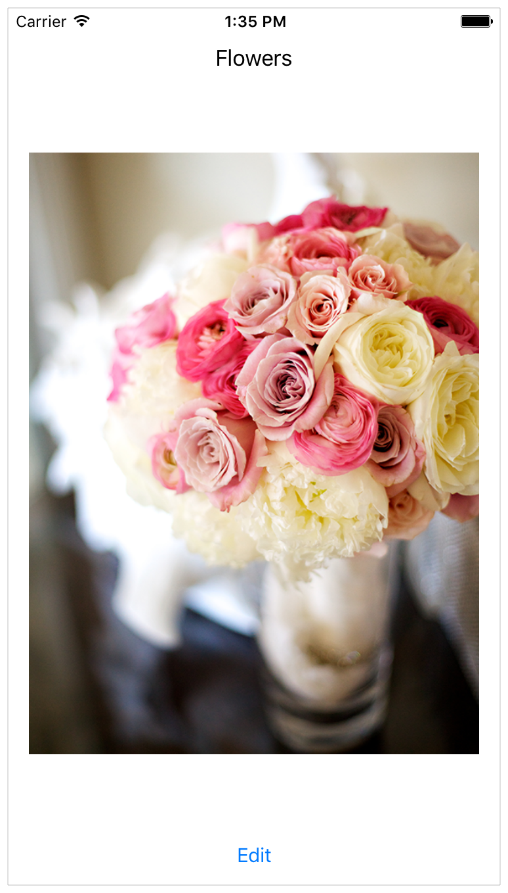
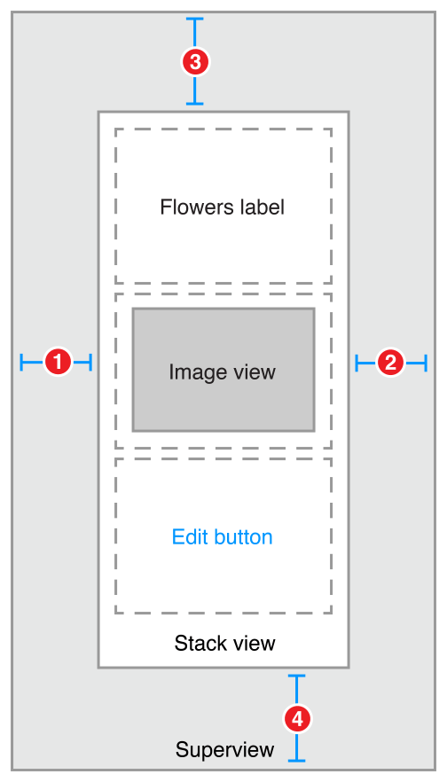
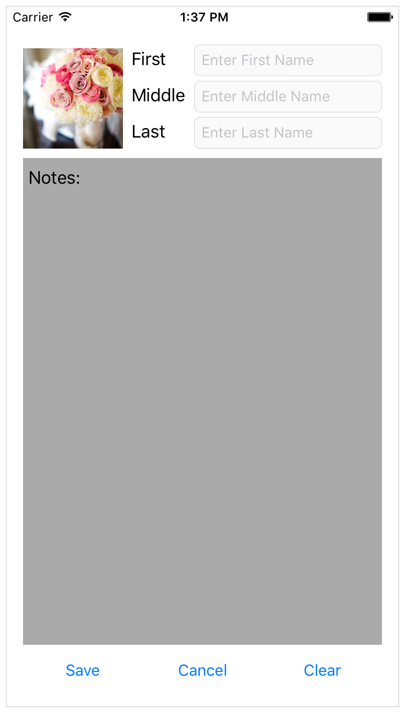
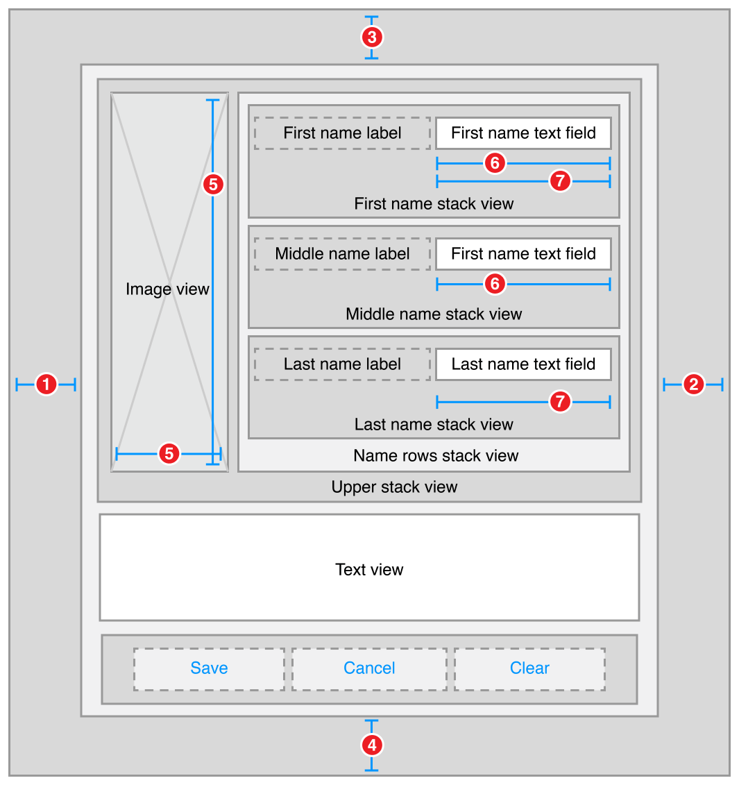
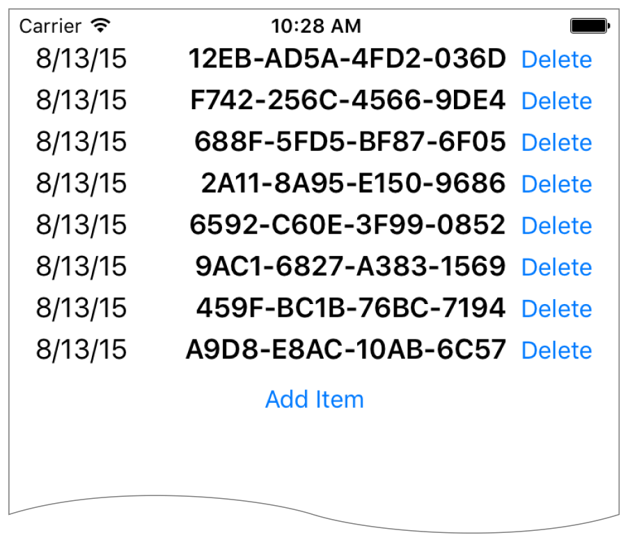
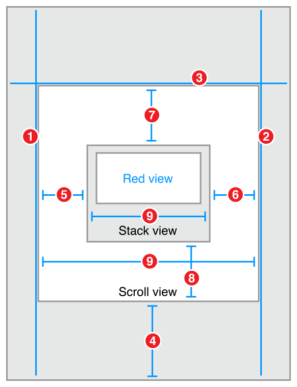

> 导航：[总目录](../../../README.md) · [documentation](../../../_indexes/documentation.md) · [Auto Layout Guide](index.md)

## Stack Views

The following recipes show how you can use stack views to create layouts of increasing complexity. Stack views are a powerful tool for quickly and easily designing your user interfaces. Their attributes allow a high degree of control over how they lay out their arranged views. You can augment these settings with additional, custom constraints; however, this increases the layout’s complexity.

To view the source code for these recipes, see the [Auto Layout Cookbook](https://developer.apple.com/sample-code/xcode/downloads/Auto-Layout-Cookbook.zip) (未归档：ZIP 按安全策略跳过) project.

### Simple Stack View

This recipe uses a single, vertical stack view to lay out a label, image view, and button.

### Views and Constraints

In Interface Builder, start by dragging out a vertical stack view, and add the flowers label, image view, and edit button. Then set up the constraints as shown.

1. `Stack View.Leading = Superview.LeadingMargin`
2. `Stack View.Trailing = Superview.TrailingMargin`
3. `Stack View.Top = Top Layout Guide.Bottom + Standard`
4. `Bottom Layout Guide.Top = Stack View.Bottom + Standard`

### Attributes

In the Attributes inspector, set the following stack view attributes:

| Stack | Axis | Alignment | Distribution | Spacing |
| --- | --- | --- | --- | --- |
| Stack View | Vertical | Fill | Fill | 8 |

Next, set the following attributes on the Image View:

| View | Attribute | Value |
| --- | --- | --- |
| Image View | Image | (an image of flowers) |
| Image View | Mode | Aspect Fit |

Finally, in the Size inspector, set the Image View’s content-hugging and compression-resistance (CHCR) priorities.

| Name | Horizontal hugging | Vertical hugging | Horizontal resistance | Vertical resistance |
| --- | --- | --- | --- | --- |
| Image View | 250 | 249 | 750 | 749 |

### Discussion

You must pin the stack view to the superview, but otherwise, the stack view manages the entire layout without any other explicit constraints.

In this recipe, the stack view fills its superview, with a small, standard margin. The arranged views are resized to fill the stack view’s bounds. Horizontally, each view is stretched to match the stack view’s width. Vertically, the views are stretched based on their CHCR priorities. The image view should always shrink and grow to fill the available space. Therefore, its vertical content hugging and compression resistance priorities must be lower than the label and button’s default priorities.

Finally, set the image view’s mode to Aspect Fit. This setting forces the image view to resize the image so that it fits within the image view’s bounds, while maintaining the image’s aspect ratio. This lets the stack view arbitrarily resize the image view without distorting the image.

For more information on pinning a view to fill its superview, see [Attributes](WorkingwithSimpleConstraints.md#apple-f4xwc4dqnrsv64tfmyxwi33df52wszbpkridimbqgeydqnjtfvbuqmjsfvjvoni) and [Adaptive Single View](WorkingwithSimpleConstraints.md#apple-f4xwc4dqnrsv64tfmyxwi33df52wszbpkridimbqgeydqnjtfvbuqmjsfvjvona).

### Nested Stack Views

This recipe shows a complex layout built from multiple layers of nested stack views. However, in this example, the stack views cannot create the wanted behaviors alone. Instead, additional constraints are needed to further refine the layout.

After the view hierarchy is built, add the constraints shown in the next section, [Views and Constraints](#apple-f4xwc4dqnrsv64tfmyxwi33df52wszbpkridimbqgeydqnjtfvbuqmjrfvjvomjs).

### Views and Constraints

When working with nested stack views, it is easiest to work from the inside out. Begin by laying out the name rows in Interface Builder. Position the label and text field in their correct relative positions, select them both, and then click the Editor > Embed In > Stack View menu item. This creates a horizontal stack view for the row.

Next, position these rows horizontally, select them, and click the Editor > Embed In > Stack View menu item again. This creates a horizontal stack of rows. Continue to build the interface as shown.

1. `Root Stack View.Leading = Superview.LeadingMargin`
2. `Root Stack View.Trailing = Superview.TrailingMargin`
3. `Root Stack View.Top = Top Layout Guide.Bottom + 20.0`
4. `Bottom Layout Guide.Top = Root Stack View.Bottom + 20.0`
5. `Image View.Height = Image View.Width`
6. `First Name Text Field.Width = Middle Name Text Field.Width`
7. `First Name Text Field.Width = Last Name Text Field.Width`

### Attributes

Each stack has its own set of attributes. These define how the stack lays out its contents. In the Attribute inspector, set the following attributes:

| Stack | Axis | Alignment | Distribution | Spacing |
| --- | --- | --- | --- | --- |
| First Name | Horizontal | First Baseline | Fill | 8 |
| Middle Name | Horizontal | First Baseline | Fill | 8 |
| Last Name | Horizontal | First Baseline | Fill | 8 |
| Name Rows | Vertical | Fill | Fill | 8 |
| Upper | Horizontal | Fill | Fill | 8 |
| Button | Horizontal | First Baseline | Fill Equally | 8 |
| Root | Vertical | Fill | Fill | 8 |

Additionally, give the text view a light gray background color. This makes it easier to see how the text view is resized when the orientation changes.

| View | Attribute | Value |
| --- | --- | --- |
| Text View | Background | Light Gray Color |

Finally, the CHCR priorities define which views should stretch to fill the available space. In the Size inspector, set the following CHCR priorities:

| Name | Horizontal hugging | Vertical hugging | Horizontal resistance | Vertical resistance |
| --- | --- | --- | --- | --- |
| Image View | 250 | 250 | 48 | 48 |
| Text View | 250 | 249 | 250 | 250 |
| First, Middle, and Last Name Labels | 251 | 251 | 750 | 750 |
| First, Middle, and Last Name Text Fields | 48 | 250 | 749 | 750 |

### Discussion

In this recipe, the stack views work together to manage most of the layout. However, they cannot—by themselves—create all of the wanted behaviors. For example, the image should maintain its aspect ratio as the image view is resized. Unfortunately, the technique used in [Simple Stack View](#apple-f4xwc4dqnrsv64tfmyxwi33df52wszbpkridimbqgeydqnjtfvbuqmjrfvjvomq) won’t work here. The layout needs to fit close to both the trailing and bottom edge of the image, and using the Aspect Fit mode would add extra white space to one of those dimensions. Fortunately, in this example, the image’s aspect ratio is always square, so you can let the image completely fill the image view’s bounds, and constrain the image view to a 1:1 aspect ratio.

> [!NOTE]
> 

Additionally, all the text fields should be the same width. Unfortunately, they are all in separate stack views, so the stacks cannot manage this. Instead, you must explicitly add equal width constraints.

Like the simple stack view, you must also modify some of the CHCR priorities. These define how the views shrink and grow as the superclass’s bounds change.

Vertically, you want the text view to expand to fill the space between the upper stack and the button stack. Therefore, the text view’s vertical content hugging must be lower than any other vertical content hugging priority.

Horizontally, the labels should appear at their intrinsic content size, while the text fields resize to fill any extra space. The default CHCR priorities work well for the labels. Interface Builder already sets the content hugging at 251, making it higher than the text fields; however, you still need to lower both the horizontal content hugging and the horizontal compression resistance of the text fields.

The image view should shrink so that it is the same height as the stack containing the name rows. However, stack views only loosely hug their content. This means that the image view’s vertical compression resistance must be very low, so the image view shrinks instead of having the stack view expand. Additionally, the image view’s aspect ratio constraint complicates the layout, because it allows the vertical and horizontal constraints to interact. This means that the text fields’ horizontal content hugging must also be very low, or they will prevent the image view from shrinking. In both cases, set the priority to a value of 48 or lower.

### Dynamic Stack View

This recipe demonstrates dynamically adding and removing items from a stack at runtime. All changes to the stack are animated. Additionally, the stack view is placed inside a scroll view, letting you scroll through the list if it is too long to fit on the screen.

> [!NOTE]
> 

### Views and Constraints

The initial user interface is quite simple. Place a scroll view on your scene, and size it so that it fills the scene. Then, place a stack view inside the scroll view, and place the add item button inside the stack view. As soon as everything’s in place, set the following constraints:

1. `Scroll View.Leading = Superview.LeadingMargin`
2. `Scroll View.Trailing = Superview.TrailingMargin`
3. `Scroll View.Top = Superview.TopMargin`
4. `Bottom Layout Guide.Top = Scroll View.Bottom + 20.0`
5. `Stack View.Leading = Scroll View.Leading`
6. `Stack View.Trailing = Scroll View.Trailing`
7. `Stack View.Top = Scroll View.Top`
8. `Stack View.Bottom = Scroll View.Bottom`
9. `Stack View.Width = Scroll View.Width`

### Attributes

In the Attributes inspector, set the following stack view attributes:

| Stack | Axis | Alignment | Distribution | Spacing |
| --- | --- | --- | --- | --- |
| Stack View | Vertical | Fill | Equal Spacing | 0 |

### Code

This recipe requires a bit of code to add items to and remove them from the stack view. Create a custom view controller for your scene with outlets for both the scroll view and stack view.

1. `class DynamicStackViewController: UIViewController {`
3. `@IBOutlet weak private var scrollView: UIScrollView!`
4. `@IBOutlet weak private var stackView: UIStackView!`
6. `// Method implementations will go here...`
8. `}`

Next, override the [viewDidLoad](https://developer.apple.com/documentation/uikit/uiviewcontroller/1621495-viewdidload) method to set the scroll view’s initial position. You want the scroll view’s content to start below the status bar.

1. `override func viewDidLoad() {`
2. `super.viewDidLoad()`
4. `// setup scrollview`
5. `let insets = UIEdgeInsetsMake(20.0, 0.0, 0.0, 0.0)`
6. `scrollView.contentInset = insets`
7. `scrollView.scrollIndicatorInsets = insets`
9. `}`

Now, add an action method for the add item button.

1. `// MARK: Action Methods`
3. `@IBAction func addEntry(sender: AnyObject) {`
5. `let stack = stackView`
6. `let index = stack.arrangedSubviews.count - 1`
7. `let addView = stack.arrangedSubviews[index]`
9. `let scroll = scrollView`
10. `let offset = CGPoint(x: scroll.contentOffset.x,`
11. `y: scroll.contentOffset.y + addView.frame.size.height)`
13. `let newView = createEntry()`
14. `newView.hidden = true`
15. `stack.insertArrangedSubview(newView, atIndex: index)`
17. `UIView.animateWithDuration(0.25) { () -> Void in`
18. `newView.hidden = false`
19. `scroll.contentOffset = offset`
20. `}`
21. `}`

This method calculates a new offset for the scroll view, then creates a new entry view. The entry view is hidden, and added to the stack. Hidden views do not affect the appearance or layout of a stack—so the stack’s appearance remains unchanged. Then, in an animation block, the view is revealed and the scroll offset is updated, animating the view’s appearance.

Add a similar method to delete entries; however, unlike the `addEntry` method, this method is not linked to any controls in Interface Builder. Instead, the app will programmatically link each entry view to this method when the view is created.

1. `func deleteStackView(sender: UIButton) {`
2. `if let view = sender.superview {`
3. `UIView.animateWithDuration(0.25, animations: { () -> Void in`
4. `view.hidden = true`
5. `}, completion: { (success) -> Void in`
6. `view.removeFromSuperview()`
7. `})`
8. `}`
9. `}`

This method hides the view in an animation block. After the animation completes, it removes the view from the view hierarchy. This automatically removes the view from the stack’s list of arranged views.

Although the entry view could be any view, this example uses a stack view that contains a date label, a label containing a random hex string, and a delete button.

1. `// MARK: - Private Methods`
2. `private func createEntry() -> UIView {`
3. `let date = NSDateFormatter.localizedStringFromDate(NSDate(), dateStyle: .ShortStyle, timeStyle: .NoStyle)`
4. `let number = "\(randomHexQuad())-\(randomHexQuad())-\(randomHexQuad())-\(randomHexQuad())"`
6. `let stack = UIStackView()`
7. `stack.axis = .Horizontal`
8. `stack.alignment = .FirstBaseline`
9. `stack.distribution = .Fill`
10. `stack.spacing = 8`
12. `let dateLabel = UILabel()`
13. `dateLabel.text = date`
14. `dateLabel.font = UIFont.preferredFontForTextStyle(UIFontTextStyleBody)`
16. `let numberLabel = UILabel()`
17. `numberLabel.text = number`
18. `numberLabel.font = UIFont.preferredFontForTextStyle(UIFontTextStyleHeadline)`
20. `let deleteButton = UIButton(type: .RoundedRect)`
21. `deleteButton.setTitle("Delete", forState: .Normal)`
22. `deleteButton.addTarget(self, action: "deleteStackView:", forControlEvents: .TouchUpInside)`
24. `stack.addArrangedSubview(dateLabel)`
25. `stack.addArrangedSubview(numberLabel)`
26. `stack.addArrangedSubview(deleteButton)`
28. `return stack`
29. `}`
31. `private func randomHexQuad() -> String {`
32. `return NSString(format: "%X%X%X%X",`
33. `arc4random() % 16,`
34. `arc4random() % 16,`
35. `arc4random() % 16,`
36. `arc4random() % 16`
37. `) as String`
38. `}`
39. `}`

### Discussion

As this recipe demonstrates, views can be added or removed from stack views during runtime. The stack’s layout automatically adjusts to compensate for changes to its array of arranged views. There are, however, a couple of important points worth remembering:

- Hidden views are still inside stack’s array of arranged views. However, they are not displayed and do not affect the layout of the other arranged views.
- Adding a view to the stack’s array of arranged views automatically adds it to the view hierarchy.
- Removing a view from the stack’s array of arranged views does not automatically remove it from the view hierarchy; however, removing the view from the view hierarchy does removes it from the arranged views array.
- In iOS, the view’s [hidden](https://developer.apple.com/documentation/uikit/uiview/1622585-hidden) property is normally not animatable. However, this property becomes animatable for views as soon as they are placed in a stack’s arranged views array. The actual animation is managed by the stack, not the view. Use the `hidden` property to animate adding views to or removing them from the stack.

This recipe also introduces the idea of using Auto Layout with scroll views. Here, the constraints between the stack and the scroll view set the size of the scroll view’s content area. An equal width constraint explicitly sets the stack (and thus the content size) to fill the scroll view horizontally. Vertically, the content size is based on the stack’s fitting size. The stack view grows longer as the user adds more entries. Scrolling is automatically enabled as soon as there is too much content to fit on the screen.

For more information, see [Working with Scroll Views](WorkingwithScrollViews.md#apple-f4xwc4dqnrsv64tfmyxwi33df52wszbpkridimbqgeydqnjtfvbuqmrufvjvomi).

[Working with Constraints in Interface Builder](WorkingwithConstraintsinInterfaceBuidler.md#apple-f4xwc4dqnrsv64tfmyxwi33df52wszbpkridimbqgeydqnjtfvbuqmjqfvjvomi)

[Simple Constraints](WorkingwithSimpleConstraints.md#apple-f4xwc4dqnrsv64tfmyxwi33df52wszbpkridimbqgeydqnjtfvbuqmjsfvjvomi)
