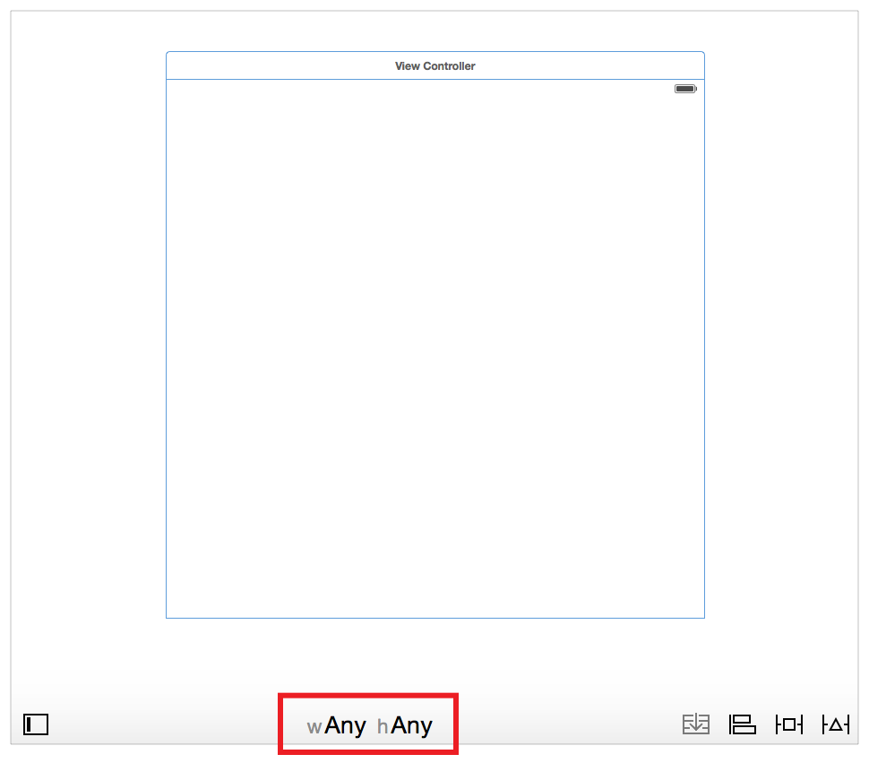
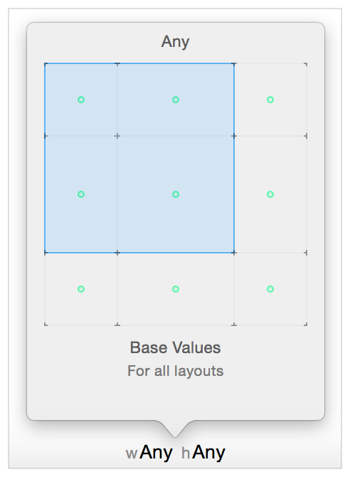
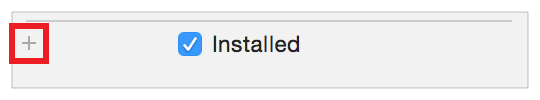
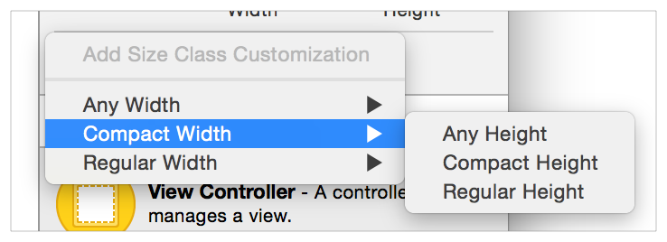
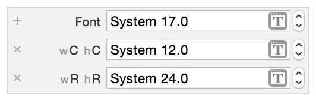

> 导航：[总目录](../../../README.md) · [documentation](../../../_indexes/documentation.md) · [Auto Layout Guide](index.md)

## Size-Class-Specific Layout

Storyboards in Interface Builder by default use size classes. Size classes are traits assigned to user interface elements, like scenes or views. They provide a rough indication of the element’s size. Interface Builder lets you customize many of your layout’s features based on the current size class. The layout then automatically adapts as the size class changes. Specifically, you can set the following features on a per-size-class basis:

- Install or uninstall a view or control.
- Install or uninstall a constraint.
- Set the value of select attributes (for example, fonts and layout margin settings).

When the system loads a scene, it instantiates all the views, controls, and constraints, and assigns these items to the appropriate outlet in the view controller (if any). You can access any of these items through their outlets, regardless of the scene’s current size class. However, the system adds these items to the view hierarchy only if they are installed for the current size class.

As the view’s size class changes (for example, when you rotate an iPhone or switch an iPad app between full-screen and Split View), the system automatically adds items to or removes them from the view hierarchy. The system also animates any changes to the view’s layout.

> [!NOTE]
> 

### Final and Base Size Classes

Interface Builder recognizes nine different size classes.

Four of these are the Final size classes: Compact-Compact, Compact-Regular, Regular-Compact, and Regular-Regular. The Final classes represent actual size classes displayed on devices.

The remaining five are Base size classes: Compact-Any, Regular-Any, Any-Compact, Any-Regular, and Any-Any. These are abstract size classes that represent two or more Final size classes. For example, items installed in the Compact-Any size class appear in both the Compact-Compact and Compact-Regular size views.

Anything set in a more specific size class always overrides the more general size classes. Additionally, you must provide a nonambiguous, satisfiable layout for all nine size classes, even the Base size classes. Therefore, it is typically easiest to work from the most general size class to the most specific. Select the default layout for your app, and design this layout in the Any-Any size class. Then modify the other Base or Final size classes as needed.

### Using the Size Class Tool

Select the size class that you are currently editing using Interface Builder’s Size Class tool. This tool is displayed at the bottom center of the Editor window. By default, Interface Builder starts with the Any-Any size class selected.

To switch to a new size class, click the Size Class tool. Interface Builder presents a popover view containing a 3 x 3 grid of size classes. Move your mouse over the grid to change the size class. The grid shows the selected size class’s name at the top and a description of the size class (including the devices and orientations it affects) at the bottom. It also displays a green dot in each size class affected by the current size class.

Any views or constraints added to the canvas are installed only in the current size class. When deleting items, the behavior varies depending on where and how the items are deleted.

- Deleting an item from the canvas or document outline removes it from the project entirely.
- Command-Deleting an item from the canvas or document outline only uninstalls the item from the current size class.
- When a scene has more than one size class, deleting items from anywhere other than the canvas or document outline (for example, selecting and deleting constraints from the Size inspector) uninstalls the item only from the current size class.
- If you have edited only the Any-Any size class, then deleting an item always removes it from the project.

If you are editing any size class other than the Any-Any size class, Interface Builder highlights the toolbar at the bottom of the editor window in blue. This makes it obvious when you’re working on a more specific size class.

### Using the Inspectors

You can also modify the size-class-specific settings in the inspectors. Anything that supports size-class-specific settings appears in the inspector with a small plus icon beside it.

By default, the inspector sets the value for the Any-Any size class. To set a different value for a more specific size class, click the plus icon to add a new size class. Select the width, and then the height, for the size class you want to add.

The inspector now shows each size class on its own line—the Any-Any setting is the top line, with the more-specific size classes listed below. You can edit the value of each line independently of the others.

To remove a custom size class, click the x icon at the beginning of the line.

For more information on working with size classes in Interface Builder, see Size Classes Design Help.

[Programmatically Creating Constraints](ProgrammaticallyCreatingConstraints.md#apple-f4xwc4dqnrsv64tfmyxwi33df52wszbpkridimbqgeydqnjtfvbuqmjwfvjvomi)

[Working with Scroll Views](WorkingwithScrollViews.md#apple-f4xwc4dqnrsv64tfmyxwi33df52wszbpkridimbqgeydqnjtfvbuqmrufvjvomi)
