> 导航：[总目录](../../../README.md) · [documentation](../../../_indexes/documentation.md) · [Auto Layout Guide](index.md)

## Views with Intrinsic Content Size

The following recipes demonstrate working with views that have an intrinsic content size. In general, the intrinsic content size simplifies the layout, reducing the number of constraints you need. However, using the intrinsic content size often requires setting the view’s content-hugging and compression-resistance (CHCR) priorities, which can add additional complications.

To view the source code for these recipes, see the [Auto Layout Cookbook](https://developer.apple.com/sample-code/xcode/downloads/Auto-Layout-Cookbook.zip) (未归档：ZIP 按安全策略跳过) project.

### Simple Label and Text Field

This recipe demonstrates laying out a simple label and text field pair. In this example, the label’s width is based on the size of its text property, and the text field expands and shrinks to fit the remaining space.

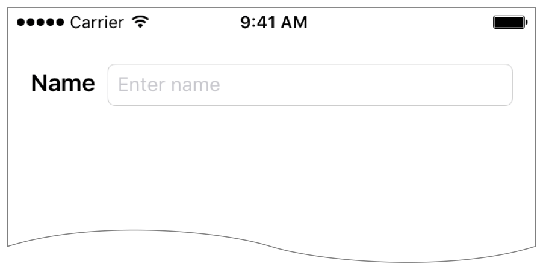

Because this recipe uses the view’s intrinsic content size, you need only five constraints to uniquely specify the layout. However, you must make sure you have the correct CHCR priorities to get the correct resizing behavior.

For more information on intrinsic content sizes and CHCR priorities, see [Intrinsic Content Size](AnatomyofaConstraint.md#apple-f4xwc4dqnrsv64tfmyxwi33df52wszbpkridimbqgeydqnjtfvbuqojnknltemi).

### Views and Constraints

In Interface Builder, drag out a label and a text field. Set the label’s text and the text field’s placeholder, and then set up the constraints as shown.

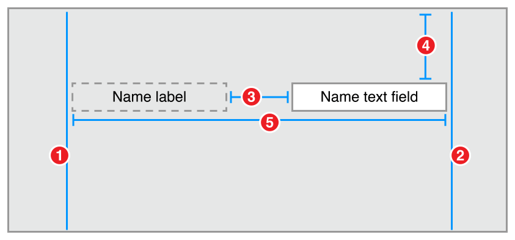

1. `Name Label.Leading = Superview.LeadingMargin`
2. `Name Text Field.Trailing = Superview.TrailingMargin`
3. `Name Text Field.Leading = Name Label.Trailing + Standard`
4. `Name Text Field.Top = Top Layout Guide.Bottom + 20.0`
5. `Name label.Baseline = Name Text Field.Baseline`

### Attributes

To have the text field stretch to fill the available space, its content hugging must be lower than the label’s. By default, Interface Builder should set the label’s content hugging to 251, and the text field to 250. You can verify this in the Size inspector.

| Name | Horizontal hugging | Vertical hugging | Horizontal resistance | Vertical resistance |
| --- | --- | --- | --- | --- |
| Name Label | 251 | 251 | 750 | 750 |
| Name Text Field | 250 | 250 | 750 | 750 |

### Discussion

Notice that this layout only uses two constraints (4 and 5) to define the vertical layout, and three constraints (1, 2, and 3) to define the horizontal layout. The rule of thumb from [Creating Nonambiguous, Satisfiable Layouts](AnatomyofaConstraint.md#apple-f4xwc4dqnrsv64tfmyxwi33df52wszbpkridimbqgeydqnjtfvbuqojnknltcnq) states that we need two horizontal and two vertical constraints per view; however, the label and text field’s intrinsic content size provides their heights and the label’s widths, removing the need for three constraints.

This layout also makes the simplifying assumption that the text field is always taller than the label text, and it uses the text field’s height to define the distance from the top layout guide. Because both the label and text field are used to display text, the recipe aligns them using the text’s baseline.

Horizontally, you still need to define which view should expand to fill the available size. You do this by modifying the view’s CHCR priorities. In this example, Interface Builder should already set the name label’s horizontal and vertical hugging priority to 251. Because this is larger than the text field’s default 250, the text field expands to fill any additional space.

> [!NOTE]
> 

### Dynamic Height Label and Text Field

The [Simple Label and Text Field](#apple-f4xwc4dqnrsv64tfmyxwi33df52wszbpkridimbqgeydqnjtfvbuqmjtfvjvooa) recipe simplified the layout logic by assuming that the text field would always be taller than the name label. That, however, is not necessarily always true. If you increase the label’s font size enough, it will extend above the text field.

This recipe dynamically sets the vertical spacing of the controls based on the tallest control at runtime. With the regular system font, this recipe appears to be identical to the [Simple Label and Text Field](#apple-f4xwc4dqnrsv64tfmyxwi33df52wszbpkridimbqgeydqnjtfvbuqmjtfvjvooa) recipe (see the screenshot). However, if you increase the label’s font size to 36.0 points, then the layout’s vertical spacing is calculated from the top of the label instead.

This is a somewhat contrived example. After all, if you increase the font size of a label, you would typically also increase the font size of the text field. However, given the extra, extra, extra large fonts available through the iPhone’s accessibility settings, this technique can prove useful when mixing dynamic type and fixed-sized controls (like images).

### Views and Constraints

Set up the view hierarchy as you did in [Simple Label and Text Field](#apple-f4xwc4dqnrsv64tfmyxwi33df52wszbpkridimbqgeydqnjtfvbuqmjtfvjvooa), but use a somewhat more complex set of constraints:

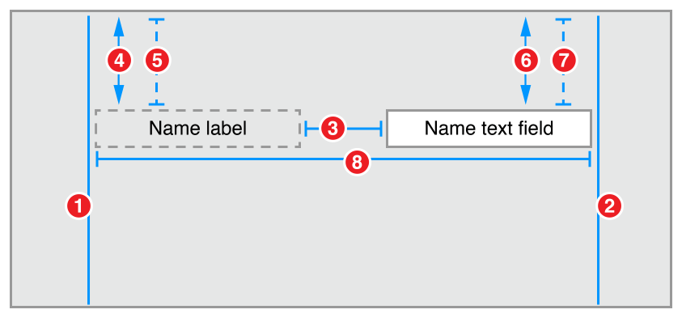

1. `Name Label.Leading = Superview.LeadingMargin`
2. `Name Text Field.Trailing = Superview.TrailingMargin`
3. `Name Text Field.Leading = Name Label.Trailing + Standard`
4. `Name Label.Top >= Top Layout Guide.Bottom + 20.0`
5. `Name Label.Top = Top Layout Guide.Bottom + 20.0 (Priority 249)`
6. `Name Text Field.Top >= Top Layout Guide.Bottom + 20.0`
7. `Name Text Field.Top = Top Layout Guide.Bottom + 20.0 (Priority 249)`
8. `Name label.Baseline = Name Text Field.Baseline`

### Attributes

To have the text field stretch to fill the available space, it’s content hugging must be lower than the label’s. By default, Interface Builder should set the label’s content hugging to 251, and the text field to 250. You can verify this in the Size inspector.

| Name | Horizontal hugging | Vertical hugging | Horizontal resistance | Vertical resistance |
| --- | --- | --- | --- | --- |
| Name Label | 251 | 251 | 750 | 750 |
| Name Text Field | 250 | 250 | 750 | 750 |

### Discussion

This recipe uses a pair of constraints for each control. A required, greater-than-or-equal constraint defines the minimum distance between that control and the layout guide, while an optional constraint tries to pull the control to exactly 20.0 points from the layout guide.

Both constraints are satisfiable for the taller constraint, so the system places it exactly 20.0 points from the layout guide. However, for the shorter control, only the minimum distance is satisfiable. The other constraint is ignored. This lets the Auto Layout system dynamically recalculate the layout as the height of the controls change at runtime.

> [!NOTE]
> 

### Fixed Height Columns

This recipe extends the [Simple Label and Text Field](#apple-f4xwc4dqnrsv64tfmyxwi33df52wszbpkridimbqgeydqnjtfvbuqmjtfvjvooa) recipe into columns of labels and text fields. Here, the trailing edge of all the labels are aligned. The text fields leading and trailing edges are aligned, and the horizontal placement is based on the longest label. Like the Simple Label and Text Field recipe, however, this recipe simplifies the layout logic by assuming that the text fields are always taller than the labels.

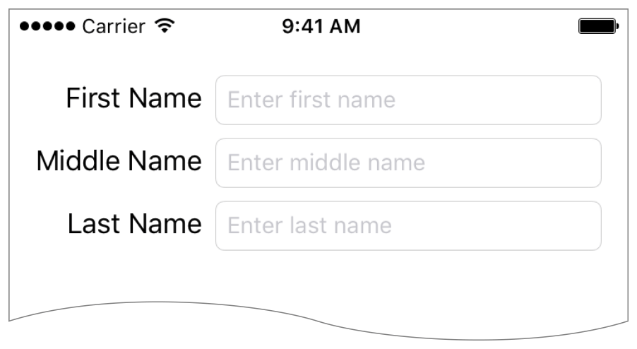

### Views and Constraints

Lay out the labels and text fields, and then set the constraints as shown.

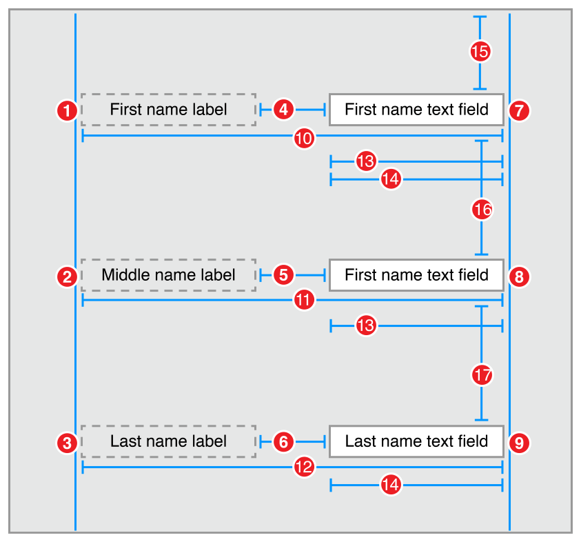

1. `First Name Label.Leading = Superview.LeadingMargin`
2. `Middle Name Label.Leading = Superview.LeadingMargin`
3. `Last Name Label.Leading = Superview.LeadingMargin`
4. `First Name Text Field.Leading = First Name Label.Trailing + Standard`
5. `Middle Name Text Field.Leading = Middle Name Label.Trailing + Standard`
6. `Last Name Text Field.Leading = Last Name Label.Trailing + Standard`
7. `First Name Text Field.Trailing = Superview.TrailingMargin`
8. `Middle Name Text Field.Trailing = Superview.TrailingMargin`
9. `Last Name Text Field.Trailing = Superview.TrailingMargin`
10. `First Name Label.Baseline = First Name Text Field.Baseline`
11. `Middle Name Label.Baseline = Middle Name Text Field.Baseline`
12. `Last Name Label.Baseline = Last Name Text Field.Baseline`
13. `First Name Text Field.Width = Middle Name Text Field.Width`
14. `First Name Text Field.Width = Last Name Text Field.Width`
15. `First Name Text Field.Top = Top Layout Guide.Bottom + 20.0`
16. `Middle Name Text Field.Top = First Name Text Field.Bottom + Standard`
17. `Last Name Text Field.Top = Middle Name Text Field.Bottom + Standard`

### Attributes

In the Attributes inspector, set the following attributes. In particular, right align the text in all the labels. This lets you use labels that are longer than their text, and still line up the edges beside the text fields.

| View | Attribute | Value |
| --- | --- | --- |
| First Name Label | Text | First Name |
| First Name Label | Alignment | Right |
| First Name Text Field | Placeholder | Enter first name |
| Middle Name Label | Text | Middle Name |
| Middle Name Label | Alignment | Right |
| Middle Name Text Field | Placeholder | Enter middle name |
| Last Name Label | Text | Last Name |
| Last Name Label | Alignment | Right |
| Last Name Text Field | Placeholder | Enter last name |

For each pair, the label’s content hugging must be higher than the text fields. Again, Interface Builder should do this automatically; however, you can verify these priorities in the Size inspector.

| Name | Horizontal hugging | Vertical hugging | Horizontal resistance | Vertical resistance |
| --- | --- | --- | --- | --- |
| First Name Label | 251 | 251 | 750 | 750 |
| First Name Text Field | 250 | 250 | 750 | 750 |
| Middle Name Label | 251 | 251 | 750 | 750 |
| Middle Name Text Field | 250 | 250 | 750 | 750 |
| Last Name Label | 251 | 251 | 750 | 750 |
| Last Name Text Field | 250 | 250 | 750 | 750 |

### Discussion

This recipe basically starts as three copies of the [Simple Label and Text Field](#apple-f4xwc4dqnrsv64tfmyxwi33df52wszbpkridimbqgeydqnjtfvbuqmjtfvjvooa) layout, stacked one on top of the other. However, you need to make a few additions so that the rows line up properly.

First, simplify the problem by right aligning the text for each of the labels. You can now make all the labels the same width, and regardless of the length of the text, you can easily align their trailing edges. Additionally, because a label’s compression resistance is greater than its content hugging, all the labels prefer to be stretched rather than squeezed. Align the leading and trailing edges, and the labels all naturally stretch to the intrinsic content size of the longest label.

Therefore, you just need to align the leading and trailing edge of all the labels. You also need to align the leading and trailing edges of all the text fields. Fortunately, the labels’ leading edges are already aligned with the superview’s leading margin. Similarly, the text fields’ trailing edges are all aligned with the superview’s trailing margin. You just need to line up one of the other two edges, and because all the rows are the same width, everything will be aligned.

There are a number of ways to do this. For this recipe, give each of the text fields an equal width.

### Dynamic Height Columns

This recipe combines everything you learned in the [Dynamic Height Label and Text Field](#apple-f4xwc4dqnrsv64tfmyxwi33df52wszbpkridimbqgeydqnjtfvbuqmjtfvjvomjw) recipe and the [Fixed Height Columns](#apple-f4xwc4dqnrsv64tfmyxwi33df52wszbpkridimbqgeydqnjtfvbuqmjtfvjvomru) recipe. The goals of this recipe include:

- The trailing edge of the labels are aligned, based on the length of the longest label.
- The text fields are the same width, and their leading and trailing edges are aligned.
- The text fields expand to fill all the remaining space in the superview.
- The height between rows are based on the tallest element in the row.
- Everything is dynamic, so if the font size or label text changes, the layout automatically updates.

### Views and Constraints

Layout the labels and text fields as you did in Fixed Height Columns; however, you need a few additional constraints.

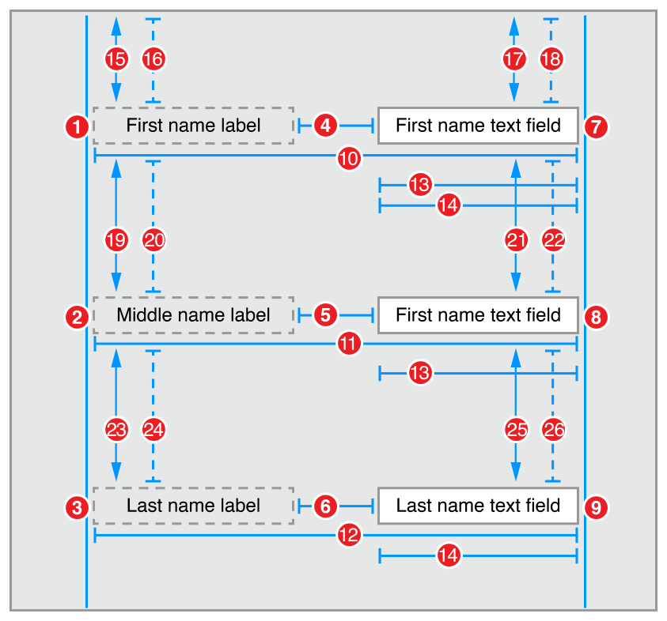

1. `First Name Label.Leading = Superview.LeadingMargin`
2. `Middle Name Label.Leading = Superview.LeadingMargin`
3. `Last Name Label.Leading = Superview.LeadingMargin`
4. `First Name Text Field.Leading = First Name Label.Trailing + Standard`
5. `Middle Name Text Field.Leading = Middle Name Label.Trailing + Standard`
6. `Last Name Text Field.Leading = Last Name Label.Trailing + Standard`
7. `First Name Text Field.Trailing = Superview.TrailingMargin`
8. `Middle Name Text Field.Trailing = Superview.TrailingMargin`
9. `Last Name Text Field.Trailing = Superview.TrailingMargin`
10. `First Name Label.Baseline = First Name Text Field.Baseline`
11. `Middle Name Label.Baseline = Middle Name Text Field.Baseline`
12. `Last Name Label.Baseline = Last Name Text Field.Baseline`
13. `First Name Text Field.Width = Middle Name Text Field.Width`
14. `First Name Text Field.Width = Last Name Text Field.Width`
15. `First Name Label.Top >= Top Layout Guide.Bottom + 20.0`
16. `First Name Label.Top = Top Layout Guide.Bottom + 20.0 (Priority 249)`
17. `First Name Text Field.Top >= Top Layout Guide.Bottom + 20.0`
18. `First Name Text Field.Top = Top Layout Guide.Bottom + 20.0 (Priority 249)`
19. `Middle Name Label.Top >= First Name Label.Bottom + Standard`
20. `Middle Name Label.Top = First Name Label.Bottom + Standard (Priority 249)`
21. `Middle Name Text Field.Top >= First Name Text Field.Bottom + Standard`
22. `Middle Name Text Field.Top = First Name Text Field.Bottom + Standard (Priority 249)`
23. `Last Name Label.Top >= Middle Name Label.Bottom + Standard`
24. `Last Name Label.Top = Middle Name Label.Bottom + Standard (Priority 249)`
25. `Last Name Text Field.Top >= Middle Name Text Field.Bottom + Standard`
26. `Last Name Text Field.Top = Middle Name Text Field.Bottom + Standard (Priority 249)`

### Attributes

In the Attributes inspector, set the following attributes. In particular, right align the text in all the labels. Right aligning the labels lets you use labels that are longer than their text, and the edge of the text still lines up beside the text fields.

| View | Attribute | Value |
| --- | --- | --- |
| First Name Label | Text | First Name |
| First Name Label | Alignment | Right |
| First Name Text Field | Placeholder | Enter first name |
| Middle Name Label | Text | Middle Name |
| Middle Name Label | Alignment | Right |
| Middle Name Text Field | Placeholder | Enter middle name |
| Last Name Label | Text | Last Name |
| Last Name Label | Alignment | Right |
| Last Name Text Field | Placeholder | Enter last name |

For each pair, the label’s content hugging must be higher than the text fields. Again, Interface Builder should do this automatically; however, you can verify these priorities in the Size inspector.

| Name | Horizontal hugging | Vertical hugging | Horizontal resistance | Vertical resistance |
| --- | --- | --- | --- | --- |
| First Name Label | 251 | 251 | 750 | 750 |
| First Name Text Field | 250 | 250 | 750 | 750 |
| Middle Name Label | 251 | 251 | 750 | 750 |
| Middle Name Text Field | 250 | 250 | 750 | 750 |
| Last Name Label | 251 | 251 | 750 | 750 |
| Last Name Text Field | 250 | 250 | 750 | 750 |

### Discussion

This recipe simply combines the techniques described in the [Dynamic Height Label and Text Field](#apple-f4xwc4dqnrsv64tfmyxwi33df52wszbpkridimbqgeydqnjtfvbuqmjtfvjvomjw) and [Fixed Height Columns](#apple-f4xwc4dqnrsv64tfmyxwi33df52wszbpkridimbqgeydqnjtfvbuqmjtfvjvomru) recipes. Like the Dynamic Height Label and Text Field recipe, this recipe uses pairs of constraints to dynamically set the vertical spacing between the rows. Like the Fixed Height Columns recipe, it uses right-aligned text in the labels, and explicit equal width constraints to line up the columns.

> [!NOTE]
> 

As you can see, the layout’s logic is beginning to grow somewhat complex; however, there are a couple of ways you can simplify things. First, as mentioned earlier, you should use stack views wherever possible. Alternatively, you can group controls, and then lay out the groups. This lets you break up a single, complex layout into smaller, more manageable chunks.

### Two Equal-Width Buttons

This recipe demonstrates laying out two equal sized buttons. Vertically, the buttons are aligned with the bottom of the screen. Horizontally, they are stretched so that they fill all the available space.

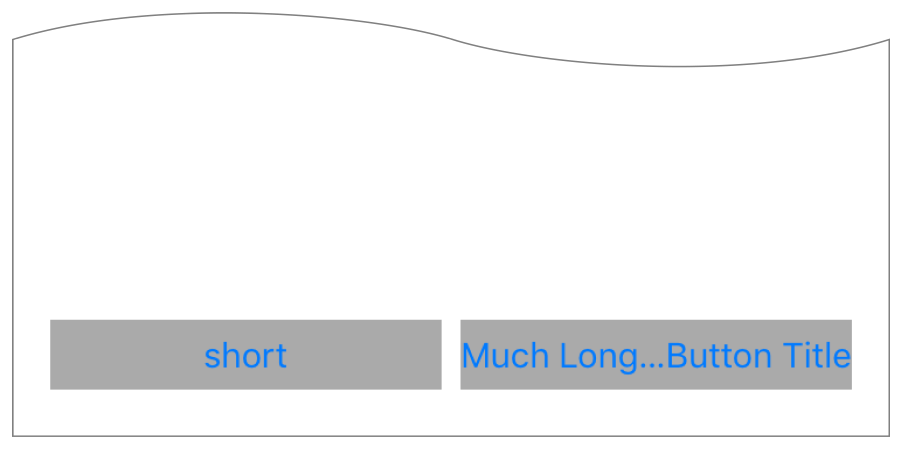

### Views and Constraints

In Interface Builder, drag two buttons onto the scene. Align them using the guidelines along the bottom of the scene. Don’t worry about making the buttons the same width—just stretch one of them to fill the remaining horizontal space. After they are roughly in place, set the following constraints. Auto Layout will calculate their correct, final position.

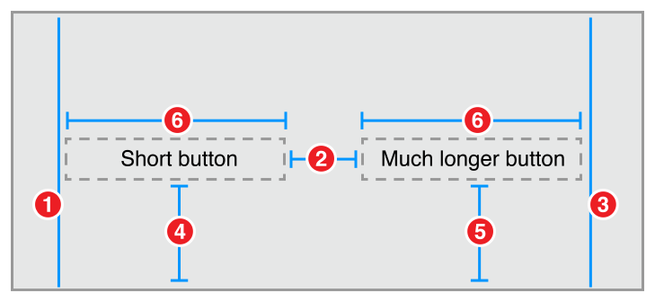

1. `Short Button.Leading = Superview.LeadingMargin`
2. `Long Button.Leading = Short Button.Trailing + Standard`
3. `Long Button.Trailing = Superview.TrailingMargin`
4. `Bottom Layout Guide.Top = Short Button.Bottom + 20.0`
5. `Bottom Layout Guide.Top = Long Button.Botton + 20.0`
6. `Short Button.Width = Long Button.Width`

### Attributes

Give the buttons a visible background color, to make it easier to see how their frames change as the device rotates. Additionally, use different length titles for the buttons, to show that the button title does not affect the button’s width.

| View | Attribute | Value |
| --- | --- | --- |
| Short Button | Background | Light Gray Color |
| Short Button | Title | short |
| Long Button | Background | Light Gray Color |
| Long Button | Title | Much Longer Button Title |

### Discussion

This recipe uses the buttons’ intrinsic height, but not their width when calculating the layout. Horizontally, the buttons are explicitly sized so that they have an equal width and fill the available space. To see how the button’s intrinsic height affects the layout, compare this recipe with the [Two Equal-Width Views](WorkingwithSimpleConstraints.md#apple-f4xwc4dqnrsv64tfmyxwi33df52wszbpkridimbqgeydqnjtfvbuqmjsfvjvomjx) recipe. In this recipe, there are only two vertical constraints, not four.

The buttons are also given titles with very different lengths to help illustrate how the button’s text affects (or in this case, does not affect) the layout.

> [!NOTE]
> 

### Three Equal-Width Buttons

This recipe extends the [Two Equal-Width Buttons](#apple-f4xwc4dqnrsv64tfmyxwi33df52wszbpkridimbqgeydqnjtfvbuqmjtfvjvona) recipe, so that it uses three equal-width buttons.

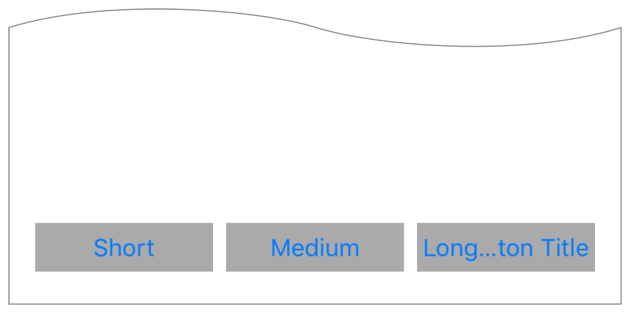

### Views and Constraints

Lay out the buttons and set the constraints as shown.

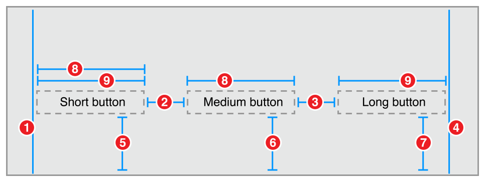

1. `Short Button.Leading = Superview.LeadingMargin`
2. `Medium Button.Leading = Short Button.Trailing + Standard`
3. `Long Button.Leading = Medium Button.Trailing + Standard`
4. `Long Button.Trailing = Superview.TrailingMargin`
5. `Bottom Layout Guide.Top = Short Button.Bottom + 20.0`
6. `Bottom Layout Guide.Top = Medium Button.Bottom + 20.0`
7. `Bottom Layout Guide.Top = Long Button.Bottom + 20.0`
8. `Short Button.Width = Medium Button.Width`
9. `Short Button.Width = Long Button.Width`

### Attributes

Give the buttons a visible background color, to make it easier to see how their frames change as the device rotates. Additionally, use different length titles for the buttons, to show that the button title does not affect the button’s width.

| Para | View | Attribute | Value |
| --- | --- | --- | --- |
| Short Button | Background | Light Gray Color |
| Short Button | Title | Short |
| Medium Button | Background | Light Gray Color |
| Medium Button | Title | Medium |
| Long Button | Background | Light Gray Color |
| Long Button | Title | Long Button Title |

### Discussion

Adding an extra button requires adding three extra constraints (two horizontal constraints and one vertical constraints). Remember, you are not using the button’s intrinsic width, so you need at least two horizontal constraints to uniquely specify both its position and its size. However, you are using the button’s intrinsic height, so you only need one additional constraint to specify its vertical position.

> [!NOTE]
> 

### Two Buttons with Equal Spacing

Superficially, this recipe resembles the [Two Equal-Width Buttons](#apple-f4xwc4dqnrsv64tfmyxwi33df52wszbpkridimbqgeydqnjtfvbuqmjtfvjvona) recipe (see Screenshot). However, in this recipe, the buttons’ widths are based on the longest title. If there’s enough space, the buttons are stretched only until they both match the intrinsic content size of the longer button. Any additional space is divided evenly around the buttons.

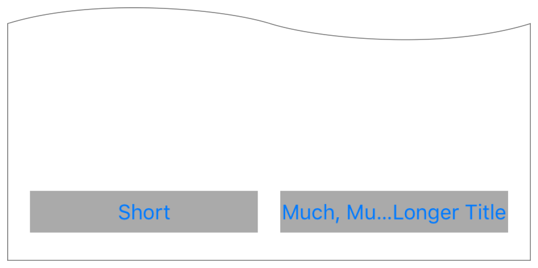

On the iPhone, the Two Equal-Width Buttons and Two Buttons with Equal Spacing layouts appear nearly identical in the portrait orientation. The difference becomes obvious only when you rotate the device into a landscape orientation (or use a larger device, like an iPad).

### Views and Constraints

In Interface Builder, drag out and position two buttons and three view objects. Position the buttons between the views, and then set the constraints as shown.

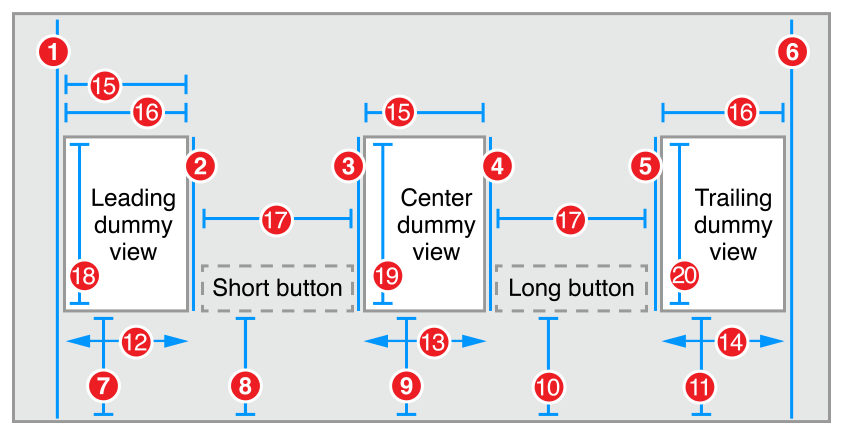

1. `Leading Dummy View.Leading = Superview.LeadingMargin`
2. `Short Button.Leading = Leading Dummy View.Trailing`
3. `Center Dummy View.Leading = Short Button.Trailing`
4. `Long Button.Leading = Center Dummy View.Trailing`
5. `Trailing Dummy View.Leading = Long Button.Trailing`
6. `Trailing Dummy View.Trailing = Superview.TrailingMargin`
7. `Bottom Layout Guide.Top = Leading Dummy View.Bottom + 20.0`
8. `Bottom Layout Guide.Top = Short Button.Bottom + 20.0`
9. `Bottom Layout Guide.Top = Center Dummy View.Bottom + 20.0`
10. `Bottom Layout Guide.Top = Long Button.Bottom + 20.0`
11. `Bottom Layout Guide.Top = Trailing Dummy View.Bottom + 20.0`
12. `Short Button.Leading >= Superview.LeadingMargin`
13. `Long Button.Leading >= Short Button.Trailing + Standard`
14. `Superview.TrailingMargin >= Long Button.Trailing`
15. `Leading Dummy View.Width = Center Dummy View.Width`
16. `Leading Dummy View.Width = Trailing Dummy View.Width`
17. `Short Button.Width = Long Button.Width`
18. `Leading Dummy View.Height = 0.0`
19. `Center Dummy View.Height = 0.0`
20. `Trailing Dummy View.Height = 0.0`

### Attributes

Give the buttons a visible background color, to make it easier to see how their frames change as the device rotates. Additionally, use different length titles for the buttons. The buttons should be sized based on the longest title.

| View | Attribute | Value |
| --- | --- | --- |
| Short Button | Background | Light Gray Color |
| Short Button | Title | Short |
| Long Button | Background | Light Gray Color |
| Long Button | Title | Much Longer Button Title |

### Discussion

As you can see, the set of constraints has become complex. While this example is designed to demonstrate a specific technique, in a real-world app you should consider using a stack view instead.

In this example, you want the size of the white space to change as the superview’s frame changes. This means you need a set of equal width constraints to control the white space’s width; however, you cannot create constraints on empty space. There must be an object of some sort whose size you can constrain.

In this recipe, you use dummy views to represent the empty space. These views are empty instances of the [UIView](https://developer.apple.com/documentation/uikit/uiview) class. In this recipe, they are given a 0-point height to minimize their effect on the view hierarchy.

> [!NOTE]
> 

Alternatively, you could use instances of the [UILayoutGuide](https://developer.apple.com/documentation/uikit/uilayoutguide) class to represent the white space. This lightweight class represents a rectangular frame that can participate in Auto Layout constraints. Layout guides do not have a graphic context, and they are not part of the view hierarchy. This makes layout guides ideal for grouping items or defining white space.

Unfortunately, you cannot add layout guides to a scene in Interface Builder, and mixing programmatically created objects with a storyboard-based scene can become quite complex. As a general rule of thumb, it’s better to use storyboards and Interface Builder, than to use custom layout guides.

This recipe uses greater-than-or-equal constraints to set the minimum spacing around the buttons. Required constraints also guarantee that the buttons are always the same width, and the dummy views are also always the same width (though, they can be a different width than the buttons). The rest of the layout is largely managed by the button’s CHCR priorities. If there isn’t enough space, the dummy views collapse to a 0-point width, and the button’s divide the available space amongst themselves (with the standard spacing between them). As the available space increases, the buttons expand until they reach the larger button’s intrinsic width, then the dummy views begin to expand. The dummy views continue to expand to fill any remaining space.

### Two Buttons with Size Class-Based Layouts

This recipe uses two different sets of constraints. One is installed for the Any-Any layout. These constraints define a pair of equal-width buttons, identical to the [Two Equal-Width Buttons](#apple-f4xwc4dqnrsv64tfmyxwi33df52wszbpkridimbqgeydqnjtfvbuqmjtfvjvona) recipe.

The other set of constraints are installed on the Compact-Regular layout. These constraints define a stacked pair of buttons, as shown below.

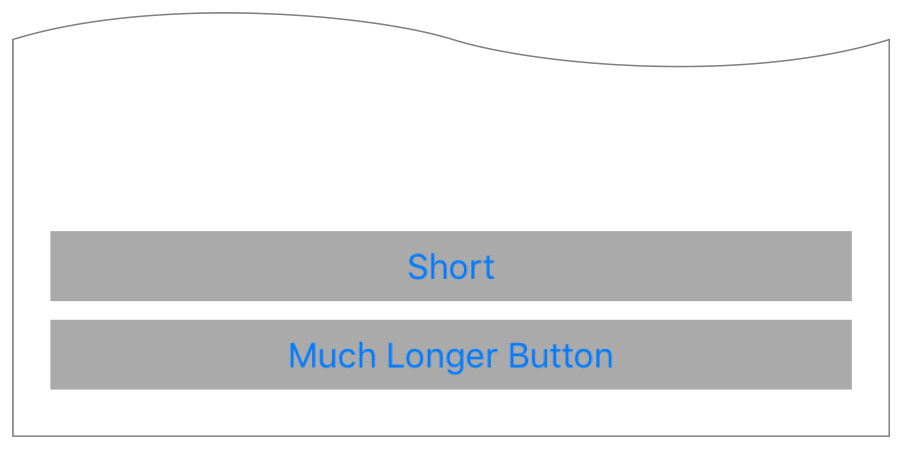

The vertically stacked buttons are used on the iPhone in portrait orientation. The horizontal row of buttons is used everywhere else.

### Constraints

Lay out the buttons exactly as you did for the Two Equal-Width Buttons recipe. In the Any-Any size class, set constraints 1 through 6.

Next, switch Interface Builder’s size class to the Compact-Regular layout.

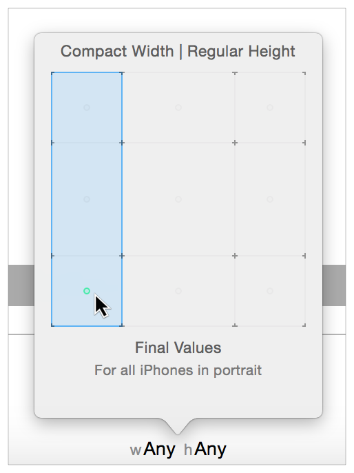

Uninstall constraint 2 and constraint 5, and add constraints 7, 8, and 9 as shown.

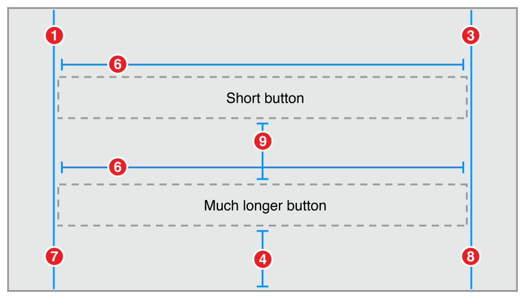

1. `Short Button.Leading = Superview.LeadingMargin`
2. `Long Button.Leading = Short Button.Trailing + Standard`
3. `Long Button.Trailing = Superview.TrailingMargin`
4. `Bottom Layout Guide.Top = Short Button.Bottom + 20.0`
5. `Bottom Layout Guide.Top = Long Button.Botton + 20.0`
6. `Short Button.Width = Long Button.Width`
7. `Long Button.Leading = Superview.LeadingMargin`
8. `Short Button.Trailing = Superview.TrailingMargin`
9. `Long Button.Top = Short Button.Bottom + Standard`

### Attributes

Give the buttons a visible background color, to make it easier to see how their frames change as the device rotates. Additionally, use different length titles for the buttons, to show that the button title does not affect the button’s width.

| View | Attribute | Value |
| --- | --- | --- |
| Short Button | Background | Light Gray Color |
| Short Button | Title | short |
| Long Button | Background | Light Gray Color |
| Long Button | Title | Much Longer Button Title |

### Discussion

Interface Builder lets you set size-class specific views, view attributes, and constraints. It allows you to specify different options for three different size classes (Compact, Any, or Regular) for both the width and the height, giving a total of nine different size classes. Four of them correspond to the Final size classes used on devices (Compact-Compact, Compact-Regular, Regular-Compact, and Regular-Regular). The rest are Base size classes, or abstract representations of two or more size classes (Compact-Any, Regular-Any, Any-Compact, Any-Regular, and Any-Any).

When loading the layout for a given size class, the system loads the most-specific settings for that size class. This means that the Any-Any size class defines the default values used by all views. Compact-Any settings affect all views with a compact width, and the Compact-Regular settings are only used for views with a compact width and a regular height. When the view’s size class changes—for example, when an iPhone rotates from portrait to landscape, the system automatically swaps layouts and animates the change.

You can use this feature to create different layouts for the different iPhone orientations. You can also use it to create different iPad and iPhone layouts. The size-class-specific customizations can be as broad or as simple as you want. Of course, the more changes you have, the more complex the storyboard becomes, and the harder it is to design and maintain.

Remember, you need to make sure you have a valid layout for each possible size class, including all the base size classes. As a general rule, it’s usually easiest to pick one layout to be your default layout. Design that layout in the Any-Any size class. Then modify the Final size classes, as needed. Remember, you can both add and remove items in the more specific size classes.

For more complex layouts, you may want to draw out the 9 x 9 grid of size classes before you begin. Fill in the four corners with the layouts for those size classes. The grid then lets you see which constraints are shared across multiple size classes, and helps you find the best combination of layouts and size classes.

For more information on working with size classes, see [Debugging Auto Layout](TypesofErrors.md#apple-f4xwc4dqnrsv64tfmyxwi33df52wszbpkridimbqgeydqnjtfvbuqmrsfvjvomi).

[Simple Constraints](WorkingwithSimpleConstraints.md#apple-f4xwc4dqnrsv64tfmyxwi33df52wszbpkridimbqgeydqnjtfvbuqmjsfvjvomi)

[Types of Errors](TypesofErrors.md#apple-f4xwc4dqnrsv64tfmyxwi33df52wszbpkridimbqgeydqnjtfvbuqmjxfvjvomi)
