> 导航：[总目录](../../../README.md) · [documentation](../../../_indexes/documentation.md) · [Auto Layout Guide](index.md)

## Working with Constraints in Interface Builder

There are three main options for setting up Auto Layout constraints in Interface Builder: You can control-drag between views, you can use the Pin and Align tools, and you can let Interface Builder set up the constraints for you and then edit or modify the results. Each of these approaches has its own set of strengths and weaknesses. Most developers find that they prefer one approach over the others; however, being familiar with all three approaches lets you quickly switch between tools based on the task at hand.

For all three options, start by dragging your views and controls from the Object library onto the scene. Resize and position them as needed. When you place a view on the canvas, Interface Builder automatically creates a set of prototyping constraints that define the view’s current size and position relative to the upper left corner.

The app can build and run with the prototyping constraints. Use these constraints to quickly visualize and test a user interface, but then replace the implicit constraints with your own explicit constraints. Never ship an app with prototyping constraints.

As soon as you create your first constraint, the system removes all the prototyping constraints from the views referred to by the constraint. Without the prototyping constraints, your layout no longer has enough constraints to uniquely size and position all the views. It becomes an ambiguous layout. The affected constraints suddenly appear in red, and Xcode generates a number of warnings.

Don’t panic. Just keep adding your constraints until your layout is complete. As soon as you add one constraint, you are responsible for adding all the constraints needed to create a nonambiguous, satisfiable layout.

For more information on fixing layout warnings and errors, see [Debugging Auto Layout](TypesofErrors.md#apple-f4xwc4dqnrsv64tfmyxwi33df52wszbpkridimbqgeydqnjtfvbuqmrsfvjvomi).

### Control-Dragging Constraints

To create a constraint between two views, Control-click one of the views and drag to the other.

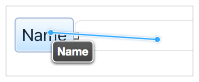

When you release the mouse, Interface Builder displays a HUD menu with a list of possible constraints.

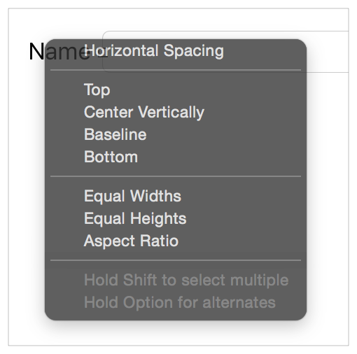

Interface Builder intelligently selects the set of constraints based on the items you are constraining and the direction of your drag gesture. If you drag more or less horizontally, you get options to set the horizontal spacing between the views, and options to vertically align the views. If you drag more or less vertically, you get options to set the vertical spacing, and options to align the views horizontally. Both gestures may include other options (such as setting the view’s relative size).

> [!NOTE]
> 

Interface Builder creates the constraints based on the views’ current frames. Therefore, you need to position the views carefully before you draw the constraints. If you line up the views based on Interface Builder’s guidelines, you should end up with a reasonable set of constraints. If necessary, you can always edit the constraints afterward.

Control-dragging provides a very quick way to set a constraint; however, because the constraint’s values are inferred from the scene’s current layout, it is easy to end up off by a point. If you want finer control, review and edit the constraints after you create them, or use the Pin and Align tools.

For more information on Control-dragging constraints, see Adding Layout Constraints by Control-Dragging in Auto Layout Help.

### Using the Stack, Align, Pin and Resolve Tools

Interface Builder provides four Auto Layout tools in the bottom-right corner of the Editor window. These are the Stack, Align, Pin, and Resolve Auto Layout Issues tools.

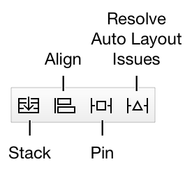

Use the Pin and Align tools when you want fine control when making constraints or when you want to make multiple constraints at once. As an added advantage, when you use these tools, you don’t need to precisely place your views before creating the constraint. Instead, you can roughly set the relative position of the views, add your constraints, and then update the frames. This lets Auto Layout calculate the correct positions for you.

### Stack Tool

The Stack tool allows you to quickly create a stack view. Select one or more items in your layout, and then click on the Stack tool. Interface Builder embeds the selected items in a stack view and resizes the stack to its current fitting size based on its contents.

> [!NOTE]
> 

### Align Tool

The Align tool lets you quickly align items in your layout. Select the items you want to align, and then click the Align tool. Interface Builder presents a popover view containing a number of possible alignments.

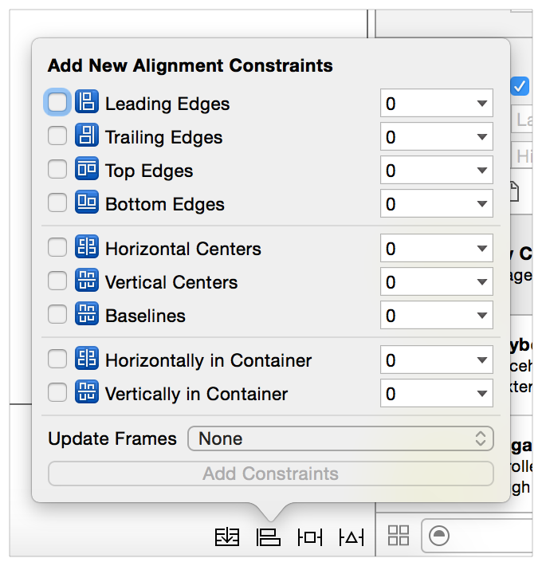

Select the options for aligning the selected views, and click the Add Constraints button. Interface Builder creates the constraints needed to ensure those alignments. By default, the constraints do not have any offset (the edges or centers are aligned with each other) and none of the frames are updated when the constraints are added. You can change any of these settings before creating the constraints.

You typically select two or more views before using the Align tool. However, the Horizontally in Container or Vertically in Container constraints can be added to a single view. You can use the popover to create any number of constraints at once—though it rarely makes sense to create more than one or two at a time.

For more information, see Adding Auto Layout Constraints with the Pin and Align Tools in Auto Layout Help.

### Pin Tool

The Pin tool lets you quickly define a view’s position relative to its neighbors or quickly define its size. Select the item whose position or size you want to pin, and click the Pin tool. Interface Builder presents a popover view containing a number of options.

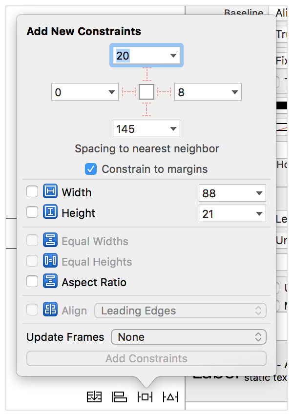

The top portion of the popover lets you pin the selected item’s Leading, Top, Trailing, or Bottom edge to its nearest neighbor. The associated number indicates the current spacing between the items in the canvas. You can type in a custom spacing, or you can click the disclosure triangle to set which view it should be constrained to or to select the standard spacing. The “Constrain to margins” checkbox determines whether constraints to the superview use the superview’s margins or its edges.

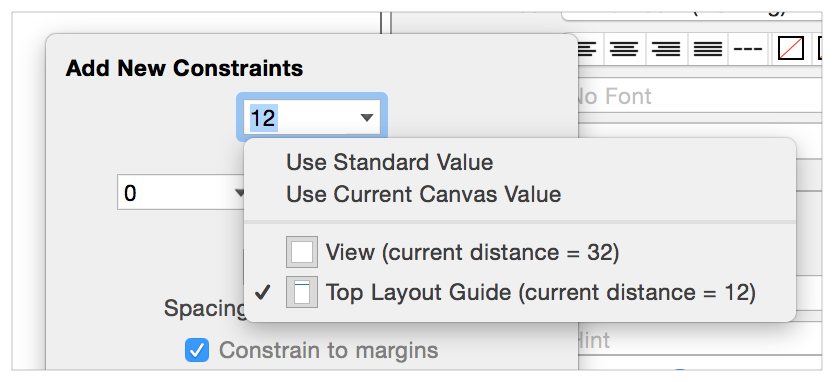

The lower portion of the popover lets you set the item’s width or height. The Width and Height constraints default to the current canvas size, though you can type in different values. The Aspect Ratio constraint also uses the item’s current aspect ratio; however, if you want to change this ratio, you need to review and edit the constraint after creating it.

Typically, you select a single view to pin; however, you can select two or more views and give them equal widths or equal heights. You can also create multiple constraints at once, or you can update the frames as you add the constraints. After you’ve set the options you want, click the Add Constraints button to create your constraints.

For more information, see Adding Auto Layout Constraints with the Pin and Align Tools in Auto Layout Help.

### Resolve Auto Layout Issues Tool

The Resolve Auto Layout Issues tool provides a number of options for fixing common Auto Layout issues. The options in the upper half of the menu affect only the currently selected views. The options in the bottom half affect all views in the scene.

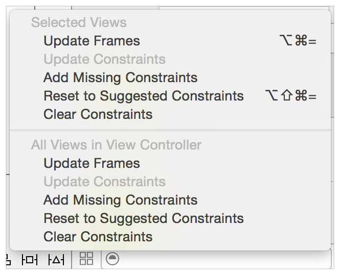

You can use this tool to update the views’ frames based on the current constraints, or you can update the constraints based on the views’ current location in the canvas. You can also add missing constraints, clear constraints, or reset the views to a set of constraints recommended by Interface Builder.

The commands to add or reset constraints are discussed in greater detail in Letting Interface Builder Create Constraints.

### Letting Interface Builder Create Constraints

Interface Builder can create some or all of the constraints for you. When using this approach, Interface Builder attempts to infer the best constraints given the view’s current size and position in the canvas. Be sure to position your views carefully—small differences in spacing can result in significantly different layouts.

To let Interface Builder create all the constraints, click Resolve Auto Layout Issues tool > Reset to Suggested Constraints. Interface Builder creates all the required constraints for the selected views (or for all the views in the scene).

Alternatively, you can add a few constraints yourself, and then click the Resolve Auto Layout Issues tool > Add Missing Constraints. This option adds the constraints needed to have a nonambiguous layout. Again, you can add constraints either to the selected view or to all the views in the scene.

This approach lets you rapidly build a nonambiguous, satisfiable layout, but unless the user interface is straightforward, the resulting layout may not behave the way you want. Always test the user interface and modify the constraints until you get the intended results.

### Finding and Editing Constraints

After you’ve added a constraint, you need to be able to find it, view it, and edit it. There are a number of options for accessing the constraints. Each option offers a unique method of organizing and presenting the constraints.

### Viewing Constraints in the Canvas

The editor displays all the constraints affecting the currently selected view as colored lines on the canvas. The shape, stroke type, and line color can tell you a lot about the current state of the constraint.

- __I-bars (lines with T-shaped end-caps).__ I-bars show the size of a space. This space can be either the distance between two items, or the height or width of an item.
- __Plain lines (straight lines with no end-caps).__ Plain lines show where edges align. For example, Interface Builder uses simple lines when aligning the leading edge of two or more views. These lines can also be used to connect items that have a 0-point space between them.
- __Solid Lines.__ Solid lines represent required constraints (priority = 1000).
- __Dashed Lines.__ Dashed lines represent optional constraints (priority < 1000).
- __Red Lines.__ One of the items affected by this constraint has an error. Either the item has an ambiguous layout, or its layout is not satisfiable. For more information, see the issues navigator or the disclosure arrow in Interface Builder’s outline view.
- __Orange Lines.__ Orange lines indicate that the frame of one of the items affected by this constraint is not in the correct position based on the current set of constraints. Interface Builder also shows the calculated position for the frame as a dashed outline. You can move the item to its calculated position using the Resolve Auto Layout Issues tool > Update Frames command.
- __Blue Lines.__ The items affected by the constraint have a nonambiguous, satisfiable layout, and the item’s frame is in the correct position as calculated by the Auto Layout engine.
- __Equal Badges.__ Interface Builder shows constraints that give two items an equal width or an equal height as a separate bar for each item. Both bars are tagged with a blue badge containing an equal (=) sign inside.
- __Greater-than-or-equal and less-than-or-equal badges.__ Interface Builder marks all constraints representing greater-than-or-equal-to and less-than-or-equal-to relationships with a small blue badge with a >= or <= symbol inside.

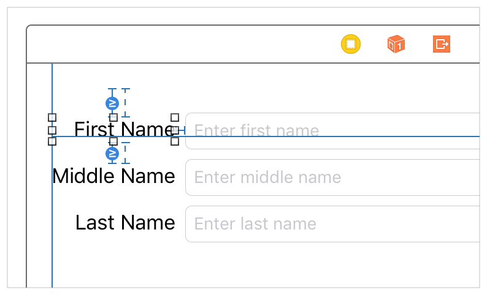

### Listing Constraints in the Document Outline

Interface Builder lists all the constraints in the document outline, grouping them under the view that holds them. Constraints are held by the closest view that contains both items in the constraint. For this calculation, each view contains itself and all its subviews, and the top and bottom layout guides are contained by the scene’s root view.

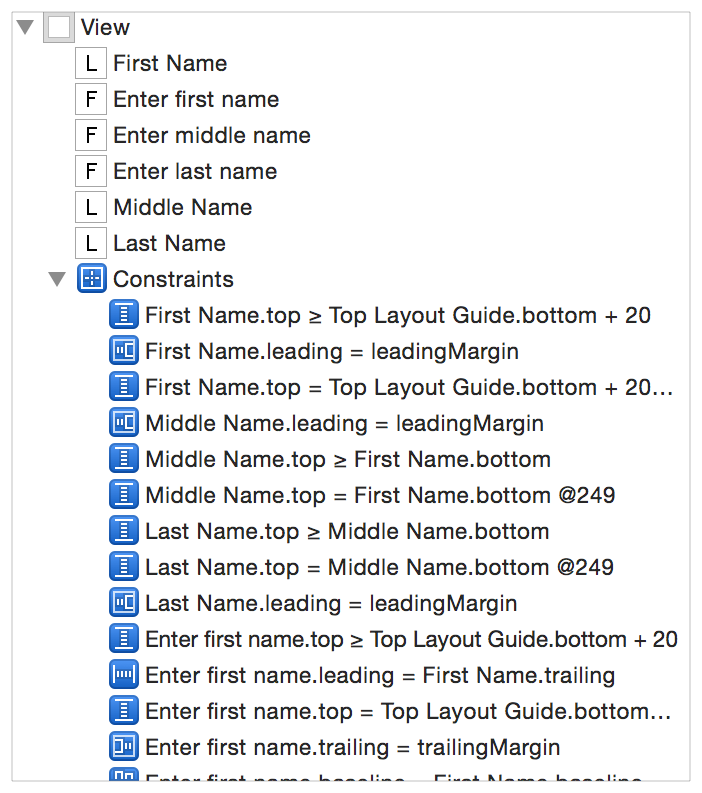

Even though constraints could be spread around the outline, most constraints end up under the scene’s root view. If you want to make sure you’ve found all the constraints, expand the entire view hierarchy.

The constraints are listed using pseudocode. These listings are often long, and they frequently start with a similar set of views, so you may have to increase the width of the outline before you can see meaningful information. Selecting a constraint in the outline highlights that constraint in the canvas. Use this feature to help you quickly identify the constraint you want to examine.

For simple scenes, the outline is a great place to glance over all the scene’s constraints. However, as the layout becomes more complex, it quickly becomes hard to find specific constraints. You are often better off examining the constraints one view at a time—either by selecting the view in the canvas or by examining the view in the Size inspector.

### Finding Constraints in the Size Inspector

The Size inspector lists all the constraints affecting the currently selected view. Required constraints appear with a solid outline, and optional constraints appear with a dashed outline. The description lists important information about the constraint. It always includes the affected attribute and the other item in the constraint. It may also include the relationship, the constant value, and the multiplier or ratio.

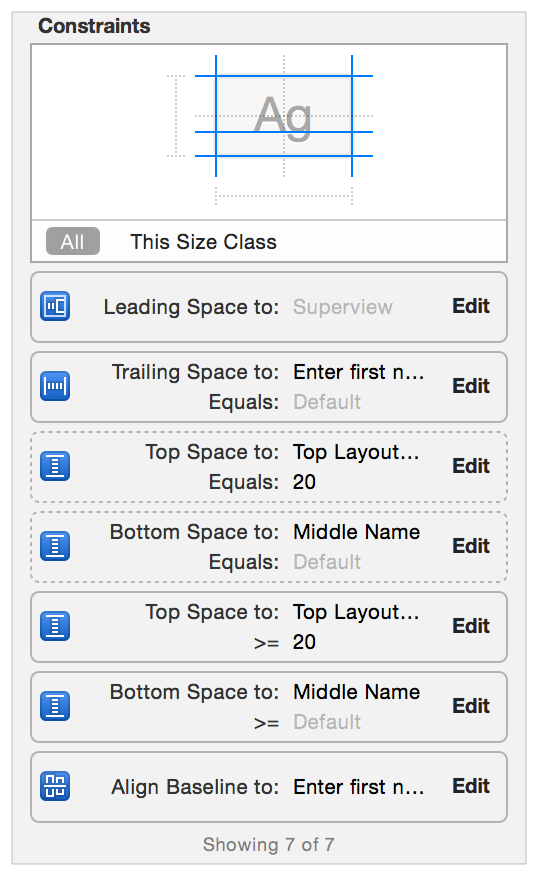

The diagram at the top of the above screenshot shows which attributes are affected by constraints. You can filter the list of constraints by selecting one or more of the diagram’s attributes. The list then shows only those constraints affecting the selected attributes.

For more information, see Viewing the Complete List of Layout Constraints for an Item in Auto Layout Help.

### Examining and Editing Constraints

When you select a constraint either in the canvas or in the document outline, the Attribute inspector shows all of the constraint’s attributes. This includes all the values from the constraint equation: the first item, the relation, the second item, the constant, and the multiplier. The Attribute inspector also shows the constraint’s priority and its identifier.

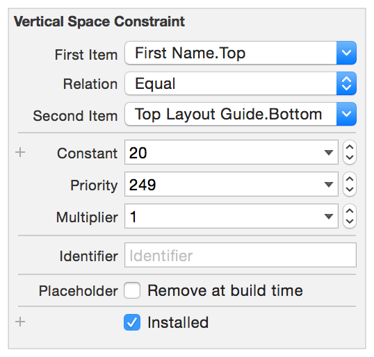

> [!NOTE]
> 

You can also mark the constraint as a placeholder. These constraints exist only at design time. They are not included in the layout when the app runs. You typically add placeholder constraints when you plan to dynamically add constraints at runtime. By temporarily adding the constraints needed to create a nonambiguous, satisfiable layout, you clear out any warnings or errors in Interface Builder.

You can freely modify the Constant, Priority, Multiplier, Relation, Identifier, and Placeholder attributes. For the first and second item, however, your options are more limited. You can swap the first and second item (inverting the multiplier and constant, as needed). You can also change the item’s attribute, but you cannot change the item itself. If you need to move the constraint to a completely different item, delete the constraint and replace it with a new constraint.

Some editing is also possible directly from the Size inspector. Clicking the Edit button in any of the constraints brings up a popover where you can change the constraint’s relationship, constant, priority, or multiplier. To make additional changes, double-click the constraint to select it and open it in the Attribute inspector.

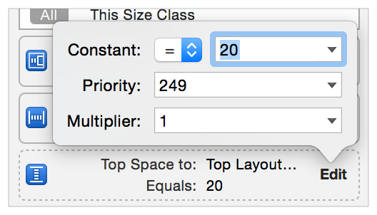

For more information, see Editing Auto Layout Constraints in Auto Layout Help.

### Setting Content-Hugging and Compression-Resistance Priorities

To set a view’s content-hugging and compression-resistance priorities (CHCR priorities), select the view either in the canvas or in the document outline. Open the Size inspector, and scroll down until you find the Content Hugging Priority and Compression Resistance Priority settings.

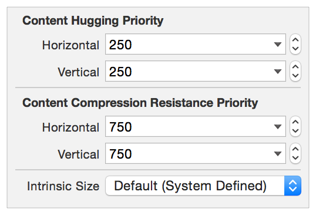

You can also set the view’s intrinsic size in Interface Builder. By default, Interface Builder uses the size returned from the view’s [intrinsicContentSize](https://developer.apple.com/documentation/uikit/uiview/1622600-intrinsiccontentsize) method. However, if you need a different size at design time, you can set a placeholder intrinsic content size. This placeholder affects the size of the view only in Interface Builder. It does not have any effect on the view at runtime.

For more information, see Setting the Placeholder Intrinsic Size for a Custom View in Auto Layout Help.

### iOS-Only Features

iOS adds a few unique features that interact with Auto Layout. These include the top and bottom layout guides, a view’s layout margins, a view’s readable content guides, and a view’s semantic content.

### Top and Bottom Layout Guides

The top and bottom layout guides represent the upper and lower edge of the visible content area for the currently active view controller. If you don’t want your content to extend under transparent or translucent UIKit bars (for example, a status bar, navigation bar, or tab bar), use Auto Layout to pin your content to the respective layout guide.

The layout guides adopt the [UILayoutSupport](https://developer.apple.com/documentation/uikit/uilayoutsupport) protocol, giving the guide a `length` property, which measures the distance between the guide and the respective edge of the view. Specifically:

- For the top layout guide, `length` indicates the distance, in points, between the top of a view controller’s view and the bottom of the bottommost bar that overlays the view.
- For the bottom layout guide, `length` indicates the distance, in points, between the bottom of a view controller’s view and the top the bar (such as a tab bar) that overlays the view.

These guides can also act as items in a constraint, supporting the top, bottom, and height attributes. Typically, you constrain views to the top layout guide’s bottom attribute or to the bottom layout guide’s top attribute. The guides also provide `topAnchor`, `bottomAnchor`, and `heightAnchor` properties, to simplify the programmatic creation of constraints.

Interface Builder automatically offers the top and bottom layout guides as options when creating constraints to the root view’s top or bottom edge as appropriate. If the layout guide is the view’s nearest neighbor, Interface Builder uses the guide by default. When using the Pin tool you can switch between the layout guide and the root view’s edge, as needed. Just click on the disclosure triangle.

### Layout Margins

Auto Layout defines margins for each view. These margins describe the preferred spacing between the edge of the view and its subviews. You can access the view’s margins using either the [layoutMargins](https://developer.apple.com/documentation/uikit/uiview/1622566-layoutmargins) or [layoutMarginsGuide](https://developer.apple.com/documentation/uikit/uiview/1622651-layoutmarginsguide) property. The `layoutMargins` property lets you get and set the margins as a [UIEdgeInsets](https://developer.apple.com/documentation/uikit/uiedgeinsets) structure. The `layoutMarginsGuide` property provides read-only access to the margins as a [UILayoutGuide](https://developer.apple.com/documentation/uikit/uilayoutguide) object. Additionally, use the [preservesSuperviewLayoutMargins](https://developer.apple.com/documentation/uikit/uiview/1622653-preservessuperviewlayoutmargins) property to determine how the view’s margins interact with its superview’s margins.

The default margins are 8 points on each side. You can modify these margins based on your app’s needs.

> [!NOTE]
> 

When constraining a view to its superview, you typically use the layout margins instead of the view’s edge. In UIKit, the [NSLayoutAttribute](https://developer.apple.com/documentation/uikit/nslayoutattribute) enumeration defines a number of attributes to represent top, bottom, leading, trailing, left, and right margins. It also includes attributes for the center X and center Y relative to the margins.

In Interface Builder, Control-dragging a constraint between a view and its superview uses the margin attributes by default. When using the Pin tool, you can toggle the “Constrain to margins” checkbox. If it’s checked, the resulting constraints use the superview’s margin attributes. If it’s unchecked, they use the superview’s edges. Similarly, when editing a constraint in the Attribute inspector, the First Item and Second Item’s pop-down menus include a “Relative to margin” option. Select this item to use the margin attribute. Deselect it to use the edge.

Finally, when programmatically creating constraints to the superview’s margins, use the `layoutMarginsGuide` property and create constraints to the layout guide directly. This lets you use the guide’s layout anchors to create your constraints, providing a streamlined API that is easier to read.

### Readable Content Guides

The view’s [readableContentGuide](https://developer.apple.com/documentation/uikit/uiview/1622644-readablecontentguide) property contains a layout guide that defines the maximum optimal width for text objects inside the view. Ideally, the content is narrow enough that users can read it without having to move their head.

This guide is always centered inside the view’s layout margin and never extends beyond those margins. The size of the guide also varies depending on the size of the system’s dynamic type. The system creates wider guides when the user selects larger fonts, because users typically hold the device farther from them while reading.

In Interface Builder, you can set whether the view’s margins represent the layout margins or the readable content guide. Select the view (typically the view controller’s root view), and open the Size inspector. If you select the Follow Readable Width checkbox, any constraints drawn to the view’s margins use the readable content guide instead.

> [!NOTE]
> 

### Semantic Content

If you lay out your views using leading and trailing constraints, the views automatically flip positions when switching between left-to-right languages (like English) and right-to-left languages (like Arabic). However, some interface elements should not change their position based on the reading direction. For example, buttons that are based on physical directions (up, down, left, and right) should always stay in the same relative orientation.

The view’s [semanticContentAttribute](https://developer.apple.com/documentation/uikit/uiview/1622461-semanticcontentattribute) property determines whether the view’s content should flip when switching between left-to-right and right-to-left languages.

In Interface Builder, set the Semantic option in the Attribute inspector. If the value is Unspecified, the view’s content flips with the reading direction. If it is set to Spatial, Playback, or Force Left-to-Right, the content is always laid out with the leading edges to the left and trailing edges to the right. Force Right-to-Left always lays out the content with the leading edges to the right and the trailing edges to the left.

### Rules of Thumb

The following guidelines will help you succeed with Auto Layout. There are undoubtedly a number of legitimate exceptions for each of these rules. However, if you decide to veer from them, pause and carefully consider your approach before proceeding.

- Never specify a view’s geometry using its frame, bounds, or center properties.
- Use stack views wherever possible

  Stack views manage the layout of their content, greatly simplifying the constraint logic needed for the rest of the layout. Resort to custom constraints only when a stack view doesn’t provide the behavior you need.
- Create constraints between a view and its nearest neighbor.

  If you have two buttons next to each other, constrain the leading edge of the second button to the trailing edge of the first. The second button generally should not have a constraint that reaches across the first button to the view’s edge.
- Avoid giving views a fixed height or width.

  The whole point of Auto Layout is to dynamically respond to changes. Setting a fixed size removes the view’s ability to adapt. However, you may want to set a minimum or maximum size for the view.
- If you are having trouble setting constraints, try using the Pin and Align tools. Although these tools can be somewhat slower than Control-dragging, they do let you verify the exact values and items involved before creating the constraint. This extra sanity check can be helpful, especially when you are first starting out.
- Be careful when automatically updating an item’s frame. If the item does not have enough constraints to fully specify its size and position, the update’s behavior is undefined. Views often disappear either because their height or width gets set to zero or because they are accidentally positioned off screen.

  You can always try to update an item’s frame, and then undo the change, if necessary.
- Make sure all the views in your layout have meaningful names. This makes it much easier to identify your views when using the tools.

  The system automatically names labels and buttons based on their text or title. For other views, you may need to set an Xcode specific label in the Identity inspector (or by double-clicking and editing the view’s name in the document outline).
- Always use leading and trailing constraints instead of right and left.

  You can always adjust how the view interprets its leading and trailing edges using its [semanticContentAttribute](https://developer.apple.com/documentation/uikit/uiview/1622461-semanticcontentattribute) property (iOS) or its [userInterfaceLayoutDirection](https://developer.apple.com/documentation/appkit/nsview/1483254-userinterfacelayoutdirection) property (OS X).
- In iOS, when constraining an item to the edge of the view controller’s root view, use the following constraints:

  - __Horizontal constraints__. For most controls, use a zero-point constraint to the layout margins. The system automatically provides the correct spacing based on what the device is and how the app presents the view controller.

    For text objects that fill the root view from margin to margin, use the readable content guides instead of the layout margins.

    For items that need to fill the root view from edge to edge (for example, background images), use the view’s leading and trailing edges.
  - __Vertical constraints__. If the view extends under the bars, use the top and bottom margins. This is particularly common for scroll views, allowing the content to scroll under the bars. Note, however, that you may need to modify the scroll view’s [contentInset](https://developer.apple.com/documentation/uikit/uiscrollview/1619406-contentinset) and [scrollIndicatorInsets](https://developer.apple.com/documentation/uikit/uiscrollview/1619427-scrollindicatorinsets) properties to correctly set the content’s initial position.

    If the view does not extend under the bars, constrain the view to the top and bottom layout guides instead.
- When programmatically instantiating views, be sure to set their [translatesAutoresizingMaskIntoConstraints](https://developer.apple.com/documentation/uikit/uiview/1622572-translatesautoresizingmaskintoco) property to `NO``false`. By default, the system automatically creates a set of constraints based on the view’s frame and its autoresizing mask. When you add your own constraints, they inevitably conflict with the autogenerated constraints. This creates an unsatisfiable layout.
- Be aware that OS X and iOS calculate their layouts differently.

  In OS X, Auto Layout can modify both the contents of a window and the window’s size.

  In iOS, the system provides the size and layout of the scene. Auto Layout can modify only the contents of the scene.

  These differences seem relatively minor, but they can have a profound impact on how you design your layout, especially on how you use priorities.

[Anatomy of a Constraint](AnatomyofaConstraint.md#apple-f4xwc4dqnrsv64tfmyxwi33df52wszbpkridimbqgeydqnjtfvbuqojnknltc)

[Stack Views](LayoutUsingStackViews.md#apple-f4xwc4dqnrsv64tfmyxwi33df52wszbpkridimbqgeydqnjtfvbuqmjrfvjvomi)
