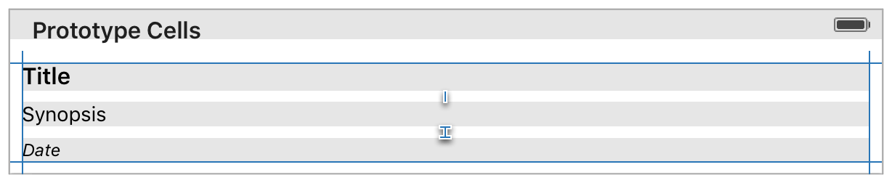

> 导航：[总目录](../../../README.md) · [documentation](../../../_indexes/documentation.md) · [Auto Layout Guide](index.md)

## Working with Self-Sizing Table View Cells

In iOS, you can use Auto Layout to define the height of a table view cell; however, the feature is not enabled by default.

Normally, a cell’s height is determined by the table view delegate’s [tableView:heightForRowAtIndexPath:](https://developer.apple.com/documentation/uikit/uitableviewdelegate/1614998-tableview) method. To enable self-sizing table view cells, you must set the table view’s [rowHeight](https://developer.apple.com/documentation/uikit/uitableview/1614852-rowheight) property to [UITableViewAutomaticDimension](https://developer.apple.com/documentation/uikit/uitableviewautomaticdimension). You must also assign a value to the [estimatedRowHeight](https://developer.apple.com/documentation/uikit/uitableview/1614925-estimatedrowheight) property. As soon as both of these properties are set, the system uses Auto Layout to calculate the row’s actual height.

1. `tableView.estimatedRowHeight = 85.0`
2. `tableView.rowHeight = UITableViewAutomaticDimension`

Next, lay out the table view cell’s content within the cell’s content view. To define the cell’s height, you need an unbroken chain of constraints and views (with defined heights) to fill the area between the content view’s top edge and its bottom edge. If your views have intrinsic content heights, the system uses those values. If not, you must add the appropriate height constraints, either to the views or to the content view itself.

Additionally, try to make the estimated row height as accurate as possible. The system calculates items such as the scroll bar heights based on these estimates. The more accurate the estimates, the more seamless the user experience becomes.

> [!NOTE]
> 

[Working with Scroll Views](WorkingwithScrollViews.md#apple-f4xwc4dqnrsv64tfmyxwi33df52wszbpkridimbqgeydqnjtfvbuqmrufvjvomi)

[Changing Constraints](ModifyingConstraints.md#apple-f4xwc4dqnrsv64tfmyxwi33df52wszbpkridimbqgeydqnjtfvbuqmrzfvjvomi)
