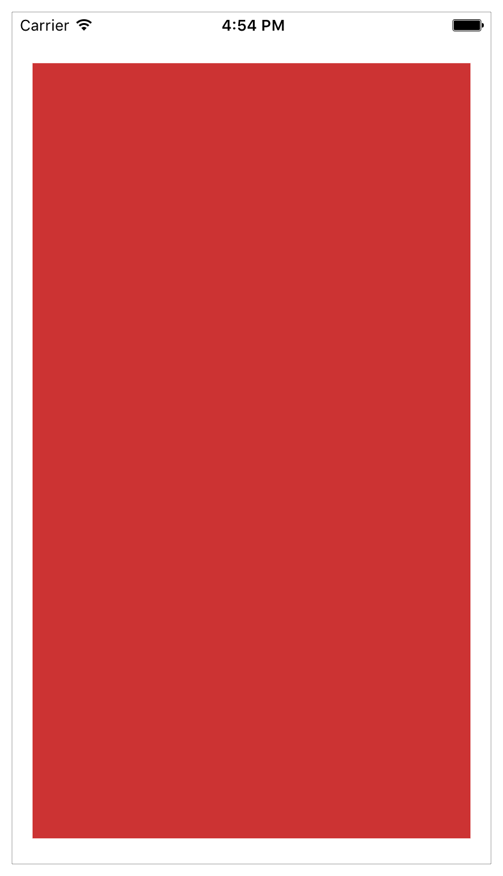
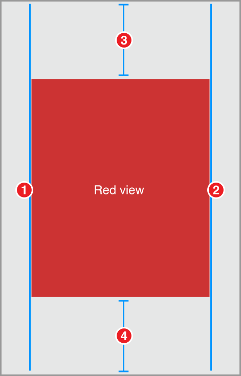
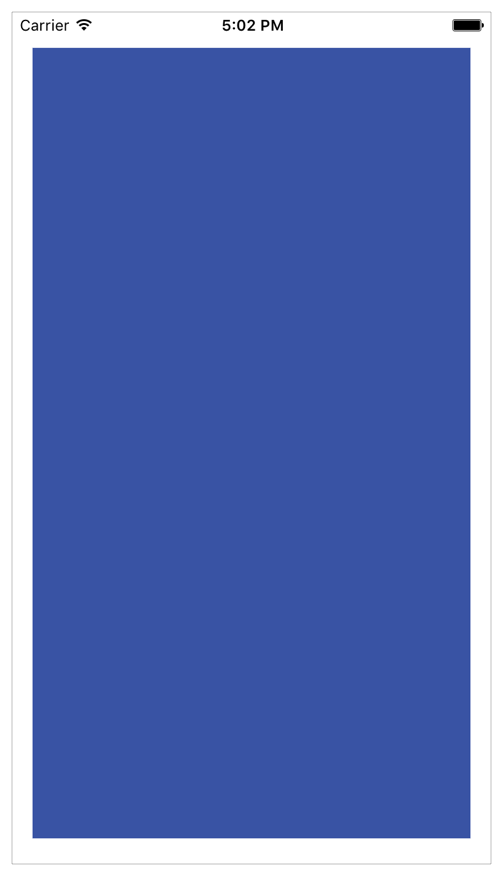
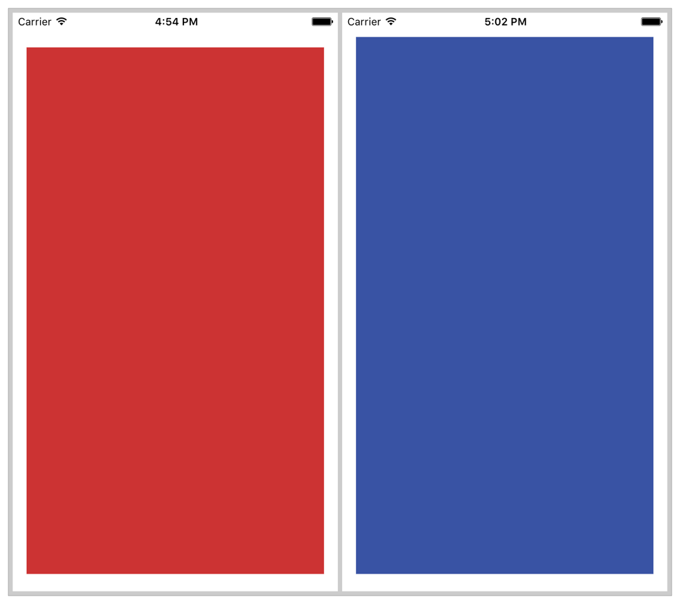
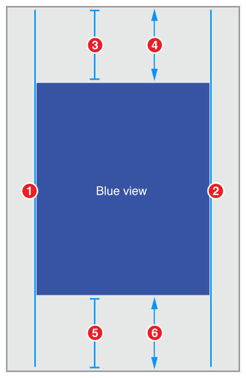
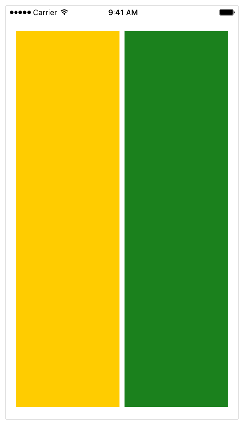
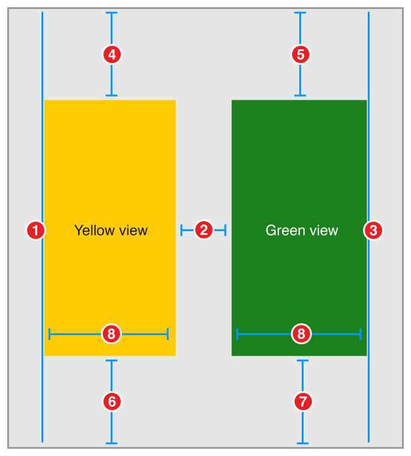
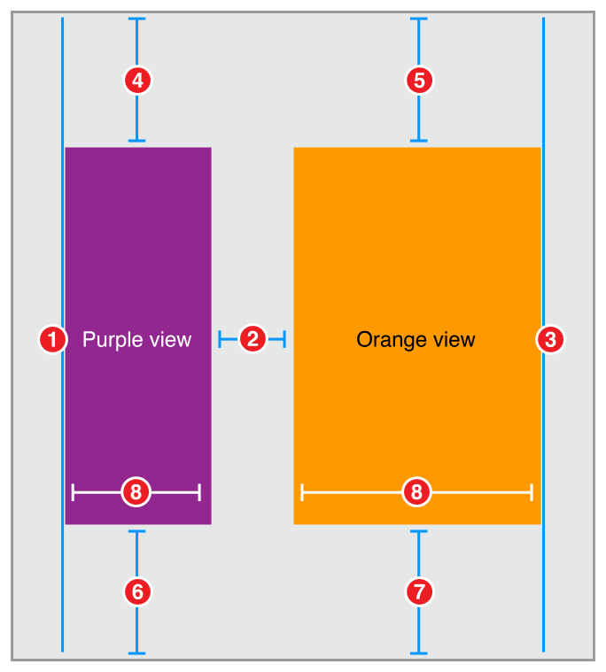
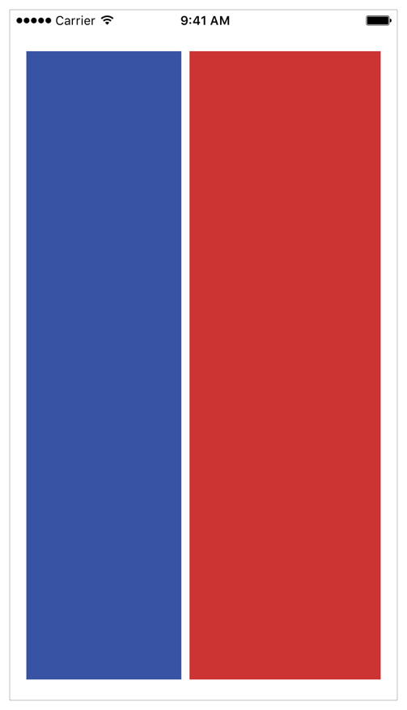
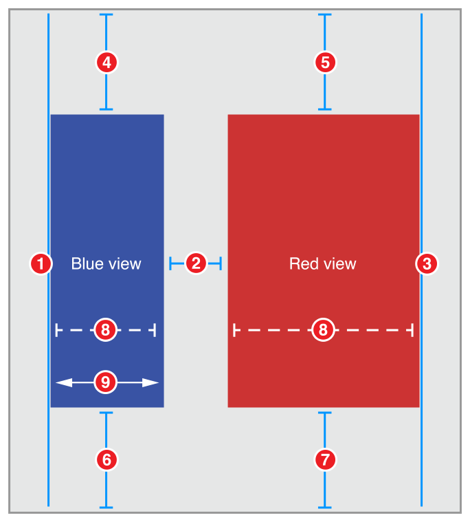

> 导航：[总目录](../../../README.md) · [documentation](../../../_indexes/documentation.md) · [Auto Layout Guide](index.md)

## Simple Constraints

The following recipes demonstrate using relatively simple sets of constraints to create common behaviors. Use these examples as the fundamental building blocks to create larger, more complex layouts.

To view the source code for these recipes, see the [Auto Layout Cookbook](https://developer.apple.com/sample-code/xcode/downloads/Auto-Layout-Cookbook.zip) (未归档：ZIP 按安全策略跳过) project.

### Simple Single View

This recipe positions a single red view so that it fills its superview with a fixed margin around all four edges.

### Views and Constraints

In Interface Builder, drag a view out onto your scene, and resize it so that it fills the scene. Use Interface Builder’s guidelines to select the correct position relative to the edge of the superview.

> [!NOTE]
> 

As soon as the view is in place, set the following constraints:.

1. `Red View.Leading = Superview.LeadingMargin`
2. `Red View.Trailing = Superview.TrailingMargin`
3. `Red View.Top = Top Layout Guide.Bottom + 20.0`
4. `Bottom Layout Guide.Top = Red View.Bottom + 20.0`

### Attributes

To give the view a red background color, set the following attributes in the Attributes inspector:

| View | Attribute | Value |
| --- | --- | --- |
| Red View | Background | Red |

### Discussion

The constraints in this recipe keep the red view a fixed distance from the edge of the superview. For the leading and trailing edges, pin your view to the superview’s margin. For the top and bottom, pin your view to the top and bottom layout guide instead.

> [!NOTE]
> 

By default, Interface Builder’s standard spacing is 20.0 points between a view and the edge of its superview, and 8.0 points between sibling views. This implies that you should use an 8.0-point space between the top of the red view and the bottom of the status bar. However, the status bar disappears when the iPhone is in a landscape orientation, and without the status bar, an 8.0-point space looks far too narrow.

Always select the layout that works best for your app. This recipe uses a fixed 20-point margin for both the top and bottom. This keeps the constraint logic as simple as possible, and still looks reasonable in all orientations. Other layouts may work better with a fixed 8-point margin.

If you want a layout that adapts automatically to the presence or absence of bars, see [Adaptive Single View](#apple-f4xwc4dqnrsv64tfmyxwi33df52wszbpkridimbqgeydqnjtfvbuqmjsfvjvona).

### Adaptive Single View

This recipe positions a single, blue view so that it fills its superview with a margin around all four edges. However, unlike the margins in the Simple Single View recipe, the top margin on this recipe adapts based on the view’s context. If there’s a status bar, the view is placed the standard spacing (8.0 points) below the status bar. If there is no status bar, the view is placed 20.0 points below the edge of the superview.

You can see this when looking at the Simple and Adaptive views side by side.

### Views and Constraints

In Interface Builder, drag a view out onto your scene, and resize it so that it fills the scene, with its edges aligned to the guidelines. Then set the constraints as shown.

1. `Blue View.Leading = Superview.LeadingMargin`
2. `Blue View.Trailing = Superview.TrailingMargin`
3. `Blue View.Top = Top Layout Guide.Bottom + Standard (Priority 750)`
4. `Blue View.Top >= Superview.Top + 20.0`
5. `Bottom Layout Guide.Top = Blue View.Bottom + Standard (Priority 750)`
6. `Superview.Bottom >= Blue View.Bottom + 20.0`

### Attributes

To give the view a blue background color, set the following attributes in the Attribute inspector:

| View | Attribute | Value |
| --- | --- | --- |
| Blue View | Background | Blue |

### Discussion

This recipe creates adaptive margins for both the top and bottom of the blue view. If there’s a bar, the view’s edge is placed 8 points away from the bar. If there is no bar, the edge is positioned 20 points away from the edge of the superview.

This recipe uses the layout guides to correctly position its contents. The system sets the position of these guides based on the presence and size of any bars. The top layout guide is positioned along the bottom edge of any top bars (for example, status bars and navigation bars). The bottom layout guide is positioned along the top edge of any bottom bars (for example, tab bars). If there isn’t a bar, the system positions the layout guide along the superview’s corresponding edge.

The recipe uses a pair of constraints to build the adaptive behavior. The first constraint is a required, greater-than-or-equal constraint. This constraint guarantees that the blue view’s edge is always at least 20-points away from the superview’s edge. In effect, it defines a minimum, 20-point margin.

Next, an optional constraint tries to position the view 8-points away from the corresponding layout guide. Because this constraint is optional, if the system cannot satisfy the constraint, it will still attempt to come as close as possible, and the constraint acts like a spring-like force, pulling the edge of the blue view towards its layout guide.

If the system is not displaying a bar, then the layout guide is equal to the superview’s edge. The blue view’s edge cannot be both 8 points and 20 points (or more) from the superview’s edge. Therefore, the system cannot satisfy the optional constraint. Still, it tries to get as close as it can—setting the margin to the 20-point minimum.

If a bar is present, then both constraints can be satisfied. All the bars are at least 20 points wide. So, if the system places the edge of the blue view 8 points away from the edge of the bar, it is guaranteed to be more than 20 points from the edge of the superview.

This technique, using a pair of constraints that act as forces pushing in opposite directions, is commonly used to create adaptive layouts. You will see it again, when we look at the content-hugging and compression-resistance (CHCR) priorities in [Views with Intrinsic Content Size](ViewswithIntrinsicContentSize.md#apple-f4xwc4dqnrsv64tfmyxwi33df52wszbpkridimbqgeydqnjtfvbuqmjtfvjvomi).

### Two Equal-Width Views

This recipe lays out two views, side by side. The views always have the same width, regardless of how the superview’s bounds change. Together, they fill the superview, with a fixed margin on all sides, and a standard-spaced margin between them.

### Views and Constraints

In Interface Builder, drag out two views and position them so they fill the scene, using the guidelines to set the correct spacing between the objects in the scene.

Don’t worry about making the views the same width. Just get the rough, relative position, and let the constraints do the hard work.

As soon as the views are in place, set the constraints as shown.

1. `Yellow View.Leading = Superview.LeadingMargin`
2. `Green View.Leading = Yellow View.Trailing + Standard`
3. `Green View.Trailing = Superview.TrailingMargin`
4. `Yellow View.Top = Top Layout Guide.Bottom + 20.0`
5. `Green View.Top = Top Layout Guide.Bottom + 20.0`
6. `Bottom Layout Guide.Top = Yellow View.Bottom + 20.0`
7. `Bottom Layout Guide.Top = Green View.Bottom + 20.0`
8. `Yellow View.Width = Green View.Width`

### Attributes

Set the views’ background colors in the Attributes inspector.

| View | Attribute | Value |
| --- | --- | --- |
| Yellow View | Background | Yellow |
| Green View | Background | Green |

### Discussion

This layout explicitly defines the top and bottom margins for both views. As long as these margins are the same, the views will implicitly be the same height. However, this is not the only possible solution to this layout. Instead of pinning the green view’s top and bottom to the superview, you could set them equal to the yellow view’s top and bottom. Aligning the top and bottom edges explicitly gives the views the same vertical layout.

Even a relatively simple layout like this can be created using a number of different constraints. Some are clearly better than others, but many of them may be roughly equivalent. Each approach has its own set of advantages and disadvantages. This recipe’s approach has two main advantages. First (and most importantly), it is easy to understand. Second, the layout would remain mostly intact if you removed one of the views.

Removing a view from the view hierarchy also removes all the constraints for that view. This means, if you removed the yellow view, constraints 1, 2, 4, 6 and 8 would all be removed. However, that still leaves three constraints holding the green view in place. You simply need to add one more constraint to define the position of the green view’s leading edge, and the layout is fixed.

The main disadvantage is the fact that you need to manually ensure that all the top constraints and bottom constraints are equal. Change the constant on one of them, and the views become obviously uneven. In practice, setting consistent constants is relatively easy when you use Interface Builder’s Pin tool to create your constraints. If you use drag and drop to create the constraints, it can become somewhat more difficult.

When faced with multiple, equally valid sets of constraints, pick the set that is easiest to understand and easiest to maintain within the context of your layout. For example, if you’re center aligning a number of different sized views, it’s probably easiest to constrain the views’ Center X attribute. For other layouts, it may be easier to reason about the view’s edges, or their heights and widths.

For more information on selecting the best set of constraints for your layout, see [Creating Nonambiguous, Satisfiable Layouts](AnatomyofaConstraint.md#apple-f4xwc4dqnrsv64tfmyxwi33df52wszbpkridimbqgeydqnjtfvbuqojnknltcnq).

### Two Different-Width Views

This recipe is very similar to the `[Two Equal-Width Views](#apple-f4xwc4dqnrsv64tfmyxwi33df52wszbpkridimbqgeydqnjtfvbuqmjsfvjvomjx)` recipe, with one significant difference. In this recipe, the orange view is always twice as wide as the purple view.

### Views and Constraints

As before, drag out two views and position them so they are roughly in the correct place. Then, set the constraints as shown.

1. `Purple View.Leading = Superview.LeadingMargin`
2. `Orange View.Leading = Purple View.Trailing + Standard`
3. `Orange View.Trailing = Superview.TrailingMargin`
4. `Purple View.Top = Top Layout Guide.Bottom + 20.0`
5. `Orange View.Top = Top Layout Guide.Bottom + 20.0`
6. `Bottom Layout Guide.Top = Purple View.Bottom + 20.0`
7. `Bottom Layout Guide.Top = Orange View.Bottom + 20.0`
8. `Orange View.Width = 2.0 x Purple View.Width`

### Attributes

Set the views’ background colors in the Attributes inspector.

| View | Attribute | Value |
| --- | --- | --- |
| Purple View | Background | Purple |
| Orange View | Background | Orange |

### Discussion

This recipe uses a multiplier on the width constraint. Multipliers can only be used on constraints to a view’s height or width. It lets you set the relative size of two different views. Alternatively, you can set a constraint between the view’s own height and width, specifying the view’s aspect ratio.

Interface Builder lets you specify the multiplier using a number of different formats. You can write the multiplier as a decimal number (2.0), a percentage (200%), a fraction (2/1), or a ratio (2:1).

### Two Views with Complex Widths

This recipe is almost identical to the one in [Two Different-Width Views](#apple-f4xwc4dqnrsv64tfmyxwi33df52wszbpkridimbqgeydqnjtfvbuqmjsfvjvomrr); however, here you use a pair of constraints to define a more complex behavior for the view widths. In this recipe, the system tries to make the red view twice as wide as the blue view, but the blue view has a 150-point minimum width. So, on iPhone in portrait the views are almost the same width, and in landscape both views are larger, but the red view is now twice as wide as the blue.

### Views and Constraints

Position the views on the canvas, and then set the constraints as shown.

1. `Blue View.Leading = Superview.LeadingMargin`
2. `Red View.Leading = Blue View.Trailing + Standard`
3. `Red View.Trailing = Superview.TrailingMargin`
4. `Blue View.Top = Top Layout Guide.Bottom + 20.0`
5. `Red View.Top = Top Layout Guide.Bottom + 20.0`
6. `Bottom Layout Guide.Top = Blue View.Bottom + 20.0`
7. `Bottom Layout Guide.Top = Red View.Bottom + 20.0`
8. `Red View.Width = 2.0 x Blue View.Width (Priority 750)`
9. `Blue View.Width >= 150.0`

### Attributes

Set the views’ background colors in the Attributes inspector.

| View | Attribute | Value |
| --- | --- | --- |
| Blue View | Background | Blue |
| Red View | Background | Red |

### Discussion

This recipe uses a pair of constraints to control the views’ widths. The optional, proportional width constraint pulls the views so that the red view is twice as wide as the blue view. However, the required greater-than-or-equal constraint defines a constant minimum width for the blue view.

In effect, if the distance between the superview’s leading and trailing margin is 458.0 points or greater (150.0 + 300.0 + 8.0), then the red view is twice as big as the blue view. If the distance between the margins is smaller, then the blue view is set to 150.0 points wide, and the red view fills the remaining space (with an 8.0-point margin between the views).

You might recognize this as yet another variation on the pattern introduced in the [Adaptive Single View](#apple-f4xwc4dqnrsv64tfmyxwi33df52wszbpkridimbqgeydqnjtfvbuqmjsfvjvona) recipe.

You can extend this design by adding additional constraints—for example, by using three constraints. A required constraint to set the red view’s minimum width. A high-priority optional constraint to set the blue view’s minimum width, and a lower priority optional constraint to set the preferred size ratio between the views.

[Stack Views](LayoutUsingStackViews.md#apple-f4xwc4dqnrsv64tfmyxwi33df52wszbpkridimbqgeydqnjtfvbuqmjrfvjvomi)

[Views with Intrinsic Content Size](ViewswithIntrinsicContentSize.md#apple-f4xwc4dqnrsv64tfmyxwi33df52wszbpkridimbqgeydqnjtfvbuqmjtfvjvomi)
