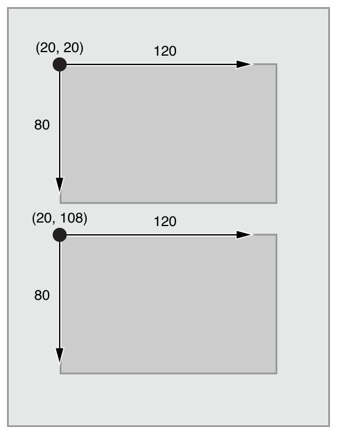
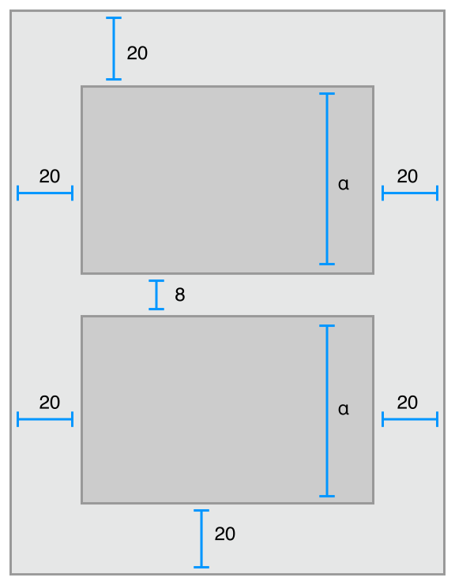

> 导航：[总目录](../../../README.md) · [documentation](../../../_indexes/documentation.md)

## Understanding Auto Layout

Auto Layout dynamically calculates the size and position of all the views in your view hierarchy, based on constraints placed on those views. For example, you can constrain a button so that it is horizontally centered with an Image view and so that the button’s top edge always remains 8 points below the image’s bottom. If the image view’s size or position changes, the button’s position automatically adjusts to match.

This constraint-based approach to design allows you to build user interfaces that dynamically respond to both internal and external changes.

### External Changes

External changes occur when the size or shape of your superview changes. With each change, you must update the layout of your view hierarchy to best use the available space. Here are some common sources of external change:

- The user resizes the window (OS X).
- The user enters or leaves Split View on an iPad (iOS).
- The device rotates (iOS).
- The active call and audio recording bars appear or disappear (iOS).
- You want to support different size classes.
- You want to support different screen sizes.

Most of these changes can occur at runtime, and they require a dynamic response from your app. Others, like support for different screen sizes, represent the app adapting to different environments. Even through the screen size won’t typically change at runtime, creating an adaptive interface lets your app run equally well on an iPhone 4S, an iPhone 6 Plus, or even an iPad. Auto Layout is also a key component for supporting Slide Over and Split Views on the iPad.

### Internal Changes

Internal changes occur when the size of the views or controls in your user interface change.

Here are some common sources of internal change:

- The content displayed by the app changes.
- The app supports internationalization.
- The app supports Dynamic Type (iOS).

When your app’s content changes, the new content may require a different layout than the old. This commonly occurs in apps that display text or images. For example, a news app needs to adjust its layout based on the size of the individual news articles. Similarly, a photo collage must handle a wide range of image sizes and aspect ratios.

Internationalization is the process of making your app able to adapt to different languages, regions, and cultures. The layout of an internationalized app must take these differences into account and appear correctly in all the languages and regions that the app supports.

Internationalization has three main effects on layout. First, when you translate your user interface into a different language, the labels require a different amount of space. German, for example, typically requires considerably more space than English. Japanese frequently requires much less.

Second, the format used to represent dates and numbers can change from region to region, even if the language does not change. Although these changes are typically more subtle than the language changes, the user interface still needs to adapt to the slight variation in size.

Third, changing the language can affect not just the size of the text, but the organization of the layout as well. Different languages use different layout directions. English, for example, uses a left-to-right layout direction, and Arabic and Hebrew use a right-to-left layout direction. In general, the order of the user interface elements should match the layout direction. If a button is in the bottom-right corner of the view in English, it should be in the bottom left in Arabic.

Finally, if your iOS app supports dynamic type, the user can change the font size used in your app. This can change both the height and the width of any textual elements in your user interface. If the user changes the font size while your app is running, both the fonts and the layout must adapt.

### Auto Layout Versus Frame-Based Layout

There are three main approaches to laying out a user interface. You can programmatically lay out the user interface, you can use autoresizing masks to automate some of the responses to external change, or you can use Auto Layout.

Traditionally, apps laid out their user interface by programmatically setting the frame for each view in a view hierarchy. The frame defined the view’s origin, height, and width in the superview’s coordinate system.

To lay out your user interface, you had to calculate the size and position for every view in your view hierarchy. Then, if a change occurred, you had to recalculate the frame for all the effected views.

In many ways, programmatically defining a view’s frame provides the most flexibility and power. When a change occurs, you can literally make any change you want. Yet because you must also manage all the changes yourself, laying out a simple user interface requires a considerable amount of effort to design, debug, and maintain. Creating a truly adaptive user interface increases the difficulty by an order of magnitude.

You can use autoresizing masks to help alleviate some of this effort. An autoresizing mask defines how a view’s frame changes when its superview’s frame changes. This simplifies the creation of layouts that adapt to external changes.

However, autoresizing masks support a relatively small subset of possible layouts. For complex user interfaces, you typically need to augment the autoresizing masks with your own programmatic changes. Additionally, autoresizing masks adapt only to external changes. They do not support internal changes.

Although autoresizing masks are just an iterative improvement on programmatic layouts, Auto Layout represents an entirely new paradigm. Instead of thinking about a view’s frame, you think about its relationships.

Auto Layout defines your user interface using a series of constraints. Constraints typically represent a relationship between two views. Auto Layout then calculates the size and location of each view based on these constraints. This produces layouts that dynamically respond to both internal and external changes.

The logic used to design a set of constraints to create specific behaviors is very different from the logic used to write procedural or object-oriented code. Fortunately, mastering Auto Layout is no different from mastering any other programming task. There are two basic steps: First you need to understand the logic behind constraint-based layouts, and then you need to learn the API. You’ve successfully performed these steps when learning other programming tasks. Auto Layout is no exception.

The rest of this guide is designed to help ease your transition to Auto Layout. The [Auto Layout Without Constraints](AutoLayoutWithoutConstraints.md#apple-f4xwc4dqnrsv64tfmyxwi33df52wszbpkridimbqgeydqnjtfvbuqobnknltc) chapter describes a high-level abstraction that simplifies the creation of Auto Layout backed user interfaces. The [Anatomy of a Constraint](AnatomyofaConstraint.md#apple-f4xwc4dqnrsv64tfmyxwi33df52wszbpkridimbqgeydqnjtfvbuqojnknltc) chapter provides the background theory you need to understand to successfully interact with Auto Layout on your own. [Working with Constraints in Interface Builder](WorkingwithConstraintsinInterfaceBuidler.md#apple-f4xwc4dqnrsv64tfmyxwi33df52wszbpkridimbqgeydqnjtfvbuqmjqfvjvomi) describes the tools for designing Auto Layout, and the [Programmatically Creating Constraints](ProgrammaticallyCreatingConstraints.md#apple-f4xwc4dqnrsv64tfmyxwi33df52wszbpkridimbqgeydqnjtfvbuqmjwfvjvomi) and [Auto Layout Cookbook](LayoutUsingStackViews.md#apple-f4xwc4dqnrsv64tfmyxwi33df52wszbpkridimbqgeydqnjtfvbuqmznknltc) chapters describe the API in detail. Finally, the [Auto Layout Cookbook](LayoutUsingStackViews.md#apple-f4xwc4dqnrsv64tfmyxwi33df52wszbpkridimbqgeydqnjtfvbuqmznknltc) presents a wide range of sample layouts of varying levels of complexity, you can study and use in your own projects, and [Debugging Auto Layout](TypesofErrors.md#apple-f4xwc4dqnrsv64tfmyxwi33df52wszbpkridimbqgeydqnjtfvbuqmrsfvjvomi) offers advice and tools for fixing things if anything goes wrong.

[Auto Layout Without Constraints](AutoLayoutWithoutConstraints.md#apple-f4xwc4dqnrsv64tfmyxwi33df52wszbpkridimbqgeydqnjtfvbuqobnknltc)
