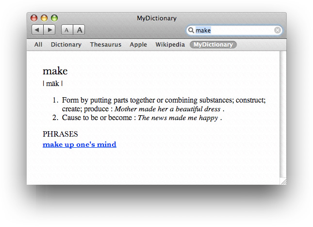
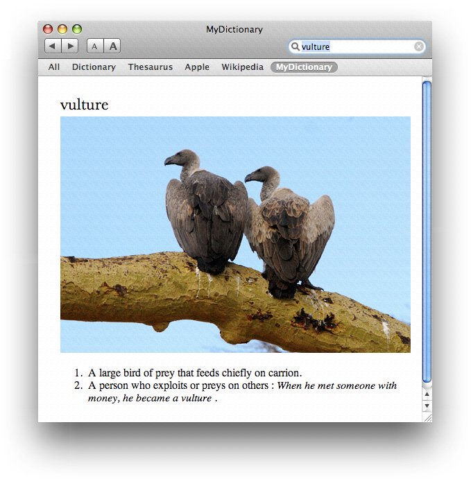
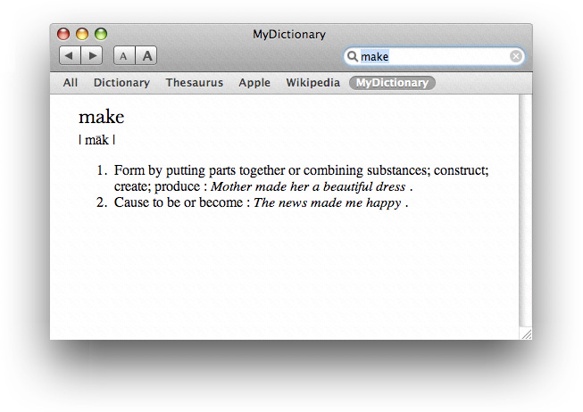
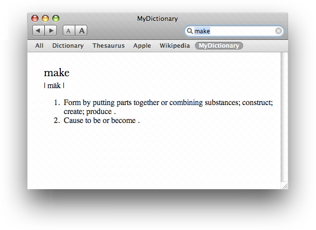
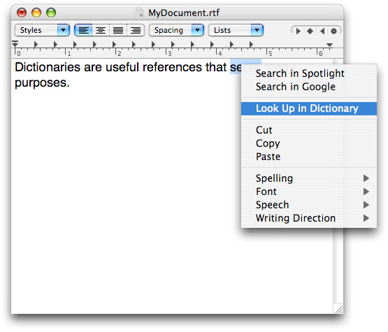
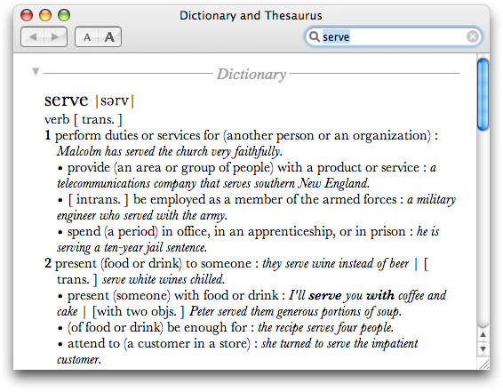

> 导航：[总目录](../../../README.md) · [documentation](../../../_indexes/documentation.md) · [Dictionary Services Programming Guide](Introduction.md)


[Next](Creating%20Dictionaries.md)[Previous](Introduction.md)

# Dictionary User Interface and Markup

This chapter describes the user interface for Dictionary Services and defines the elements and attributes that you use to mark up dictionary content. The dictionary schema conforms to the RELAX NG definition ([http://www.relaxng.org/](http://www.relaxng.org/)). You define the dictionary structure by marking up the content using XHTML tags and tags that are defined by Dictionary Services.

Dictionaries are useful references that serve many purposes. The most typical is for users to look-up the meaning of a word in a particular language. However you can create content for a thesaurus, bilingual dictionaries (such as English-Japanese), in-house glossaries, and professional dictionaries (such as legal, medical, and technical). OS X includes the Dictionary application to provide users with digital access to content that is bundled according to the instructions provided in this book.

Figure 1-1 shows an entry from the MyDictionary dictionary for the word _make_. The MyDictionary dictionary was created using the Dictionary Development Kit. (You can download the kit in “Auxiliary Tools for Xcode - February 2012” from [Downloads for Apple Developers](https://developer.apple.com/downloads/).) As you read the rest of this chapter, you’ll see how to markup text using XHTML to create the entry, pronunciation, definitions, usage examples, phrases, and so on that appear in this figure.

__Figure 1-1__  A dictionary entry



A dictionary entry is not limited to text. You can include other resources such as images (see Figure 1-2) , movies, sounds, and hyperlinks to webpages.

__Figure 1-2__  A dictionary entry that displays an image



You can structure a dictionary to respect parental control user settings. (Parental controls are set in System Preferences by administrator users for restricted users.) By using the appropriate tag, as you’ll see later in this chapter, you can suppress entries or particular portions of an entry. Figure 1-3 shows the same entry shown in [Figure 1-1](#apple-f4xwc4dqnrsv64tfmyxwi33df52wszbpkridimbqga3dcnjsfvbuqnbnknlte), but as seen for a user that has parental controls turned on. The phrases portion of the entry is marked with a parental controls tag that suppresses its display.

__Figure 1-3__  Parental controls can suppress phrases



You can also markup entries with priority tags to control the depth of the information that’s shown. Figure 1-4 shows the same entry as [Figure 1-1](#apple-f4xwc4dqnrsv64tfmyxwi33df52wszbpkridimbqga3dcnjsfvbuqnbnknlte), but this time both parental controls and priority settings suppress content. The usage sentences shown in [Figure 1-1](#apple-f4xwc4dqnrsv64tfmyxwi33df52wszbpkridimbqga3dcnjsfvbuqnbnknlte) are tagged with a priority setting that causes them not to be displayed in Figure 1-4.

__Figure 1-4__  Priority settings and parental controls limit an entry



In addition to using the Dictionary application, users can access dictionary entries from within an application by control-clicking selected text. Then, in the contextual menu that appears, the user can choose Look Up in Dictionary, as shown in Figure 1-5.

__Figure 1-5__  The dictionary look-up command in the contextual menu



The Dictionary window opens to show the results of searching for the selected text in the active dictionaries. See Figure 1-6.

__Figure 1-6__  The Dictionary window



You define the structure of a dictionary by marking up its content with XHTML and Dictionary Services markup items (elements, attributes, processing instructions, comments, and so forth).

- XHTML. You can use any XHTML markup except for those defined in the Structure module. You can find the DTD for XHTML modules on this website:

  [http://www.w3.org/TR/xhtml-modularization/dtd_module_defs.html#a_dtd_module_defs](http://www.w3.org/TR/xhtml-modularization/dtd_module_defs.html#a_dtd_module_defs)
- Dictionary Services. Some markup defines the structure of the dictionary. Other markup attaches a specific functionality or semantics to XHTML elements. See [Dictionary Services Markup](#apple-f4xwc4dqnrsv64tfmyxwi33df52wszbpkridimbqga3dcnjsfvbuqnbnknltq).

This section defines the markup items that are specific to Dictionary Services. The default namespace refers to XHTML. The namespace prefix `d` identifies elements and attributes that are specific to Dictionary Services.

`%dic.content` defines an element that can be used in various places.

It `%Flow.mix;` as XHTML does. The `Flow.mix` tag includes all text content, block, and inline elements.

```
<!ENTITY % dic.content
    "( #PCDATA | %Flow.mix; )*"
>

<!-- %Flow.mix; includes all text content, block and inline -->
<!ENTITY % Flow.mix
    "%Heading.class;
    | %List.class;
    | %Block.class;
    | %Inline.class;
    %Misc.class;"
>
```


`d:dictionary` defines the root element of a dictionary that contains one or more entries.

```
<!ELEMENT d:dictionary ( d:entry+ ) >
```


`d:entry` contains one or more index and a body part, and constructs the logical structure of a dictionary entry.

```
<!ELEMENT d:entry ( d:index+, %dic.content;) >
<!ATTLIST d:entry
    id                    ID        #REQUIRED
    d:title            NMTOKEN    #REQUIRED
    d:parental-control    ( 1 )        #IMPLIED
>
```

The attributes are:

- `id` ID of the entry. The value should be unique in the dictionary.
- `d:title` The title is the text that represents the entry. It should represent the entry or be the canonical form of the entry. You can use this text as the title of the window that displays the entry. You can also use it to fill the search text field of the Dictionary application.
- `d:parental-control` Parental control level indicates a restricted part of the entry. The value of this attribute should be "1". When parental control function is active, the entries that have this attribute are not searched and do not appear in the search result list.

`d:index`  defines information to extract from an entry and use to build the index. The index element should appear prior to other elements in the entry.

```

<!ELEMENT d:index EMPTY >
<!ATTLIST    d:index
    d:value    NMTOKEN    #REQUIRED
    d:title    NMTOKEN    #REQUIRED
    d:parental-control    NMTOKEN    #IMPLIED
    d:anchor    NMTOKEN    #IMPLIED
    d:yomi    NMTOKEN    #IMPLIED
>
```

The attributes are:

- `d:value` The search key text of for the entry.
- `d:title` The text that is displayed on the search result list. It can be used as the title of the window that displays the entry.
- `d:parental-control` Removes the title from search result list. See [Parental Controls and Priority](#apple-f4xwc4dqnrsv64tfmyxwi33df52wszbpkridimbqga3dcnjsfvbuqnbnknltcmi).
- `d:anchor` Highlights a specific part in an entry, such as the explanation of an idiomatic phrase.
- `d:yomi` Used only for Japanese dictionaries.

For example, the following entries for “make” indicates that a search using either _make_, _makes_, or _made_ will return make as a result.

```
<d:index d:value="make"  d:title="make"/>
<d:index d:value="makes" d:title="makes"/>
<d:index d:value="made"  d:title="made"/>
<d:index d:value="make it" d:title="make it" d:parental-control="1" d:anchor="xpointer(//*[@id='make_it'])"/>
```


`d:gi` defines characters that are not available in Unicode or for which the platform does not have glyph data. You can also use this element to specify a font that contains special characters. Use the `gi` element like an inline element.

```
<!ENTITY % inline.extra "| d:gi">
<!ELEMENT d:gi (#PCDATA) >
<!ATTLIST    d:gi
    d:set             NMTOKEN    #IMPLIED
    d:name            NMTOKEN    #IMPLIED
    d:ps-font-name    NMTOKEN    #IMPLIED
>
```

The attributes are:

- `d:set` The glyph set name. Only one is supported, "AdobeJapan1".
- `d:name` CID number (Character Identifier)
- `d:ps-font-name` The PostScript font name.

For example:

```
<d:gi d:set="AdobeJapan1" d:name="6930">邉</d:gi>  # One of the character variants
<d:gi d:ps-font-name="Webdings">&#xF06A;</d:gi>   # Airplane symbol
```


You can highlight a portion of an entry using the `d:anchor` attribute of the `d:index` tag. The value of `d:anchor` must be an XPath expression that specifies the block in the entry to highlight. The `id` that you supply must be unique.

For example the `d:anchor` attribute in the following:

```
<d:entry id="make_1" d:title="make">
    ...
<d:index d:value="make it" d:parental-control="1" d:anchor="xpointer(//*[@id='make_it'])"/>
```

causes the this part of the entry to be highlighted:

```
<div id="make_it"><b>make it</b> : succeed in something; survive.</div>
```


`d:parental-control` identifies content that should not be shown for users that have parental controls enabled. (Parental controls are enabled in System Preferences.)

```
<!ATTLIST div d:parental-control NUMBER #IMPLIED >
<!ATTLIST span d:parental-control NUMBER #IMPLIED >
<!ATTLIST entry d:parental-control NUMBER #IMPLIED >
<!ATTLIST d:index d:parental-control NUMBER #IMPLIED >
```

The value is always `1`.

The `d:entry` tag can have this attribute. Entries that have this attribute don’t appear on the search result list.

`d:priority` hides part of the content to allow for briefer content. It’s typically used for results displayed in the Dictionary window.

```
<!ATTLIST div d:priority NUMBER #IMPLIED >
<!ATTLIST span d:priority NUMBER #IMPLIED >
```

The value can be in the range of `0` to `9`, inclusive. Content that has a priority value greater than `1` is not displayed in the Dictionary window. The behavior is defined only for `0` and `2`. All other values are reserved for future use.

Dictionary Services applies the following rules to content with `d:parental-control` and `d:priority` tags. (Note that these rules are part of the RELAX NG definition.)

- If you don’t specify a parental control or priority tag for an element, the value is assumed to be `0`.
- An element that doesn't have a parental control or priority tag inherits the value of its parent element.
- A child element can have a parental control or priority tag whose value is equal to or greater than the value of that of its parent. If a child element has a parental control or priority tag whose value is smaller than its parent, the value of the parent applies. In other words, if the parent element isn’t shown, neither is the child element. But if a parent element is shown, you can hide the child element.

`pr` marks the pronunciation of the entry. You don’t supply a `value` attribute because all values are acceptable.

```
<!ATTLIST div d:priority NMTOKEN #IMPLIED >
<!ATTLIST span d:priority NMTOKEN #IMPLIED >
```

For example:

```
<h1>make</h1>
<span class="syntax"><span d:pr="1">| māk |</span></span>
```

You can use this tag to switch pronunciation notation according to dictionary-specific preferences.

You can implement a hypertext link as follows:

```
<h3>PHRASES</h3>
     ...
     <h4><a href="x-dictionary:r:make_up_ones_mind"><b>make up one's mind</b></a></h4>
```

When the user clicks the link, it jumps to the following dictionary entry whose id is `make_up_ones_mind`:

```
<d:entry id="make_up_ones_mind" d:title="make up one's mind" d:parental-control="1">
    <d:index d:value="make up one's mind"/>
    <h1>make up one's mind</h1>
    <ul>
        <li>
        make a decision.
        </li>
    </ul>
</d:entry>
```

For other variations, see [URI Scheme](#apple-f4xwc4dqnrsv64tfmyxwi33df52wszbpkridimbqga3dcnjsfvbuqnbnknltcmy).

`x-dictionary:` is an URI scheme that describes cross references between entries in dictionaries. It is used in tag such as `<a href="x-dictionary:r:another_id">`.

The `x-dictionary:` URI contains three elements separated by colons as the general form—target selector, target text, and dictionary bundle ID. The target selector must be either `d` (for definition) or `r` (for reference). Use `d` if you want to search definitions of the following key text. Use `r` if you want to refer to the entry specified by the reference ID which must be unique to each dictionary.

```
  x-dictionary:d:key_text:dict_bundle_id
  x-dictionary:r:reference_id:dict_bundle_id
```

The dictionary bundle ID can be omitted in both forms, as shown in the following lines. If it is omitted, Dictionary Services searches the target text in all active dictionaries.

```
  x-dictionary:d:key_text
  x-dictionary:r:reference_id
```


The `d:yomi` attribute marks Japanese Yomi.

For details on Yomi and marking Yomi content in a Japanese dictionary, see [Creating a Japanese Dictionary](Creating%20Dictionaries.md#apple-f4xwc4dqnrsv64tfmyxwi33df52wszbpkridimbqga3dcnjsfvbuqmznknltq).

[Next](Creating%20Dictionaries.md)[Previous](Introduction.md)

