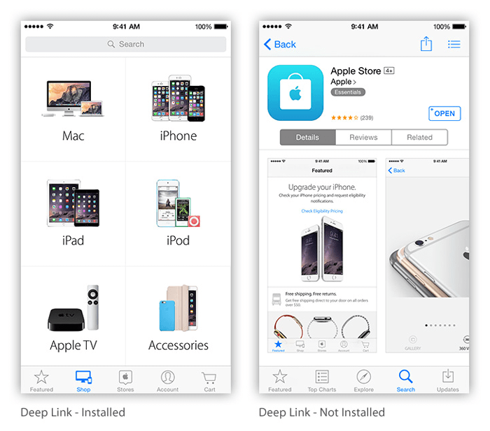
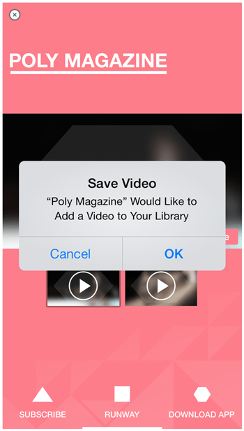
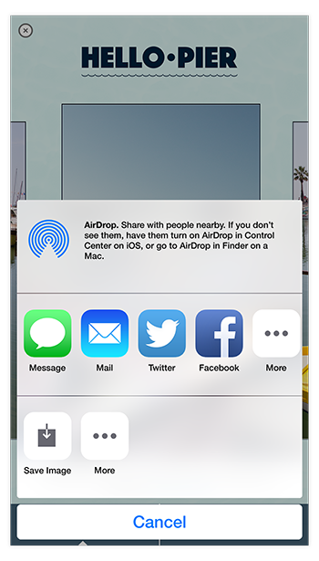

> 导航：[总目录](../../../README.md) · [documentation](../../../_indexes/documentation.md) · [Guide to Designing Expanded Ad Units](Introduction.md)

[Next](Submitting%20Your%20Ad%20for%20Approval.md)[Previous](Designing%20an%20Expanded%20Ad%20Unit.md)

# Features for Expanded Ad Units

With expanded ad units, you have the foundation to create a unique, emotional experience that reflects the personality and value of your brand. Before you begin to design your ad, it’s good to be aware of both the capabilities and the constraints of the iAd platform.

When you first start to select features for your ad experience, you may find some features that are available only in the current version of iOS. If this is your situation you should consider how to “degrade gracefully” for users who are not using the latest version of iOS. Your solution might be as simple as providing an appropriate alternative.

However, if the desired new feature is at the heart of the whole ad experience and there is no other suitable alternative, work with your Account Manager to confirm that there is enough inventory with the current version of iOS to reach your targeting goals. If there is, you should feel confident that you can leverage that feature.

In addition to your ad providing the rich functionality of HTML, CSS, and JavaScript, some native iOS features are available for use in your ad. Unless otherwise noted, these features are available in ads on iOS-based devices running iOS 7.0 and later.

Direct users to specific sections of your ad by linking hot spots within the banner. You can provide a customized ad based on the user’s banner experience.

When you use banner hot spots, make sure that the tappable areas are large enough to accommodate a finger (132 pixels x 132 pixels on a Retina HD display). Make sure the calls to action, such as “Tap to Explore,” are clearly labeled.

Your ad can respond to gestures just as a native iOS app would. Common gestures—such as pinching to zoom and swiping to scroll—are fast and easy to implement.

Figure 3-1 shows how drag and drop, two-finger rotation, and pinch to zoom can all be used together.

__Figure 3-1__  Example of multi-touch gesture usage

!

__Technical discussion__: [Handling Multi-Touch Events](../../Apple%20Applications/Safari%20Web%20Content%20Guide/Handling%20Events.md#apple-f4xwc4dqnrsv64tfmyxwi33df52wszbpkridimbqga3dkmjrfvjvomrs)

Because your ad is backed by the WebKit engine, it has access to the amazing CSS visual effects available in all WebKit-enabled applications. Here are just a few examples of the types of visual effects you can create entirely with CSS:

- Plane flips
- Drops
- Fade-ins
- Wipes
- Fold-outs

These visual effects can enrich every part of your ad experience, from your banner to an interaction in your core ad unit.

__Technical discussion__: _[Safari CSS Visual Effects Guide](../../Internet%20Web/Safari%20CSS%20Visual%20Effects%20Guide/Introduction.md#apple-f4xwc4dqnrsv64tfmyxwi33df52wszbpkridimbqga4damzs)_

You can embed audio and video in your ad to enhance the users’ rich-media experience. Video can play in full-screen mode, or inline with other web content (see Figure 3-2). If you don’t want to use the default controls, you can design your own custom controls for inline videos. Because video is implemented with the standard HTML5 video element, you can apply CSS visual effects to it, just as you would to any other item in your ad: You can animate the video’s position on the page, transform its shape, overlay other web content on top of your video, and so on.

__Figure 3-2__  A default media player (left) and an inline video (right)

!!

When developing video for your ad, keep the following duration guidelines in mind:

- Immediately following a splash page, video should last no longer than about 15 seconds.
- In any other part of the core ad unit, video should last no longer than about 60 seconds.
- The total duration of all video in your ad should not exceed 2 minutes.

If your ad includes audio, keep the following considerations in mind:

- The system volume on the user’s device might be low or muted. If audio is essential to your ad’s experience, include a visual message in your ad that tells the user to turn up the volume.
- In iOS 7.0 and later, the device’s hardware mute switch mutes the ad audio.
- An ad should not contain audio that plays automatically. Make sure that your ad mutes audio by default and that users can enable audio using tap or other interaction.

__Technical discussion__: Playing Videos in _iAd JS Programming Guide_

The Web Audio API allows for robust audio playback capabilities within an ad. Here are some of the new features:

- Preloading multiple sound files
- Playing sounds at an exact time
- Playing multiple audio files simultaneously
- Dynamically applying audio filters or effects
- Generating custom sounds
- Accessing raw audio data (waveform)

Figure 3-3 below shows an example of a sound board that gives you control over a sound while you apply a filter and affect the pan and volume in real time.

__Figure 3-3__  A Web Audio API soundboard

!

__Availability:__ The Web Audio API is available in iOS 7.0 and later.

__Technical discussion:__ [Playing Sounds with the Web Audio API](https://developer.apple.com/library/archive/documentation/AudioVideo/Conceptual/Using_HTML5_Audio_Video/PlayingandSynthesizingSounds/PlayingandSynthesizingSounds.html#//apple_ref/doc/uid/TP40009523-CH6) in _[Safari HTML5 Audio and Video Guide](../../Audio%20Video/Safari%20HTML5%20Audio%20and%20Video%20Guide/About%20HTML5%20Audio%20and%20Video.md#apple-f4xwc4dqnrsv64tfmyxwi33df52wszbpkridimbqga4tkmrt)_

Embed a high-performance map in your ad and then use it to inform users of nearby places of interest. You can even reinforce your brand from within your map by using your own customized pins for map annotations and by highlighting specific geographic regions with a custom overlay (see Figure 3-4). With the user’s permission, you can also display the user’s current location. Not everyone will allow this, so you should provide zip code entry as an alternative.

__Figure 3-4__  An embedded map and examples of custom pins

!

Map tiles are loaded by iOS automatically; your ad needs to provide only the locations of annotations on the map. When you use the `MapView` class to create a map view, you can use CSS to apply transforms, transitions, and animations to the map.

__Technical discussion__: Displaying Annotated Maps

Enable users to make purchases from the iTunes Store, the App Store, or the iBookstore without ever leaving your ad. Users can purchase items of the following types:

- Songs and albums
- Movies and TV episodes
- Books (when the iBooks app is installed on the user’s device)
- iOS apps

__Technical discussion__: Purchasing Content from iTunes

You can supply video or images in your ad that users can download to their device. User can then share this content on their social networks. This is a useful feature to give users the opportunity to watch videos that might be too long to include in the ad at their own leisure. Videos must be smaller than 10 MB.

__Technical discussion__: Wallpaper Sizes

You can also let users set their device wallpaper to an image from your ad.

The default Save Wallpaper dialog lets users set an image to either their lock screen, their Home screen or both, as shown below in Figure 3-5.

__Figure 3-5__  A Set as Wallpaper user flow

!!

It is recommended that you give users the additional option of saving the image to their photo library. They can share the image or set as their wallpaper at another time. Saving directly as a wallpaper does not allow a user this capability.

Your ad can save its currently displayed content as an image. This approach provides an easy way to let users save the visual result of a creative activity that your ad provides.

__Technical discussion__: Saving Images

Consider pre-filling and presenting the standard calendar event view (see Figure 3-6) to users so that they can add an event to their calendar. Specify a name, date, location, and description for the event.

__Figure 3-6__  A Calendar composer window

!

__Technical discussion__: Adding Calendar Events

You can save contact information to the user’s address book, as shown in Figure 3-7.

__Figure 3-7__  A New Contact composer window

!

This information may include such fields as:

- First and last names
- Prefix/Suffix
- Company Name
- Addresses
- Phone numbers
- Email addresses
- Website address
- A contact image
- Text note

__Technical discussion__: For a comprehensive list of fields, see the _iAd JS Library Reference_.

Your ad can include bundled PDF content and enable users to preview it and save it to the iBooks library on their device, as shown in Figure 3-8. Users can download this content without leaving the core ad unit. To save the downloaded PDF, users need to use iBooks. If a user does not have iBooks installed, you can provide a message such as, “To view and save PDF, you need iBooks.”

__Figure 3-8__  Downloading a PDF file within an ad and saving it to iBooks

!!

The PDF file must be less than 5 MB, but for best user experience it should be less than 2 MB.

Your ad can include links that enable the user to call a specified phone number. After a user initiates a phone call from within your ad, the user is not returned to your ad.

__Technical discussion__: [Phone Links](https://developer.apple.com/library/archive/featuredarticles/iPhoneURLScheme_Reference/PhoneLinks/PhoneLinks.html#//apple_ref/doc/uid/TP40007899-CH6) in _[Apple URL Scheme Reference](../../../featuredarticles/Apple%20URL%20Scheme%20Reference/About%20Apple%20URL%20Schemes.md#apple-f4xwc4dqnrsv64tfmyxwi33df52wszbpkridimbqga3tqojz)_

If your app has email, present a standard email composition view to users so that they can send messages without leaving the ad. You can prepopulate the system-provided composition view with content in the subject line or message body, as shown in Figure 3-9. Remember that your email message can be plain text or HTML.

While users are in the composition view, they can edit any field and choose recipients from their contacts.

__Figure 3-9__  An email composer window

!

__Technical discussion__: Composing Email and SMS Messages

You can use XML feeds or web services programming interfaces to supply content to your ad. To receive and distribute the content securely, use a proxy as an intermediate container for your ad’s data. For example, a simple `POST` and `GET` HTTP pass-through proxy is available for feeds and web services that support this model. More complex data transfer is possible but might require technical review. The ad developer needs to work with the iAd Creative Development team to set up the proxy.

Your ad can direct users to pages outside of your ad. The page is displayed within the ad in an in-ad web view for users of iOS 7.0 and later (see Figure 3-10). When users have finished browsing, they can return to the ad by tapping the close button.

__Figure 3-10__  An in-ad web view

!

With in-ad web view, you can direct users to external commerce or branded sites without their leaving an ad. An overlay appears within the ad that contains the web content. Use this feature to do such things as complete an mCommerce transaction, enter data into your CRM, or review mobile optimized product catalog. When the users have finished, they can close the overlay and return to their ad experience.

The link must be a publicly available URL and should lead to a website that is advertiser branded and optimized for mobile Safari on iOS. Third-party sites are reviewed on a case-by-case basis.

__Availability:__ In-Ad Web View is available in iOS 7.0 and later.

Your ad can access Twitter from within the core ad unit with single sign-on authentication. Users can tweet and follow a brand’s Twitter feed. If a user is already logged in to Twitter on the device, that user does not need to log in again from inside the ad.

Tweets can be pre-populated with text, links, and images (see Multi-Touch and Gestures) and are editable by the user. The tweet message size is 140 characters.

A user can also “follow” a Twitter profile using the same single sign-on capability.

__Figure 3-11__  A twitter composer window

!

__Availability__: Twitter follow is available in iOS 7.0 and later.

Your ad can detect when the device changes orientation between landscape and portrait, and can respond appropriately. Apple recommends that you select a single orientation (portrait or landscape) and keep your ad locked to that orientation. An interface that demands orientation changes can frustrate users.

__Technical discussion__: Handling Orientation Changes

Your ad can detect when a user shakes the device. Your ad can respond to device shakes in any manner you choose.

__Technical discussion__: Handling Shake Events

Your ad can respond when a user moves the device in ways that the accelerometer or gyroscope can detect. Because some devices do not have a gyroscope, your ad can prepare to receive both types of data and handle them appropriately.

As shown in Figure 3-12, the accelerometer measures significant change in motion along x-, y-, and z-axes. The gyroscope measures angles of rotation around gravity.

__Figure 3-12__  The differences between accelerometer and gyroscope

!

The gyroscope measures, in degrees, three properties:

- __alpha__: Rotation of the device frame around its z-axis. The z-axis is colloquially referred to as _yaw_.
- __beta__: Rotation of the device frame around its x-axis, also known as _roll_.
- __gamma__: Rotation of the device frame around its y-axis, also known as _pitch_.

You can use data from the accelerometer and gyroscope to detect both sudden device movements and the device’s orientation relative to gravity. Together, the accelerometer and gyroscope provide 6-axis motion sensing. For example, you can use the alpha rotation values to simulate the motion of pouring out a glass of water onscreen.

__Availability__: Available on iPod touch, iPhone 4 and later, and iPad 2 and later.

__Technical discussion__: [Handling Events](https://developer.apple.com/library/archive/documentation/AppleApplications/Reference/SafariWebContent/HandlingEvents/HandlingEvents.html#//apple_ref/doc/uid/TP40006511) in _iAd JS Programming Guide_

You can prompt users to capture a single photo or short video with their device’s camera for use within the ad, using either the front or back camera (when available). Figure 3-13 shows the Camera app’s photo view and video view.

__Figure 3-13__  Camera functions—photo (left) and video (right)

!

After users have captured the photo or video, they can preview it before selecting it to use, videos can not be edited.

Within the ad, photos can be:

- Shared via Tweet
- Shared via email
- Shared via SMS/Message
- Saved to photo album
- Set as wallpaper
- Submitted to advertiser back-end

Videos with a duration of less than 15 seconds can be:

- Shared via email
- Shared via SMS/Message
- Submitted to advertiser back-end

As shown in Figure 3-14, users can also access their photo library to import photos and videos into an ad. This does not require the camera function to be active.

__Figure 3-14__  Select from photo library user flow

!

It is possible to filter the media within the photo library to show only photos or videos.

Photos taken during an ad session can be edited or modified within the ad. Videos cannot be edited within the ad.

Users can save the photo to their Camera Roll or save as a wallpaper. They can share photos and videos via Twitter, email and SMS/iMessage, or upload them to a server through a third-party API.

__Availability:__ Photo library access and video capture are available in iOS 7.0 and later.

Using Reminders in your ad, you can prefill and present the Reminders event view to users so that they can add an event to their Reminders application (see Figure 3-15). You can specify a title, date, time, location, recurrence, and note settings.

__Figure 3-15__  A reminder composer (left) and the Reminders app (right)

!

The device prompts the user with the Reminder notification when the appropriate time, date, and location (optional) have been reached.

__Availability:__ Creating a reminder is available in iOS 7.0 and later.

Wallet is a native app, included as part of iOS 7.0 for iPhone only. Wallet stores a user’s digital passes, replacing physical coupons and rewards cards you would otherwise keep in your wallet. A pass is a digital card that may be used to redeem goods/services or track activity on an account—such as gift cards, loyalty cards, coupons, and boarding passes. Users can save these digital cards from within an ad to the Wallet iOS app and then redeem them when they like.

As shown in Figure 3-16, the front of the card displays the brand logo and other information relating to the card’s purpose, such as an expiration date or a barcode. The back side of the card displays notification options and additional fields that can be customized by the brand.

__Figure 3-16__  The front and back of pass within Wallet

!!

Some of the back-side fields may contain links that could take the user out of the ad experience. The table below shows these items and their behaviors.

| Information item | Preview action | Exits ad |
| --- | --- | --- |
| Time | Launches Event composer |  |
| Email Address | Launches Mail composer |  |
| Address | Launches Maps |  |
| URL | Launches Safari browser |  |
| Application (installed) | Launches Application |  |
| Application (not installed) | Launches App Store page |  |

There are various pass types to choose from (as shown in Figure 3-17). Advertisers can choose the pass style best suited to their needs.

__Figure 3-17__  Available pass styles

!!

Advertisers are unable to configure the notification properties of the card on behalf users, but users can modify these settings (located on the back of the card) before or after they save the card.

The 2D barcode can be displayed in the formats shown in Figure 3-18.

__Figure 3-18__  2D barcode examples

!

If your pass won’t require additional, user-specific information, supply the pass bundle during asset handoff. However, if you would like to include specific information for a user within a pass—for instance, their name or the 10 nearest stores—the pass will need to be generated by the advertiser’s back end and the bundle URL displayed within the ad. This sort of transaction and delivery can be done in an in-ad web view.

After a user saves a pass to their device, the pass can be remotely updated using the Apple Push Notification service (APNs). When an advertiser sends a push notification to a pass, the Wallet app receives the push notification and then talks to a web-based API provided on the advertiser’s server in order to get updates to the user’s pass.

In order for advertisers to create a pass, they must:

- Create an iOS developer account
- Obtain pass creation certificate
- Configure the pass appropriately

__Availability:__ Saving a card to Wallet is available in iOS 7.0 and later, on iPhone only.

__Technical discussion:__ “Setting the Pass Style” in _Wallet Programming Guide_.

Within an ad you can display the Message composer to send out SMS or MMS messages (see Figure 3-19). The message body can be predefined and can include text copy, URLs, and an image or video derived from the ad or from a user’s photo library. Users can edit the text and choose recipients from their contacts. You can send MMS messages to all iOS-based devices through the Messages application, but you can send SMS only to all other non-iOS devices.

__Figure 3-19__  A Messages composer window

!

__Availability:__ Sending through Messages is available in iOS 7.0 and later.

Content promotions are a great way to engage users. Not only can your users purchase iTunes content within an ad, they can now redeem free content there. Available content includes iTunes songs (as shown in Figure 3-20), song credits, iTunes gift cards, Apple Online Store gift cards, and even Apple hardware (iPod, MacBook, Mac mini, iPad, and Apple TV).

__Figure 3-20__  iAd Promotional Offers user flow

!!

Here are some content guidelines to keep in mind:

- Avoid using phrases implying that an award is randomly given: avoid _win, sweepstakes, prize, contest, giveaway_
- Call out offers clearly in the banners as an incentive to tap through
- Feature the offer prominently within the ad as part of the primary objective to ensure that users have an opportunity to engage
- If applicable, submit your 3rd party distributor’s T&Cs for display in the ad unit to Apple for review and approval before they are registered with any state regulatory body
- Include the following disclaimer above your promotion T&Cs: “Apple is not a participant in or sponsor of this promotion”
- Do not include the terms “Apple,” “iAd”, or the name of any Apple product in the title of the promotion

There are timing, process and technical considerations when using iAd promotional offers; consult your iAd representative for more information.

__Availability:__ iAd Promotional Offers are available in iOS 7.0 and later.

Your ad can give users the option to share images & text from the ad unit by accessing the iOS Share Sheet. Users can share a single block of text, or one or more images via SMS, Mail, Twitter, Facebook or other applications installed on their device. Note that Recipients & subject lines cannot be pre-populated with content, however pre-populated image attachments & text is supported. Share Sheet is available in iOS 8.0 and later.

[Next](Submitting%20Your%20Ad%20for%20Approval.md)[Previous](Designing%20an%20Expanded%20Ad%20Unit.md)

