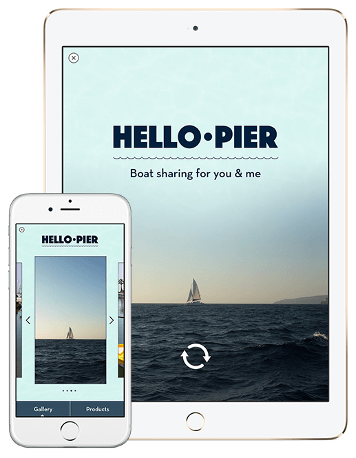
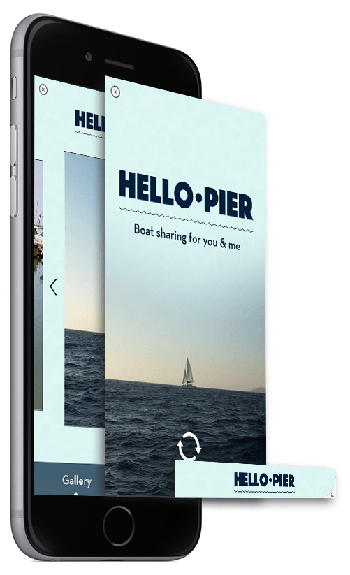

> 导航：[总目录](../../../README.md) · [documentation](../../../_indexes/documentation.md) · [Guide to Designing Expanded Ad Units](Introduction.md)

[Next](Designing%20an%20Expanded%20Ad%20Unit.md)[Previous](Introduction.md)

# Understanding the Expanded Ad Unit Experience

Before you begin developing your ad, familiarize yourself with each part of the expanded ad unit experience so that you know exactly what your users expect.

At the heart of every great advertisement is a great ad design, and a great ad design requires a solid understanding of the advertising medium. This guide helps you understand the iAd platform and how to design an expanded ad unit.

An expanded ad unit on the iAd Platform is a highly focused, web-based experience that is presented to users within their own apps or within Radio on Apple Music. At its core, the ad is made up of the same technologies used on the web—HTML, CSS, and JavaScript—and is powered by WebKit, the same browser rendering engine that powers Safari. In addition to what you can do with these core web technologies, you also have access to certain native iOS integration points, such as the ability to send messages, make a user-confirmed purchase from the iTunes Store, or embed maps.

1. __The iAd app network banner or Radio on Apple Music slate.__ A user enters your ad by tapping a banner displayed in an iOS app or a slate displayed within Radio on Apple music, so it is critical that your banner be engaging and appealing.
2. __The ad unit transition.__ This animation completes the transition from the current app to your splash page or ad when your banner is tapped. It gives users a visual connection between your banner or slate and the full-featured ad experience.
3. __The splash page.__ This page is displayed while the main content of your ad finishes loading. The splash page is a small collection of web content that contains appealing, lightweight graphics and animation. It segues into the primary part of the ad experience, keeping users engaged while the main content is loaded in the background.
4. __The core ad unit.__ This is the main content of your ad. It should deliver a media-rich experience that entertains and informs your users. The vast majority of the ad development process is spent developing the content of the core ad unit.

When a user taps your banner, the current app is paused and resumes only when the user closes your ad. From the moment the banner is tapped to the moment the user closes your ad, the device screen—and the user’s attention—are devoted entirely to your ad content.

[Next](Designing%20an%20Expanded%20Ad%20Unit.md)[Previous](Introduction.md)

