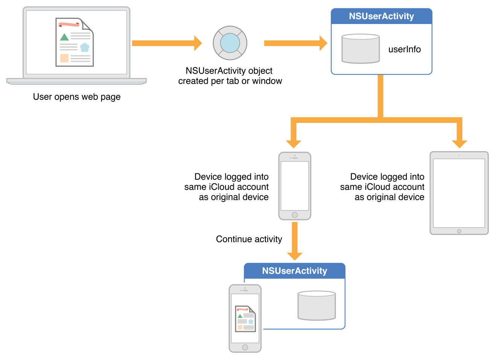

> 导航：[总目录](../../../README.md) · [documentation](../../../_indexes/documentation.md)

[Next](Adopting%20Handoff.md)

# About Handoff

Handoff is a capability introduced in iOS 8 and OS X v10.10 that transfers user activities among multiple devices associated with the same user. In iOS 9 and OS X v10.11, Handoff helps your app participate in search by making it possible to designate user activities and app states as searchable. For example, when a searchable activity or state appears in Spotlight search results or Siri suggestions, users can tap the result to return to the relevant area in your app.

Handoff lets users switch from one device to another and continue an ongoing activity seamlessly, without reconfiguring each device independently. For example, a user who is browsing a long article in Safari on a Mac can move to a nearby iOS device that’s signed into iCloud with the same Apple ID and open the same webpage automatically in Safari on iOS, at the same scroll position as on the original device.

Apple apps, such as Safari, Mail, Maps, Contacts, Notes, Calendar, and Reminders use public APIs to implement Handoff for iOS 8 and OS X v10.10. A third-party developer can use the same APIs to implement Handoff in apps that share the developer’s Team ID. Such apps must either be distributed through the App Store or signed by the registered developer.

Handing off a user activity involves three phases:

- Create a user activity object for each activity the user engages in your app.
- Update the user activity object regularly with information about what the user is doing.
- Continue the user activity on a different device when the user requests it.

Document-based apps (that is, apps based on a subclass of [NSDocument](https://developer.apple.com/documentation/appkit/nsdocument) or [UIDocument](https://developer.apple.com/documentation/uikit/uidocument)), provide built-in support for all three phases of the handoff scenario. Responder objects (subclasses of [NSResponder](https://developer.apple.com/documentation/appkit/nsresponder) and [UIResponder](https://developer.apple.com/documentation/uikit/uiresponder)) provide built-in support for updating user activities and managing their current status. Your app can also create, update, and continue user activities directly, working especially with the app delegate.

The Handoff mechanism depends primarily on objects of a single class in Foundation, [NSUserActivity](https://developer.apple.com/documentation/foundation/nsuseractivity), with support of additional small APIs in UIKit and AppKit. Apps encapsulate information about a user’s activities in `NSUserActivity` objects, and those activities become candidates for continuation on other devices. Handoff of a given user activity requires the originating app to designate that activity’s `NSUserActivity` object as the current activity, save pertinent data for continuation on another device, and send the data to the resuming device. Handoff passes only enough information between the devices to describe the activity itself, while larger-scale data synchronization is handled through iCloud.

On the continuing device, the user is notified that an activity is available for continuation. If the user chooses to continue the activity, an appropriate app is launched and provided with the activity’s payload data. A user activity can be continued only in an app that has the same developer Team ID as the activity's source app and that supports the activity's type. Supported activity types are specified in the app's `Info.plist` under the `NSUserActivityTypes` key (for more information about this key, see [NSUserActivityTypes](../../General/Information%20Property%20List%20Key%20Reference/Cocoa%20Keys.md#apple-f4xwc4dqnrsv64tfmyxwi33df52wszbpkridimbqga4tenjrfvjvomry)). So, the continuing device chooses the appropriate app based on the target Team ID, activity type property of the originating `NSUserActivity` object, and optionally the activity object’s title property. From the information in the user activity object’s `userInfo` dictionary, the continuing app can then configure its user interface and state appropriately for seamless continuation of the user’s activity.

Optionally, if continuing an activity requires more data than can be efficiently transferred by the initial transport mechanism, a resuming app can call back to the originating app’s activity object to open streams between the apps and transfer more data. For example, if the activity to be continued is composing an email message that contains an image, then the streams option is the best way to transfer the data needed to continue the composition on another device. For more information, see [Using Continuation Streams](Adopting%20Handoff.md#apple-f4xwc4dqnrsv64tfmyxwi33df52wszbpkridimbqge2dgmzyfvbuqmrnknltcmy).

Document-based apps on iOS and OS X automatically support Handoff, as described in [Supporting a User Activity in Document-Based Apps](#apple-f4xwc4dqnrsv64tfmyxwi33df52wszbpkridimbqge2dgmzyfvbuqmznknltk).

An [NSUserActivity](https://developer.apple.com/documentation/foundation/nsuseractivity) object encapsulates the state of a user activity in an app on a particular device. It is the primary object in the Handoff mechanism and it helps you designate an activity or app state as searchable. The originating app creates a user activity object for each user activity that can be handed off to another device or that can appear in Spotlight search results. For example, a web browser would create a user activity object for each open tab or window in which the user is browsing URLs. However, only the activity object corresponding to the frontmost tab or window is current at a given time, and only the current activity is available for continuation.

An [NSUserActivity](https://developer.apple.com/documentation/foundation/nsuseractivity) object is identified by its [activityType](https://developer.apple.com/documentation/foundation/nsuseractivity/1409611-activitytype) and [title](https://developer.apple.com/documentation/foundation/nsuseractivity/1413375-title) properties. In addition, you can use properties such as [keywords](https://developer.apple.com/documentation/foundation/nsuseractivity/1408023-keywords) and [contentAttributeSet](https://developer.apple.com/documentation/foundation/nsuseractivity/1616398-contentattributeset) to provide rich information about an activity to display in search results.

The `NSUserActivity` class defines properties you use to specify the eligibility of an activity for various uses. For example, you can use [eligibleForSearch](https://developer.apple.com/documentation/foundation/nsuseractivity/1417761-iseligibleforsearch) to add an activity to the on-device index and enable it to show up in the user’s search results and you can use [expirationDate](https://developer.apple.com/documentation/foundation/nsuseractivity/1413745-expirationdate) to specify a date after which an activity is no longer eligible to be indexed or handed off.

An [NSUserActivity](https://developer.apple.com/documentation/foundation/nsuseractivity) object also has a [userInfo](https://developer.apple.com/documentation/foundation/nsuseractivity/1411706-userinfo) dictionary to contain its state data and a flag named [needsSave](https://developer.apple.com/documentation/foundation/nsuseractivity/1408791-needssave) that supports lazy updating of its state by its delegate. The `NSUserActivity` method [addUserInfoEntriesFromDictionary:](https://developer.apple.com/documentation/foundation/nsuseractivity/1410066-adduserinfoentriesfromdictionary) enables the delegate and other clients to merge state data into its [userInfo](https://developer.apple.com/documentation/foundation/nsuseractivity/1411706-userinfo) dictionary.

For more information, see _[NSUserActivity Class Reference](https://developer.apple.com/documentation/foundation/nsuseractivity)_.

The user activity delegate is an object that conforms to the [NSUserActivityDelegate](https://developer.apple.com/documentation/foundation/nsuseractivitydelegate) protocol. It is typically a top-level object in the app, such as a view controller or the app delegate, that manages the activity’s interaction with the app.

The user activity delegate is represented by the [delegate](https://developer.apple.com/documentation/foundation/nsuseractivity/1412329-delegate) property of [NSUserActivity](https://developer.apple.com/documentation/foundation/nsuseractivity) and is responsible for keeping the data in the [NSUserActivity](https://developer.apple.com/documentation/foundation/nsuseractivity) object’s user info dictionary up to date so that it can be handed off to another device. When the system needs the activity to be updated, such as before the activity is continued on another device, it calls the delegate’s [userActivityWillSave:](https://developer.apple.com/documentation/foundation/nsuseractivitydelegate/1414848-useractivitywillsave) method. You can implement this callback to make updates to the object’s data-bearing properties such as [userInfo](https://developer.apple.com/documentation/foundation/nsuseractivity/1411706-userinfo), [title](https://developer.apple.com/documentation/foundation/nsuseractivity/1413375-title), and so on. Once the system calls this method, it resets [needsSave](https://developer.apple.com/documentation/foundation/nsuseractivity/1408791-needssave) to `NO`. Change this value to `YES` if something happens that changes the [userInfo](https://developer.apple.com/documentation/foundation/nsuseractivity/1411706-userinfo) or other data-bearing properties again.

Alternatively, instead of implementing the delegate’s [userActivityWillSave:](https://developer.apple.com/documentation/foundation/nsuseractivitydelegate/1414848-useractivitywillsave) method, you can have UIKit or AppKit manage the user activity automatically. The app opts into this behavior by setting a responder object’s [userActivity](https://developer.apple.com/documentation/uikit/uiresponder/1621089-useractivity) property and implementing the responder’s [updateUserActivityState:](https://developer.apple.com/documentation/uikit/uiresponder/1621095-updateuseractivitystate) callback, as described in [Managing a User Activity With Responders](#apple-f4xwc4dqnrsv64tfmyxwi33df52wszbpkridimbqge2dgmzyfvbuqmznknlts). This arrangement is preferred if it works for your user activity.

For more information, see _[NSUserActivityDelegate Protocol Reference](https://developer.apple.com/documentation/foundation/nsuseractivitydelegate)_.

UIKit and AppKit provide support for Handoff in the document, responder, and app delegate classes. Although there are minor behavioral differences between the platforms, the basic mechanism, which enables apps to save and restore user activities, is the same, and the APIs are the same.

A document-based app on iOS and OS X automatically supports Handoff if you add an `NSUbiquitousDocumentUserActivityType` key and value for each `CFBundleDocumentTypes` entry in your app’s `Info.plist` property list file. If this key is present, [NSDocument](https://developer.apple.com/documentation/appkit/nsdocument) and [UIDocument](https://developer.apple.com/documentation/uikit/uidocument) automatically create [NSUserActivity](https://developer.apple.com/documentation/foundation/nsuseractivity) objects for iCloud-based documents of the given document type. The value of `NSUbiquitousDocumentUserActivityType` is a string that represents the [NSUserActivity](https://developer.apple.com/documentation/foundation/nsuseractivity) object’s activity type. That is, you provide an activity type for each document type supported by your document-based app. Multiple document types can have the same activity type. [NSDocument](https://developer.apple.com/documentation/appkit/nsdocument) and [UIDocument](https://developer.apple.com/documentation/uikit/uidocument) automatically put the value of their [fileURL](https://developer.apple.com/documentation/uikit/uidocument/1619990-fileurl) property into the activity object’s [userInfo](https://developer.apple.com/documentation/foundation/nsuseractivity/1411706-userinfo) dictionary with the `NSUserActivityDocumentURLKey`.

In OS X, AppKit can automatically restore [NSUserActivity](https://developer.apple.com/documentation/foundation/nsuseractivity) objects created in this way. It does so if the app delegate method [application:continueUserActivity:restorationHandler:](https://developer.apple.com/documentation/appkit/nsapplicationdelegate/1428471-application) returns `NO` or is unimplemented. In this situation, the document is opened with the [NSDocumentController](https://developer.apple.com/documentation/appkit/nsdocumentcontroller) method [openDocumentWithContentsOfURL:display:completionHandler:](https://developer.apple.com/documentation/appkit/nsdocumentcontroller/1514992-opendocument) and receives a [restoreUserActivityState:](https://developer.apple.com/documentation/appkit/nsdocument/1535442-restoreuseractivitystate) message.

For more information, see [Adopting Handoff in Document-Based Apps](Adopting%20Handoff.md#apple-f4xwc4dqnrsv64tfmyxwi33df52wszbpkridimbqge2dgmzyfvbuqmrnknltcny). Also see _[NSDocument Class Reference](https://developer.apple.com/documentation/appkit/nsdocument)_ and _[UIDocument Class Reference](https://developer.apple.com/documentation/uikit/uidocument)_.

UIKit and AppKit can manage a user activity if you set it as a responder object’s [userActivity](https://developer.apple.com/documentation/uikit/uiresponder/1621089-useractivity) property. When the responder knows that the activity state is dirty, it must set the object’s [needsSave](https://developer.apple.com/documentation/foundation/nsuseractivity/1408791-needssave) property to `YES`. The system automatically saves the [NSUserActivity](https://developer.apple.com/documentation/foundation/nsuseractivity) object at appropriate times, first giving the responder an opportunity to update the activity’s state through the [updateUserActivityState:](https://developer.apple.com/documentation/uikit/uiresponder/1621095-updateuseractivitystate) callback. Your responder subclass must override the [updateUserActivityState:](https://developer.apple.com/documentation/uikit/uiresponder/1621095-updateuseractivitystate) method to add state data to the user activity object. If multiple responders share a single [NSUserActivity](https://developer.apple.com/documentation/foundation/nsuseractivity) object, they all receive an [updateUserActivityState:](https://developer.apple.com/documentation/uikit/uiresponder/1621095-updateuseractivitystate) callback when the system updates the user activity object. Before the update callbacks are sent, the activity object’s [userInfo](https://developer.apple.com/documentation/foundation/nsuseractivity/1411706-userinfo) dictionary is cleared.

In OS X, [NSUserActivity](https://developer.apple.com/documentation/foundation/nsuseractivity) objects managed by AppKit and associated with responders automatically become current based on the main window and the responder chain, that is, when the document’s window becomes the main window. In iOS, however, for [NSUserActivity](https://developer.apple.com/documentation/foundation/nsuseractivity) objects managed by UIKit, you must either call [becomeCurrent](https://developer.apple.com/documentation/foundation/nsuseractivity/1413665-becomecurrent) explicitly or have the document’s [NSUserActivity](https://developer.apple.com/documentation/foundation/nsuseractivity) object set on a [UIViewController](https://developer.apple.com/documentation/uikit/uiviewcontroller) object that is in the view hierarchy when the app comes to the foreground.

A responder can set its [userActivity](https://developer.apple.com/documentation/uikit/uiresponder/1621089-useractivity) property to `nil` to disassociate itself from an activity. When an [NSUserActivity](https://developer.apple.com/documentation/foundation/nsuseractivity) object managed by the app framework has no more associated responders or documents, it is automatically invalidated.

For more information, see [Adopting Handoff in Responders](Adopting%20Handoff.md#apple-f4xwc4dqnrsv64tfmyxwi33df52wszbpkridimbqge2dgmzyfvbuqmrnknltq). Also see _[NSResponder Class Reference](https://developer.apple.com/documentation/appkit/nsresponder)_ or _[UIResponder Class Reference](https://developer.apple.com/documentation/uikit/uiresponder)_.

The app delegate is the primary entry point for continuing a user activity in a non-document-based app. As soon as the user chooses to resume an activity, either by responding to the notification or by selecting a search result, Handoff launches the appropriate app and sends the app’s delegate an [application:willContinueUserActivityWithType:](https://developer.apple.com/documentation/uikit/uiapplicationdelegate/1622919-application) message. The app lets the user know that the activity will continue shortly. Meanwhile, the [NSUserActivity](https://developer.apple.com/documentation/foundation/nsuseractivity) object is delivered when the delegate receives an [application:continueUserActivity:restorationHandler:](https://developer.apple.com/documentation/uikit/uiapplicationdelegate/1623072-application) message. You should implement this method to configure your app in such a way that it can resume the activity represented by the user activity object.

The [application:continueUserActivity:restorationHandler:](https://developer.apple.com/documentation/uikit/uiapplicationdelegate/1623072-application) message includes a block, the restoration handler, that you can optionally call if your app uses auxiliary responder or document objects to perform the resuming user activity. Create these objects (or fetch them if cached) and pass them to the restoration handler in its [NSArray](https://developer.apple.com/library/archive/documentation/LegacyTechnologies/WebObjects/WebObjects_3.5/Reference/Frameworks/ObjC/Foundation/Classes/NSArrayClassCluster/Description.html#//apple_ref/occ/cl/NSArray) parameter. The system then sends each object a [restoreUserActivityState:](https://developer.apple.com/documentation/uikit/uiresponder/1621111-restoreuseractivitystate) message, passing the user activity object. Each object can use the activity’s [userInfo](https://developer.apple.com/documentation/foundation/nsuseractivity/1411706-userinfo) data to resume the activity. For more information about using this restoration handler, see the description of the [application:continueUserActivity:restorationHandler:](https://developer.apple.com/documentation/uikit/uiapplicationdelegate/1623072-application) method in _[NSApplicationDelegate Protocol Reference](https://developer.apple.com/documentation/appkit/nsapplicationdelegate)_.

When you continue an activity that was chosen in a search result, you should regenerate the keywords for the activity, if appropriate, because the activity you receive may not have the same properties as the activity that was originally created.

If you do not implement [application:continueUserActivity:restorationHandler:](https://developer.apple.com/documentation/uikit/uiapplicationdelegate/1623072-application) or return `NO` from it, and your app is document-based, AppKit can automatically resume the activity, as described in [Supporting User Activity in Document-Based Apps](#apple-f4xwc4dqnrsv64tfmyxwi33df52wszbpkridimbqge2dgmzyfvbuqmznknltk). For more details, see [Continuing an Activity](Adopting%20Handoff.md#apple-f4xwc4dqnrsv64tfmyxwi33df52wszbpkridimbqge2dgmzyfvbuqmrnknltcoi).

[Next](Adopting%20Handoff.md)

