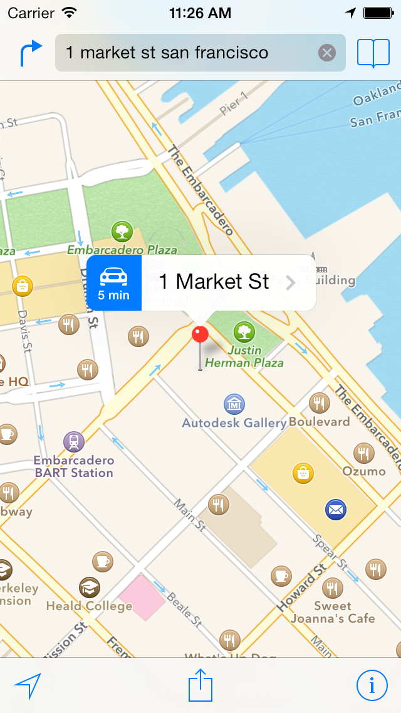

> 导航：[总目录](../../../README.md) · [documentation](../../../_indexes/documentation.md)

[Next](Getting%20the%20User%E2%80%99s%20Location.md)

# About Location Services and Maps

Using location-based information in your app is a great way to keep the user connected to the surrounding world. Whether you use this information for practical purposes (such as navigation) or for entertainment, location-based information can enhance the overall user experience.

Location-based information consists of two pieces: location services and maps. Location services are provided by the Core Location framework, which defines Objective-C interfaces for obtaining information about the user’s location and heading (the direction in which a device is pointing). Maps are provided by the Map Kit framework, which supports both the display and annotation of maps similar to those found in the Maps app. (To use the features of the Map Kit framework, you must turn on the Maps capability in your Xcode project.) Location services and maps are available on both iOS and OS X.

By incorporating geographic data into your apps, you can orient users to the surrounding environment and keep them connected to people nearby.

Because maps and location services are available in both iOS and OS X, location-based apps use very similar code on both platforms. The differences are in user interface code (for example, using `UIView` in iOS and `NSView` in OS X) and in the few features that are supported in iOS only (such as heading service).

### Location Services Provide a Geographical Context for Apps

Knowing the user’s geographic location can improve the quality of the information you offer, and might even be at the heart of your app. Apps with navigation features use location services to monitor the user’s position and generate updates. Other types of apps use location services to enable social connections among nearby users.

### iBeacon Transmitters Enhance the User’s Experience of a Location

iBeacon transmitters provide a way to create and monitor beacons that advertise certain identifying information using Bluetooth low-energy wireless technology. Bluetooth low-energy beacons that advertise the same universally unique identifier (UUID) form a beacon region that your app can monitor through the Core Location region monitoring support. Beacons with the same UUID can be distinguished by the additional information they advertise. While a beacon is in range of a user’s device, apps can also monitor for the relative distance to the beacon.

You can use the information advertised by beacons to enhance the user’s experience of a particular location. For example, a museum app can monitor for beacons placed near the museum’s important exhibits. As a user approaches a particular exhibit, the app can use the relative distance of the beacon as a cue to provide more information about that exhibit rather than another.

Because beacons advertise information using Bluetooth low-energy technology, you can turn any iOS device that supports Bluetooth low-energy data sharing into a beacon.

### Heading Information Indicates the User’s Current Orientation

Heading services complement the basic location services by providing more precise information about which way a device is pointed. The most obvious use for this technology is a compass, but you can also use it to support augmented reality, games, and navigational apps. Even on devices that don’t have a magnetometer—the hardware used to get precise heading information—information about the user’s course and speed are available for apps that need it.

### Maps Support Navigation and the Display of Geographically Relevant Content

Maps help users visualize geographical data in a way that is easy to understand. For example, a map can show satellite data for an area, or pitch a map view at an angle and display three-dimensional buildings for a 3D perspective on the area. You can incorporate Map Kit framework standard views into your app and display information tied to specific geographic points. In addition, this framework lets you layer custom information on top of a map, scroll it along with the rest of the map content, and take static snapshots of a map for printing.

### Routing Apps Provide Directions to the User

A routing app can receive coordinates from the Maps app and use those coordinates to provide point-to-point directions to users. An app that provides navigation capabilities can declare itself a routing app with minimal additional effort. In addition to driving and walking directions, routing apps can support several other modes of transport, including taxi, airplane, and various public transportation options.

### Local Search

Users often want to find locations based on descriptive information, such as a name, address, or business type. Using the Map Kit local search API, you can perform searches that are based on this type of user input and show the results on your map.

You don’t have to read this entire document to use each technology. Core Location and Map Kit framework services are independent of other services. The beginning of each chapter introduces the terminology and information you need to understand the corresponding technology, followed by examples and task-related steps. The only exception is the [Annotating Maps](Annotating%20Maps.md#apple-f4xwc4dqnrsv64tfmyxwi33df52wszbpkridimbqga4tiojxfvbuqnrnknltc) chapter, which builds on the information presented in the [Displaying Maps](Displaying%20Maps.md#apple-f4xwc4dqnrsv64tfmyxwi33df52wszbpkridimbqga4tiojxfvbuqmznknltc) chapter.

For information about the classes of the Core Location framework, see _[Core Location Framework Reference](https://developer.apple.com/documentation/corelocation)_.

For information about the classes of the Map Kit framework, see _[Map Kit Framework Reference](https://developer.apple.com/documentation/mapkit)_.

To learn how to enable the Maps service in your project, see “Configuring Maps” in _App Distribution Guide_.

To learn how to test and debug location awareness in your app, see [Use Maps to Simulate Location Awareness](../../IDEs/Simulator%20User%20Guide/Getting%20Started%20in%20Simulator.md#apple-f4xwc4dqnrsv64tfmyxwi33df52wszbpkridimbqgezdqnbyfvbuqnjnknltcmy).

[Next](Getting%20the%20User%E2%80%99s%20Location.md)

