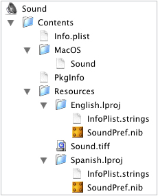

> 导航：[总目录](../../../README.md) · [documentation](../../../_indexes/documentation.md) · [Preference Pane Programming Guide](Introduction.md)

[Next](Updating%20Preference%20Panes.md)[Previous](Life%20Cycle%20of%20a%20Preference%20Pane.md)

# Anatomy of a Preference Pane Bundle

A preference pane plug-in is packaged on disk as a bundle with the `.prefPane` extension. Like all bundle packages, a preference pane consists of an executable (in the Mac OS X native Mach-O format), an information property list (`Info.plist`), and localizable and global (nonlocalized) resources.

The structure of a sample preference pane bundle is shown in [Figure 1](#apple-f4xwc4dqnrsv64tfmyxwi33df52wszbpgiydambqg4ydkljrgazdcmbx).

__Figure 1__  Contents of a preference pane bundle

When created within Xcode, the basic structure and the files are created for you. [Creating a Preference Pane Bundle](Creating%20a%20Preference%20Pane%20Bundle.md#apple-f4xwc4dqnrsv64tfmyxwi33df52wszbpgiydambqg4ydslkcifbemq2bijfa) describes the steps required to produce a working preference pane bundle. The following sections describe the individual elements of the bundle.

Every bundle contains a dictionary, the `Info.plist` file, that defines certain properties of the bundle, such as the names of important resources. Preference pane bundles should provide values for the following keys in the information property list:

| Key | Description |
| --- | --- |
| `CFBundleIdentifier` | The unique identifier string for the bundle. Every bundle should have a unique `CFBundleIdentifier` prefixed by the reverse domain name of the organization. For example, “`com.mycompany.preference.sound`”. |
| `NSMainNibFile` | The name of the main nib file. If this key is omitted, the default preference pane implementation assumes a value of “Main”. The value must not include the `.nib` extension. For example, “`SoundPref`”. |
| `NSPrefPaneIconFile` | The name of an image file resource used in the Show All view and favorites area of the System Preferences application to represent the preference pane. The icon should be 32 x 32 pixels in size. If this key is omitted, System Preferences looks for the `CFBundleIconFile` key. The value must include the extension. For example, “`Sound.tiff`”. |
| `NSPrefPaneIconLabel` | The name of the preference pane displayed by System Preferences beneath the pane’s icon and in the Pane menu. You can include a newline character in the string (“`\n`”) to split a long name between two lines. If this key is omitted, System Preferences looks for the `CFBundleName` key. `NSPrefPaneIconLabel` should be localized via the `InfoPlist.strings` file. For example, “`Sound`” and “`Sonido`”. |
| `NSPrincipalClass` | The name of the main controller class of the preference pane. This class must be defined in the Mach-O binary of the bundle and it must be a subclass of NSPreferencePane. To avoid symbol name collisions, the name of the class must be prefixed by a specially munged version of the bundle identifier (see [Preventing Name Conflicts](Preventing%20Name%20Conflicts.md#apple-f4xwc4dqnrsv64tfmyxwi33df52wszbpgiydambqg4ydmlkciffesqkhizca) for details). For example, “`ComApplePreferenceSoundPref`”. |

A bundle’s resources can be localized to different languages and regions. Generally, these are resources that present text to the user, such as menu names and labels in windows. The resource files are stored in separate subdirectories in the `Contents/Resources` directory of the bundle. The directories are named after the language, such as `English.lproj` or `Spanish.lproj`. When your preference pane accesses a localized resource, such as a nib file containing a window, the operating system selects the version according to the user’s language preferences.

The simplest way for a preference pane to define its user interface is through a main nib file. This nib file should be a localized resource. The name of the main nib file can be anything, but it must match the value of the `NSMainNibFile` key in the bundle’s property list.

Like application bundles, preference pane bundles should include a localized `InfoPlist.strings` resource. This file contains individual strings the user sees, but cannot be stored within the nib file. This file should contain an entry for the `NSPrefPaneIconLabel` property whose value is the localized display name of the preference pane.

Not all resources need to be localized. Images without textual content can be used for all languages. These global resources are stored in the `Contents/Resources` directory.

The preference pane icon file (usually an `.icns` or `.tiff` file) is the 32 x 32 pixel icon used in the System Preferences application to represent the preference pane in the Show All view and the favorites area. The name of the preference pane icon file is specified by the `NSPrefPaneIconFile` key in the bundle’s property list. Typically, this is a global (nonlocalized) resource. However, if the icon contains locale-specific information (such as text), it can be made localized.

Preference pane bundles for System Preferences live in the `PreferencePanes` family of library directories. This family of directories consists of these directories:

| Directory | Description |
| --- | --- |
| `/System/Library/PreferencePanes` | Mac OS X built-in preference panes |
| `/Network/Library/PreferencePanes` | Third-party preference panes available to all users on the network |
| `/Library/PreferencePanes` | Third-party preference panes available to all users on the computer |
| `~/Library/PreferencePanes` | Third-party preference panes available only to the current user |

System Preferences searches these directories in the reverse order that they are listed here. If multiple preference panes are found with identical bundle identifiers (`CFBundleIdentifier` key value), only the first preference pane found is displayed.

When creating a custom preference application or if you use preference panes to implement the Preferences menu item of the target application, store the preference pane bundles inside the application’s bundle in the `Resources` directory. If the preference pane needs to be shared by a suite of applications, store the preference pane bundles in a subdirectory in `/Library/Application Support`.

[Next](Updating%20Preference%20Panes.md)[Previous](Life%20Cycle%20of%20a%20Preference%20Pane.md)

