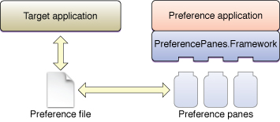
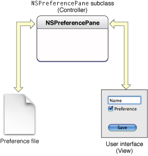

> 导航：[总目录](../../../README.md) · [documentation](../../../_indexes/documentation.md) · [Preference Pane Programming Guide](Introduction.md)

[Next](The%20Preference%20Application.md)[Previous](Introduction.md)

# Architecture of Preference Panes

This section provides an overview of the preference pane architecture. It describes the various components involved in using preference panes and how they fit together, the design principle within the plug-in, and finally some implementation details.

There are three logical components to the preference pane architecture: the application that loads the preference pane plug-ins (the preference application), the Preference Panes framework (`PreferencePanes.framework`), and the preference pane plug-ins themselves. The responsibilities of each are as follows:

- The preference application serves as the container of the preference pane: It loads the preference pane plug-in and provides the window in which the preference pane is displayed. When the plug-in is loaded, the application creates an instance of the plug-in’s principle class, a subclass of NSPreferencePane. Through NSPreferencePane’s interface, the application notifies the preference pane when the pane is displayed and again when it is being removed from the screen.
- The Preference Panes framework acts as the interface between the preference application and the preference pane plug-in. The framework provides the NSPreferencePane class, which is subclassed by the plug-in. The application uses the methods defined by NSPreferencePane to communicate with the plug-in. The default implementation of NSPreferencePane is able to load a default nib file and provide the application with a view containing the user interface.
- The preference pane plug-in provides the user interface for modifying the preferences and interacts with the system or another application to record the changes. The plug-in exports a principle class that is a subclass of the NSPreferencePane class. An instance of this subclass is created by the preference application. This instance, the preference pane object, initializes the user interface with the current preference settings, receives action messages from the interface when the user makes changes, and then records the changes when the user is finished.

In managing the preference settings, the preference pane object usually interacts with an additional component: the object to which the preferences apply. This target can be part of the operating system or one or more separate applications; the interaction can be by direct communication between the preference pane object and target or by indirect communication though the use of a preference file.

The plug-in architecture of preference panes is illustrated, showing a case of indirect communication with the target application, in Figure 1.

__Figure 1__  Plug-in architecture of preference panes

Preference panes are built using a Model-View-Controller (MVC) design wherein the user interface (View) and data model (Model) are separated from one another with all communication going through a third object (Controller). Cocoa applications, as well as the Cocoa frameworks, are frequently implemented using MVC, which allows for greater flexibility and object reuse.

[Figure 2](#apple-f4xwc4dqnrsv64tfmyxwi33df52wszbpgiydambqg4ydcljrgmydomrw) shows the MVC design as it applies to preference panes. The `NSPreferencePane` subclass (the preference pane object) assumes the central role as Controller. It is the intermediary between the user interface defined within a nib file and the preference file, which holds the user’s preferences. Through target-action connections between the user interface (the View) and the preference pane object, the user interface sends messages to the preference pane object as the user performs actions. The preference application can also be considered part of the View, since it provides the window for displaying the preference pane and notifies the preference pane object when the user selects and deselects the preference pane. The preference pane object translates these user actions into modified preference values and updates the values in the preference file (the Model).

__Figure 2__  Model-View-Controller design of preference panes

The Preference Panes framework is an Objective-C framework built on top of Cocoa. As such, it can be used only by a Cocoa application, and the user interface you create for the preference pane module must also be implemented using Cocoa. You cannot create a Carbon-based, or Java-based, preference pane with this framework. In contrast, the application to which the preferences apply can be implemented in any language using any framework, provided it is able to communicate with the preference pane.

For storing preferences, Mac OS X has a built-in preference system, Core Foundation Preference Services, that provides all applications (Cocoa, Carbon, or BSD) the ability to easily read and write preference information to standardized XML-based files. When direct communication between applications is required, you can choose from a variety of methods from low-level signals and sockets to high-level Apple events, most of which are available to both Cocoa and Carbon applications.

[Next](The%20Preference%20Application.md)[Previous](Introduction.md)

