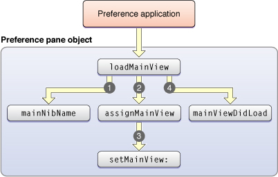

> 导航：[总目录](../../../README.md) · [documentation](../../../_indexes/documentation.md) · [Preference Pane Programming Guide](Introduction.md)


[Next](Anatomy%20of%20a%20Preference%20Pane%20Bundle.md)[Previous](Managing%20User%20Preferences.md)

# Life Cycle of a Preference Pane

Normally, the user interacts with a preference pane via the System Preferences application. It is the responsibility of the System Preferences application to load the preference pane bundle, create an instance of the principle class, and message the principle class object appropriately at various times during its life.

Preference panes can be used in other applications as well. For example, the Mac OS X Setup Assistant embeds the Date & Time preference pane in one of its windows.

Throughout this description, we’ll refer to the container application, whether it be System Preferences, the Setup Assistant, or your own preference application, as simply “the application.”

The life of a preference pane begins when the application instantiates an `NSBundle` object for the preference pane package. The application then asks the `NSBundle` for its principle class and creates an instance of the principle class using the `initWithBundle:` method, passing in the `NSBundle` object as the argument.

The `initWithBundle:` method is the designated initializer for the `NSPreferencePane` class. Subclasses of `NSPreferencePane` that wish to perform their own initialization should override the `initWithBundle:` method, taking care to call the superclass’s implementation first. For example:

```objc
- (id)initWithBundle:(NSBundle *)bundle
{
    if ( ( self = [super initWithBundle:bundle] ) != nil )
    {
        // add subclass-specific initialization here
    }
    return self;
}
```

At this point, the user interface elements of the preference pane (its main nib file and its main view) have not been loaded or initialized. Any initialization that depends on outlet connections to user interface elements in the main nib file should be deferred to the `mainViewDidLoad` method described below.

If your preference pane supports AppleScript commands, it should be prepared to respond to them at this point.

When the preference pane’s user interface needs to be displayed for the first time, the application sends the `loadMainView` message to the preference pane object. The default implementation of `loadMainView` performs the following actions:

1. Determines the name of the main nib file by calling the preference pane object’s `mainNibName` method.
2. Loads that nib file, passing in the preference pane object as the nib file’s owner.
3. Invokes the preference pane object’s `assignMainView` method to find and assign the main view.
4. Invokes the preference pane object’s `mainViewDidLoad` method.
5. Returns the main view.

The sequence of methods invoked while loading the main view is illustrated in [Figure 1](#apple-f4xwc4dqnrsv64tfmyxwi33df52wszbpgiydambqg4ydiljrgaytmobr).

__Figure 1__  Execution flow of loadMainView



A preference pane subclass should rarely need to override the `loadMainView` method. One case in which an override is necessary is if a preference pane subclass needs to use a non–nib–based technique to load the main view, such as programatically creating the main view. In this case, the subclass’s implementation of `loadMainView` must call `setMainView:` passing in the main view as the argument. This ensures that future calls to `mainView` will return the correct view.

The default implementation of `mainNibName` returns the value of the `NSMainNibFile` key in the bundle’s property list. If the key does not exist, the default value of `@“Main”` is returned. A NSPreferencePane subclass can override the `mainNibName` method if it needs to dynamically select the main nib file to use.

The default implementation of `loadMainView` invokes the `assignMainView` method to find and assign the main view in the main nib file. The default implementation of `assignMainView` assigns the content view of `_window` to the `_mainView` outlet and retains the view. It then removes the content view from `_window`, releases `_window`, and sets `_window` to `nil`.

Most preference panes should not need to override the `assignMainView` method. The default implementation of `assignMainView` allows a preference pane developer to create the user interface for the preference pane in a window and connect the `_window` outlet to the window. If a preference pane has multiple main views and needs to select which main view to use at runtime, it can override the `assignMainView` method.

The preference pane object receives a `mainViewDidLoad` message after its main nib file has been loaded and the main view has been assigned. The default implementation of `mainViewDidLoad` in the NSPreferencePane class does nothing. A NSPreferencePane subclass can override this method if it needs to initialize the state of the view’s graphical elements.

Before a preference pane’s main view is displayed in the application’s window, the application sends the preference pane object a `willSelect` message. Immediately after the view is displayed, the application sends the preference pane a `didSelect` message.

The default implementations of these methods do nothing. An NSPreferencePane subclass should override these methods if it needs to perform some action either immediately before or immediately after a preference pane is selected.

The application attempts to deselect the currently selected preference pane when one of the following actions occur:

- the user attempts to switch to another view in the preference window
- the user attempts to close the preference window
- the user attempts to quit the application

The application attempts to deselect a preference pane by sending it the `shouldUnselect` message. The method returns one of the values from [Table 1](#apple-f4xwc4dqnrsv64tfmyxwi33df52wszbpgiydambqg4ydiljrgiydcmzu), indicating whether the preference pane is willing to be deselected. The default implementation of `shouldUnselect` in the NSPreferencePane class returns `NSUnselectNow`. This tells the application that it is OK to deselect the preference pane immediately.

__Table 1__  Return values of shouldUnselect

| `NSUnselectCancel` | Cancel the deselection |
| `NSUnselectNow` | Continue the deselection |
| `NSUnselectLater` | Delay the deselection until the preference pane invokes `replyToShouldUnselect:` |

A preference pane can override the `shouldUnselect` method if it needs to cancel or delay the deselection. Typically, this occurs if the preference pane needs to confirm saving changes with the user (as with the Network preference pane). If the mechanism of confirming the deselection is synchronous (such as with an application-modal alert or sheet), the `shouldUnselect` method should make the synchronous call and then return `NSUnselectCancel` or `NSUnselectNow`. For example:

```objc
- (NSPreferencePaneUnselectReply)shouldUnselect
{
    int result = NSRunAlertPanel( ... );

    if ( result == NSAlertDefaultReturn )
        return NSUnselectNow;
    return NSUnselectCancel;
}
```

If the mechanism of confirming the deselection is asynchronous (such as with a window-modal sheet), the `shouldUnselect` method should return `NSUnselectLater`. When a pane returns `NSUnselectLater`, it must call `replyToShouldUnselect:` once the pane decides whether or not it can be deselected. The `replyToShouldUnselect:` method takes one parameter, a Boolean value, that indicates whether or not the application should deselect the pane. A value of `YES` means the application should deselect the pane. A value of `NO` means the application should cancel the deselection.

Once the deselection is confirmed, the application sends the preference pane a `willUnselect` message immediately before the action that causes the deselection is performed. The application sends the preference pane a `didUnselect` message immediately after the action that caused the deselection is performed. When quitting the application, the `willUnselect` and `didUnselect` messages are both sent before the application quits.

For performance reasons, the System Preferences application keeps preference pane objects around once they have been instantiated. They are not deallocated when the preference pane is deselected. They are only deallocated when the System Preferences application terminates.

[Next](Anatomy%20of%20a%20Preference%20Pane%20Bundle.md)[Previous](Managing%20User%20Preferences.md)

