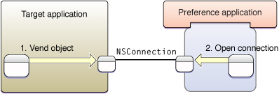
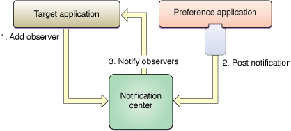

> 导航：[总目录](../../../README.md) · [documentation](../../../_indexes/documentation.md) · [Preference Pane Programming Guide](Introduction.md)

[Next](Life%20Cycle%20of%20a%20Preference%20Pane.md)[Previous](The%20Preference%20Application.md)

# Managing User Preferences

The Preference Panes framework defines the interface through which an application interacts with the preference pane object, but the application is responsible only for displaying the preference pane’s user interface. The preference pane object is responsible for handling the preferences themselves. This section describes techniques by which the preference pane can store and communicate preferences to the target application.

Because preference panes are subject to sudden termination by `SIGKILL` when the user shuts down the device, preferences should be sent to the target application or saved to a preference file whenever the user makes a change, if practical. You should not wait for the pane to be dismissed to save the preferences. If you have complex sets of preferences that need to saved as a group, save the changes interactively to a temporary file, and provide an Apply button to copy the settings to the preferences file and/or target application, so that the device can be shut down without your pane either losing data or blocking shut down.

At the heart of the Mac OS X user preference system is Core Foundation Preference Services. This collection of routines defines a set of domains according to the user name, host name, and application ID to which a given preference value applies. Each component of the domain is specified by a CFString. Predefined constant strings are available to easily select either the “Current” instance of a component (such as the current application or current user) or a shared component available to “Any” instance.

|  |  |
| --- | --- |
| `kCFPreferencesCurrentUser` | `kCFPreferencesAnyUser` |
| `kCFPreferencesCurrentApplication` | `kCFPreferencesAnyApplication` |
| `kCFPreferencesCurrentHost` | `kCFPreferencesAnyHost` |

These constants combine to form the eight preference domains shown in [Table 1](#apple-f4xwc4dqnrsv64tfmyxwi33df52wszbpgiydambqg4ydgljrga2tcobu).

__Table 1__  Preference domains in precedence order

| User name | Application ID | Host name |
| Current | Current | Current |
| Current | Current | Any |
| Current | Any | Current |
| Current | Any | Any |
| Any | Current | Current |
| Any | Current | Any |
| Any | Any | Current |
| Any | Any | Any |

By providing your own string, you can access domains other than those defined by the current context. Access to the preferences of other users, though, requires special privileges.

Preferences located in domains higher on the list in [Table 1](#apple-f4xwc4dqnrsv64tfmyxwi33df52wszbpgiydambqg4ydgljrga2tcobu) (in other words, the more specific domains) take precedence over those located in lower domains (the more general domains).

The NSUserDefaults class, which is part of the Cocoa Foundation framework, is used by Cocoa applications to manage their user preferences. Because it writes preferences to the second domain listed in [Table 1](#apple-f4xwc4dqnrsv64tfmyxwi33df52wszbpgiydambqg4ydgljrga2tcobu), using the “Current” application domain, it cannot be used by a preference pane within a preference application. It would write any changed preferences to the preference application’s preference file, instead of to the target application’s file. If the preference pane is embedded in the target application, NSUserDefaults works, but it then breaks the modular and reusable design of the preference pane.

For details on how to read and write preferences to a preference file, see [Using Preference Services](Using%20Preference%20Services.md#apple-f4xwc4dqnrsv64tfmyxwi33df52wszbpgiydambqg4ydolkcifbemq2bijfa). For more information about Preferences, see _[Preferences Programming Topics for Core Foundation](../../Core%20Foundation/Preferences%20Programming%20Topics%20for%20Core%20Foundation/Introduction%20to%20Preferences%20Programming%20Topics%20for%20Core%20Foundation.md#apple-f4xwc4dqnrsv64tfmyxwi33df52wszbpgeydambqgezds2i)_.

When dealing with a cross-platform target application, such as standard BSD daemons, Core Foundation Preference Services cannot be used. Instead, you need to manipulate custom configuration files. For BSD applications, the file is normally a plain text file, but the specific format varies from program to program. Your preference pane needs to include its own code to read, parse, modify, and save these files rather than use Preference Services.

Storing the new preferences on disk is not sufficient when the change applies to a running application or an integrated part of the operating system; you need to inform the target of the change if it is to take effect immediately instead of waiting for a restart. You achieve this by sending a message from the preference pane to the target application. In some cases the message may be a simple function call to an operating system routine.

In Mac OS X there is an abundance of ways to communicate with other processes; each layer and framework has its own preferred methods. Although preference panes are written using the Cocoa Objective-C framework, you are not restricted to its particular implementation of messaging—use what is best for the situation. When the target application is not under your control, your choice is limited to those methods understood by the target.

You could forego saving the preferences in the preference pane altogether if the changes are communicated directly to an omnipresent part of the system that manages its preferences itself. The preference pane could merely send the updated preferences to the target and the target would take responsibility for storing them in a persistent location (typically a file on the disk).

If the target is not guaranteed to always be running, the preference pane needs to update the preference file itself. Use the following communication methods only for auxiliary information or to notify the target, if it is currently running, that its preferences have changed.

At the highest level of interprocess communication are Apple events, the long-time standard for interapplication communication in Mac OS. An Apple event is a high-level message that an application can send to itself, other applications on the same computer, or applications on a remote computer. Apple event objects have a well-defined data structure with support for extensible, hierarchical data types. A well-defined set of Apple events can provide support for a rich scripting interface through AppleScript.

The Objective-C language runtime supports an interprocess messaging solution called “distributed objects.” This mechanism enables a Cocoa application to call an object in a different Cocoa application. Calls may be synchronous, meaning the sending process is blocked while waiting for a reply from the receiver, or asynchronous, meaning no reply is expected and the sender is not blocked.

The receiving application “vends,” or makes public, an object to which other applications can connect. Invoking one of the vended object’s methods then takes place as if the object existed in your own application—the syntax does not change. The runtime system handles the necessary transmission of data between the applications.

__Figure 1__  Distributed object architecture

If your preference pane is to be used to control a faceless Cocoa application, this is a very simple technique for interapplication communication. Since it allows two-way communication, you can provide greater interaction between the user and the application. The preference application can obtain the current settings directly from the target application instead of a preference file. It can then get immediate feedback on whether the user’s modifications are accepted by the target.

For details on how to use distributed objects in a preference pane, see [Using Distributed Objects](Communicating%20With%20the%20Target%20Application.md#apple-f4xwc4dqnrsv64tfmyxwi33df52wszbpgiydambqg4ydqljrgaytkmzt). For more information on distributed objects, see _Inside Mac OS X: The Objective-C Programming Language_ and the [NSConnection](https://developer.apple.com/library/archive/documentation/LegacyTechnologies/WebObjects/WebObjects_3.5/Reference/Frameworks/ObjC/Foundation/Classes/NSConnection/Description.html#//apple_ref/occ/cl/NSConnection) and [NSDistantObject](https://developer.apple.com/documentation/foundation/nsdistantobject) class descriptions in the Foundation Framework Reference.

An alternative to the direct and bidirectional communication of distributed objects and Apple events is a one-way distributed notification. A distributed notification is a message posted by any application to a per-machine notification center, which in turn broadcasts the message to any applications interested in receiving it. Included with the notification is an identifier of the sender, and, optionally, a dictionary containing additional information. The receiver of the notification cannot communicate any information back to the sender. [Figure 2](#apple-f4xwc4dqnrsv64tfmyxwi33df52wszbpgiydambqg4ydgljrga2dmnrr) illustrates this architecture.

__Figure 2__  Distributed Notification Model

The distributed notification mechanism is accessible through the Core Foundation CFNotificationCenter object and through the Cocoa NSDistributedNotificationCenter class. A Cocoa application, such as your preference application, can use either interface. A Carbon application, perhaps the target application, can use only the Core Foundation interface. A notification posted using one interface can be received by either.

A benefit of the distributed notification model is the model’s one-to-many capabilities. If you have a suite of tools that share a common set of preferences, each running tool can register for and receive the same notifications for preference changes. Distributed notifications are also sent asynchronously. Your preference pane can post the notification and return immediately; you do not need to wait for the target application to receive the notification and finish processing it.

Further, the target application does not need to be running. If no application is listening for the notification, nothing happens. Because of this, distributed notifications are especially useful for notifying an application of a modified preference file. The preference pane can modify the preference file and post a notification about the change without being dependent on whether someone is listening to it.

Distributed notifications are a system-wide resource shared by all applications. To avoid name conflicts, select notification names that are certain to be unique to your application. See [Preventing Name Conflicts](Preventing%20Name%20Conflicts.md#apple-f4xwc4dqnrsv64tfmyxwi33df52wszbpgiydambqg4ydmlkciffesqkhizca) for details.

For details on how to use distributed notifications in a preference pane, see [Using Distributed Notifications](Communicating%20With%20the%20Target%20Application.md#apple-f4xwc4dqnrsv64tfmyxwi33df52wszbpgiydambqg4ydqljrgaytmnzu). For more information on distributed notifications, see the [NSDistributedNotificationCenter](https://developer.apple.com/documentation/foundation/nsdistributednotificationcenter) class description in the Foundation Framework Reference.

Cross-platform applications cannot make use of the above Mac OS X–specific techniques for interprocess communication. However, Mac OS X supports BSD sockets, a standard communication method on BSD platforms. You can make use of the standard POSIX socket APIs or take advantage of higher-level abstractions in the Cocoa class NSSocketPort or a Core Foundation CFSocket object. The production and parsing of the raw data stream sent over the sockets are the responsibilities of the preference pane object and the target application.

BSD signals are also available in Mac OS X. Signals are software interrupts that can be sent to a specific application. By default, the signal terminates the receiving application, but the application can override this by installing a signal handler that runs when a particular signal is received. The only information passed by the signal is a single integer identifying the signal.

Traditional BSD services (such as `inetd`) frequently use the predefined signal `SIGHUP` (hangup signal) to reset themselves. When modifying the preferences of one of these services, write the updated settings to the application’s preference file and send the `SIGHUP` signal to the application. In response, the application can reread its preferences.

[Next](Life%20Cycle%20of%20a%20Preference%20Pane.md)[Previous](The%20Preference%20Application.md)

