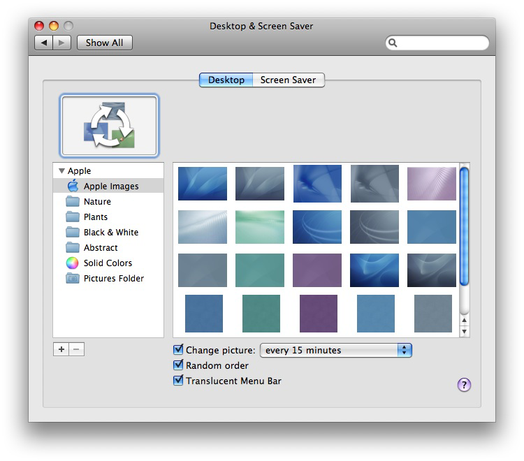

> 导航：[总目录](../../../README.md) · [documentation](../../../_indexes/documentation.md) · [Preference Pane Programming Guide](Introduction.md)

[Next](Managing%20User%20Preferences.md)[Previous](Architecture%20of%20Preference%20Panes.md)

# The Preference Application

The preference application loads the preference pane plug-in and presents the preference pane to the user. Depending on the type and number of preferences you need to manage, you have several choices for the preference application. You can have the preference pane be displayed by System Preferences, by a custom preference application, or by the target application itself in response to the Preferences menu item.

System Preferences is the standard location for presenting system-level preferences. The preference panes shipped with Mac OS X include panes affecting hardware (such as the Sound, Mouse, and Display panes), software integrated into the system (such as the Dock and Screen Saver panes), and behavior applicable to every application (such as the International and General panes).

When your preferences apply to the system or to the user’s environment as a whole, make the preference pane available to System Preferences. This may include panes for the following situations:

- additional input devices such as tablets, multi-function mice, and microphones
- configurable internal hardware such as processor upgrade cards
- light-weight faceless server applications such as a file server
- system-wide utilities such as keyboard macros

Unless your preference pane clearly belongs in System Preferences, use a custom preference application instead.

System Preferences searches for preference panes in four separate locations. Depending on where you install your preference pane bundle, it is available only to an individual user, to an individual computer, or to all computers and users on a network (see [Where Preference Panes Live](Anatomy%20of%20a%20Preference%20Pane%20Bundle.md#apple-f4xwc4dqnrsv64tfmyxwi33df52wszbpgiydambqg4ydkljzg4ydoma)).

The System Preferences window has a fixed width (668 pixels) but resizes itself vertically to fit the size of the current preference pane. Your preference pane should fit on the smallest supported screen resolution in Mac OS X: 800 x 600. If all your preferences cannot fit reasonably well within this size, you can use a tabbed view to divide the preferences into subsets as shown in Figure 1. If you find yourself creating more than a few tabs to hold all your preferences, you should create a custom preference application, instead. Do not split related preferences between multiple panes.

__Figure 1__  Using a tabbed view to categorize related options

Preference panes are self-contained modules. They cannot interact with nor extend other preference panes. In particular you cannot create a preference pane that adds another tab to one of Apple’s standard preference panes such as the pane shown in Figure 1.

If your preferences cannot be presented to the user from within the target application, due to the lack of a suitable user interface, and they do not provide system-level functionality appropriate for System Preferences, present the preferences in a custom preference application. In particular, use a custom preference application if any of the following is true:

- there are a large number of preferences (for example, for a Web server)
- the preferences apply to a background application that is not providing a service to the system or other applications (for example, distributed computing applications)
- more interaction is required than basic mouse clicking and short typing (for example, for training voice-recognition software)

Because System Preferences controls the window in which your preference pane is displayed, your layout options are restricted, especially when you have more than a few preferences. By using a custom preference application, you get greater freedom in designing the user interface. Rather than having a single preference pane with its preferences possibly split into tabbed views of a fixed height and width, preferences can be split between multiple preference panes with custom icons and unique sizes. Each pane can be customized to present the best possible interface for its contents.

If you have very few preferences and do not need to manage multiple preference panes, you can forego use of the Preference Panes framework altogether. You can more easily create a regular nib file containing the entire interface and have the application load it directly.

If the preferences apply to an individual application with its own user interface, or several applications that share common preferences, use the application itself, loading the preference pane in response to the Preferences menu item. For a solitary application, store the preference pane bundles within the `Resources` directory of the application’s package. For a suite of applications, store the bundles in your own subdirectory in `/Library/Application Support`.

If the preferences apply to an individual application, you are calling the preference pane in response to the user choosing Preferences from the menu, and you have only a few preferences that can all fit into a single preference pane, the Preference Panes framework provides little benefit over a regular nib file and a custom class.

When managing a collection of preferences, though, the framework provides a prebuilt architecture with several benefits. For one, the plug-in architecture takes advantage of lazy loading. The code and resources consumed by the preference pane do not need to be allocated until the user selects the preference pane. Its modular design also allows for greater reuse. For example, if you write multiple applications that have a common preference, such as a default font, you can have a single preference pane used by all applications. Finally, the programming interface is designed to support preference panes being displayed and then hidden as the user selects from a collection of preference panes. You do not need to design and create your own implementation for this.

[Next](Managing%20User%20Preferences.md)[Previous](Architecture%20of%20Preference%20Panes.md)

