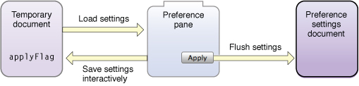

> 导航：[总目录](../../../README.md) · [documentation](../../../_indexes/documentation.md) · [Preference Pane Programming Guide](Introduction.md)

[Next](Preventing%20Name%20Conflicts.md)[Previous](Anatomy%20of%20a%20Preference%20Pane%20Bundle.md)

# Updating Preference Panes

OS X v10.6 introduces several system-wide features that preference panes should support. In v10.6 and v10.7, preference panes should be 64-bit, utilize garbage collection, and support sudden termination. In v10.8 and later, garbage collection is deprecated in favor of ARC (Automatic Reference Counting). For transition purposes, v10.6 will support 32-bit preference panes from developers outside of Apple. For 32-bit preference panes, garbage collection is not required, and support for sudden termination is “opt-in.” For 64-bit preference panes, garbage collection is a required feature and sudden termination is enabled by default. It is strongly recommended that all new preference panes be 64-bit, as support for 32-bit preference panes is not guaranteed in the future.

Starting with v10.6, preference panes should be 64-bit programs. In the future, only 64-bit versions of preference panes will be supported. For transitional purposes, however, v10.6 supports 32-bit preference panes as well.

Because you probably want your preference pane to work under earlier versions of the Mac OS, and because v10.6 can be run on 32-bit machines, you probably want to release your preference pane as a dual binary for 10.6, in both 32-bit and 64-bit versions.

If you are providing a dual binary, your preference pane is more like a framework than a stand-alone application, in that it can be called by 32-bit or 64-bit applications.

See _[64-Bit Transition Guide for Cocoa](../../Cocoa/64-Bit%20Transition%20Guide%20for%20Cocoa/Introduction%20to%2064-Bit%20Transition%20Guide%20For%20Cocoa.md#apple-f4xwc4dqnrsv64tfmyxwi33df52wszbpkridimbqga2denbx)_ for a description of how to write your preference pane as a 64-bit program, and how to provide a dual binary that can be called from 32-bit or 64-bit applications.

All 64-bit preference panes are expected to use garbage collection in v10.6 and v10.7. Using garbage collection will, in most cases, simplify your code and reduce the likelihood of memory leaks.

In 10.6, the System Preferences application will run 64-bit preference panes with garbage collection enabled, and 32-bit panes with garbage collection disabled.

See _[Garbage Collection Programming Guide](../../Cocoa/Garbage%20Collection%20Programming%20Guide/Introduction%20to%20Garbage%20Collection.md#apple-f4xwc4dqnrsv64tfmyxwi33df52wszbpkridimbqgazdimzr)_ for a description of how to implement garbage collection in Cocoa programs and for the compiler directives to produce working code for dual binaries. You still need to retain and release objects in your 32-bit code, but with the proper compiler directives, the compiler will ignore these statements in the 64-bit version.

To make shutting down the Mac faster and more convenient, 10.6 introduces sudden termination. When the user shuts down the device, applications that support sudden termination are simply killed, instead of being told that they are being quit and allowed to complete unfinished tasks.

It is important that you disable and re-enable sudden termination in parts of your code that have unfinished work that must be completed before your program terminates. In particular, the methods `willUnselect` and `didUnselect` should not be relied on to complete work at shutdown.

To disable sudden termination temporarily, call the `disableSuddenTermination` method in `NSProcessInfo`. When your pane is in a state that allows it to be safely terminated by `SIGKILL`, call `enableSuddenTermination`. You can nest calls to disable sudden termination, or disable and enable sudden termination on a background thread: sudden termination is not enabled until all calls to disable it have been balanced by a call to enable it again.

Ideally, your preference pane should update the preferences file each time the user makes a change in the pane, so no work needs to be done at shutdown.

For complex groups of preferences that need to be changed as a set, changes should be saved to a temporary document as they are modified, and an Apply button should be provided to flush the settings to the actual preferences.

The temporary document should include a flag to indicate that the settings have been applied. When the pane loads, it should load its settings from this temporary document, and set the Apply button active if the settings have not yet been applied. If you follow this recommendation, your pane will not need to disable sudden termination when the user makes changes, as no work will need to be done at shutdown. See Figure 1 for an illustration of this technique.

__Figure 1__  Figure

64-bit preference panes have sudden termination enabled by default. 32-bit preference panes can opt-in to sudden termination by setting the boolean value of `NSSupportsSuddenTermination` to `true` in the preference pane’s `.plist` file.

[Next](Preventing%20Name%20Conflicts.md)[Previous](Anatomy%20of%20a%20Preference%20Pane%20Bundle.md)

