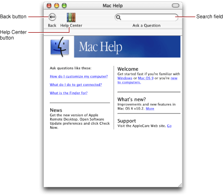
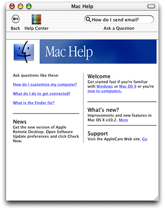
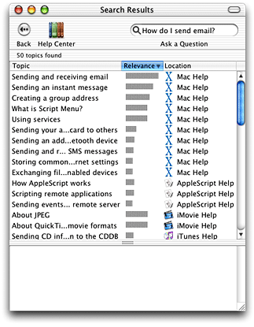
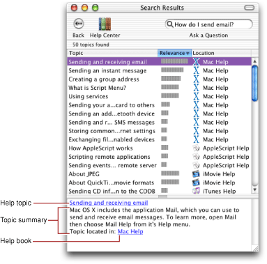
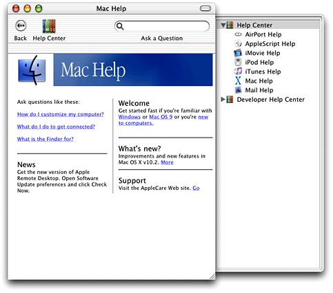
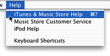
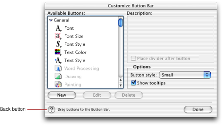
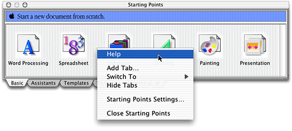

> 导航：[总目录](../../../README.md) · [documentation](../../../_indexes/documentation.md) · [Providing User Assistance With Apple Help](Introduction%20to%20Providing%20User%20Assistance%20With%20Apple%20Help.md)

[Next](Authoring%20User%20Help.md)[Previous](Introduction%20to%20Providing%20User%20Assistance%20With%20Apple%20Help.md)

# Apple Help Concepts

This chapter introduces the Help Viewer application and the Apple Help application programming interface. It describes the Help Viewer interface, how Help Viewer displays your help book, and how users access help from your application. All Carbon, Cocoa, and Java developers authoring user help for a Mac OS X application should be familiar with the concepts presented here.

Users view online help in Help Viewer, a browser-like application designed to display HTML help content. Help Viewer displays files adhering to the HTML 3.2 specification. In addition, Help Viewer supports QuickTime media and AppleScript automation.

Users typically launch Help Viewer by selecting the application help item from the Help menu, described further in [How Users Access Your Help](#apple-f4xwc4dqnrsv64tfmyxwi33df52wszbpkridimbqga3dknrtfvbuqmrqguwueqkcijceissd). When Help Viewer launches, it brings up the window shown in Figure 1-1, displaying help for the application from which the user requested assistance. In Figure 1-1, the Help Viewer window displays the system help book, Mac Help.

__Figure 1-1__  The Help Viewer window

By default, there are three user interface elements in the toolbar at the top of the Help Viewer window: the Back button, the Help Center button, and the search field. The Back button on the left side of the toolbar allows users to navigate back to previously visited help pages; users can also view their navigation history and revisit pages using the Go menu. The Help Center button opens and closes the Help Center drawer; the Help Center is described further in [The Help Center](#apple-f4xwc4dqnrsv64tfmyxwi33df52wszbpkridimbqga3dknrtfvbuqmrqguwueqkcirfegq2g). The search field allows users to search all available help on the system.

Users can customize the Help Viewer toolbar by choosing the Customize Toolbar item from the View menu. Users can add additional controls, such as a Forward button, Print button, or font size buttons, or choose a different view for the toolbar.

One of the primary advantages of Help Viewer for viewing online help is its ability to quickly and accurately search an installed set of help content. Users often arrive at online help with an idea of what they want to accomplish; help should allow them to get the information they need as quickly as possible and get on with their tasks. Especially for large help systems, searching is often the most efficient and effective way for users to obtain help.

The text entry field at the right side of the Help Viewer window’s toolbar allows users to search the available help content on the system. Users enter the term or concept for which they want to obtain help into the text field. They can also enter a question. Figure 1-2 shows a question entered in the text field of the Help Viewer window.

__Figure 1-2__  A question entered in the search field of Help Viewer

When the user presses Return, Help Viewer searches the help books installed on the system for the relevant term or terms. Figure 1-3 shows the search results returned by Help Viewer in response to the question entered in Figure 1-2.

__Figure 1-3__  Search results displayed in Help Viewer

Help Viewer displays the titles of each relevant help topic in a table of search results, along with the help book in which that topic is found. Search results are ranked by relevance, with the topmost hits having the highest relevance. When the user selects a topic from the search results, the bottom frame of the Help Viewer window displays a summary of the help topic, if available. The user can view the selected topic by double-clicking the topic in the search results table or by following the link in the bottom frame of the Help Viewer window. Figure 1-4 shows the summary for a help topic returned as a search result for the query entered in [Figure 1-2](#apple-f4xwc4dqnrsv64tfmyxwi33df52wszbpkridimbqga3dknrtfvbuqmrqguwueqkci5dugskb).

__Figure 1-4__  A topic summary displayed for a search result in Help Viewer

The Help Center, displayed in a drawer, lists all of the help books currently installed on the user’s system. With the Help Center, users can easily access and browse all of the help available to them. Figure 1-5 shows the Help Center.

__Figure 1-5__  The Help Center

The Help Center is visible by default when Help Viewer is launched, but users can hide and show the Help Center using the button in the Help Viewer toolbar. Because the Help Center is available to the user at any time, no matter what help book they are currently viewing, users can conveniently switch between help books without switching applications. When the user selects a help book in the Help Center, Help Viewer loads that help book.

To display help in Help Viewer, you must create and register a help book. As described in [Introduction to Providing User Assistance With Apple Help](Introduction%20to%20Providing%20User%20Assistance%20With%20Apple%20Help.md#apple-f4xwc4dqnrsv64tfmyxwi33df52wszbpkridimbqga3dknrtfvbuqmrqgqwugscejfceursf), a help book is the collection of HTML files that constitute your help content. In addition to HTML files, help books can contain graphics, AppleScript scripts, QuickTime movies, and other resources used in the help pages. A help book can be simple or complex, depending upon the complexity of the software product it describes. In addition to any help content, a help book should contain these two items:

- A default, or title, page. This is the HTML page that is displayed by default when Help Viewer first opens the help book. The title page is identified by the `AppleTitle` meta tag in its header. The `AppleTitle` meta tag is one of the help-specific meta tags described in [Help-Specific Meta Tags](#apple-f4xwc4dqnrsv64tfmyxwi33df52wszbpkridimbqga3dknrtfvbuqmrqguwueqkci5bekskj). Without this page, Help Viewer cannot locate and automatically access the help book. Title pages are described in more detail in [Creating a Title Page](Authoring%20User%20Help.md#apple-f4xwc4dqnrsv64tfmyxwi33df52wszbpkridimbqga3dknrtfvbuqmrqgywugskijjcucrkg).
- An index file. For a help book to be searchable, it must have an index file. You can create index files using the Apple Help Indexing Tool, described in [Indexing Your Help Book](Authoring%20User%20Help.md#apple-f4xwc4dqnrsv64tfmyxwi33df52wszbpkridimbqga3dknrtfvbuqmrqgywugskijbdeqqkg).

All of the content referenced by your help book must reside in a single folder, although a help book folder can contain any number of subfolders.

When you register your help book, Help Viewer locates your help book folder, searches the folder for the title page and index file or files for your help book, and caches the location of those files. When users select your help book in the Help Center or choose the application help item from the Help menu, Help Viewer opens the title page of your help book. When users enter a search in Help Viewer, Help Viewer searches the index files in your help book and displays the relevant results in the table view shown in [Figure 1-3](#apple-f4xwc4dqnrsv64tfmyxwi33df52wszbpkridimbqga3dknrtfvbuqmrqguwueqkcivfemqsf).

In Mac OS 9 and later, Help Viewer supports Internet-based help book content; you can store help pages on a remote server and Help Viewer downloads them as needed. This allows you to keep your help content up to date easily and without inconvenience to your users.

You specify the server from which Help Viewer should retrieve content when you index your help book. When the user opens your help book, Help Viewer loads your title page. When the user follows a link to another page, Help Viewer looks for the page in the local help book folder. If this page is not present in the local help folder, Help Viewer contacts the server specified in the index and downloads the page.

Beginning with Mac OS X version 10.2, you can specify Internet-based help as your primary help book content. When you specify Internet-primary help, Help Viewer first checks for content on your remote server when loading a help page, even if that page exists in the local help folder. Using Internet-primary help, you can provide a complete installation of your help book locally, yet still provide updated help content over the Internet. Also beginning in Mac OS X version 10.2, Help Viewer supports updating indexes over the Internet.

To learn more about supplying content remotely, see [Storing Pages on Remote Servers](Authoring%20User%20Help.md#apple-f4xwc4dqnrsv64tfmyxwi33df52wszbpkridimbqga3dknrtfvbuqmrqgywugscei5eukq2f).

Users access your application’s help book— and other help resources—in any of the following three ways:

1. Selecting an item from the Help menu. This is the most visible means of accessing user help, and your application must provide Help menu access to its help book. If you register your help book, the system automatically makes your help book accessible from the Help menu.
2. Clicking a help button. Where appropriate—for example, in a dialog requesting a user action—your application may supply a help button. Clicking this button should bring up your application’s user help.
3. Selecting a help item from a contextual menu. If contextually relevant help exists for a part of your application’s user interface, the first item in a contextual menu should be a help item. If the user selects the help item, your application should bring up the relevant help.

Users access your application’s help book and other help resources through the Help menu, the rightmost menu in the application region of the menu bar. Although your application may also provide additional means of obtaining help, such as contextual menu items or help buttons, the Help menu is the most obvious means of obtaining assistance for the majority of users. Because the Help menu is easily visible, remains in a consistent location, and is always accessible, it is the first place users go when they have a question. Help menu items are not context-sensitive.

Figure 1-6 shows the Help menu in iTunes.

__Figure 1-6__  The Help menu

The Help menu is supplied by the system. The first item in the Help menu should be titled _ApplicationName_ Help, where _ApplicationName_ is the name of your software product. When the user chooses this item from the menu, you should open Help Viewer to the first page of your application’s primary help book. If you have registered your help book, the system not only creates the Help menu and the application help menu item for you, it also handles the choice of the application help menu item by opening Help Viewer to your application’s registered help book.

In addition to your application’s primary help book, you may want to include items for other help resources, such as links to support or customer service websites or tutorials, in the Help menu.

A help button is a small round button displaying the standard help icon—a question mark.

When contextually relevant help is available, you can use help buttons in the lower-left corner of a window or dialog to take users directly to the pertinent information. For example, you can use a help button in a Preferences dialog to take users directly to information about setting preferences for your application.

Figure 1-7 shows a typical help button, in the lower-left corner of an AppleWorks dialog.

__Figure 1-7__  A help button

You should use help buttons only when contextually relevant help exists for the current window or dialog. Help buttons should allow users to obtain assistance for the task at hand without searching through your help book.

When the user clicks the help button, your application should load the relevant help topic in Help Viewer, using the Apple Help functions `AHLookupAnchor` or AHGotoPage. See [The Apple Help Application Programming Interface](#apple-f4xwc4dqnrsv64tfmyxwi33df52wszbpkridimbqga3dknrtfvbuqmrqguwueqkcijceiqkd) for more information on using these functions.

You can also provide context-specific user assistance through contextual menu items. Contextual menus are displayed when the user Control-clicks an object in an application’s user interface. If help pertaining to that object exists—for example, a a description of how to use that user interface element—the first item in the contextual menu should be a help item. Figure 1-8 shows a contextual menu containing a Help item.

__Figure 1-8__  Help in a contextual menu

If the user selects the help item from the menu, you should use the function `AHLookupAnchor` or `AHGotoPage` to load the relevant page of your help book in Help Viewer. To learn more about using Apple Help functions to access your help book, refer to [Opening Your Help Book in Help Viewer](Opening%20Your%20Help%20Book%20in%20Help%20Viewer.md#apple-f4xwc4dqnrsv64tfmyxwi33df52wszbpkridimbqga3dknrtfvbuqmrqhawugskiizaueskf).

Help Viewer recognizes a number of help-specific HTML extensions, which you can use in your help book to control how Help Viewer displays and accesses your help. These extensions to the HTML 3.2 specification fall into three categories:

- Meta information. Help Viewer uses this meta information to recognize your help book and determine how it should be displayed.
- Help URLs. Help Viewer handles a number of help-specific URLs, which you can use to load particular help content in Help Viewer.
- Segment commands. These are HTML comments that Help Viewer interprets to mark and identify subsections within an HTML page.

Help Viewer recognizes a set of properties for the standard HTML `<META>` element, which you can use to control how your help book appears in the Help Center and in search results. You can also use these meta tags to control how your help is indexed. [Authoring User Help](Authoring%20User%20Help.md#apple-f4xwc4dqnrsv64tfmyxwi33df52wszbpkridimbqga3dknrtfvbuqmrqgywugskiivaucrci) describes many of these meta tags and how you can use them. For a complete list of the help-specific meta information recognized by Help Viewer, see [Table A-1](Apple%20Help%20Meta%20Tag%20Properties.md#apple-f4xwc4dqnrsv64tfmyxwi33df52wszbpkridimbqga3dknrtfvbuqmrqhewugscejbdecrsh).

There are several URLs, using the Help Viewer `help:` protocol, that you can use in your help book to create links to additional help content. You use the standard `<A HREF>` syntax for a source link with these help URLs. Although you can use help URLs to link to HTML help pages, their main advantage is that they allow you to create hyperlinks that, when clicked, initiate searches in Help Viewer, run AppleScript scripts, and perform anchor lookup.

The help URLs are described in more detail in the section [Adding Specialized Content to Your Help Book](Authoring%20User%20Help.md#apple-f4xwc4dqnrsv64tfmyxwi33df52wszbpkridimbqga3dknrtfvbuqmrqgywuerkkivducrcd). For a full listing of the supported help URLs, see [Table B-1](Apple%20Help%20URLs.md#apple-f4xwc4dqnrsv64tfmyxwi33df52wszbpkridimbqga3dknrtfvbuqmrrgawviucykjcummjqge).

Help Viewer also recognizes certain HTML comments that you can use to split an HTML file in your help book into subsections, called segments. Segments can be returned as individual hits in a search, each with its own description, title, and search keywords. You may find it useful to use segments if you have a particularly large help book and wish to reduce the file count without loading too much help content into a single help page. [Creating Segments in Help Pages](Authoring%20User%20Help.md#apple-f4xwc4dqnrsv64tfmyxwi33df52wszbpkridimbqga3dknrtfvbuqmrqgywugsceirbeoqkb) describes segments in more detail. See [Table C-1](Apple%20Help%20Segments.md#apple-f4xwc4dqnrsv64tfmyxwi33df52wszbpkridimbqga3dknrtfvbuqmrrgewueqkcirdesqki) for a complete list of the comments denoting segments.

The Apple Help application programming interface, declared in the `AppleHelp.h` header file in the Carbon framework, allows you to programmatically access and load help pages in Help Viewer. When users choose an item from the Help menu, click a help button, or choose Help from a contextual menu, your application must respond by displaying the appropriate help material. If this help material is in an Apple Help book, your application must open the relevant page of the help book in Help Viewer.

The Apple Help functions that open a help book in Help Viewer are listed in Table 1-1.

__Table 1-1__  Apple Help functions for accessing your help book

| Function name | Action |
| `AHLookupAnchor` | Opens your help book to the section or page identified by the given anchor. |
| `AHSearch` | Searches your help book for a given text string. |
| `AHGotoPage` | Opens a help book page at a known location. |

If you know the exact location within your help book of the help topic you wish to display, you can use the `AHGotoPage` function to load the topic in Help Viewer. `AHGotoPage` requires that you know the full or partial path to the HTML file describing the desired help topic. `AHLookupAnchor`, on the other hand, allows you to access a help topic with only the anchor name; in most cases, this approach is more flexible than tracking the location of the file describing that topic. If there is not one particular topic that you wish to load in Help Viewer, you can instead use the `AHSearch` function to search your help book for all topics containing a particular string.

The Apple Help functions are described in detail in the _Apple Help Reference_.

To learn how you can use the Apple Help functions to access your help book content from within your application, see [Opening Your Help Book in Help Viewer](Opening%20Your%20Help%20Book%20in%20Help%20Viewer.md#apple-f4xwc4dqnrsv64tfmyxwi33df52wszbpkridimbqga3dknrtfvbuqmrqhawugskiizaueskf).

[Next](Authoring%20User%20Help.md)[Previous](Introduction%20to%20Providing%20User%20Assistance%20With%20Apple%20Help.md)

