> 导航：[总目录](../../../README.md) · [documentation](../../../_indexes/documentation.md) · [Providing User Assistance With Apple Help](Introduction%20to%20Providing%20User%20Assistance%20With%20Apple%20Help.md)


[Next](Registering%20Your%20Help%20Book.md)[Previous](Apple%20Help%20Concepts.md)

# Authoring User Help

This chapter describes how to author help content for Help Viewer and organize it into a help book. Anyone authoring user help for the Mac OS should be familiar with the basic requirements of creating a help book and with the general guidelines for writing user help.

These basic steps are involved in creating a help book for the Mac OS:

1. Design the help content.
2. Author the HTML help pages.
3. Organize the help book. This includes creating the necessary auxiliary files that Help Viewer uses.
4. Index the help book.

In addition, this chapter describes how you can include additional content, such as QuickTime movies and AppleScript scripts, in your help book and how you can localize your help book for other languages.

The first steps in authoring your help book are identifying the topics your help must cover and designing a layout for presenting these topics. To this end, you may find it useful to create a topic outline. If the software product for which you are creating help already has existing documentation, you may be able to base your outline on this material. If you are creating a help book from scratch, there are a number of ways you can approach the outline. A few examples:

- Walk through the steps of the main task sequence in order. If you are writing help for a larger application, there may be several different task sequences a user would perform. For example, a productivity suite may have different task sequences for word processing, using spreadsheets, and creating presentations.
- List topics alphabetically.
- Go through each menu and menu item in the application sequentially.

Each topic should be simple enough to be described in a few short paragraphs on a single HTML page. If a topic is lengthy, you should consider breaking it up into smaller subtopics.

Here are some tips to keep in mind when designing your help book.

- Divide the information into overview information and tasks. Overview information defines terms and explains concepts important to an understanding of your software product; task information gives step-by-step directions for accomplishing a particular goal. You should generally place these two kinds of information on separate help pages to give users quick access to the information they want. You can link between pages containing overview and task information when appropriate. Avoid including “feature-oriented” pages, which describe application features but don’t tell users what they can do or how.
- Identify any information you think you’ll need to give users more than once in a help book. You can write an individual help page to cover this information and link to it from other topics in the book to avoid duplication.
- Build pages around four central questions: what can users do, why do they want to do it, how can they do it, and how can they solve problems doing it. Depending upon the complexity of the task, a well-designed help page may cover the first two questions in two sentences, the third question in one, and the fourth in two or three bullet points.

Once you have identified the subjects covered in your help book, you need to create HTML files for your help pages. To ensure that your help displays properly in Help Viewer, your help files should comply with the HTML 3.2 specification. For a comprehensive description of the HTML 3.2 specification, see

[http://www.w3.org/TR/REC-html32.html](http://www.w3.org/TR/REC-html32.html)

You can author your help book in any application that generates valid HTML 3.2 files. Likewise, you can view your help book in any HTML 3.2–qualified browser; however, you should always test your help book in Help Viewer to ensure that your help book displays properly. If you already have HTML help content, there are tools available to help you quickly and easily convert your files to Apple Help content. For a list of some of the tools you can use to create help content for your help book, see

[http://developer.apple.com/ue/help/](https://developer.apple.com/ue/help/)

Each help page should cover only one topic, which can be expressed in a few short paragraphs. As mentioned in the section [Designing a Help Book](#apple-f4xwc4dqnrsv64tfmyxwi33df52wszbpkridimbqga3dknrtfvbuqmrqgywugskiiveekqkd), your help book may contain both overview and task information. Overview pages define terms and concepts important to your application or offer other general information that users may need to know to understand your software product. For example, the help book page shown in Figure 2-1 defines a playlist, a concept fundamental to the iTunes application.

__Figure 2-1__  A help book page containing overview information

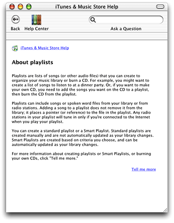

Task pages, on the other hand, offer a step-by-step description of the actions the user must take to perform a common task in your software product. The help book page shown in Figure 2-2 describes the steps necessary to add a song from a CD to the user’s playlist.

__Figure 2-2__  A task-oriented help book page

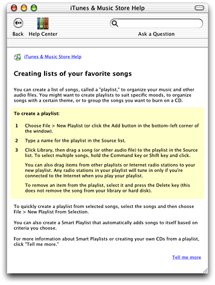

Topic pages typically include these elements:

- A title identifying the topic. In Figure 2-1, “About playlists” identifies “playlists” as the topic; in Figure 2-2, “Creating lists of your favorite songs” identifies the creation of playlists as the topic.
- The topic introduction. For an overview page, this section defines the relevant terms or concepts. For example, the first two paragraphs in Figure 2-1 define a “playlist” and why it is useful. For a task-oriented page, the introduction provides context for the task description that follows and explains why or when the user would perform the task. In Figure 2-2, the first paragraph briefly summarizes the definition of a playlist and gives a few reasons why you might want to create one.
- Requirements for performing the task. For a task page, any conditions that must be met in order for the task to succeed should be mentioned up front, before the user begins the task. For example, if the help topic is "Burning a CD," the system requirements—such as the presence of a CD burner—for burning the CD should be mentioned here.
- The task description. These are the steps that the user must perform to accomplish the given task. [Figure 2-2](#apple-f4xwc4dqnrsv64tfmyxwi33df52wszbpkridimbqga3dknrtfvbuqmrqgywugskijfdekq2d) shows the three steps necessary to create a new playlist. Overview pages typically do not contain this information.
- The topic wrap-up. This includes any information the user may need in order to wrap up any task described in the page. It is also a good place to include tips, shortcuts, troubleshooting information, and links to related help topics. For example, the last paragraph shown in [Figure 2-2](#apple-f4xwc4dqnrsv64tfmyxwi33df52wszbpkridimbqga3dknrtfvbuqmrqgywugskijfdekq2d) links to related information on creating a playlists using Smart Playlists.

For an example of a basic topic page, see the template file `TopicTemplate.htm` located in `/Developer/Documentation/AppleHelp/Templates/`.

In addition to topic pages, you may need to create navigation pages for your help book. Users should be able to find most of the information they need by searching and navigating through links in your topic pages. However, navigation pages, such as tables of content, allow users to browse your help book and navigate to topics they want to learn more about without having a particular search topic in mind. You may consider providing a table of contents at the following levels:

- top level
- chapter level
- topic level

The top-level table of contents page in your help book allows the user to select a starting point within your help book. A top-level table of contents gets the user started in finding help, even if they do not quite know what they are looking for. Figure 2-3 shows the top-level table of contents for the AppleWorks application.

__Figure 2-3__  The top-level table of contents for AppleWorks Help

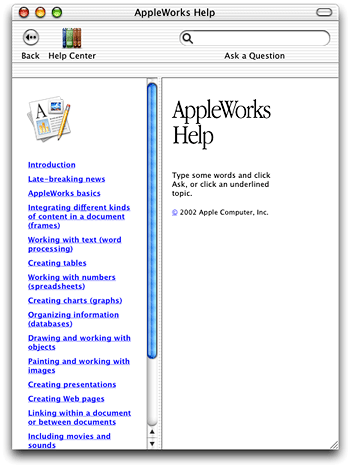

If your help book is chapter based, you should provide a separate table of contents for each chapter. Chapter-based help books are described further in [Creating a Chapter-Based Help Book](#apple-f4xwc4dqnrsv64tfmyxwi33df52wszbpkridimbqga3dknrtfvbuqmrqgywugskiizceqr2k).

As mentioned in [Designing a Help Book](#apple-f4xwc4dqnrsv64tfmyxwi33df52wszbpkridimbqga3dknrtfvbuqmrqgywugskiiveekqkd), you should break complex topics with lengthy descriptions into smaller subtopics in order to keep each help topic short and focused. However, it may not be appropriate to include all of the subtopics directly in your main table of contents.

Even if your help book is not chapter-based, you can create navigation pages to group related subtopics. This allows users to see and navigate to each of these table of contents subtopics. Figure 2-4 shows a page from iTunes Help. On the left side is the top-level table of contents for iTunes Help; on the right side is a table of contents listing the subtopics related to editing information in iTunes.

__Figure 2-4__  A topic level table of contents in iTunes Help

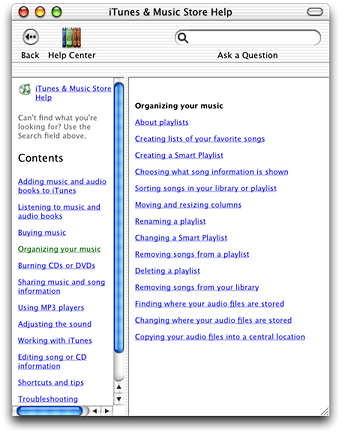

_Apple Human Interface Guidelines_ offers information on effectively incorporating help into your application.

Once you create the HTML files containing your help content, you must organize them into a help book. To do this, create a help book folder and include the following items:

- The topic and navigation pages. These are the HTML pages that you created for your help content, as described in [Authoring Help Pages](#apple-f4xwc4dqnrsv64tfmyxwi33df52wszbpkridimbqga3dknrtfvbuqmrqgywugskii5eeirsk).
- A title page. This is the HTML file that is displayed by default when the user first opens your help book.
- A help book icon. This icon is displayed next to your help book in the Help Center.

Every help book must be enclosed in its own folder. For a simple help book, Apple recommends that you also create one subfolder for your HTML help files and one subfolder for graphics. Figure 2-5 shows an example of a simple help folder for SurfWriter Help.

__Figure 2-5__  An example of a simple help book folder structure

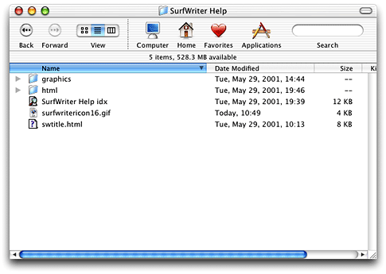

The three files at the top level of the SurfWriter Help folder are the index file, the title page, and the book’s icon. The title page is described in the next section, [Creating a Title Page](#apple-f4xwc4dqnrsv64tfmyxwi33df52wszbpkridimbqga3dknrtfvbuqmrqgywugskijjcucrkg). [Specifying a Help Book Icon](#apple-f4xwc4dqnrsv64tfmyxwi33df52wszbpkridimbqga3dknrtfvbuqmrqgywugskiireeoq2k) describes how to add an icon to your help book. Index files are discussed in [Indexing Your Help Book](#apple-f4xwc4dqnrsv64tfmyxwi33df52wszbpkridimbqga3dknrtfvbuqmrqgywugskijbdeqqkg).

The title page is your help book’s default page, which appears when the user opens your help book, either by selecting the application help item from the Help menu or by selecting your help book in the Help Center. The title page introduces your help book and serves as the entry point into the rest of your help content. All help books registered with the Help Viewer must have a title page.

There are many ways you can approach designing the title page for your help book. For example, the title page from Mac Help, the system help book, welcomes the reader and offers a number of links to help pages answering common queries to get the reader started.

You can also specify a frameset as the title page, as AppleWorks Help does. AppleWorks Help uses frames to combine an introductory page with a table of contents that allows readers to see what topics are covered by the help book. [Figure 2-3](#apple-f4xwc4dqnrsv64tfmyxwi33df52wszbpkridimbqga3dknrtfvbuqmrqgywugskijffessce) shows the AppleWorks Help title page.

To specify the title page of your help book, include the `AppleTitle` meta tag in the header section of the HTML file you want to use as your book’s default page. This HTML file must reside at the top level of your help book folder, as shown in [Figure 2-5](#apple-f4xwc4dqnrsv64tfmyxwi33df52wszbpkridimbqga3dknrtfvbuqmrqgywugskiineuqssd). Here is how you would use the `AppleTitle` meta tag in the title page for a help book called SurfWriter Help:

`<META NAME="AppleTitle" CONTENT="SurfWriter Help">`

Figure 2-6 shows the title page for SurfWriter Help.

__Figure 2-6__  The SurfWriter Help title page

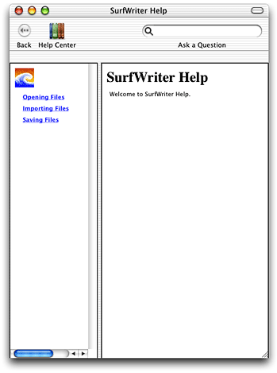

For a good example of a basic title page, see the template file `TOCTemplate.htm` installed by the Mac OS X Developer Tools CD in the directory `Developer/Documentation/AppleHelp/Templates/`.

When you register a help book, your help book becomes visible in the Help Center. If you provide an icon, Help Viewer displays this icon in the Help Center drawer, next to the title of your help book. Adding an icon to your help book makes it easier for users to associate your book with your application.

To specify an icon for your help book, use the `AppleIcon` meta tag in the header sec tion of your title page file. Here is how you would specify an icon file called `surfwritericon16.png` for SurfWriter Help.

```
<META NAME="AppleIcon" CONTENT="SurfWriter%20Help/surfwritericon16.png">
```

Figure 2-7 shows SurfWriter Help in the Help Center, with the SurfWriter icon next to the book title.

__Figure 2-7__  The SurfWriter help book in the Help Center

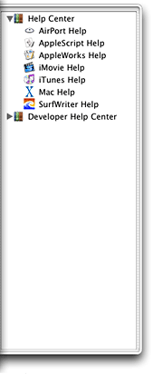

In the example help book folder shown in [Figure 2-5](#apple-f4xwc4dqnrsv64tfmyxwi33df52wszbpkridimbqga3dknrtfvbuqmrqgywugskiineuqssd), the icon file is placed at the top level of the SurfWriter Help folder, but you can place the icon file in a graphics subfolder and specify the path accordingly. The icon should be a 16-by-16 pixel version of your application icon, saved as a .PNG file.

If your application uses optional components such as plug-ins or expansion packs, you may find it useful to organize your help book into chapters. Chapters are subfolders within a help book. The advantage of creating a chapter-based help book is that you can choose to install only those chapters that support components the user has installed. If the user later adds or removes components, you can install or remove individual chapter folders as required.

Each chapter has its own title page and may contain its own index and subfolders. For example, SurfWriter features several optional components, so the help book is organized into a main folder and a subfolder for each component. `[“SurfWriter help book with main folder installed”](#apple-f4xwc4dqnrsv64tfmyxwi33df52wszbpkridimbqga3dknrtfvbuqmrqgywugscejfbugscd)` shows the SurfWriter help book with only the main folder installed.

__Figure 2-8__  SurfWriter help book with main folder installed

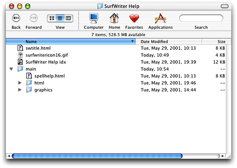

`[“SurfWriter help book with optional chapter installed”](#apple-f4xwc4dqnrsv64tfmyxwi33df52wszbpkridimbqga3dknrtfvbuqmrqgywugsceirfeorsg)` shows the SurfWriter help book after the user installs the optional spelling checker. Note that each subfolder has its own title page.

__Figure 2-9__  SurfWriter help book with optional chapter installed

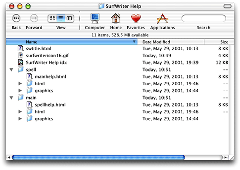

In addition, you should provide a separate table of contents for each chapter. This makes your help book truly modular, allowing chapters to be easily added and removed. You can use this chapter-level table of contents as your chapter title page.

If you have a chapter-based help book, you can create a dynamic table of contents for it. With a dynamic table of contents, you can install and remove chapters, and the top-level table of contents for your help book will always reflect the latest contents of the help book currently on the user’s system.

To create a dynamic table of contents, each chapter in your help book must have a title page containing the `AppleTitle` meta tag. At the top level of your help book, include a template file for the table of contents. In this template file, specify the format of the table, using HTML comments containing the strings `AppleTOCRowBegin` and `AppleTOCRowEnd`. For example, the following lines specify the format of a table row in the dynamically generated table of contents for SurfWriter Help:

```
<!-- AppleTOCRowBegin -->
<TR HEIGHT=”1”>
    <TD HEIGHT=”1” WIDTH=”158”></TD>
</TR>
<TR>
    <TD WIDTH=”158”><FONT FACE=”Helvetica,Arial” SIZE=”2”>
    <A HREF=”AppleURL” TARGET=”AppleTarget”><B>AppleTitle</B></A></FONT>
    </TD>
</TR>
<!-- AppleTOCRowEnd -->
```

The `AppleTOCRowBegin` and `AppleTOCRowEnd` HTML comments mark the beginning and end of the definition of a table row in the dynamically generated table of contents. Help Viewer locates the title page of each chapter in the book and, using the table row definition in your template file, inserts a row in the table of contents linking to that page. Help Viewer uses the chapter title, defined by the `AppleTitle` meta tag in the chapter title page, as the text of the link. Any content that appears before the `AppleTOCRowBegin` command in the template file is copied over to the dynamically generated table of contents without change. Figure 2-10 shows the dynamically generated table of contents for SurfWriter Help in the left frame.

__Figure 2-10__  The generated table of contents for SurfWriter Help

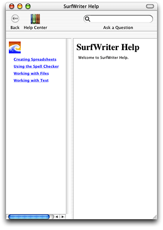

You can use the generated table of contents as your help book’s title page by including the `AppleTitle` tag at the top of your template file, above the `AppleTOCRow` commands. You should also include any other relevant title page information, such as your help book icon. If you specify a frameset for your top-level title page, you can include the generated table of contents by linking to the `toc.htm` file. The frameset for the title page for SurfWriter Help, shown in [Figure 2-10](#apple-f4xwc4dqnrsv64tfmyxwi33df52wszbpkridimbqga3dknrtfvbuqmrqgywugskiijcecrsk), incorporates the dynamically generated table of contents in this way.

For more examples of dynamically generated tables of content, see `/Developer/Documentation/Apple Help/Sample Books`.

You can control the ordering of the chapters in your help book’s table of contents by using the `AppleOrder` meta tag in the header of each chapter’s title page file. For example:

```
<META NAME="AppleOrder" CONTENT="80">
```

When the Help Viewer creates a dynamic table of contents for your help book, it lists each chapter in the order specified by the `AppleOrder` vaues, lowest to highest. Chapters with no `AppleOrder` value are listed last. If you do not specify chapter ordering, Help Viewer displays all chapter titles in alphabetical order. For example, given a help book with three chapters titled "About SurfWriter," "Using SurfWriter," and "SurfWriter Reference," the default chapter ordering is as follows:

1. About SurfWriter
2. SurfWriter Reference
3. Using SurfWriter

Using the `AppleOrder` tag, the chapter ordering for the same book can be changed. Given an `AppleOrder` value of 10 for "About SurfWriter," 20 for "Using SurfWriter," and 30 for "SurfWriter Reference," Help Viewer orders the table of contents as follows:

1. About SurfWriter
2. Using SurfWriter
3. SurfWriter Reference

If you specify the same `AppleOrder` value for more than one chapter, Help Viewer sorts those chapters alphabetically.

To help users quickly find the information they need to accomplish their tasks, you should make your help book searchable. To make your help book searchable, you must run the Apple Help Indexing Tool to create an index for your help book. The indexing tool is described in [Using the Apple Help Indexing Tool](#apple-f4xwc4dqnrsv64tfmyxwi33df52wszbpkridimbqga3dknrtfvbuqmrqgywugskii5ausskb).

You should also include additional tags and meta information in your HTML help files to control how your help is indexed. Including this information improves the user experience of searching your help book by increasing the relevance of the results returned for searches of your help book and improving their appearance in Help Viewer. [Controlling Indexing of Your Help](#apple-f4xwc4dqnrsv64tfmyxwi33df52wszbpkridimbqga3dknrtfvbuqmrqgywugskijjeusqsk) describes how you can improve indexing and searching of your help book.

There are a number of tags that you can include in your HTML pages to control how your help content is indexed by the Apple Help Indexing Tool. In addition to indexing the text of your help topics, this tool indexes the following items:

- _Keywords_. Keywords allow you to specify synonyms or common misspellings for a help topic, ensuring that users who search on these alternate terms still get a hit on the relevant topic.
- _Abstracts_. An abstract is a brief summary of a help topic that is displayed when the user previews the topic in a list of search results. Users can determine whether they wish to learn more about the topic without actually loading the topic page.
- _Anchors_. Anchors allow you to uniquely identify a topic or section within a page. Anchors help you provide quick access to help content; you can specify an anchor as the destination of a link or use the Apple Help API to search for and display the content identified by an anchor.
- _Segments_. Segments divide a single HTML file into subsections, each of which can be indexed and returned as a separate hit in a search. Segments are particularly useful in large help systems.

Finally, you can specify which content in your help book should be indexed, as described in [Specifying What Is Indexed](#apple-f4xwc4dqnrsv64tfmyxwi33df52wszbpkridimbqga3dknrtfvbuqmrqgywugskiineugr2j). By using these various elements in your help book, you can greatly improve the search results for your help book and make your help book more easily accessible from your application.

Keywords are a set of additional search terms for an HTML help page. When a user searches your help book for a term that is designated as a keyword for a topic page, Help Viewer returns that page as a search result, even though the term may not appear in the body of the page. Using keywords, you can specify a set of synonyms and common misspellings for topics covered in your help book.

You can specify keywords for a help page using the `KEYWORDS` meta tag in the header of the help page’s HTML file. The following example shows keywords that you could set for a help page that describes how to use the Trash:

```
<HEAD>
<TITLE>Importing Files</TITLE>
<META NAME="KEYWORDS" CONTENT="discard, dispose, erase, scrap">
</HEAD>
```


An abstract is a brief description of a help topic that appears in the bottom frame of the Help Viewer window when the user selects that topic from a list of search results.

Well-written abstracts help users ascertain whether a given page, returned as a search result, in fact contains the information they were searching for. For example, SurfWriter Help contains a page describing how to import files from other formats. The page’s title, “Importing Files,” gives the user some idea of the page’s contents, but you can provide a fuller description by using an abstract phrase such as, “How to read files created by other applications.”

To add an abstract to a help page, use the `DESCRIPTION` meta tag in the header section of the page’s HTML file. Here is an example of how to create such an abstract:

```
<HEAD><TITLE>Importing Files</TITLE>
<META NAME="DESCRIPTION" CONTENT="How to read files created by other applications">
</HEAD>
```

`[“Example of a search result showing an abstract”](#apple-f4xwc4dqnrsv64tfmyxwi33df52wszbpkridimbqga3dknrtfvbuqmrqgywugskijfeekscf)` shows how such a page shows up as a search result.

__Figure 2-11__  Example of a search result showing an abstract

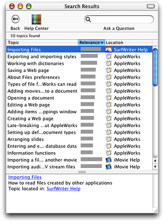

Anchors allow you to uniquely identify topics in your help book. When a user follows a link to an anchor, Help Viewer loads the page containing the anchor and scrolls to its location (if it is not at the top of the page). For example, assume that SurfWriter has a simple scripting language called SurfScript. In the help pages for SurfScript, you could specify a unique anchor for each SurfScript command. This allows Help Viewer to scroll directly to the desired text when the page loads.

You can also use anchors to load an anchored page from within your application by calling the Apple Help function `AHLookupAnchor`. To continue the example, SurfWriter could provide an online lookup function that loads the help page for a SurfScript command by calling the `AHLookupAnchor` function and passing the appropriate anchor name when a user Option-clicks a command name in a SurfScript document.

If you need to access your help content programmatically—as you would, for example, if you provide contextually sensitive help—you should consider using anchors to make your help easily accessible from your application. Because you can change the location of anchors within your help book without affecting your product’s code, anchors provide a simple and maintainable way for your application to access specific topics within your help book.

You can create multiple anchors in a single file. This is especially useful if you split a file into segments, described in the next section.

You specify an anchor using the standard HTML 3.2 anchor element, as shown in the following example, which creates an anchor called `SurfScriptCommand_OPEN` in a help page describing SurfScript’s `OPEN` command:

```
<A NAME="SurfScriptCommand_OPEN"></A>
<!--Here is the description of SurfScript’s OPEN command-->
```

If you use anchors in your help book, you must turn anchor indexing on when you index your help book with the Apple Help Indexing Tool. For more information, see [Specifying Anchor Indexing](#apple-f4xwc4dqnrsv64tfmyxwi33df52wszbpkridimbqga3dknrtfvbuqmrqgywuerkkjbeumskd).

A large help book may contain hundreds of individual pages. If you need to reduce the number of files in your help book, you can combine several pages into one through the use of subsections called segments. Help Viewer treats segments much like separate files; each segment in a file can have a different abstract, anchor, and keyword set. The following example shows how SurfWriter Help defines a segment and specifies its abstract and keywords:

```
<!-- AppleSegStart="Opening a File" -->
<!-- AppleSegDescription="How to open a SurfWriter file" -->
<!-- AppleKeywords="launch, read, look , examine" -->
<!-- Topic text goes here-->
<!-- AppleSegEnd -->
```

The beginning of the segment is marked by the `AppleSegStart` command. If the segment has an abstract or keywords, they are specified using the `AppleSegDescription` and `AppleSegKeywords` commands, respectively.The content of the segment follows. The `AppleSegEnd` command marks the end of the segment.

By default, each file in your help book is fully indexed. You can use the `ROBOTS` meta tag in the HTML header of a particular file to control how that file is indexed. The `ROBOTS` meta tag supports the values shown in Table 2-1.

__Table 2-1__  Values of the `ROBOTS` meta tag

| Value | Meaning |
| `NOINDEX` | Specifies that the HTML file should not be indexed. |
| `KEYWORDS` | Specifies that the HTML file should be indexed for keywords only. |
| `SEGMENTS` | Specifies that the HTML file should be indexed for the content of the segments in that file. |
| `ANCHORS` | Specifes that the HTML file should be indexed for anchors only. |

Apple recommends that you do not index files that contain only links or graphics. To specify that a file should not be indexed, use the `ROBOTS` meta tag with the value `NOINDEX` as shown in the following example:

```
<META NAME="ROBOTS" CONTENT="NOINDEX">
```

Specifying `KEYWORDS` as the value of the `ROBOTS` meta tag may be useful if you have a keyword file that is separate from its associated topic pages, for example. If you define segments in a file, as described in `[“Creating Segments in Help Pages”](#apple-f4xwc4dqnrsv64tfmyxwi33df52wszbpkridimbqga3dknrtfvbuqmrqgywugsceirbeoqkb)`, you can supply a value of `SEGMENTS` in the file’s header to specify that only the content of the segments is indexed. The `ANCHORS` value is useful for pages which you want to be able to retrieve using anchor lookup, but which are not useful as search results, such as your main entry page.

Once you have finished adding abstracts, keywords, and any other indexing information to your help book files, you must run the Apple Help Indexing Tool on your help book. The Apple Help Indexing Tool creates an index for your help content and stores it as a separate file at the top level of the help book folder. The index file may be invalidated if you change or rearrange the content of the help folder, so you should wait to create the index file until the help book content is complete and all files are in their final location.

You can create an index for your help book simply by dragging the folder containing the help book onto the Apple Help Indexing Tool. However, you must modify the default preference settings of the Apple Help Indexing Tool if you are doing any of the following:

1. Indexing a help book for a language other than English. Read [Localizing Your Help Book](#apple-f4xwc4dqnrsv64tfmyxwi33df52wszbpkridimbqga3dknrtfvbuqmrqgywuerkkjfduer2k) for more information on indexing non-English help books.
2. Using anchors.
3. Supplying help content from a remote server.

If you add anchors to your help book, you must index your help book with anchor indexing selected in the Apple Help Indexing Tool’s preferences so that Help Viewer can find your anchors. To turn on anchor indexing, perform the following steps:

1. Open the Apple Help Indexing Tool Preferences dialog, by selecting Preferences from the application menu.
2. Click the check-box labeled “Index anchor information in all files,” which is near the bottom of the dialog shown in Figure 2-12.

__Figure 2-12__  Turning on anchor indexing in the Apple Help Indexing Tool

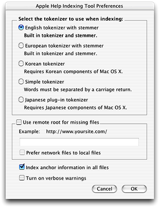

As described in [Internet-Based Help Book Content](Apple%20Help%20Concepts.md#apple-f4xwc4dqnrsv64tfmyxwi33df52wszbpkridimbqga3dknrtfvbuqmrqguwugskiivbuqskc), Help Viewer supports Internet-based help in Mac OS X version 10.1 and later. To provide updates to your help content via the Internet, you must specify a remote server from which to download updated help content before you index your help book. To specify a remote server for your help content you must do the following:

1. Open the Preferences dialog for the Apple Help Indexing Tool.
2. Click the check-box labeled “Use remote root for missing files.”
3. In the text field under this checkbox, enter the server address where your remote help content is available. Figure 2-13 shows a remote root specified in the indexing tool preferences.

   __Figure 2-13__  Specifying a remote server in the Apple Help Indexing Tool

   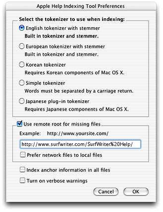

By default, Help Viewer downloads only content that is missing from your locally installed help book folder. However, in Mac OS X version 10.2 and later, you can specify “Internet-primary” help by clicking the check-box labeled “Prefer network files to local files” in the Apple Help Indexing Tool preferences. When you choose Internet-primary help, Help Viewer checks the server specified in your index file for help content, regardless of the content currently installed on the local system.

When the user loads a page from your help book, Help Viewer looks for the page in your local help folder. If the page is not found in the help folder, or if you have specified Internet-primary help, Help Viewer contacts the server specified in the index and obtains the page. Help Viewer caches remotely accessed pages on the user’s system.

Beginning with Mac OS X version 10.2, Help Viewer can also download updated index files from a remote server. When Help Viewer launches, it looks in your help book’s index file for a remote root. If you have specified a remote root, Help Viewer contacts the server and checks for an index file at that location. If an index file is present, Help Viewer downloads the file. Help Viewer also purges the cache of any HTML or graphics files downloaded using the remote root from the previous index file; this ensures that users see only content relevant to the latest and most up-to-date index file.

In Mac OS X version 10.2 and later, you can control how your long help pages are cached, using the two meta tags shown below:

```
<META HTTP-EQUIV="Expires" CONTENT="Tue, 01 Jan 1980 1:00:00 GMT">
<META HTTP-EQUIV="Pragma" CONTENT="no-cache">
```

The first example sets a specific expiration date for the cached page. A 24-hour clock is used, and the time zone is included when specifying a particular expiration date. If you are using specific cache expiration dates for your help pages in conjunction with index files updated over the Internet, the relevant portion of Help Viewer’s cache can be flushed completely whenever a new index file is downloaded, making your cache expiration dates irrelevant. The second example tells Help Viewer that the file should never expire.

The Apple Help Indexing Tool is scriptable, allowing you to automate the indexing process with AppleScript. For example, the following script defines a droplet.

```
on open these_items
tell application "Finder"
    activate// 1
    set folderAlias to these_items as alias// 2
end tell

tell application "Apple Help Indexing Tool"
    activate// 3
    turn remote root "on" with root url "http://www.mycompany.com/myhelp/"// 4
    use tokenizer "English"// 5
    turn anchor indexing "on"// 6
    open folderAlias// 7
end tell
end open
```

When you drag your help book folder to the droplet, the Finder sends an Open command to the droplet, invoking the script. The identity of the help book folder is passed to the script in the `these_items` parameter. Here is what the script does:

1. Activates the Finder application.
2. Tells the Finder to create an alias, stored in the `folderAlias` variable, to the help book folder.
3. Activates the Apple Help Indexing Tool.
4. Specifies a remote server for help content.
5. Sets the tokenizer to use while indexing.
6. Turns on anchor indexing.
7. Runs the indexing tool on the help book folder.

See the Apple Help Indexing Tool’s AppleScript dictionary for more information on the AppleScript commands supported by the indexing tool. You can view the indexing tool’s AppleScript dictionary by selecting Open Dictionary from the File menu in the Script Editor application. Double-click the name of the Apple Help Indexing Tool in the dialog that appears.

For more information on AppleScript and scripting, see the AppleScript documentation in the ADC Reference Library.

You can enrich the user experience of your help book by including additional resources such as animated tutorials, scripted tasks, and other multimedia content supported by Help Viewer. This section shows you how to

- embed QuickTime movies in your help book
- automate tasks using AppleScript scripts in your help book
- initiate Help Viewer searches from a link in your help book
- link to anchors in your help book

You can use QuickTime to create animated tutorials or demos for your help book. To link to a QuickTime movie, use the standard HTML `EMBED` tag. The following example shows how to call a movie file called `SurfScriptDemo.mov` located in the movies subfolder of the SurfWriter Help folder:

```
<EMBED SRC="SurfWriter%20Help/movies/SurfScriptDemo.mov">
```

Use only legal URL characters to specify the URL for the path; for example, the folder name “SurfWriter Help” is specified as `SurfWriter%20Help`.

You can launch other applications, such as media players or custom help applications, from your help book by using the standard HTML anchor element. Here is an example of how you would specify a link that opens an application called SurfScriptPlayer located in the SurfWriter Help folder:

```
<A HREF="SurfWriter%20Help/SurfScriptPlayer">
```

Use only legal URL characters to specify the URL for the path; for example, the folder name “SurfWriter Help” is specified as `SurfWriter%20Help`.

The URLs using the Help Viewer `help:` protocol, introduced in [Help-Specific Meta Tags](Apple%20Help%20Concepts.md#apple-f4xwc4dqnrsv64tfmyxwi33df52wszbpkridimbqga3dknrtfvbuqmrqguwueqkci5bekskj), allow you to create links to other help content in your help book, including

- AppleScript scripts
- Help Viewer searches
- anchor locations

You can take advantage of AppleScript’s ability to automate Mac OS events by linking to scripts in your help book. For example, Figure 2-14 shows a page from Mac Help that uses an AppleScript script to open the International preferences pane in System Preferences when the user clicks the link at the bottom of the page.

__Figure 2-14__  A link to an AppleScript script in a help page

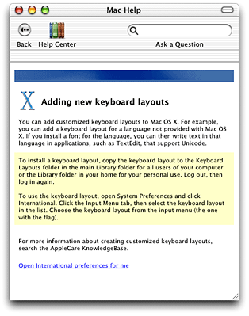

The syntax for calling a script is as follows:

```
<A HREF="help:runscript=help_folder_name/subfolder/scriptnamestring='optional_string_parameter'">
```

The optional `string` parameter is a string value that you can pass to the script. The script is responsible for parsing the value passed in the `string` parameter. If the script accepts multiple parameters, use commas to separate the values. The following example shows how to specify a script called “MakeNewSaveFolder” in the scripts subfolder of the SurfWriter Help folder and pass it a folder name value in the `string` parameter:

```
<A HREF="help:runscript=SurfWriter%20Help/scripts/MakeNewSaveFolderstring='My Save Folder'">
```

Make sure that you enclose the entire tag value in double quotes. You can enclose arguments to help URLs in single quotes, as the string values is shown in the previous example, or you can use standard URL encoding; for example, the folder name “SurfWriter Help” is specified as `SurfWriter%20Help`. For more information on standard URL encoding, see

[http://www.w3.org/Addressing/](http://www.w3.org/Addressing/)

The `help:search` URL allows you to create a link in your help book that, when clicked by the user, initiates a search for a particular term or phrase. This is particularly useful for linking to further information about subjects that appear in multiple help pages. Rather than link to each topic page, you can simply set up a search that will find all pages in your help book in which the subject appears. The syntax for initiating a Help Viewer search is as follows:

```
<A HREF="help:search='search_term' bookID=help_book_name">
```

The `bookID` parameter is a string value specifying which help book Help Viewer should search. If you do not specify a book, Help Viewer searches all help books currently installed on the system. Your book must be indexed for the search to return results.

The following example creates a link to a search for topics related to importing files in the SurfWriter help book:

```
<A HREF="help:search='How do I import files?' bookID=SurfWriter%20Help">
```

When the user clicks the resulting link, Help Viewer searches SurfWriter Help for all topics pertaining to importing files, just as if the user had typed the query "How do I import files?" into Help Viewer’s search field.

Using the `help:anchor` URL, you can create a link to any help book location identified by an anchor. It is often simpler to create links using anchors than to hardcode the path to the destination in the link. The syntax for linking to an anchor location is as follows:

```
<A HREF="help:anchor=anchor_name bookID=help_book_name">
```

The `bookID` parameter is a string value identifying the help book in which Help Viewer should search for the anchor. If no help book is specified, Help Viewer searches all of the registered help books currently on the system. The following example creates a link to the topic on opening files in SurfWriter Help:

```
<A HREF="help:anchor=openfile bookID=SurfWriter%20Help">
```

When the user clicks the link, Help Viewer takes the user to the location identified by the anchor named “openfile.” If more than one anchor is found matching the anchor name, Help Viewer displays all of the matching anchor locations in a search results page. To link to anchor locations in your help book, you must index your help book with anchor indexing turned on, as described in [Specifying Anchor Indexing](#apple-f4xwc4dqnrsv64tfmyxwi33df52wszbpkridimbqga3dknrtfvbuqmrqgywuerkkjbeumskd).

If your application will be used in more than one part of the world, your help book should be localized for every relevant language, country, or cultural region where it will be used. Localizing your help book involves translating the text of your help content and customizing graphics and other resources used in your help book. This section shows you how you can ensure that your localized help content appears correctly in Help Viewer.

For more information on internationalization and HTML, see

[http://www.w3.org/International/](http://www.w3.org/International/)

To specify the character encoding used by your help book, use the standard HTML 3.2 syntax, as shown in the example below, which specifies the Latin-1 character encoding:

```
<META HTTP-EQUIV="content-type" CONTENT="text/html;charset=iso-8859-1">
```

In versions of Mac OS prior to 10.1, Help Viewer does not respect the character set tag when rendering HTML. Furthermore, prior to Mac OS X v10.1, Help Viewer supports only a limited number of character encodings. In particular, Help Viewer supports the MacRoman, MacJapanese, MacKorean, MacChineseTrad, and MacChineseSimp encodings.

If you have a localized help book that uses a non-Roman font, you can specify which font Help Viewer uses for your help book title when it displays your help book in the Help Center, as well as the font used by Help Viewer to display search results from your help book.

To specify a font for your book’s Help Center listing, use the `AppleFont` property for the `<META>` element in your help book title page. For example, here is how you would specify the Osaka font for your Help Center listing:

```
<META NAME="AppleFont" CONTENT="Osaka">
```

If you need to specify a non-Roman font in which to display search results for your help book, you can use the `AppleSearchResultsFont` property in the header of your title page file. Here is an example of how to specify the Osaka font to display search results:

```
<META NAME="AppleSearchResultsFont" CONTENT="Osaka">
```


Once you have created your localized help book, you must run the Apple Help Indexing Tool on the book. To index a non-US English help book, open the Preferences dialog in the Apple Help Indexing Tool by choosing Preferences from the application menu. From the radio button group labeled “Select the tokenizer to use when indexing,” choose the appropriate setting for your target language. Figure 2-15 shows the Preferences dialog of the Apple Help Indexing Tool.

__Figure 2-15__  The Preferences dialog of the Apple Help Indexing Tool

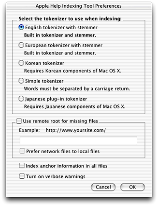

Apple Help Indexing Tool 1.3 supports U.S. English, Western European English, Japanese, Korean, and Chinese language indexing. To use Chinese language indexing, choose the Simple Tokenizer option in the Apple Help Indexing Tool Preferences; this tokenizer supports both the Traditional and Simplified character sets.

[Next](Registering%20Your%20Help%20Book.md)[Previous](Apple%20Help%20Concepts.md)

