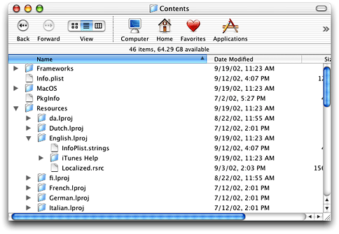
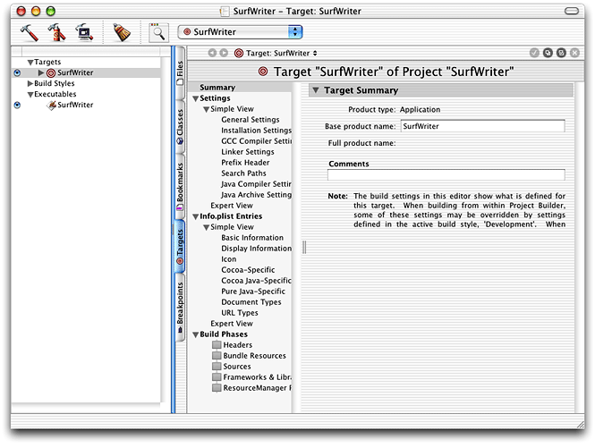
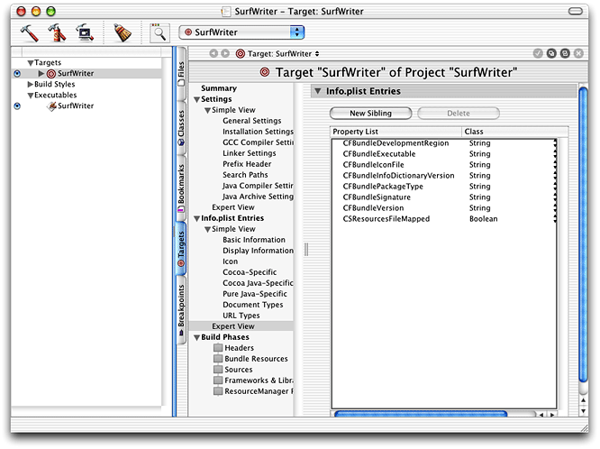
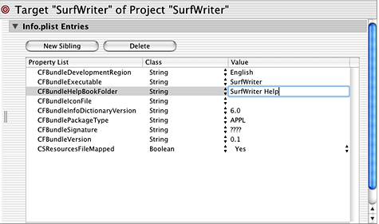

> 导航：[总目录](../../../README.md) · [documentation](../../../_indexes/documentation.md) · [Providing User Assistance With Apple Help](Introduction%20to%20Providing%20User%20Assistance%20With%20Apple%20Help.md)


[Next](Opening%20Your%20Help%20Book%20in%20Help%20Viewer.md)[Previous](Authoring%20User%20Help.md)

# Registering Your Help Book

This chapter describes how to register your completed help book so that users—and your application—can access it. When you register your help book, it becomes available in the Help Center and from the Help menu. All developers creating help books for the Mac should read this section to learn how to add their help books to their software products.

Help books, like other resources that are language or region-specific, are kept in localized resource directories, named for their language or region and identified by the `.lproj` extension. These localized resource directories are placed in the `Resources` directory of your software bundle.

For example, if your application is localized for English, French, and Japanese audiences, your application bundle should contain a localized resource directory for each language. You should place a help book folder with your application’s help content, localized for the target region, in each directory.

Figure 3-1 shows the contents of an application bundle. The folder containing the English-language version of the application help book is located in the `English.lproj` subdirectory of the `Resources` directory. For more information on localization of resources, naming conventions for `.lproj` directories, and bundle structure, see _[Bundle Programming Guide](../../Core%20Foundation/Bundle%20Programming%20Guide/Introduction.md#apple-f4xwc4dqnrsv64tfmyxwi33df52wszbpgeydambqgezdg2i)_.

__Figure 3-1__  The location of an English-language help book in the application bundle.



Apple strongly recommends that you place your help book in your software bundle. When your help book is bundled with your software, it is installed and moved along with your application. You can also place your help book at one of the standard locations for third-party help, `/Library/Documentation/Help` or `Library/Documentation/Help` in the user’s home directory. If you place your help at one of these locations, you do not need to register your help book.

You must register your help book to get the automatic help book support provided by the system. When you register your help book, the system creates a Help menu for your application, populates it with an application help item, and opens your help book when a user selects this item. In addition, your help book must be registered for it to appear in the Help Center.

For Cocoa and Java applications, you can take advantage of automatic help book registration by adding the help book name and location to your information property list (`Info.plist`) file. For Carbon applications, you must take the additional step of calling the Apple Help registration function, `AHRegisterHelpBook`.

Cocoa and Java applications that use the Apple Help API to access their help book content must also call the `AHRegisterHelpBook` function before making any calls to other Apple Help functions.

To register a help book, you need to include the `CFBundleHelpBookFolder` and `CFBundleHelpBookName` keys in your `Info.plist` file. The `CFBundleHelpBookFolder` key identifies the help book folder; the value associated with this key should be a string, specifying the folder name. For example, here is how you would enter the name of the SurfWriter help book folder:

```
<key>CFBundleHelpBookFolder</key>
<string>SurfWriter Help</string>
```

The `CFBundleHelpBookName` key identifies the help book. The value associated with this key should be a string specifying the help book title, as defined by the `AppleTitle` tag in the title page of the book. For example, here is how you would enter the title of the SurfWriter Help book:

```
<key>CFBundleHelpBookName</key>
<string>SurfWriter Help</string>
```

If you are using Project Builder to develop your software product, you can add these keys to your `Info.plist` file with the following steps:

1. From the main project window, click on the Targets tab. In the left column, your project’s targets appear.
2. Select the target for which you want to edit the `Info.plist` file. You should see a window such as that shown in Figure 3-2.

   __Figure 3-2__  The targets view in Project Builder

   
3. Under Info.plist Entries, select the Expert View item. You should see a pane similar to that shown in Figure 3-3.

   __Figure 3-3__  The Expert settings in the Targets pane of Project Builder

   
4. Click the New Sibling button to create a new key-value pair. Type `CFBundleHelpBookFolder` for the new item’s key.
5. Double-click in the Value column to edit the value associated with the key. Type the name of the folder containing your application’s main help book. For example, Figure 3-4 shows entry for the SurfWriter application’ s help book folder.

   __Figure 3-4__  The `CFBundleHelpBookFolder` key-value pair added to the `Info.plist` file in Project Builder

   
6. Click the New Sibling button to create another key-value pair. Type `CFBundleHelpBookName` for the key. Enter the name of your main help book, as it appears in the title page.

If you have more than one help book, you can set the value of each of the `CFBundleHelpBookName` and `CFBundleHelpBookFolder` keys to an array of strings. However, if you use an array for the value of these two keys, you do not get automatic support for your application help item in the Help menu.

Note that your `Info.plist` file must also contain a valid `CFBundleIdentifier` entry. For more information on application packaging and property lists, see _[Bundle Programming Guide](../../Core%20Foundation/Bundle%20Programming%20Guide/Introduction.md#apple-f4xwc4dqnrsv64tfmyxwi33df52wszbpgeydambqgezdg2i)_.

Carbon applications and Cocoa or Java applications that call Apple Help functions must first call the Apple Help function `AHRegisterHelpBook` to register their help book. You would typically do this during application initialization. Once your application has called `AHRegisterHelpBook`, your help content is accessible through the use of the Apple Help functions.

Listing 3-1 shows an example of how to register a help book using `AHRegisterHelpBook`.

__Listing 3-1__  Registering a help book with `AHRegisterHelpBook`

```
OSStatus RegisterMyHelpBook(void)
{
    CFBundleRef myApplicationBundle;
    CFURLRef myBundleURL;
    FSRef myBundleRef;
    OSStatus err = noErr;

    myApplicationBundle = NULL;
    myBundleURL = NULL;

    myApplicationBundle = CFBundleGetMainBundle();// 1
    if (myApplicationBundle == NULL) {err = fnfErr; goto bail;}

    myBundleURL = CFBundleCopyBundleURL(myApplicationBundle);// 2
    if (myBundleURL == NULL) {err = fnfErr; goto bail;}

    if (!CFURLGetFSRef(myBundleURL, &myBundleRef)) err = fnfErr;// 3

    if (err == noErr) err = AHRegisterHelpBook(&myBundleRef);// 4
    return err;

}
```

Here is what the code in Listing 3-1 does:

1. Calls the Core Foundation function `CFBundleGetMainBundle` to retrieve a reference to the application’s main bundle.
2. Calls the Core Foundation function `CFBundleCopyBundleURL` to get the path to the application bundle.
3. Calls the Core Foundation function `CFURLGetFSRef` to convert the path obtained in Step 2 into a file system reference (an `FSRef` structure).
4. Calls `AHRegisterHelpBook`, passing the file system reference obtained in the last step. Apple Help finds the help book located in the bundle and caches the name and location of the help book. Apple Help chooses which localized version of the help book to use based upon the current language of the system.

[Next](Opening%20Your%20Help%20Book%20in%20Help%20Viewer.md)[Previous](Authoring%20User%20Help.md)

