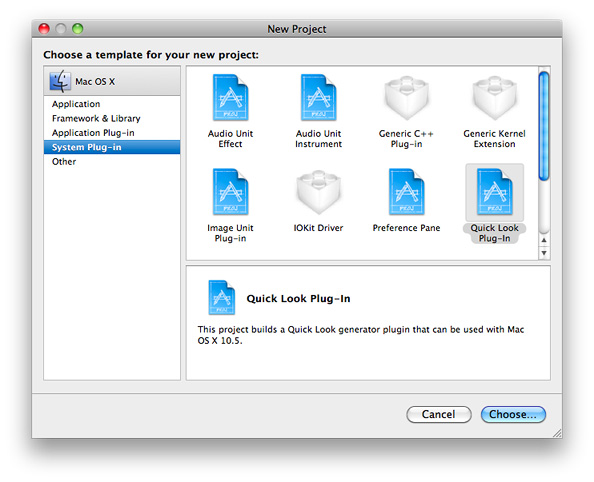
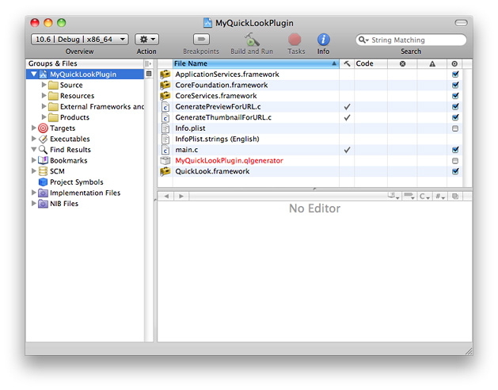

> 导航：[总目录](../../../README.md) · [documentation](../../../_indexes/documentation.md) · [Quick Look Programming Guide](Introduction%20to%20Quick%20Look%20Programming%20Guide.md)


[Next](Overview%20of%20Generator%20Implementation.md)[Previous](Quick%20Look%20Architecture.md)

# Creating and Configuring a Quick Look Project

Xcode projects for Quick Look generators originate from a special template that sets up important aspects of the project. However, you still must specify generator-specific configuration information and add any resources for the generator, typically before you write any code.

To create a Quick Look generator project, start by choosing New Project from the File menu in the Xcode application. In the project-creation assistant, select Quick Look Plug-In in the list of project templates (as shown in Figure 3-1) and click Next.

__Figure 3-1__  Choosing the Quick Look plug-in template



After you specify a name and location for the project, Xcode displays a project window similar to the example in Figure 3-2.

__Figure 3-2__  Default items in a Quick Look plug-in project



The following items in this window have some special relevance to Quick Look:

- `QuickLook.framework`—The Quick Look framework, which includes both consumer and producer parts of the architecture.

  If you want additional frameworks, add them to the project and insert the appropriate `#include` or `#import` directives. For example, if you want to write code using Cocoa API, add `Cocoa.framework` to the project.
- `main.c` — This file contains all of the code required for a `CFPlugin`-based plug-in. You should not have to add or modify any of this code.
- `GeneratePreviewForURL.c` and `GenerateThumbnailForURL.c` — The first file contains code templates for the callbacks `GeneratePreviewForURL` and `CancelPreviewGeneration`; the second file contains code templates for the callbacks `GenerateThumbnailForURL` and `CancelThumbnailGeneration`.

  If your implementation code is going to be Objective-C, be sure to change the extensions of these files from `c` to `m` _in_ Xcode (that is, by selecting the file and choosing Rename from the File menu).

Although a Quick Look generator does not (and should not) have nib files as resources, you can add other resources if necessary.

Quick Look generators must be 64-bit binaries, or universal binaries if necessary to support older systems.

The information property list (`Info.plist`) of a Quick Look generator project includes some special properties whose values you should set in addition to standard properties such as `CFBundleIdentifier` and `CFBundleVersion`. The following sections describe these properties.

One important property for Quick Look generators is `LSItemContentTypes`, a subproperty of `CFBundleDocumentTypes`. Listing 3-1 shows the `CFBundleDocumentTypes` property when unedited. (Note that the Quick Look project template specifies the value (`QLGenerator`) of the `CFBundleTypeRole` property for you.)

__Listing 3-1__  The subproperties of `CFBundleDocumentTypes`

```
    <key>CFBundleDocumentTypes</key>
    <array>
        <dict>
            <key>CFBundleTypeRole</key>
            <string>QLGenerator</string>
            <key>LSItemContentTypes</key>
            <array>
                <string>SUPPORTED_UTI_TYPE</string> // change this!
            </array>
        </dict>
    </array>
```

Replace the string “`SUPPORTED_UTI_TYPE`” with one or more UTI s identifying the content types of the documents for which this generator generates thumbnails and previews. For example, the _[QuickLookSketch](../../../samplecode/QuickLookSketch/QuickLookSketch.md#apple-f4xwc4dqnrsv64tfmyxwi33df52wszbpirkfgmjqgaydimbtge)_ example project specifies the UTIs for Sketch documents:

```
<key>CFBundleDocumentTypes</key>
    <array>
        <dict>
            <key>CFBundleTypeRole</key>
            <string>QLGenerator</string>
            <key>LSItemContentTypes</key>
            <array>
                <string>com.apple.sketch2</string>
                <string>com.apple.sketch1</string>
            </array>
        </dict>
    </array>
```

For more information on Uniform Type Identifiers (UTIs) for document-content types, see _[Uniform Type Identifiers Overview](../../File%20Management/Uniform%20Type%20Identifiers%20Overview/Introduction%20to%20Uniform%20Type%20Identifiers%20Overview.md#apple-f4xwc4dqnrsv64tfmyxwi33df52wszbpkridimbqgaytgmjz)_.

As Listing 3-2 shows, a large segment of the `Info.plist` in a Quick Look generator project are properties related to `CFPlugIn`. You should not have to edit these properties.

__Listing 3-2__  CFPlugIn properties

```
    <key>CFPlugInDynamicRegisterFunction</key>
    <string></string>
    <key>CFPlugInDynamicRegistration</key>
    <string>NO</string>
    <key>CFPlugInFactories</key>
    <dict>
        <key>27EB40F9-21D6-4438-9395-692B52DB53FB</key>
        <string>QuickLookGeneratorPluginFactory</string>
    </dict>
    <key>CFPlugInTypes</key>
    <dict>
        <key>5E2D9680-5022-40FA-B806-43349622E5B9</key>
        <array>
            <string>27EB40F9-21D6-4438-9395-692B52DB53FB</string>
        </array>
    </dict>
    <key>CFPlugInUnloadFunction</key>
    <string></string>
```


You can specify these additional key-value pairs in the information property list (`Info.plist`) of a Quick Look generator:

| Key | Allowed value | Description |
| --- | --- | --- |
| `QLThumbnailMinimumSize` | Real number `<real>`_n_`</real>` | Specifies the minimum use size along one dimension (in points) of thumbnails for the generator. Quick Look does not call the `GenerateThumbnailForURL` callback function for thumbnail sizes less than this value. The default size is 17. If your generator is fast enough, you can remove this property so the thumbnail image can appear in standard lists. |
| `QLPreviewWidth` | Real number `<real>`_n_`</real>` | This number gives Quick Look a hint for the width (in points) of previews. It uses these values if the generator takes too long to produce the preview. |
| `QLPreviewHeight` | Real number `<real>`_n_`</real>` | This number gives Quick Look a hint for the height (in points) of previews. It uses these values if the generator takes too long to produce the preview. |
| `QLSupportsConcurrentRequests` | `YES` or `NO` | Controls whether the generator can handle concurrent thumbnail and preview requests. |
| `QLNeedsToBeRunInMainThread` | `YES` or `NO` | Controls whether the generator can be run in threads other than the main thread |

The properties `QLSupportsConcurrentRequests` and `QLNeedsToBeRunInMainThread` are Quick Look properties that affect the multithreaded characteristics of the generator. They are discussed in [Generators and Thread Safety](Overview%20of%20Generator%20Implementation.md#apple-f4xwc4dqnrsv64tfmyxwi33df52wszbpkridimbqga2tamrqfvbuqnrnknltc).

[Next](Overview%20of%20Generator%20Implementation.md)[Previous](Quick%20Look%20Architecture.md)

