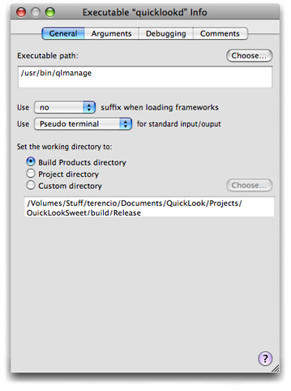
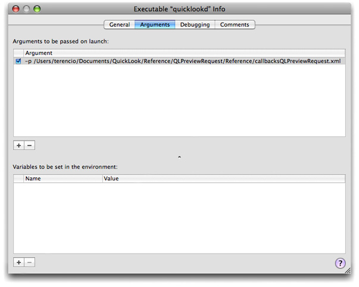

> 导航：[总目录](../../../README.md) · [documentation](../../../_indexes/documentation.md) · [Quick Look Programming Guide](Introduction%20to%20Quick%20Look%20Programming%20Guide.md)


[Next](Document%20Revision%20History.md)[Previous](Canceling%20Previews%20and%20Thumbnails.md)

# Debugging and Testing a Generator

Quick Look gives developers some facilities for debugging and testing their generator code. The following sections describe those facilities and offers some strategies and advice for debugging and testing generators.

Because a generator is a plug-in and is not a self-contained executable, debugging it could be problematic if you were left on your own. Fortunately, Quick Look gives you a way to debug generator code easily: the `qlmanage` diagnostic tool (installed in `/usr/bin`). `qlmanage` executes your project’s generator in almost the same kind of environment as the Quick Look daemon (`quicklookd`) does. You can run this tool as your project’s executable and, by specifying certain arguments, you can step through your generator code and see how it handles previews and thumbnails.

To set up your Quick Look project for debugging, complete the following steps:

1. Choose New Custom Executable from the Project menu.
2. In the Assistant window, enter “qlmanage” as the executable name. In the Executable Path field specify the full path to the tool:

```
/usr/bin/qlmanage
```

   Click Finish to dismiss the Assistant.
3. The Executable Info window appears for `qlmanage`, as shown in Figure 10-1. Click the Arguments tab.

   __Figure 10-1__  Setting `qlmanage` as a custom executable

   
4. In the Arguments pane of the Executable Info window (Figure 10-2) enter one or more debugging options in the Arguments table.

   __Figure 10-2__  Specifying a document for which `qlmanage` requests a preview

   

   The `qlmanage` tool takes the following arguments:

| Flag | Value | Description |
| --- | --- | --- |
| `-p` | Absolute path to document | Requests preview of specified document |
| `-t` | Absolute path to document | Requests thumbnail of specified document. |
| `-r` | None | Resets `quicklookd` and the Quick Look client’s generator cache |
| `-m` | None | Prints information on `quicklookd` actions, including a list of detected generators |
| `-h` | None | Prints a brief description of options |

You can also run the `qlmanage` tool from the command line. The following example requests a thumbnail of a specified document:

```
qlmanage -t /tmp/MySketchDoc.sketch2
```

This example displays a preview for a particular document:

```
qlmanage -p /tmp/MySketchDoc.sketch2
```

The `-m` option for `qlmanage` is useful, as it prints (to standard output) a report from the Quick Look daemon on current generator status.

__Listing 10-1__  Sample output of `qlmanage -m`

```
2007-04-05 17:00:46.998 qlmanage[1190:d03] Server statistics:
server: living for 21s (9 requests handled)
memory used: 10 MB (10551296 bytes)
last burst: during 0s - 1 requests - 0s idle
plugins:
  com.apple.ichat.ichat -> /System/Library/QuickLook/iChat.qlgenerator
  com.apple.safari.bookmark -> /System/Library/Frameworks/QuickLook.framework/Resources/Generators/Bookmark.qlgenerator
  com.apple.sketch1 -> /Library/QuickLook/QuickLookSketch.qlgenerator
  public.rtf -> /System/Library/Frameworks/QuickLook.framework/Resources/Generators/Text.qlgenerator
  public.audio -> /System/Library/Frameworks/QuickLook.framework/Resources/Generators/Audio.qlgenerator
  com.apple.dashboard-widget -> /System/Library/Frameworks/QuickLook.framework/Resources/Generators/StandardBundles.qlgenerator
  com.apple.rtfd -> /System/Library/Frameworks/QuickLook.framework/Resources/Generators/Text.qlgenerator
  com.microsoft.word.doc -> /System/Library/QuickLook/Office.qlgenerator
  com.apple.addressbook.person -> /System/Library/Frameworks/QuickLook.framework/Resources/Generators/Contact.qlgenerator
  public.plain-text -> /System/Library/Frameworks/QuickLook.framework/Resources/Generators/Text.qlgenerator
  com.apple.quartz-composer-composition -> /System/Library/Frameworks/QuickLook.framework/Resources/Generators/Movie.qlgenerator
  public.xml -> /Library/QuickLook/QuickLookSweet.qlgenerator
  com.apple.eventmanager.events -> /Library/QuickLook/WebViewQLPlugin.qlgenerator
  com.apple.sketch2 -> /Library/QuickLook/QuickLookSketch.qlgenerator
  com.apple.package -> /System/Library/Frameworks/QuickLook.framework/Resources/Generators/Package.qlgenerator
  com.apple.ical.bookmark -> /System/Library/Frameworks/QuickLook.framework/Resources/Generators/iCal.qlgenerator
  com.adobe.pdf -> /System/Library/Frameworks/QuickLook.framework/Resources/Generators/PDF.qlgenerator
  public.font -> /System/Library/Frameworks/QuickLook.framework/Resources/Generators/Font.qlgenerator
  com.apple.mail.emlx -> /System/Library/Frameworks/QuickLook.framework/Resources/Generators/Mail.qlgenerator
  com.microsoft.excel.xls -> /System/Library/QuickLook/Office.qlgenerator
  com.apple.eventmanager.eventsbin -> /Library/QuickLook/WebViewQLPlugin.qlgenerator
  com.apple.mail.email -> /System/Library/Frameworks/QuickLook.framework/Resources/Generators/Mail.qlgenerator
  com.apple.ical.ics -> /System/Library/Frameworks/QuickLook.framework/Resources/Generators/iCal.qlgenerator
  com.apple.systempreference.prefpane -> /System/Library/Frameworks/QuickLook.framework/Resources/Generators/StandardBundles.qlgenerator
  com.apple.safari.history -> /System/Library/Frameworks/QuickLook.framework/Resources/Generators/Bookmark.qlgenerator
  public.html -> /System/Library/Frameworks/QuickLook.framework/Resources/Generators/Web.qlgenerator
  com.apple.eventmanager.eventsq -> /Library/QuickLook/WebViewQLPlugin.qlgenerator
  com.apple.addressbook.group -> /System/Library/Frameworks/QuickLook.framework/Resources/Generators/Contact.qlgenerator
  public.movie -> /System/Library/Frameworks/QuickLook.framework/Resources/Generators/Movie.qlgenerator
  com.apple.application -> /System/Library/Frameworks/QuickLook.framework/Resources/Generators/StandardBundles.qlgenerator
  com.apple.ichat.transcript -> /System/Library/QuickLook/iChat.qlgenerator
  com.apple.ical.bookmark.todo -> /System/Library/Frameworks/QuickLook.framework/Resources/Generators/iCal.qlgenerator
  public.vcard -> /System/Library/Frameworks/QuickLook.framework/Resources/Generators/Contact.qlgenerator
generators change detected: NO
```

Once you have set up your Quick Look generator project for debugging, specify breakpoints in your code, change the build configuration to Debug, and choose Build and Debug from the Debug menu.

After your generator seems to be bug-free, you can test it further to determine if anything else needs to be improved. Copy the generator to an application bundle or to one of the standard file-system locations for Quick Look generators. Try out your generator with different client applications (Finder, Spotlight, Time Machine, and so forth). Using `qlmanage` as an executable (see [Debugging Facilities](#apple-f4xwc4dqnrsv64tfmyxwi33df52wszbpkridimbqga2tamrqfvbuqmjufvjvomy)) you can test your generator to see how it handles thumbnails and previews. Force preview- or thumbnail-generation by closing a Finder or Spotlight window and see how well your generator responds.

In addition, check your generator to see how well it performs; if it takes longer than two seconds to generate a preview, then you should closely examine your code to find out where you could improve performance.

As an aid to testing, or even debugging, you can set the `QLEnableLogging` user default at the command line:

```
defaults write -g QLEnableLogging YES
```

After doing this, Quick Look prints log messages showing its activity, such as which generators it loads and which documents it requests previews and thumbnails for. Here is a sample log message:

```
2006-12-15 11:18:16.839 quicklookd[26260:3b03] [QL] Thumbnailing /Users/jalon/Documents/PreviewableDocuments/Test5.sketch2. Content type UTI: com.apple.sketch2. Generator used: <QLGenerator /Library/QuickLook/quicklooksketch.qlgenerator>
```

[Next](Document%20Revision%20History.md)[Previous](Canceling%20Previews%20and%20Thumbnails.md)

