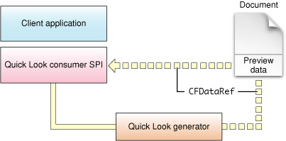

> 导航：[总目录](../../../README.md) · [documentation](../../../_indexes/documentation.md) · [Quick Look Programming Guide](Introduction%20to%20Quick%20Look%20Programming%20Guide.md)

[Next](Drawing%20Thumbnails%20and%20Previews%20In%20a%20Graphics%20Context.md)[Previous](Creating%20and%20Configuring%20a%20Quick%20Look%20Project.md)

# Overview of Generator Implementation

The Quick Look generator API gives you several approaches for implementing generators. This chapter describes what they are and suggests the approach most suitable for applications based on their document types. It also discusses thread safety and multithreading issues related to Quick Look generators.

This chapter summarizes only the generation of thumbnails and previews. See [Canceling Previews and Thumbnails](Canceling%20Previews%20and%20Thumbnails.md#apple-f4xwc4dqnrsv64tfmyxwi33df52wszbpkridimbqga2tamrqfvbuqmjtfvjvomi) for a discussion of how to cancel the generation of thumbnails and previews.

The header file `QLGenerator.h` in the Quick Look framework declares the programmatic interface for Quick Look generators. (Another header file, `QLBase.h`, is also in the `Headers` folder, but this file merely contains definitions of various macros used by both the Quick Look public and private interfaces.) The programmatic interface for generators is divided between thumbnail requests and preview requests, represented by opaque types [QLThumbnailRequestRef](https://developer.apple.com/documentation/quicklook/qlthumbnailrequest) and [QLPreviewRequestRef](https://developer.apple.com/documentation/quicklook/qlpreviewrequest), respectively. The API falls into three distinct categories:

- __Callbacks__

  Generators must implement a callback function typed as `GenerateThumbnailForURL` to create and return a thumbnail representation of a document. They must implement a callback function typed as `GeneratePreviewForURL` to create and return a preview of a document. As noted in [Creating and Configuring a Quick Look Project](Creating%20and%20Configuring%20a%20Quick%20Look%20Project.md#apple-f4xwc4dqnrsv64tfmyxwi33df52wszbpkridimbqga2tamrqfvbuqnjnknltk), the Xcode template for generators makes the default names of the callback functions the same as their type names.

  An additional pair of callback functions can be implemented to cancel the generation of previews and thumbnails that a generator is currently performing. For more information on these callbacks, see [Canceling Previews and Thumbnails](Canceling%20Previews%20and%20Thumbnails.md#apple-f4xwc4dqnrsv64tfmyxwi33df52wszbpkridimbqga2tamrqfvbuqmjtfvjvomi).
- __Functions used in generating thumbnails and previews__

  Quick Look provides a range of functional alternatives for generators to create and return thumbnails and previews. For example, the [QLThumbnailRequestCreateContext](https://developer.apple.com/documentation/quicklook/1402694-qlthumbnailrequestcreatecontext) and [QLPreviewRequestCreateContext](https://developer.apple.com/documentation/quicklook/1402613-qlpreviewrequestcreatecontext) functions provide a graphics context for drawing bitmap and vector-based images in. You use the [QLPreviewRequestSetDataRepresentation](https://developer.apple.com/documentation/quicklook/1402661-qlpreviewrequestsetdatarepresent) function to return an embedded or dynamically generated preview, often for HTML content enriched with attachments. With the [QLThumbnailRequestSetImage](https://developer.apple.com/documentation/quicklook/1402699-qlthumbnailrequestsetimage) function you return a static thumbnail image representing a document.

  [Approaches to Thumbnail and Preview Generation](#apple-f4xwc4dqnrsv64tfmyxwi33df52wszbpkridimbqga2tamrqfvbuqnrnknltg) describes these functions and related functions in greater detail and identifies the situations best suited to their use.
- __Functions that return information about the request or generator__

  The remaining functions in `QLGenerator.h` allow you get the attributes of preview or thumbnail requests or to obtain other data related to them. For example, the [QLThumbnailRequestCopyURL](https://developer.apple.com/documentation/quicklook/1402629-qlthumbnailrequestcopyurl) function returns the URL identifying the document for which a thumbnail is requested. The [QLThumbnailRequestGetGeneratorBundle](https://developer.apple.com/documentation/quicklook/1402686-qlthumbnailrequestgetgeneratorbu) function returns a reference (`CFBundleRef`) to the generator’s bundle. And the [QLPreviewRequestCopyContentUTI](https://developer.apple.com/documentation/quicklook/1402682-qlpreviewrequestcopycontentuti) function returns the UTI identifier of the current document’s content (for example, `com.apple.sketch1`).

An important distinction to keep in mind when programming generators is the difference between options and properties. Both are names of `CFDictionaryRef` parameters in Quick Look functions. But the _options_ parameter in the callback functions `GenerateThumbnailForURL` and `GeneratePreviewForURL` is a dictionary of options, or hints, from the client to the generator for how the request should be handled. The _properties_ parameter is the last parameter in the `QLThumbnailRequest` and `QLPreviewRequest` functions used for creating thumbnails and previews; the `properties` dictionary contains data supplemental to the created thumbnail or preview.

The approach you take toward thumbnail and preview generation, and the Quick Look functions you use, depend on the kind of document your generator is intended for. Ask yourself these questions about the document:

- Is it bundled (as is, for example, a Pages document) or is it non-bundled (or flat)?
- Does it contain graphics or text? Or both graphics and text?
- If graphics, is it a bitmap or vector image?
- Does it have a single page or multiple pages?

Of course, whether the request is for a thumbnail or a preview enters into your choice of approach. If a request is for a thumbnail with a size no larger than a regular document icon, then a thumbnail at that size may be no better than the icon. If the request is for preview of a multipage document, do you show just the first page of the document or all of it? Whether the request is for a thumbnail or a preview, the performance of your generator is of paramount importance. For example, when a client requests thumbnails, it can request them for dozens of different documents; inefficient generators can make the client’s display of thumbnails appear sluggish. If the client requests a preview for a document that is over 200 pages, perhaps you should include only enough of the document for the user to identify it. For your generator you should adopt proper memory-management practices and the appropriate multithreading strategy. For more information about multithreaded generators and thread-safety issues, see [Generators and Thread Safety](#apple-f4xwc4dqnrsv64tfmyxwi33df52wszbpkridimbqga2tamrqfvbuqnrnknltc)

If you want to specify static thumbnail and preview images for a bundled document, you can take the easiest approach—it doesn’t even require a generator. Just have your application place the images inside the document bundle in a subfolder named `QuickLook`; the image file for thumbnails should be named `Thumbnail.`_ext_ and the file for previews should be named `Preview.`_ext_ (where _ext_ is an extension such as `tiff`, `png`, or `jpg`). If you decide on this approach, you should not create a generator.

Programmatically, you can take one of the following approaches for generating your thumbnails and previews, depending on the document and other circumstances:

- If the document is single page containing bitmap graphics, vector graphics, or even text (generally when it is a graphical element of the preview), you can draw the thumbnail or preview in a graphics context returned by, respectively, the [QLThumbnailRequestCreateContext](https://developer.apple.com/documentation/quicklook/1402694-qlthumbnailrequestcreatecontext) or [QLPreviewRequestCreateContext](https://developer.apple.com/documentation/quicklook/1402613-qlpreviewrequestcreatecontext) function.
- If the document has more than one page of vector graphics or text, you can draw the preview as PDF content in the graphics context supplied by [QLPreviewRequestCreatePDFContext](https://developer.apple.com/documentation/quicklook/1402759-qlpreviewrequestcreatepdfcontext). You can call regular Core Graphics functions to draw the preview image.

  The advantage of this and the previous approach is that you completely control what’s drawn; however, you have to handle the layout yourself. Applications that are good candidates for this approach are Font Book, Keynote, and Pages.
- For any kind of document, the application can write the thumbnail and preview image as part of the document data, which the generator retrieves and returns with the functions [QLThumbnailRequestSetImageWithData](https://developer.apple.com/documentation/quicklook/1402655-qlthumbnailrequestsetimagewithda) and [QLPreviewRequestSetDataRepresentation](https://developer.apple.com/documentation/quicklook/1402661-qlpreviewrequestsetdatarepresent), respectively. Figure 4-1 illustrates this approach. For previews, you must specify which native Quick Look type the preview data is in through the _contentTypeUTI_ parameter. For thumbnails, the returned data must in a format that can be processed by the Image I/O framework : JPG, TIFF, PNG, and so on.

  __Figure 4-1__  Returning preview data stored in the document

  
- For multipage documents, typically textual documents, the generator can dynamically generate the preview “on the fly” and return it with the `QLPreviewRequestSetDataRepresentation` function.

  Although you can do this for a preview in any native Quick Look type (such as RTF), a recommended approach for documents with “enriched” textual content is to use `QLPreviewRequestSetDataRepresentation` with a _contentTypeUTI_ parameter of `kUTTypeHTML`. This combination of function and parameter tells Quick Look to use the Web Kit to handle the layout of the preview. In the final parameter of the function, the `properties` dictionary, you can specify attachments in the HTML (such as images, sounds, and even things like Address Book cards). For this approach to be feasible, of course, the document data must be convertible to HTML.
- When you cannot provide Quick Look (via `QLThumbnailRequestSetImageWithData`) a version of a thumbnail image that is in a format suitable for the Image I/O framework, but you can generate a serialized thumbnail image in some other format, you can use the [QLThumbnailRequestSetImage](https://developer.apple.com/documentation/quicklook/1402699-qlthumbnailrequestsetimage) function to return this image to Quick Look.

For performance reasons, the Quick Look daemon (`quicklookd`) prefers to run a generator in its own thread, usually concurrently with other generators or even with the same generator when that generator is working on multiple documents. Given this, several thread-safety questions arise when you write code for a generator:

- Is the generator code itself thread-safe?
- Are the frameworks that the generator calls into thread-safe in the current context?

  See [Thread Safety Summary](https://developer.apple.com/library/archive/documentation/Cocoa/Conceptual/Multithreading/ThreadSafetySummary/ThreadSafetySummary.html#//apple_ref/doc/uid/10000057i-CH12) for a discussion of what parts of the system are thread safe.
- Is the generator code or the framework code called by the generator able to be run in a non-main thread?

If you can determine the answer to these questions, you can configure your generator for optimum performance by setting the `QLSupportsConcurrentRequests` and `QLNeedsToBeRunInMainThread` properties in you generator’s information property list (`Info.plist`). (If you are unsure of the answer to any of the above questions, assume the most conservative answer in terms of thread safety.) Table 4-1 summarizes the thread-safety status that Quick Look assumes when you assign different values to these two properties.

__Table 4-1__  Quick Look properties for specifying the thread-safety status of the generator

| Quick Look property pair | Values | Thread-safety status |
| `QLSupportsConcurrentRequests`  `QLNeedsToBeRunInMainThread` | `NO`  `NO` | Default. The generator code is not thread safe but it uses thread-safe frameworks. The generator is never called twice at the same time, but might be called on different threads. |
| `QLSupportsConcurrentRequests`  `QLNeedsToBeRunInMainThread` | `YES`  `NO` | The generator code is thread safe and uses thread-safe frameworks. Quick Look can call the generator for several documents at the same time in different threads, including the main thread. |
| `QLSupportsConcurrentRequests`  `QLNeedsToBeRunInMainThread` | `NO`  `YES` | The safest context, because Quick Look calls the generator serially in the main thread. |
| `QLSupportsConcurrentRequests`  `QLNeedsToBeRunInMainThread` | `YES`  `YES` | In some situations, the Quick Look daemon may spin off a subprocess to handle requests from clients, so those requests might be dispatched to the same generator code in two different processes. This combination indicates that the generator is thread safe in that context. |

For information about thread-safety issues, including the thread-safe status of the Carbon and Cocoa frameworks, see _[Threading Programming Guide](../../Cocoa/Threading%20Programming%20Guide/Introduction.md#apple-f4xwc4dqnrsv64tfmyxwi33df52wszbpgeydambqga2to2i)_.

[Next](Drawing%20Thumbnails%20and%20Previews%20In%20a%20Graphics%20Context.md)[Previous](Creating%20and%20Configuring%20a%20Quick%20Look%20Project.md)

