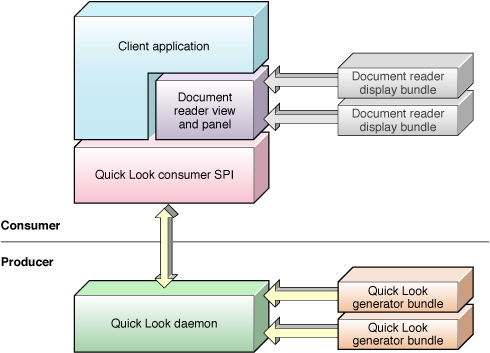
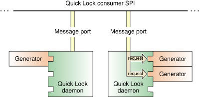

> 导航：[总目录](../../../README.md) · [documentation](../../../_indexes/documentation.md) · [Quick Look Programming Guide](Introduction%20to%20Quick%20Look%20Programming%20Guide.md)

[Next](Creating%20and%20Configuring%20a%20Quick%20Look%20Project.md)[Previous](Quick%20Look%20and%20the%20User%20Experience.md)

# Quick Look Architecture

The follow sections examine the architecture of Quick Look. A general picture of this architecture helps you to understand the role and constraints of generators.

The architecture of Quick Look is based on a consumer—producer model. The consumer (or client) is an application that wants to display thumbnail and preview representations of documents. The producer side of the architecture provides those representations to the consumer. (Some Quick Look clients are system applications such as Finder, Spotlight, and FileSync.) Clients have access to the public function `QLThumbnailImageCreate`, and to the Quick Look preview panel, described in _[QLPreviewPanel Class Reference](https://developer.apple.com/documentation/quartz/qlpreviewpanel)_. Figure 2-1 illustrates the architecture of Quick Look.

__Figure 2-1__  The Quick Look architecture

The consumer portion of Quick Look has three components: a document reader (consisting of a custom view and panel), display bundles for that reader, and an SPI to enable communication with the client. Each of these components has a specific role to play in support of the consumer:

- Document reader—Quick Look implements a view (NSView) and panel (NSPanel) customized for displaying document previews. Along with the preview content, the view might include (at the client’s option) controls for manipulating the preview, such as page-forward, page-backward, start playing, rewind, and text-search. A client application can embed this view in its user interface if it chooses. The Quick Look panel contains a Quick Look view and various controls that let the user take some action with the preview, such making the preview image full-screen or starting a slideshow.
- Display bundles—The Quick Look view itself doesn’t display document previews but delegates that work to a display bundle. There is one Quick Look display bundle for each native document type. See [Developing for Quick Look](Quick%20Look%20and%20the%20User%20Experience.md#apple-f4xwc4dqnrsv64tfmyxwi33df52wszbpkridimbqga2tamrqfvbuqmznknltk) for a discussion of the Quick native types. If a document is not of a native type, it must be converted to a one in order to be displayed as a Quick Look thumbnail or preview.
- Consumer SPI—The client application talks with Quick Look through this interface, making requests for previews and thumbnails and accessing the Quick Look document reader.

The “producer” part of Quick Look is based on a plug-in architecture that enables applications to provide thumbnails and previews of their documents, if those documents are not one of the native Quick Look types. The consumer and producer parts of Quick Look communicate over one or more Mach ports.

The “producer” side of Quick Look is where third-party development takes place, and thus it merits a closer look. it consists of one or more Quick Look daemons and multiple Quick Look generators. Figure 2-2 shows how these things are related to one another.

__Figure 2-2__  Quick Look provider component

A Quick Look generator is CFPlugIn-based bundle that provides thumbnail images and previews for an application’s documents. The job of a generator is to convert the document data into one of the Quick Look native types for each preview or thumbnail request it receives. The daemon loads a generator when it first receives a request for a document’s preview or thumbnail. It locates the generator associated with a particular document using the document’s content-type UTI, which is specified in the generator’s information property list. It looks for the generator inside the application bundle or in one of the standard file-system locations for generators, such as `/Library/QuickLook`. Quick Look generators must be 64-bit binaries, or universal binaries if necessary to support older systems.

The Quick Look daemon (`quicklookd`) is a faceless background application that acts as a host for the CFPlugIn-based generators. It communicates with the consumer side of Quick Look through a Mach port, and (as noted above) locates and loads generators when it first receives a request for a preview or thumbnail for a document whose format is not one of the native types. It conveys requests from clients to generators and returns their responses.

There are advantages to having a daemon as an intermediary between the consumer SPI and the generators. If a Quick Look daemon crashes, it can be restarted immediately to resume service where it left off. If a generator is not thread-safe or needs to be isolated for any other reason, a separate daemon can be run to handle requests for that generator. When the daemon is idle, Quick Look can terminate it, freeing up system resources.

With all the architectural pieces in place, let’s follow what happens when a client application such as Finder asks to display a preview of a document. The user opens a folder, displaying a list of documents of various types; some of these documents are of native Quick Look types and others are specific to certain applications. The user selects a document—say, a JPG file—and chooses the Quick Look Preview command from the File menu. In Quick Look the following sequence of actions occurs:

1. The client (Finder) sends a message to the consumer part of Quick Look requesting a preview for the document.
2. Quick Look sees that the document format is of a native type, so it loads the appropriate display bundle (if necessary)
3. The display bundle draws the document in the document reader (that is, in the Quick Look view, which is the content view of the Quick Look panel).

The user next requests a preview for a document that is not of a Quick Look native type. The following sequences of steps happens:

1. The client (Finder) sends a message to the consumer part of Quick Look requesting a preview for the document.
2. The Quick Look framework sees that the document format is _not_ of a native type, so it forwards the message to the Quick Look daemon.
3. Using the document’s content-type UTI, the daemon locates the appropriate generator and loads it if necessary.
4. It forwards the preview request to the generator, which creates a preview and either returns it or tells the generator where to find it.
5. The daemon returns the generator’s response to the consumer part of Quick Look.
6. Quick Look loads the appropriate display bundle (if necessary).
7. The display bundle draws the document in the document reader.

You can store a Quick Look generator in an application bundle (in `MyApp.app/Contents/Library/QuickLook/`) or in one of the standard file-system locations:

- `~/Library/QuickLook`—third party generators, accessible only to logged-in user
- `/Library/QuickLook`—third party generators, accessible to all users of the system
- `/System/Library/QuickLook`—Apple-provided generators, accessible to all users of the system

When Quick Look searches for a generator to use, it first looks for it in the bundle of the associated application and then in the standard file-system locations in the order given in the list above. If two generators have the same UTI, Quick Look uses the first one it finds in this search order. If two generators claim the same UTI at the same level (for example, in `/Library/QuickLook`), there is no way to determine which one of them will be chosen.

[Next](Creating%20and%20Configuring%20a%20Quick%20Look%20Project.md)[Previous](Quick%20Look%20and%20the%20User%20Experience.md)

