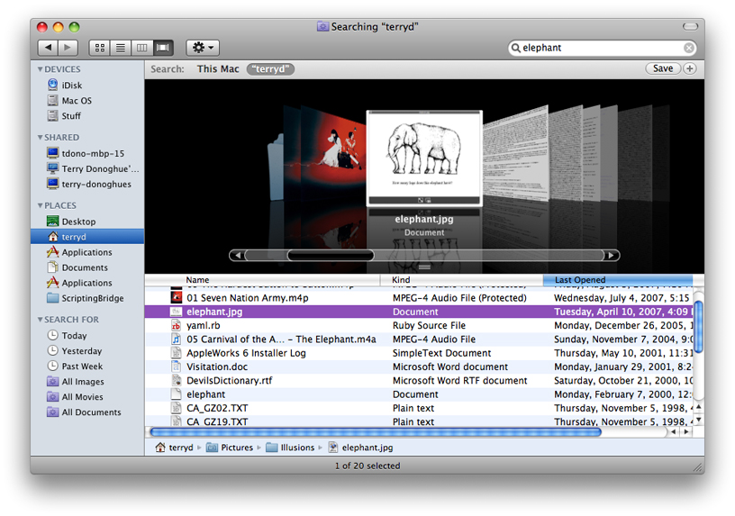
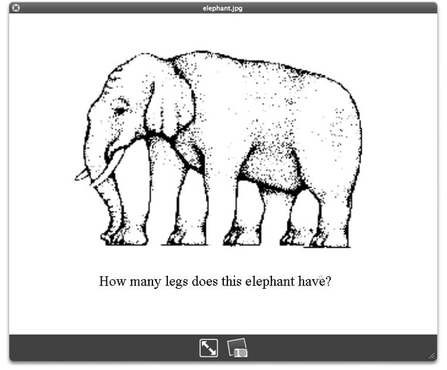
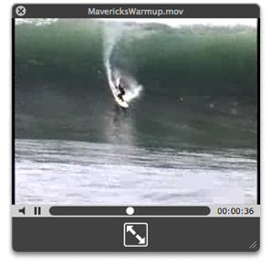

> 导航：[总目录](../../../README.md) · [documentation](../../../_indexes/documentation.md) · [Quick Look Programming Guide](Introduction%20to%20Quick%20Look%20Programming%20Guide.md)

[Next](Quick%20Look%20Architecture.md)[Previous](Introduction%20to%20Quick%20Look%20Programming%20Guide.md)

# Quick Look and the User Experience

Some applications on an OS X system present users with lists of document files. Among these applications are Finder, Spotlight, and Time Machine. These applications show a document icon, the filename, and perhaps metadata related to the document, but often this information is insufficient for users to distinguish one document from another. To identify a particular document by its content in versions of OS X prior to version 10.5, users had to open each document in the list (often requiring them to launch of the application) until they find the one they want. Needless to say, this is a time-consuming procedure.

Quick Look is a feature of OS X introduced in version 10.5 that makes it possible for users to quickly discover the contents of listed documents, both as thumbnail images and as full-size preview images, without requiring the launch of a document’s application. The following sections describe the Quick Look feature and identify those applications that are likely candidates for generating Quick Look thumbnails and previews for their documents.

Quick Look displays two representations of documents: thumbnails and previews. These two representations fulfill different needs.

A thumbnail is a static image that depicts a document. Although the size may vary, it is typically smaller than a preview and larger than a document icon. The intent of a thumbnail is to give users a notion of a document’s contents within a fairly small bounds. At larger sizes, a thumbnail for some kinds of documents—say, image files—might be as useful as a full-size preview. But at smaller sizes, a thumbnail might not be any better than a document icon at conveying what a document contains.

A preview is a larger representation of a document, usually a full-size rendering of it, that is contained by the Quick Look panel (see [Figure 1-2](#apple-f4xwc4dqnrsv64tfmyxwi33df52wszbpkridimbqga2tamrqfvbuqmznknlte)). Quick Look displays previews without the need to open the document in its owning application. Users request previews when thumbnails are either not available or do not reveal enough detail to allows them to distinguish one document from another.

A client may display multiple thumbnails at once, while previews are generally displayed one at a time.

To appreciate how Quick Look contributes to the user experience, let’s consider how it is used. If you search for an item in Spotlight—say, “elephant”—and click the Show All option you might see a Finder window like the example in Figure 1-1 .

__Figure 1-1__  Thumbnails in the Finder’s Cover Flow view

The image in the middle of the Finder’s Cover Flow view is a thumbnail generated by Quick Look. Thumbnails appear in various places in OS X v10.5. In addition to Cover Flow, they appear in the Finder in icon mode and column mode, in the Dock as stacks of icons, and in the Quick Look index sheet when multiple previews are requested. Thumbnails also appear in the Quick Look panel when Quick Look can’t generate a preview (but can generate a thumbnail).

If the user want to get a closer look at a document, he or she could select it in Spotlight or a Finder window and press the space bar. Quick Look displays a full-size preview image of the document similar to the one in Figure 1-2. (In the Finder you can also press Command-Y to view a preview of the selected item.)

__Figure 1-2__  A Quick Look preview of an image

Quick Look preview include not only static images and documents, but can include QuickTime movies, as in the example in Figure 1-3.

__Figure 1-3__  A Quick Look preview of a movie

When users request previews for multiple documents in the Finder, the Quick Look panel enables them to cycle through the previews or look at them all at once (as thumbnails) in an index sheet. The Quick Look panel also includes controls that permit users to resize a preview dynamically, expand it to take up the screen, close the panel, and (depending on document type) perform operations such as “play movie” and “add to iPhoto.“

Architecturally, Quick Look has a consumer, or client, side and a side that provides the thumbnail and preview images to the consumer side for display. (For a detailed look at the various parts of Quick Look and how they work together, see [Quick Look Architecture](Quick%20Look%20Architecture.md#apple-f4xwc4dqnrsv64tfmyxwi33df52wszbpkridimbqga2tamrqfvbuqnbnknltc).) Clients of Quick Look request thumbnails and previews for listed and selected documents, respectively, and receive images for display.

Quick Look supports the display of document thumbnails and previews if the format is one of its native types. The native Quick Look types are plain text, RTF, HTML, PDF, images (in various standard formats, such as JPG, PNG, and TIFF), and QuickTime movies and sounds. However, if a document is not in one of the native types, the document’s application must include a Quick Look generator if it wants to take advantage of the Quick Look feature. The generator is a bundle that creates representations of the application’s documents in one of the native types for display as previews and thumbnails. The purpose of a Quick Look generator is to provide upon demand, and as efficiently as possible, a thumbnail or preview image of a document in one of the native Quick Look types.

Of the various components of Quick Look, only the generator bundle (which is based on the `CFPlugIn` architecture) exposes a programmatic interface for third-party developers. Because of its `CFPlugIn` foundation, and to make Quick Look accessible to as many applications as possible, the generator API is in ANSI C, not Objective-C.

A Quick Look generator bundle must have an extension of `qlgenerator` and be installed in a file-system location described in [Installing Quick Look Generators](Quick%20Look%20Architecture.md#apple-f4xwc4dqnrsv64tfmyxwi33df52wszbpkridimbqga2tamrqfvbuqnbnknlti).

[Next](Quick%20Look%20Architecture.md)[Previous](Introduction%20to%20Quick%20Look%20Programming%20Guide.md)

