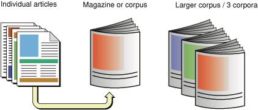
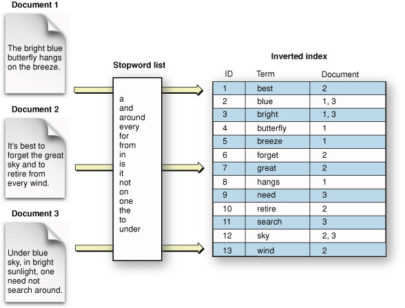
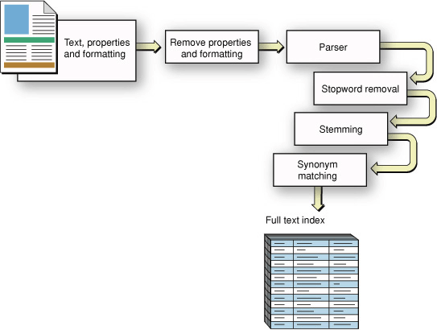
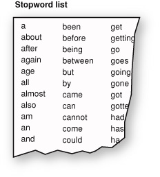
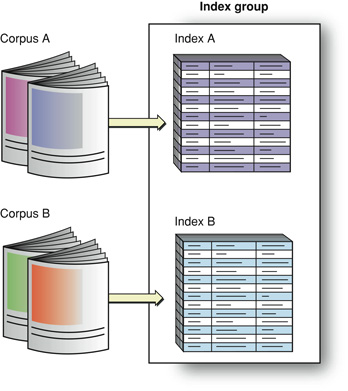
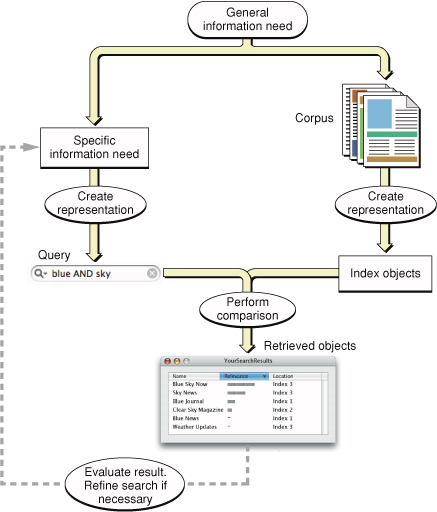

> 导航：[总目录](../../../README.md) · [documentation](../../../_indexes/documentation.md) · [SearchKit Programming Guide](Introduction.md)

[Next](Search%20Kit%20Concepts.md)[Previous](Introduction.md)

# Search Basics

Talking about an _information retrieval_ (_IR_) technology such as Search Kit requires some terms and notions that may be unfamiliar to you. In this chapter you learn about these. Along the way, you learn that the workflow in an IR system isn’t very different from the process of getting information from your local library.

If you understand such terms as corpus, text extraction, inverted index, query, Boolean search, and relevance ranking, you can skip this chapter and begin with [Search Kit Concepts](Search%20Kit%20Concepts.md#apple-f4xwc4dqnrsv64tfmyxwi33df52wszbpkridimbqgazdqnbufvkfawcsivddcmbr).

This chapter describes information retrieval as a three-step process:

1. Establishing a suitable source to search
2. Formulating a query
3. Invoking a search and providing results

This chapter steps you through a search workflow using a library metaphor, relating it to a generic computer-based IR system with occasional mention of Search Kit particulars.

You have an information need. But before you can ask a question, you need someone or something to ask. That is, you need to establish who or what you will accept as an authority for an answer. So before you ask a question you need to define the target of your question.

Such a target can be as broad as the entire Internet for a simple search using Google, or as specific as a local mailbox in a user's Mail program. Using a library metaphor here, you’ll ask a librarian, who will in turn consult some magazine indexes. The librarian plays the role of your application. The librarian's special reference skills play the role of Search Kit. The magazine indexes play the role of Search Kit indexes.

The target of a question corresponds to the information retrieval notion of a _document collection_, or more formally, a _corpus_, as depicted in Figure 1-1.

__Figure 1-1__  A corpus is a collection of documents

If one considers a magazine article to be a _document_, then an issue of the magazine constitutes a corpus—it is a collection of one or more documents. The 12 issues published in a year are corpora (“Of these corpora, which has the most articles?”), but considered as a single, larger collection, they become a single, larger corpus (“In this corpus that includes 12 issues, which articles mention sports cars?”).

Similarly, if one considers a mail message to be a document, then each of the mailboxes in a user's Mail application is a corpus. A set of mailboxes, when you search in one or another individually, are corpora. When you search a set of mailboxes as a single large collection, the set constitutes a single, larger corpus.

So generally speaking, information retrieval is a two step process that starts with specifying a corpus and proceeds to specifying a query.

If you call a librarian, you've chosen the library as your corpus. If you then ask, “Which make of car has the best trade-in value?” the librarian might narrow the effective corpus by looking through the articles in the past year’s issues of a consumer magazine and an automotive magazine. In this scenario, the librarian, acting on your behalf, expects that one or more of these documents will contain a good answer—that is, the librarian expects that those issues constitute an appropriate corpus to search.

To get back to you in a reasonable amount of time, of course, the librarian wouldn’t go to the magazine shelves and read every issue published over the past year, cover to cover. He’d use indexes. Computer-based information retrieval systems do the same.

An _index_ maps the salient information in a corpus into a format designed to let you quickly locate specific content. For example, an annual magazine index includes the key terms from every article in every issue published that year.

Each entry in a magazine index points you to one or more articles. You can think of an index as a list of terms, with each term followed by a list of the documents it appears in. This sort of index, the one that people usually think of, is formally known as an _inverted index_. The term “inverted” refers to the arrangement of information in the index, which is intended to locate documents by matching on terms. This is “inverted” compared to using documents directly: if you pick up a book, you “match” on the document and “locate” all the terms in it.

Figure 1-2 shows an inverted index schematically and depicts a simplified version of how such an index might represent terms from a set of documents.

__Figure 1-2__  Inverted index

This figure includes something called a _stopword_ list, used to filter out specified terms during text extraction. (S[Stopwords and Minimum Term Length](#apple-f4xwc4dqnrsv64tfmyxwi33df52wszbpkridimbqgazdqnbtfvbekskfjbauusa)topwords are described shortly.)

The earliest known use of inverted indexes is 1247 CE, when the first concordance of the Bible was created. Back then the process took the efforts of several hundred monks. (This historical information comes from a scholarly overview of text analysis from the University of Alberta, titled [What Is Text Analysis?](http://tapor.ualberta.ca/Resources/TAIntro/).)

An information retrieval system, instead of relying on multiple monks, employs a _text-extraction_ algorithm to harvest relevant terms from a document. A _term_ that becomes an entry in an index is typically a word. Figure 1-3 illustrates the basic steps in text extraction, starting with a formatted document and resulting in a full text index.

__Figure 1-3__  Text extraction, from formatted document to full text index

Text extraction entails a tradeoff between coverage and relevance. If you index every term in a corpus, you have perfect coverage and won’t miss anything but you’ll end up with an index whose percentage of useful entries is low. In many cases there’s no benefit to extracting words like “the,” “and,” or “it” and placing them in an index.

Indexing systems, such as the one in Search Kit, let you specify a list of _stopwords_—terms to ignore during text extraction—and to specify a _minimum term length_. Terms in the corpus either shorter than the minimum term length or included in a stopword list are skipped during text extraction. Figure 1-4 shows an excerpt from a typical stopword list.

__Figure 1-4__  A typical stopword list (excerpt)

Any word skipped in this way won’t be in the index and so won’t be searchable. This is sometimes just what you want. Such words rarely relate to the meaning or value of a document.

But if you want to support searching for exact phrases, excluding common words can be problematic precisely because they are common and appear often in phrases. One option some IR systems use to solve this dilemma is to index everything, then filter on stopwords and minimum term length at query time unless the query is phrase-based. For more on phrase-based searching, see [Phrase Searches](#apple-f4xwc4dqnrsv64tfmyxwi33df52wszbpkridimbqgazdqnbtfvbekskeiffegsa).

Stopword lists are, of course, language specific and perhaps even domain specific. A corpus of chemical descriptions would likely benefit from a different stopword list than a corpus of children’s short stories would. If you plan to market your application to different cultural regions, or to widely divergent markets even within one region, keep this in mind.

Indexing systems also employ lists of _synonyms_ to improve search quality. For example, if you ask a librarian a question about used-car trade-in value, he might look in some magazine indexes under “car”; but the text of a relevant article might mention only “passenger vehicle” or “automobile.” If the indexing system associated these alternate terms as synonyms of “car,” the relevant articles would also be attached to the index term “car.”

Teaching an indexing system about synonyms amounts to giving it a list, the creation of which is a manual process. Search Kit supports synonyms as a so-called "substitution list" in the text analysis properties dictionary of an index. For more on this, see [kSKSubstitutions](https://developer.apple.com/documentation/coreservices/ksksubstitutions) and [SKIndexCreateWithURL](https://developer.apple.com/documentation/coreservices/1446111-skindexcreatewithurl) in _[Search Kit Reference](https://developer.apple.com/documentation/coreservices/search_kit)_.

There’s an algorithmic technique as well for increasing the likelihood users will find what they’re looking for. This technique is called _stemming_ or, sometimes, _suffix stripping_. Search Kit does not perform stemming, but it’s useful to know about it so you can better understand Search Kit’s behavior in your application. You may want to provide stemming functionality yourself.

Most languages have closely related words, known as morphological or inflectional variants, based on a common portion known as a _stem_, or _root word_. In English, the stem tends to come at the beginning of words: “swim,” “swimming,” and “swimmer” share the common stem “swim.”

An indexing system that knows how to stem will convert each alternate word form, during text extraction, to a common stem word. The associated query system will also convert words in a query string to the appropriate stem. For example, “swim,” “swimming,” and “swimmer” would all be transformed to “swim.” Some stemming systems can deal with irregular endings as well. For instance, a stemmer could equate “swam” with “swim” even though the stem “swim” does not appear in this variant.

Stemming not only increases the likelihood of a successful search, it also decreases index size.

If your application requires stemming behavior, you can add it yourself using a standard algorithm such as the one developed by Martin F. Porter in 1980. Using the Porter Stemming Algorithm, sometimes called the Porter Stemmer, your application would get the text from the documents in a corpus, stem it, and then hand it to Search Kit for indexing. Your application would also apply stemming to queries.

Keep in mind that stemming, like a useful list of synonyms, and like a stopword list, is language and domain dependent.

Another way to reduce index size and increase index quality is to employ a _minimum term frequency_ during text extraction. An indexing system that supports minimum term frequency skips over terms that appear in a document fewer than a specified number of times.

The idea behind minimum term frequency is that if a term appears only once in a document, that document is not likely to be a useful source of information on that topic. Search Kit does not currently support a minimum term frequency, but you could add this behavior to your application using other OS X frameworks.

An information retrieval system that needs to support phrase searches should not exclude words from an index based on term frequency, just as it should not exclude words using a minimum term length or stopword list.

Indexes can be constructed in a way that supports _phrase_ or _proximity_ searching. These allow users to search, for example, for “Search Kit” as a complete phrase, as opposed to searching for documents that contain the terms “search” and “kit” anywhere in their content.

In an index that supports phrase searching, a term’s linear position in a document is recorded along with a reference to the document the term appears in. See [Figure 1-5](#apple-f4xwc4dqnrsv64tfmyxwi33df52wszbpkridimbqgazdqnbtfvjvomi).

__Figure 1-5__  An inverted index that supports phrase searches

!

Searching for a phrase amounts to searching for a series of terms that appear in consecutive order. Similarly, searching for proximity amounts to searching for a pair of terms whose linear distance is small. Search Kit supports phrase searching in inverted and inverted-vector indexes but does not currently support proximity searching.

Returning now to our library metaphor: If a librarian picks two annual indexes (one each from two magazines) to find an answer to a question about automobile trade-in values, he creates an _index group_ consisting of two indexes, each of which contains the terms from multiple documents. Information retrieval systems can offer the same functionality. In the case of Search Kit, it is up to your application to define and manage index groups.

Just as a corpus is a collection of one or more related documents, an index group brings together one or more related indexes, as shown in Figure 1-6.

__Figure 1-6__  An index group

This figure illustrates two indexes that each represent a different corpus. You can also create two indexes on the same corpus to include in a group. For example, one index might contain only article titles and another might contain article body text. If you create an index group with these two indexes, searches on it would cover both sorts of content. An index "group" containing only the title index would let a user find articles based strictly on titles.

Just as a librarian doesn’t read magazines when searching for an article (but goes straight to an index instead), an IR system doesn’t scan the documents in a corpus during a search. So there is a lag between the time of text extraction during index construction and the time of index scanning during a search. Depending on how volatile the information is in a corpus, and how quickly a user expects a search response, an application that uses an IR system may want to refresh its indexes before invoking a search.

Often, the best time to refresh an index is after a change is made to any of its referenced documents. This is appropriate when an application exerts exclusive control over creating, deleting, and editing its documents. Spotlight, for example, uses this strategy whenever a document is changed, added to, or deleted from the OS X file system.

In our ongoing example, you started with a general information need and used it to identify a suitable, searchable corpus—namely, a library with a friendly librarian. You expected the library to contain the information you need, and you expected it to be efficiently accessible. Thanks to magazine publishers who create annual indexes, it is. The figure Figure 1-7 summarizes these steps from the top down on the right side.

The next step in using an IR system is to define a specific information need and represent it as a _query_, a process that the figure illustrates on the left side.

__Figure 1-7__  An information retrieval system

In this chapter, we've supposed that you want to know which make of car has the best trade-in value, and we've supposed that you are using a library to find your answer. Alternatively, you might ask a friend or use Google. In each case you expect your chosen corpus to contain the answer. And, in each case you need to formulate a specific query that expresses what you want to know in terms understood by whom or what you are asking.

You use natural language to ask a friend or a librarian, and a Boolean-like syntax for Google. To get the answer using a magazine index, you (or a librarian) would scan its alphabetical listings while holding one or more keywords in mind. In other words, the IR system determines the appropriate form for a query.

Some common sorts of queries for software-based IR systems are _Boolean_, _prefix_, and _phrase_. To get what you want, you need to pick the appropriate type of search and then use corresponding query syntax.

A librarian or an IR system can provide guidance to promote a successful search. Apple’s search field widget, for example, provides a standard and flexible interface for invoking a search.

To review and then complete our library metaphor, you call your local library and ask for the information desk. The very cooperative librarian listens to your car trade-in value question and then puts you on hold for a few minutes. The librarian performs the search by comparing your query to the available indexes, represented in the figure Figure 1-7 as the "Perform comparison" step. He comes back on the phone, with your retrieved answer on a a scrap of paper, and says, “The make of automobile with the best trade in value this year is the XYZ.”

You have your answer, but that isn’t necessarily the end of the story. The answer might prompt you to realize you want to consider other criteria, such as purchase price. Or you might want to know which makes rank second and third.

The response you get becomes part of what is known and helps you focus more clearly on what you want to know. Information retrieval is often cyclical in this way. The IR systems that you develop should anticipate that answers lead to new questions. Google “Similar pages” links are an example of this.

The two basic ways to provide results in an IR system are by inclusion/exclusion and by relevance.

An _inclusion/exclusion result_ includes only documents that satisfy a query. The documents won’t be in any particular order—they will not be ranked by relevance. If a user wants to know which CDs in a catalog are by (fictional) rock band The Pink Widgets, then you simply want to return all the Pink Widgets CD titles as a result. You may order the results based on release date or popularity, but those are considerations outside the request encapsulated by the query.

In the case of the library search for used-car trade-in values, the librarian in our example didn’t bother saying which article was best. He just found the information and gave it to you.

A _relevance-based result_, on the other hand, includes documents with a range of relevance to a query. For example, an IR system might sort CD titles by The Pink Widgets toward the top of a results table but also list CDs containing song titles with the words ‘pink’ and ‘widget’ in them, or CDs containing cover versions of Pink Widgets songs, sorted lower in the table.

The best sort of result presentation will put the most satisfying matches at the top. More than this, it will present matches in a way that helps a user refine a search if need be—perhaps by providing context for each result, perhaps by providing associated information such as modification date or user-entered comments.

Once you’ve added information retrieval to your application, you’ll probably want to fine-tune the presentation of results to provide maximum value. One way to approach such fine-tuning is by experimenting with a representative corpus and with a suite of expected user queries. With such experimentation you may discover, for example, that you can present sets of similar documents, or documents sharing a common attribute, as groups in an outline-style view. For example, a search in OS X using the Spotlight search field shows results sorted by category such as Documents, Mail Messages, and PDF Documents.

[Next](Search%20Kit%20Concepts.md)[Previous](Introduction.md)

