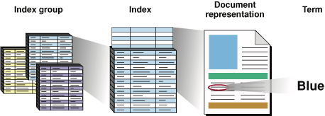
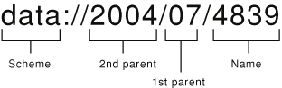
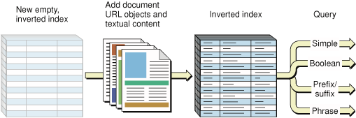
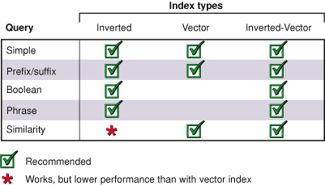
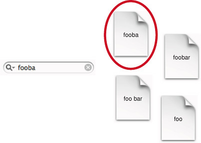
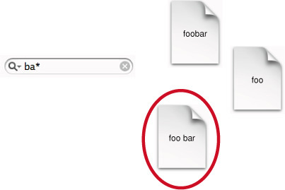
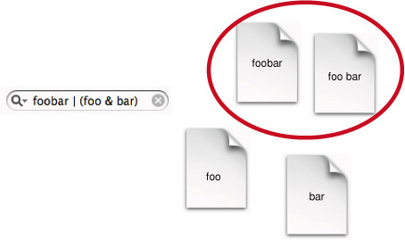
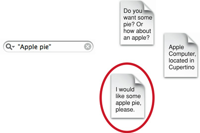

> 导航：[总目录](../../../README.md) · [documentation](../../../_indexes/documentation.md) · [SearchKit Programming Guide](Introduction.md)

[Next](Search%20Kit%20Tasks.md)[Previous](Search%20Basics.md)

# Search Kit Concepts

In this chapter you learn about Search Kit’s capabilities, architecture, workflow, and internal workings. Before reading it you should understand the terms and ideas covered in [Search Basics](Search%20Basics.md#apple-f4xwc4dqnrsv64tfmyxwi33df52wszbpkridimbqgazdqnbtfvkfawcsivddcmbr).

Apple designed Search Kit as a highly flexible information retrieval framework. When using Search Kit, a "document" is any text container as understood by your application. You are not limited to searching files on disk but can search any body of textual information—pages distributed across a network, live database content, or custom, application-defined data. Similarly, your application can define what counts as a "term" for Search Kit. For Japanese text, Search Kit parses terms using Apple’s Japanese language analysis technology.

Search Kit uses _document URL objects_, similar to CFURL objects, to refer to documents. Using document URL objects, your application can define any sort of _document object hierarchy_ and location scheme.

The first two sections of this chapter—[Search Kit Architecture](#apple-f4xwc4dqnrsv64tfmyxwi33df52wszbpkridimbqgazdqnbufvbecqshivduorq) and [Search Kit Application Workflow](#apple-f4xwc4dqnrsv64tfmyxwi33df52wszbpkridimbqgazdqnbufvwxe2rnknltc)—provide a high-level understanding. The meat of this chapter is in the final section, [How Search Kit Works](#apple-f4xwc4dqnrsv64tfmyxwi33df52wszbpkridimbqgazdqnbufvbecssgjjdumrq).

The Search Kit API is a C language framework within the Core Services umbrella framework. As such, it employs memory-management and error-handling conventions from Apple's Core Foundation technology and makes use of Core Foundation data types.

This section is a brief tour through Search Kit's architecture, providing just enough context to understand how Search Kit's pieces fit together. To dig deeper into any of the topics presented in this section, refer to [How Search Kit Works](#apple-f4xwc4dqnrsv64tfmyxwi33df52wszbpkridimbqgazdqnbufvbecssgjjdumrq) and [Search Kit Tasks](Search%20Kit%20Tasks.md#apple-f4xwc4dqnrsv64tfmyxwi33df52wszbpkridimbqgaytanzrfvbuqmrqgqwvgvzr).

Search Kit uses a simple information containment hierarchy to allow your application to manage the content, or corpus, it is responsible for. Figure 2-1 illustrates this hierarchy by zooming in successively from left to right.

__Figure 2-1__  The Search Kit containment hierarchy

At the outermost level, as shown in the figure on the left, an application typically works with a group of indexes. An individual index, depicted in the figure under the heading "Index" and represented in Search Kit as an `SKIndexRef` opaque type, contains representations of one or more documents.

A document representation in an index is a key/value pair. The key is a lightweight, unique identifier of type `SKDocumentID`. The corresponding value includes a document URL object of type `SKDocumentRef`. Zooming in on one such document representation, the figure depicts an individual term associated with one document.

A Search Kit index associates each document with the terms extracted from it. A term is also represented as a key/value pair in an index. A term's key, like a document's key, is a lightweight, unique identifier. A term ID is of type `CFIndex`. The value for a term includes the term string itself. Given a term ID, your application can get the term by calling the `SKIndexCopyTermStringForTermID` function.

Index groups, as shown on the left in Figure 2-1, are not explicitly supported in Search Kit but have many uses. You implement them in your application for such things as:

- Simultaneously searching multiple fields in documents such as emails, where you have one index for the body content, another for the “To” header, and so on
- Simultaneously searching multiple corpora, such as multiple email mailboxes

You’ll typically create disk-based (persistent) indexes using the `SKIndexCreateWithURL` function, which creates an index in a file. One index file can hold any number of Search Kit indexes. The choice to put one or more than one index in a file has implications regarding how an application manages searches, as described later in this chapter.

Search Kit supports memory-based indexes as well, with its `SKIndexCreateWithMutableData` function.

Whether it is file or memory based, you set an index’s capabilities when you create it. There are two aspects to consider.

- _Index type_ determines whether the index will be optimized for query searching or similarity searching.
- An index’s _text analysis properties dictionary_ determines whether the index will support phrase-based searches. It also sets various index attributes that bear on index size and search efficiency.

A new Search Kit index is empty, ready to accept documents. Search Kit provides functions for creating document URL objects, for adding them and their associated text to indexes, and for reindexing documents that change or move.

To find documents, your application creates and then queries a _search object_. The search object, upon its creation, initiates search and then acts as a dynamic repository for results. Your application can query the search object immediately after its creation and then repeatedly to get additional results.

Each search object is associated with exactly one index. By creating multiple search objects, you can perform searches on multiple indexes sequentially or in parallel, according to the requirements of your application.

Performing a search is a straightforward, two-step process:

1. Create a searchable corpus.
2. Using the user's query, perform a search and display the results.

You make textual content searchable by indexing it. To do this, you:

1. Create an empty index using the `SKIndexCreateWithURL` function for a file-based index, or with the `SKIndexCreateWithMutableData` function for a memory-based index.
2. Create document URL objects to add to the index by calling the `SKDocumentCreateWithURL` or the `SKDocumentCreate` function, depending on how your application wants to manage your corpus.
3. Add document URL objects and text to the index with the `SKIndexAddDocumentWithText` or `SKIndexAddDocument` functions. In the general case, your application takes responsibility for getting text out of a document, using other OS X frameworks, and then hands the text to an index in the form of a CFString object using the `SKIndexAddDocumentWithText` function. Alternatively, the `SKIndexAddDocument` function makes use of the Spotlight text importers to get the text from a local, file-based document.

A user’s request for information includes a query along with a specification of where to search. The query comprises words and perhaps _operators_, such as “`&`”, representing a logical `AND`, or “\*”, the _wildcard character_. The specification of where to search—that is, which indexes to use—may be supplied by your application or supplied by the user. As an example of a user-supplied search location, the set of mailboxes a user selects in Mail becomes the active set of locations for search.

Different types of indexes support different types of search, so you may want your application to guide users appropriately in regard to query type. For example, if an index doesn't support phrase searching, your application could provide appropriate feedback if a user enters a query with a double-quote-delimited text string.

As preparation for a search, your application should use the `SKIndexFlush` function to update and flush to disk the indexes specified in the query. Updating and flushing ensure that you invoke the search on fresh data.

However, if the information in the corpus changes rarely, or if the corpus is so large that the time consumed by updating the indexes would frustrate user expectations, you may want to update more strategically. For instance, if your application controls when documents change, you can update an index incrementally each time a document changes. OS X does this for file system searches that use Spotlight by way of file system notifications.

You create a search object with the asynchronous `SKSearchCreate` function. You then query it with the `SKSearchFindMatches` function, which provides results as an array of document IDs and a parallel array, if requested, of relevance scores. Your application can get document locations for these IDs, in the form of document URL objects, by calling the `SKIndexCopyDocumentURLsForDocumentIDs` function. Finally, your application can display these document locations as search results using other OS X frameworks.

In addition to query-based searches, Search Kit supports similarity searching and summarization. This section briefly describes these workflows as well as index maintenance in terms of removing and reindexing documents.

In a _similarity search_, a user looks for documents similar to an example document. The workflow is nearly identical to the workflow for a query search, with these differences:

- When creating a search object with the `SKSearchCreate` function, use the `kSKSearchOptionFindSimilar` flag in the _inSearchOptions_ parameter.
- Provide a string representing a document, or a portion of a document, to the `SKSearchCreate` function’s _inQuery_ parameter.

Starting with OS X v10.4, Search Kit supplants the summarization functionality previously available in Apple’s Find By Content technology. You can use summarization independently of search or as an adjunct to your application’s display of search results. Find By Content remains available in OS X for backward compatibility only.

To perform summarization you create a _summarization object_ of type `SKSummaryRef` by passing a text string to the `SKSummaryCreateWithString` function. You then use the `SKSummaryCopySentenceSummaryString` or `SKSummaryCopyParagraphSummaryString` functions to generate a sentence- or paragraph-based summary of the size you want. Each of these functions has a parameter that lets you specify summary length as an integer number of sentences or paragraphs.

You can see summarization in action by selecting a block of text in a Mac app and then choosing the Summarize service from the Services submenu in the application menu.

For additional control over summarization, Search Kit supplies other functions that let you work with individual sentences and paragraphs from the summarization object. For more information, refer to _[Search Kit Reference](https://developer.apple.com/documentation/coreservices/search_kit)_.

To reindex a document that has changed but whose location is the same, you simply replace it in the index. If a document has moved, or moved and changed, you remove the old version and then add the new version. For details refer to [Search Kit Tasks](Search%20Kit%20Tasks.md#apple-f4xwc4dqnrsv64tfmyxwi33df52wszbpkridimbqgaytanzrfvbuqmrqgqwvgvzr).

Here you learn how Search Kit works with documents as abstract objects, how it indexes content, and how it manages queries and results.

Search Kit works with any collection of textual information as a document object hierarchy. This approach gives your application a great deal of flexibility in how it defines and manages documents.

There are two ways Search Kit can manage a document object hierarchy. One is specifically for documents that are disk-based files—those whose URLs use the `file` _scheme_. The other is general; it works with any sort of document, whether it is file based, memory based, or application defined.

- If your application works with documents that are disk-based files, you can use the file-system hierarchy directly. With this option you let Search Kit find documents and get their contents. Document URL objects in this approach are equivalent to file-system paths.
- If your documents are not disk-based files or you want more control over the document object hierarchy, use Search Kit’s general approach. In this approach, your application specifies, using a flexible URL format, how to refer to documents. Your application takes responsibility for locating documents, and during indexing, your application hands the textual content of a document to Search Kit in the form of a CFString object.

With either approach, when you create a document URL object, you give Search Kit the information needed to find the document. This may be a file-system URL, an Internet URL, a SQL statement, an ID number, and so on—the format is up to your application. During a search, when Search Kit identifies a document in response to a user’s query, your application can ask for the location information and use it to get the associated document.

Using Search Kit, the definition of “document” is largely up to your application. A document, to Search Kit, is simply a locatable chunk of text. The chunking depends on your application which serves as an intermediary between Search Kit and the information you want to search.

An email client, for example, might use a single plaintext file (such as in the Unix `mbox` format) to hold multiple documents—namely, the set of mail messages in a mailbox. Another application might employ a one-to-one correspondence between files and documents. Or an application might consider all the files within a folder to be a single, multipart document—in this case, a search hit in any of the referenced files might direct the user to the containing folder or bundle. It’s up to your application.

To Search Kit, a document is atomic in that it defines the granularity of a search. Using Search Kit, your application can find documents—as your application understands them—but cannot locate the position of a term within a document. If you want to locate matches for a user’s query within a found document, use the MLTE `TXNFind` function in Carbon or the `NSString``rangeOfCharacterFromSet:options:` method in Cocoa.

To Search Kit, a document’s structure is irrelevant in that Search Kit indexes don’t know anything about paragraphs, subtitles, tagging, or fields of information within a document. Search Kit sees a document’s content simply as a bag of terms. If you want to let users search by various attributes of documents, you create an index for each attribute.

Search Kit is concerned only with textual content, so it does not keep track of file-system attributes such as modification timestamps. In Carbon, use the `PBCatSearch` function to search by file-system attributes. In Cocoa, use the `NSFileManager` class. You can also use the Spotlight API to search for documents according to file-system attributes or other metadata.

As described above, Search Kit’s notion of document location is encapsulated in something called a document URL object. Document URL objects correspond to the simple data type `SKDocumentRef`. A document URL object is similar to a CFURL object but lets you use any format that you like to represent a document’s location. It’s up to your application to interpret the location to retrieve the document.

There are multiple ways to create document URL objects. You can create them by converting CFURL objects using the `SKDocumentCreateWithURL` function. Alternatively, you can give this function a URL directly. In this case you can use any URL scheme you like, including standard schemes such as `file`, `http` and `ftp`; or nonstandard schemes of your own design, such as `data`.

Yet another way to build document URL objects is to construct a document object hierarchy node by node. Search Kit supports the building of document object hierarchies with its `SKDocumentCreate` function. This function, rather than taking a complete URL as `SKDocumentCreateWithURL` does, builds a URL for you from a triple of information that you hand it: the document _name_, the _parent document URL object_, and an optional _scheme_.

Figure 2-2 illustrates these components as they appear in a URL. If you want to take advantage of Search Kit’s ability to locate and read local, file-based documents, the Name portion should match the document filename. If your application manages the documents in its corpora, the Name portion may match the document filename or not, according to the application's needs.

__Figure 2-2__  A Search Kit document URL

The full URL is the location information in the document URL object. The portion to the left of the Name, up to but not including the final slash, is the location information in the document URL object for the parent. To tell the `SKDocumentCreate` function the scheme for the document URL object, use the text starting from the left and up to, but not including, the colon.

A document object hierarchy can be flat, tree-based, or more complex. Your application defines and uses it.

You can determine document URLs by assembling them piece by piece if you want, using the functions `SKDocumentGetName`, `SKDocumentGetParent`, and `SKDocumentGetSchemeName` to query document URL objects. Start at the leaf document and traverse upward, parent to parent. This works with all document URL objects—those created by converting CFURL objects, those created from URLs directly, and those created by using name, parent, and scheme.

The parent-child-based control of document object hierarchies you get by using the `SKDocumentCreate` function can be useful when you want to attach information to nondocument nodes in a hierarchy. For example, you may want to record when the documents in a folder were last indexed; you can associate that information with the document URL object of the enclosing folder. This can also be useful when the documents in your corpus do not correspond to disk-based files—for example, when they are database records or tagged chunks of text within an enclosing file. In cases like these, a nondocument node is a good place to store metainformation about subordinate documents.

A side effect of Search Kit’s powerful generality in handling document object hierarchies is that when you create a document URL object from a multipart URL, Search Kit creates a series of document URL objects, one for each element in the path. Use these if you want, as just described, or ignore them if they’re not useful.

In the special case of `file` URLs, Search Kit knows how to find documents for you. It also knows how to harvest the content of local files, as described in [Terms, From Documents to Indexes](#apple-f4xwc4dqnrsv64tfmyxwi33df52wszbpkridimbqgazdqnbufvbecqsgjfbeqry). In every other case, your application manages a document object hierarchy and interprets document locations from document URL objects.

You can get the URL itself from a document URL object by passing the object to the `SKDocumentCopyURL` function.

You can associate information with each document in an index by way of a properties dictionary, using the `SKIndexSetDocumentProperties` function. The format of this optional dictionary can be as simple or as complex as you want. For example, an email program could include a property dictionary for each mailbox, describing metainformation such as number of read and unread messages, the file-system location of the mailbox, and so on.

You can use this property information as context for the user or for your application but you cannot directly search it. Retrieve property information using the `SKIndexCopyDocumentProperties` function.

_Terms_ are the currency of information retrieval. In a search, you provide a query consisting of terms, perhaps including operators, and Search Kit matches the query with indexed terms that have been extracted from documents. Here you learn how terms get from documents into indexes. You also learn about the Search Kit index types and about how they support various types of searching.

You may want to first review [Constructing Indexes](Search%20Basics.md#apple-f4xwc4dqnrsv64tfmyxwi33df52wszbpkridimbqgazdqnbtfvbekskgi5besqy) in the Search Basics chapter, which provides an implementation-independent introduction to indexes.

Terms get from documents into Search Kit indexes through a three-step process:

1. You ask Search Kit to create a new, empty index if you need one. Otherwise, get the reference for an existing index.
2. You create a document URL object for each of the documents you want to index.
3. You add the document URL objects and textual content to the index.

Figure 2-3 depicts this process.

__Figure 2-3__  Adding documents to a new index

In the general case and for documents that do not correspond to on-disk files—webpages, database records, tag-delimited subsets of files, data in memory, or custom, application-specific content—use the `SKIndexAddDocumentWithText` function. Your application explicitly sends document text in the form of a CFString object to the function and provides the document location as a document URL object. You can also use this function for on-disk, file-based documents when you want more control over the indexing process. You might do this, for example, for an XML document when your application understands the tagging semantics.

To ask Search Kit to get textual content for you from an on-disk file using Spotlight importers, use the `SKIndexAddDocument` function. This function converts a file-system path to a document URL object, and (with help from the Spotlight importers) gets the text to be placed in the index.

If your application relies on Spotlight importers, when your program launches, tell Search Kit to load them by calling the `SKLoadDefaultExtractorPlugIns` function.

In either case, the “add-document” functions—`SKIndexAddDocument` and `SKIndexAddDocumentWithText`—parse textual content into terms before placing it into an index. If your application is reading Japanese text, Search Kit uses Apple’s Japanese language analysis technology.

Each term in a Search Kit index has a unique ID and is associated with a list of document URL objects, as illustrated in the Search Basics chapter in [Figure 1-2](Search%20Basics.md#apple-f4xwc4dqnrsv64tfmyxwi33df52wszbpkridimbqgazdqnbtfvbekskji5eeosa). Various Search Kit functions let you convert between terms and IDs, determine which documents contain a term, get the number of times a term appears in a document, and so on.

Three types of Search Kit indexes handle various functionality and efficiency requirements:

- _Inverted indexes_ map terms to documents. Use an inverted index to allow users to discover which documents match their queries. This is the preferred index type for most applications.
- _Vector indexes_ map documents to terms. Use a vector index to let users find documents based on a similar, specified document—that is, to perform similarity searching.
- _Inverted-vector indexes_ combine the characteristics and capabilities of inverted and vector indexes. They consume more memory and file space than either of their constituent types.

When you create an index, you specify one of these three index types using the _inIndexType_ parameter in either the `SKIndexCreateWithURL` or `SKIndexCreateWithMutableData` function. The type determines how each added document will be indexed and indirectly determines which sorts of searches your users can perform. For example, a vector index does not support Boolean queries or phrase-based searching. Figure 2-4 lists the various index types and the search capabilities for each.

__Figure 2-4__  Index types and their available search types

_Inverted indexes_ are optimized for fast query-based searches and for minimal index size. They map terms to document. That is, terms are the keys in the key-value pairs in inverted indexes.

Use an inverted index unless your application’s primary use is similarity searching. Although inverted indexes work for similarity searching, performance is slower than when searching by similarity using a vector index.

A Search Kit inverted index lists each constituent term exactly once—no matter how many of the documents contained in the index include the term and no matter how frequently the term appears in any of the documents. The value in a term's (key, value) pair in an inverted index includes a number indicating how many of the index's documents contain the term, IDs of the documents that use the term, and how often the term appears in each document.

If you specify proximity-searching support when you create an index, the index also tracks the position of each instance of the term in each document.

_Vector indexes_ map documents to terms. That is, documents are the keys in the (key, value) pairs in vector indexes. Their primary use is fast similarity searching.

The value in a document's (key, value) pair in a vector index includes a number indicating how many terms the document contains, IDs of the terms in the document, and how often each term appears in the document.

Vector indexes do not support Boolean or phrase-based searching. These limitations, along with their relatively large size, make them a bad choice unless your primary need is fast similarity searching.

_Inverted-vector indexes_ support every type of Search Kit query but are larger still than vector indexes. Their only practical application is to support Boolean, phrase-based, and fast similarity searching on the same index, and when index size will not be an issue.

In addition to having a type, each Search Kit index has a _text analysis properties dictionary_ that defines a variety of index characteristics and capabilities. Among these are phrase-based searching, synonyms, words to exclude from an index (“stopwords”), and so on.

You specify the text analysis properties dictionary for an index using the _inAnalysisProperties_ parameter in either the `SKIndexCreateWithURL` or `SKIndexCreateWithMutableData` function. The available keys for the dictionary are defined in the `Text Analysis Keys` constants, described in _[Search Kit Reference](https://developer.apple.com/documentation/coreservices/search_kit)_.

You must ensure that the set of attributes you confer on an index makes sense. For example, because Vector indexes do not support phrase-based searching, do not use a `kCFBooleanTrue` value for the `kSKProximityIndexing` key in a Vector index's text analysis properties dictionary.

To design the index architecture for your application, begin by answering these questions:

- Which documents should be in a given index?
- Should the indexes be persistent or memory based?
- Which sorts of queries should the indexes support?
- Do you want to filter the content as it is added to the index (using stopwords or a minimum term length)?
- Do you need a list of term substitutions?

Your answers to these questions will guide your choice of index type and text analysis properties.

When your application adds or removes a document URL object from an index, the on-disk or memory-based representation of the index becomes stale. A search on an index in such a state won’t have access to the nonflushed updates. The solution is to call the `SKIndexFlush` function before searching. `SKIndexFlush` flushes index-update information and commits memory-based index caches to disk, in the case of an on-disk index, or to a memory object, in the case of a memory-based index. In both cases, calling this function makes the state of an index consistent.

Indexes can develop _fragmentation_ (that is, they can become bloated with unused text) as your application adds and removes document URL objects. Search Kit _compacts_ an index, if needed, when your application calls the `SKIndexCompact` function. Because this function typically takes significant time to do its work, call it only when you find that an index is significantly fragmented.

To check for bloat you can take advantage of the way Search Kit allocates document IDs. It does so starting at 1 and without reusing previously allocated IDs for an index. Simply compare the highest document ID, found with the `SKIndexGetMaximumDocumentID` function, with the current document count, found with the `SKIndexGetDocumentCount` function.

Once you have a searchable corpus in the form of populated indexes, you’re ready to search. Searching is a multistep process:

1. Get the user’s query, including, if applicable, their specification of where to search.
2. Create (or reuse) an appropriate index group.
3. Update the indexes to query, as necessary.
4. Invoke the search.
5. Display results based on information from the returned search object, and continue to update the results as appropriate by continuing to query the search object.

This section describes working with indexes and focuses on the general case of searching multiple indexes. It also describes the various types of query available in Search Kit and briefly describes working with search results.

In many cases, applications need to invoke a search over multiple indexes. For example, say a car buyer wants to learn about cars from America, Germany, and Japan. Your application might manage its automobile data by using a separate index for each country of manufacture. In this case, you'd include indexes from the specified countries in the user's search.

As a slightly more complex example, say you have a large set of static webpages (not generated on demand from a database) composing an online catalog. Each page lists several products. Each product, in turn, might be a member of one or more product categories—sports equipment, home and garden, sale items, and so on. Say you’d like your users to be able to search by product name, price, and category.

One strategy for providing search on such a website would be to define and appropriately tag each individual product description as a document. Recall that, when using Search Kit, a "document" is anything your application defines it to be. You would include tagging within each product description indicating product name, price, and a list of categories the product belongs to.

You could then create a separate index across the website for each such field of information, along with an index of all the visible text content. A user's search could specify which fields to search on, and your application would add the corresponding indexes to the index group used for the search.

Search Kit's asynchronous architecture lets you search multiple indexes in sequence or in parallel, depending on your application's needs and on the structure of your information.

- If your application is searching multiple indexes in a single file or in separate files but all on the same physical disk, Apple recommends that you search the indexes in sequence for best performance.
- When an index group is distributed across multiple disks or across a network, or when the indexes are all in memory, search the indexes in parallel.

For a parallel search, your application can use a separate thread for each index to be searched. Alternatively, you can create a search object for each index in a group, then repeatedly query the search objects in turn by making use of the timeout option in the `SKSearchFindMatches` function.

Search Kit responds to a query by interpreting the query's terms, the explicit and implicit operators, and the order of the query's terms and operators. Using an enhanced, Google-like syntax, Search Kit supports a variety of types of query as well as arbitrary combinations of these types. For example, the following query includes Boolean, prefix, and suffix searching:

`appl* OR *ing`

Using the asterisk (`*`) wildcard operator and the Boolean `OR` operator, this query returns documents containing words that begin with “appl” as well as documents that contain words that end with “ing”.

The following table lists the operators for nonsimilarity searches. (Similarity searches do not respond to operators.) Synonyms, separated by commas here, all have the same order of evaluation.

__Table 2-1__  Query operators in Search Kit, from highest to lowest precedence

| Operator† | Meaning |
| `"` | Opening and closing delimiter for phrase-based searching. |
| `(`, `)` | Opening and closing delimiters for logical grouping. |
| `!`, `NOT` | Boolean `NOT`. |
| `&`, `AND`, `<space>` | Boolean `AND`. The `<space>` character represents a Boolean operator when there are terms to both sides of the `<space>` character. In this case, `<space>` represents a Boolean `AND` by default, or a Boolean `OR` if specified by `kSKSearchOptionSpaceMeansOR`. |
| `|` | Boolean inclusive `OR`. |
| `*` | Wildcard for prefix or suffix; surround term with wildcard characters for substring search. Ignored in phrase-based searches. |

A Search Kit query can be as complex as you want, combining all the various operator types. For the purposes of explanation, this section discusses each query type separately.

The simplest sort of query consists of:

- One or more terms
- No operators other than the `<space>` character between the terms
- The default, `AND`-based behavior for <space>

Such a _simple search_ looks for documents in the targeted set of indexes that contain all of the terms entered in the query string. Indexed terms match the query only if they match exactly. For example, if you search for “fooba” and a document contains “foobar” but not “fooba,” you don’t get a hit. Figure 2-5 depicts the behavior of a simple search.

__Figure 2-5__  A simple search

If you specify the "space means `OR`" option using the `kSKSearchOptionSpaceMeansOR` constant in the `SKSearchCreate` function, Search Kit finds not only documents that contain all of the query terms. It also finds documents that contain some, but not all, of the query terms; it ranks such documents lower than documents that contain all the query terms.

A _prefix search_ looks for documents represented in the targeted set of indexes that contain terms beginning with the characters in a query. This is especially useful for the sort of live searching you see in Mail and Xcode. As the user types each successive character, the found set narrows. See Figure 2-6.

__Figure 2-6__  A prefix search

Prefix searching looks at each term in the query separately, `AND`ing multiple terms by default, and matches on the beginnings of terms in the currently targeted set of indexes. In Figure 2-6, the word “bar” in the circled document is the only term that begins with the same characters as in the query, “ba.”

To invoke a prefix search directly, a user would append the asterisk (\*) character to the end of each term to be used as a prefix. An application can implicitly add the trailing asterisk to query terms before sending the query on to Search Kit.

Here’s another example of prefix searching. If you have mail messages from Billy Bob, Billy Joe, and Big Chief, you could enter “`Bo*`” to find all of Billy Bob’s messages, or “`Jo*`” to find Billy Joe’s messages. Entering “`Bi*`” would match messages from all three friends. “`Bi* OR Ch*`” would match Big Chief with the highest relevance but would also match Billy Bob and Billy Joe because they each contain one term matched by one of the query terms. The query “`illy*`” wouldn’t match any of the mail messages.

Very similar to a prefix query is a _suffix search_. Suffix searching looks at each term in the query separately, `AND`ing multiple terms by default, and matches on the _ends_ of terms in the currently targeted set of indexes. Again the wildcard character is the asterisk, but placed before the term as in "`*illy`". And again you can design your application so that users explicitly type the asterisk before terms, or you can add the asterisk implicitly before handing the query off to Search Kit.

A _Boolean search_ offers full Boolean search functionality using the operators described in Table 2-1. You can design your application's interface so that users type the operators directly, or you can provide an alternate interface—converting the query to use the Search Kit standard operator syntax before handing off the query to the `SKSearchCreate` function.

The Boolean search in Figure 2-7 employs grouping operators as well as Boolean operators.

__Figure 2-7__  A Boolean search

In the figure, the query in the search field indicates a request for documents that contain the exact term "foobar" as well as documents that contain both the term "foo" and the term "bar".

A _phrase search_ works in inverted (and inverted-vector) indexes that were created with a true value for the `kSKProximityIndexing` key in the text analysis properties dictionary. Such an index stores the position of each term in each document, along with the information otherwise stored in an inverted (or an inverted-vector) index.

Despite the name of the `kSKProximityIndexing` text analysis properties key, Search Kit does not currently support arbitrary proximity searching. That is, you cannot search for documents in which two words are near each other but not adjacent. Search Kit supports only phrase searching.

When a user enters "Apple pie" as a query—including the surrounding quotation marks—Search Kit tries to find documents containing this exact phrase. See [Figure 2-8](#apple-f4xwc4dqnrsv64tfmyxwi33df52wszbpkridimbqgazdqnbufvjvomq) for an illustration of phrase searching.

__Figure 2-8__  A phrase-based search

Immediately upon invocation of a query—that is, upon creation of a search object—Search Kit asynchronous searching accumulates results into the search object. Using the [SKSearchFindMatches](https://developer.apple.com/documentation/coreservices/1448608-sksearchfindmatches) function, your application retrieves results from the search object as they come in.

A search does not return documents per se. It returns document IDs. Your application, in turn, uses the document IDs to get document URL objects from the indicated indexes. The document URL objects, in turn, refer to the documents that satisfy the query.

The Search Kit framework does not provide display functionality. Instead, your application uses other OS X frameworks to present the basic result data in the way you determine to be most useful. Tables are a popular way to display results, but you could just as well present search hits in outline form, as a graph, or as audible feedback.

[Next](Search%20Kit%20Tasks.md)[Previous](Search%20Basics.md)

