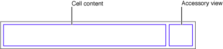
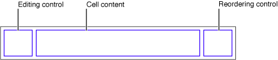
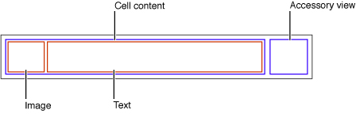
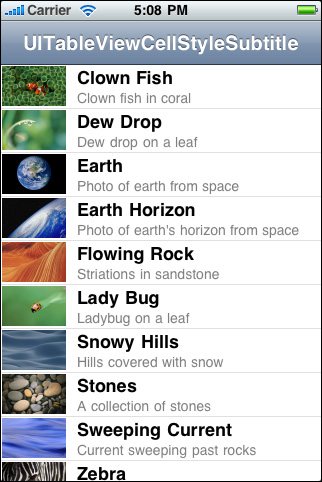
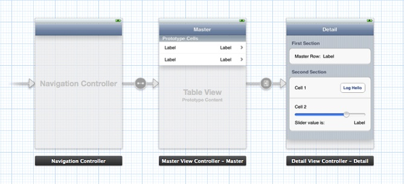
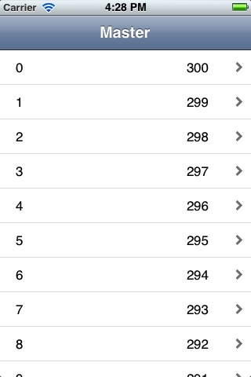
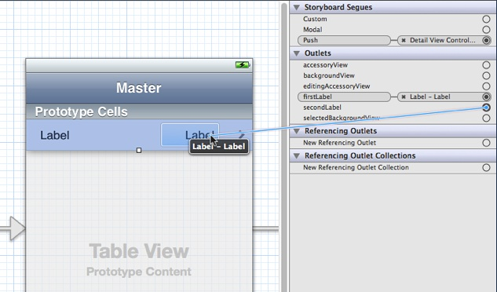
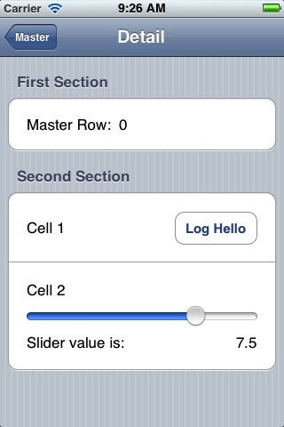
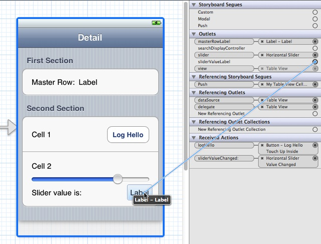
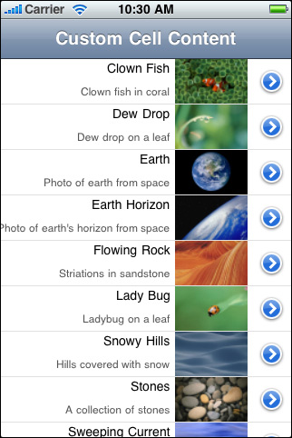

> 导航：[总目录](../../../README.md) · [documentation](../../../_indexes/documentation.md) · [Table View Programming Guide for iOS](About%20Table%20Views%20in%20iOS%20Apps.md)


[Next](Managing%20Selections.md)[Previous](Creating%20and%20Configuring%20a%20Table%20View.md)

# A Closer Look at Table View Cells

A table view uses cell objects to draw its visible rows and then caches those objects as long as the rows are visible. Cells inherit from the [UITableViewCell](https://developer.apple.com/documentation/uikit/uitableviewcell) class. The table view’s [data source](https://developer.apple.com/library/archive/documentation/General/Conceptual/DevPedia-CocoaCore/Delegation.html#//apple_ref/doc/uid/TP40008195-CH14) provides the cell objects to the table view by implementing the [tableView:cellForRowAtIndexPath:](https://developer.apple.com/documentation/uikit/uitableviewdatasource/1614861-tableview) method, a required method of the [UITableViewDataSource](https://developer.apple.com/documentation/uikit/uitableviewdatasource) [protocol](https://developer.apple.com/library/archive/documentation/General/Conceptual/DevPedia-CocoaCore/Protocol.html#//apple_ref/doc/uid/TP40008195-CH45).

In this chapter, you’ll learn about:

- The characteristics of cells
- How to use the default capabilities of `UITableViewCell` for setting cell content
- How to create custom `UITableViewCell` objects

## Characteristics of Cell Objects

A cell object has various parts, which can change depending on the mode of the table view. Normally, most of a cell object is reserved for its content: text, image, or any other kind of distinctive identifier. Figure 5-1 shows the major parts of a cell.

__Figure 5-1__  Parts of a table view cell



The smaller area on the right side of the cell is reserved for accessory views: disclosure indicators, detail disclosure controls, control objects such as sliders or switches, and custom views.

When the table view goes into editing mode, the editing control for each cell object (if it’s configured to have such a control) appears on its left side, in the area shown in Figure 5-2.

__Figure 5-2__  Parts of a table-view cell in editing mode



The editing control can be either a deletion control (a red minus sign inside a circle) or an insertion control (a green plus sign inside a circle). The cell’s content is pushed toward the right to make room for the editing control. If the cell object is configured for reordering (that is, relocation within the table view), the reordering control appears in the right side of the cell, next to any accessory view specified for editing mode. The reordering control is a stack of horizontal lines; to relocate a row within its table view, users press on the reordering control and drag the cell.

If a cell object is reusable—the typical case—you assign it a reuse identifier (an arbitrary string) in the storyboard. At runtime, the table view stores cell objects in an internal queue. When the table view asks the [data source](https://developer.apple.com/library/archive/documentation/General/Conceptual/DevPedia-CocoaCore/Delegation.html#//apple_ref/doc/uid/TP40008195-CH14) to configure a cell object for display, the data source can access the queued object by sending a [dequeueReusableCellWithIdentifier:](https://developer.apple.com/documentation/uikit/uitableview/1614891-dequeuereusablecell) message to the table view, passing in a reuse identifier. The data source sets the content of the cell and any special properties before returning it. This reuse of cell objects is a performance enhancement because it eliminates the overhead of cell creation.

With multiple cell objects in a queue, each with its own identifier, you can have table views constructed from cell objects of different types. For example, some rows of a table view can have content based on the image and text properties of a `UITableViewCell` in a predefined style, while other rows can be based on a customized `UITableViewCell` that defines a special format for its content.

When providing cells for the table view, there are three general approaches you can take. You can use ready-made cell objects in a range of styles, you can add your own subviews to the cell object’s content view (which can be done in Interface Builder), or you can use cell objects created from a custom subclass of `UITableViewCell`. Note that the content view is a container of other views and so displays no content itself.

## Using Cell Objects in Predefined Styles

Using the [UITableViewCell](https://developer.apple.com/documentation/uikit/uitableviewcell) class directly, you can [create](https://developer.apple.com/library/archive/documentation/General/Conceptual/DevPedia-CocoaCore/ObjectCreation.html#//apple_ref/doc/uid/TP40008195-CH39) “off-the-shelf” cell objects in a range of predefined styles. [Standard Styles for Table View Cells](Table%20View%20Styles%20and%20Accessory%20Views.md#apple-f4xwc4dqnrsv64tfmyxwi33df52wszbpkridimbqga3tinjrfvbuqmznknltcna) describes these standard cells and provides examples of how they look in a table view. These cells are associated with the following `enum` constants, declared in `UITableViewCell.h`:

```c
typedef enum {
    UITableViewCellStyleDefault,
    UITableViewCellStyleValue1,
    UITableViewCellStyleValue2,
    UITableViewCellStyleSubtitle
} UITableViewCellStyle;
```

These cell objects have two kinds of content: one or more text strings and, in some cases, an image. Figure 5-3 shows the approximate areas for image and text. As an image expands to the right, it pushes the text in the same direction.

__Figure 5-3__  Default cell content in a `UITableViewCell` object



The `UITableViewCell` class defines three [properties](https://developer.apple.com/library/archive/documentation/General/Conceptual/DevPedia-CocoaCore/DeclaredProperty.html#//apple_ref/doc/uid/TP40008195-CH13) for this cell content:

- [textLabel](https://developer.apple.com/documentation/uikit/uitableviewcell/1623210-textlabel)—A label for the title (a [UILabel](https://developer.apple.com/documentation/uikit/uilabel) object)
- [detailTextLabel](https://developer.apple.com/documentation/uikit/uitableviewcell/1623273-detailtextlabel)—A label for the subtitle if there is additional detail (a `UILabel` object)
- [imageView](https://developer.apple.com/documentation/uikit/uitableviewcell/1623270-imageview)—An image view for an image (a [UIImageView](https://developer.apple.com/documentation/uikit/uiimageview) object)

Because the first two of these properties are labels, you can set the font, alignment, line-break mode, and color of the associated text through the properties defined by the [UILabel](https://developer.apple.com/documentation/uikit/uilabel) class (including the color of text when the row is highlighted). For the image view property, you can also set an alternative image for when the cell is highlighted using the [highlightedImage](https://developer.apple.com/documentation/uikit/uiimageview/1621066-highlightedimage) property of the `UIImageView` class.

Figure 5-4 gives an example of a table view whose rows are drawn using a `UITableViewCell` object in the [UITableViewCellStyleSubtitle](https://developer.apple.com/documentation/uikit/uitableviewcellstyle/uitableviewcellstylesubtitle) style; it includes both an image and, for textual content, a title and a subtitle.

__Figure 5-4__  A table view with rows showing both images and text



Listing 5-1 shows the implementation of [tableView:cellForRowAtIndexPath:](https://developer.apple.com/documentation/uikit/uitableviewdatasource/1614861-tableview) that creates the table view rows in [Figure 5-4](#apple-f4xwc4dqnrsv64tfmyxwi33df52wszbpkridimbqga3tinjrfvbuqnznknltg). The first thing the data source should do is send [dequeueReusableCellWithIdentifier:](https://developer.apple.com/documentation/uikit/uitableview/1614891-dequeuereusablecell) to the table view, passing in a reuse identifier. If a prototype for the cell exists in a storyboard, the table view returns a reusable cell object. Then it sets the cell object’s content, both text and image.

__Listing 5-1__  Configuring a `UITableViewCell` object with both image and text

```objc
- (UITableViewCell *)tableView:(UITableView *)tableView cellForRowAtIndexPath:(NSIndexPath *)indexPath {

    UITableViewCell *cell = [tableView dequeueReusableCellWithIdentifier:@"MyIdentifier"];
    if (cell == nil) {
        cell = [[UITableViewCell alloc] initWithStyle:UITableViewCellStyleSubtitle reuseIdentifier:@"MyIdentifier"];
        cell.selectionStyle = UITableViewCellSelectionStyleNone;
    }
    NSDictionary *item = (NSDictionary *)[self.content objectAtIndex:indexPath.row];
    cell.textLabel.text = [item objectForKey:@"mainTitleKey"];
    cell.detailTextLabel.text = [item objectForKey:@"secondaryTitleKey"];
    NSString *path = [[NSBundle mainBundle] pathForResource:[item objectForKey:@"imageKey"] ofType:@"png"];
    UIImage *theImage = [UIImage imageWithContentsOfFile:path];
    cell.imageView.image = theImage;
    return cell;
}
```

The table view’s data source implementation of [tableView:cellForRowAtIndexPath:](https://developer.apple.com/documentation/uikit/uitableviewdatasource/1614861-tableview) should _always_ reset all content when reusing a cell.

When you configure a `UITableViewCell` object, you can also set various other properties, including (but not limited to) the following:

- [selectionStyle](https://developer.apple.com/documentation/uikit/uitableviewcell/1623221-selectionstyle)—Controls the appearance of the cell when selected.
- [accessoryType](https://developer.apple.com/documentation/uikit/uitableviewcell/1623228-accessorytype) and [accessoryView](https://developer.apple.com/documentation/uikit/uitableviewcell/1623219-accessoryview)—Allow you to set one of the standard accessory views (disclosure indicator or detail disclosure control) or a custom accessory view for a cell in normal (nonediting) mode. For a custom view, you may provide any [UIView](https://developer.apple.com/documentation/uikit/uiview) object, such as a slider, a switch, or a custom view.
- [editingAccessoryType](https://developer.apple.com/documentation/uikit/uitableviewcell/1623266-editingaccessorytype) and [editingAccessoryView](https://developer.apple.com/documentation/uikit/uitableviewcell/1623264-editingaccessoryview)—Allow you to set one of the standard accessory views (disclosure indicator or detail disclosure control) or a custom accessory view for a cell in editing mode. For a custom view, you may provide any [UIView](https://developer.apple.com/documentation/uikit/uiview) object, such as a slider, a switch, or a custom view.
- [showsReorderControl](https://developer.apple.com/documentation/uikit/uitableviewcell/1623243-showsreordercontrol)—Specifies whether it shows a reordering control when in editing mode. The related but read-only [editingStyle](https://developer.apple.com/documentation/uikit/uitableviewcell/1623234-editingstyle) property specifies the type of editing control the cell has (if any). The delegate returns the value of the `editingStyle` property in its implementation of the [tableView:editingStyleForRowAtIndexPath:](https://developer.apple.com/documentation/uikit/uitableviewdelegate/1614869-tableview) method.
- [backgroundView](https://developer.apple.com/documentation/uikit/uitableviewcell/1623260-backgroundview) and [selectedBackgroundView](https://developer.apple.com/documentation/uikit/uitableviewcell/1623226-selectedbackgroundview)—Provide a background view (when a cell is unselected and selected) to display behind all other views of the cell.
- [indentationLevel](https://developer.apple.com/documentation/uikit/uitableviewcell/1623252-indentationlevel) and [indentationWidth](https://developer.apple.com/documentation/uikit/uitableviewcell/1623247-indentationwidth)—Specify the indentation level for cell content and the width of each indentation level.

Because a table view cell inherits from [UIView](https://developer.apple.com/documentation/uikit/uiview), you can also affect its appearance and behavior by setting the properties defined by that superclass. For example, to affect a cell’s background color, you could set its [backgroundColor](https://developer.apple.com/documentation/uikit/uiview/1622591-backgroundcolor) property. Listing 5-2 shows how you might use the delegate method [tableView:willDisplayCell:forRowAtIndexPath:](https://developer.apple.com/documentation/uikit/uitableviewdelegate/1614883-tableview) to alternate the background color of rows (via their backing cells) in a table view.

__Listing 5-2__  Alternating the background color of cells

```objc
- (void)tableView:(UITableView *)tableView willDisplayCell:(UITableViewCell *)cell forRowAtIndexPath:(NSIndexPath *)indexPath {
    if (indexPath.row%2 == 0) {
        UIColor *altCellColor = [UIColor colorWithWhite:0.7 alpha:0.1];
        cell.backgroundColor = altCellColor;
    }
}
```

Listing 5-2 also illustrates an important aspect of the table view API. A table view sends a [tableView:willDisplayCell:forRowAtIndexPath:](https://developer.apple.com/documentation/uikit/uitableviewdelegate/1614883-tableview) message to its [delegate](https://developer.apple.com/library/archive/documentation/General/Conceptual/DevPedia-CocoaCore/Delegation.html#//apple_ref/doc/uid/TP40008195-CH14) just before it draws a row. If the delegate chooses to implement this method, it can make last-minute changes to the cell object before it is displayed. With this method, the delegate should change only state-based properties that were set earlier by the table view, such as selection and background color, and not content.

## Customizing Cells

The four predefined styles of [UITableViewCell](https://developer.apple.com/documentation/uikit/uitableviewcell) objects suffice for most of the rows that table views display. With these ready-made cell objects, rows can include one or two styles of text, often an image, and an accessory view of some sort. The application can modify the text in its font, color, and other characteristics, and it can supply an image for the row in its selected state as well as its normal state.

As flexible and useful as this cell content is, it might not satisfy the requirements of all applications. For example, the labels permitted by a native [UITableViewCell](https://developer.apple.com/documentation/uikit/uitableviewcell) object are pinned to specific locations within a row, and the image must appear on the left side of the row. If you want the cell to have different content components and to have these laid out in different locations, or if you want different behavioral characteristics for the cell, you have two alternatives:

- Add subviews to a cell’s content view.
- Create a custom subclass of [UITableViewCell](https://developer.apple.com/documentation/uikit/uitableviewcell).

The following sections discuss both approaches.

### Loading Table View Cells from a Storyboard

In a [storyboard](https://developer.apple.com/library/archive/documentation/General/Conceptual/Devpedia-CocoaApp/Storyboard.html#//apple_ref/doc/uid/TP40009071-CH99), the cells in a table view are dynamic or static. With dynamic content, the table view is a list with a large (and potentially unbounded) number of rows. With static content, the number of rows is a finite quantity that’s known at compile time. A table view that presents a detail view of an item is a good candidate for static content.

You can design dynamic or static cell content directly inside a table view object. Figure 5-5 shows the master and detail table views in a simple storyboard. In this example, the master table view contains dynamic prototype cells, and the detail table view contains static cells.

__Figure 5-5__  Table view cells in a storyboard



The following sections demonstrate how to load data into table views that contain custom-configured cells.

#### The Technique for Dynamic Row Content

In this section, you compose a custom prototype cell in a storyboard. At runtime, the [data source](https://developer.apple.com/library/archive/documentation/General/Conceptual/DevPedia-CocoaCore/Delegation.html#//apple_ref/doc/uid/TP40008195-CH14) dequeues cells, prepares them, and gives them to its table view for drawing the rows depicted in Figure 5-6.

__Figure 5-6__  Table view rows drawn with a custom prototype cell



The data source can use two different ways to access the subviews of the cells. One approach uses the [tag](https://developer.apple.com/documentation/uikit/uiview/1622493-tag) property defined by `UIView` and the other approach uses outlets. Using tags is convenient, although it makes the code more fragile because it introduces a coupling between the tag numbers in the storyboard and the code. Using outlets requires a little more work because you need to define a custom subclass of [UITableViewCell](https://developer.apple.com/documentation/uikit/uitableviewcell). Both approaches are described here.

To create a project that uses a storyboard to load custom table view cells

1. Create a project using the Master-Detail Application template and select the Use Storyboards option.
2. On the storyboard canvas, select the master view controller.
3. In the Identity inspector, verify that Class is set to the custom MasterViewController class.
4. Select the table view inside the master view controller.
5. In the Attributes inspector, verify that the Content pop-up menu is set to Dynamic Prototypes.
6. Select the prototype cell.
7. In the Attributes inspector, choose Custom in the Style pop-up menu.
8. Enter a reuse identifier in the Identifier text field.

   This is the same reuse identifier you send to the table view in the [dequeueReusableCellWithIdentifier:](https://developer.apple.com/documentation/uikit/uitableview/1614891-dequeuereusablecell) message. For an example, see Listing 5-3.
9. Choose Disclosure Indicator in the Accessory pop-up menu.
10. Drag objects from the Library onto the cell.

    For this example, drag two label objects and position them near the ends of the cell (leaving room for the accessory view).
11. Select the objects and set their attributes, sizes, and autoresizing characteristics.

    An important attribute to set for the programmatic portion of this procedure is each object’s [tag](https://developer.apple.com/documentation/uikit/uiview/1622493-tag) property. Find this property in the View section of the Attributes inspector and assign each object a unique integer.

Now write the code you would normally write to obtain the table view’s data. (For this example, the only data you need is the row number of each cell.) Implement the data source method [tableView:cellForRowAtIndexPath:](https://developer.apple.com/documentation/uikit/uitableviewdatasource/1614861-tableview) to create a new cell from the prototype and populate it with data, in a manner similar to Listing 5-3.

__Listing 5-3__  Adding data to a cell using tags

```objc
- (UITableViewCell *)tableView:(UITableView *)tableView cellForRowAtIndexPath:(NSIndexPath *)indexPath
{
    UITableViewCell *cell = [tableView dequeueReusableCellWithIdentifier:@"MyIdentifier"];

    UILabel *label;

    label = (UILabel *)[cell viewWithTag:1];
    label.text = [NSString stringWithFormat:@"%d", indexPath.row];

    label = (UILabel *)[cell viewWithTag:2];
    label.text = [NSString stringWithFormat:@"%d", NUMBER_OF_ROWS - indexPath.row];

    return cell;
}
```

There are a few aspects of this code to note:

- The string identifier you assign to the prototype cell is the same string you pass to the table view in [dequeueReusableCellWithIdentifier:](https://developer.apple.com/documentation/uikit/uitableview/1614891-dequeuereusablecell).
- Because the prototype cell is defined in a storyboard, the [dequeueReusableCellWithIdentifier:](https://developer.apple.com/documentation/uikit/uitableview/1614891-dequeuereusablecell) method always returns a valid cell. You don’t need to check the return value against nil and create a cell manually.
- The code gets the labels in the cell by calling [viewWithTag:](https://developer.apple.com/documentation/uikit/uiview/1622429-viewwithtag), passing in their tag integers. It can then set the textual content of the labels.

If you prefer not to use tags, you can use an alternative method for setting the content in the cell. Define a custom [UITableViewCell](https://developer.apple.com/documentation/uikit/uitableviewcell) subclass with outlet properties for the objects you want to set. In the storyboard, associate the new class with the prototype cell and connect the outlets to the corresponding objects in the cell.

To use outlets for the custom cell content

1. Add an Objective-C class named `MyTableViewCell` to your project.
2. Add the following code to the interface in `MyTableViewCell.h`:

   ```objc
   @interface MyTableViewCell : UITableViewCell

   @property (nonatomic, weak) IBOutlet UILabel *firstLabel;
   @property (nonatomic, weak) IBOutlet UILabel *secondLabel;
   @end
   ```
3. Add the following code to the implementation in `MyTableViewCell.m`:

   ```
   @synthesize firstLabel, secondLabel;
   ```
4. Add the following line of code to the source file that implements the data source:

   ```objc
   #import "MyTableViewCell.h"
   ```
5. Use the Identity inspector to set the Class of the prototype cell to `MyTableViewCell`.
6. Use the Connections inspector to connect the two outlets in the prototype cell to their corresponding labels.

   
7. Implement the data source method [tableView:cellForRowAtIndexPath:](https://developer.apple.com/documentation/uikit/uitableviewdatasource/1614861-tableview) in a manner similar to Listing 5-4.

__Listing 5-4__  Adding data to a cell using outlets

```objc
- (UITableViewCell *)tableView:(UITableView *)tableView cellForRowAtIndexPath:(NSIndexPath *)indexPath
{
    MyTableViewCell *cell = [tableView dequeueReusableCellWithIdentifier:@"MyIdentifier"];

    cell.firstLabel.text = [NSString stringWithFormat:@"%d", indexPath.row];
    cell.secondLabel.text = [NSString stringWithFormat:@"%d", NUMBER_OF_ROWS - indexPath.row];

    return cell;
}
```

The code gains access to the labels in the cell using accessor methods (dot notation is used here). The code can then set the textual content of the labels.

#### The Technique for Static Row Content

In this section, you compose several cells in a table view with static content. At runtime, when the table view is loaded from the storyboard, the table view controller has immediate access to these cells and composes the sections and rows of the table view with them, as depicted in Figure 5-7.

__Figure 5-7__  Table view rows drawn with multiple cells



As with the procedure for dynamic content, start by adding a subclass of [UITableViewController](https://developer.apple.com/documentation/uikit/uitableviewcontroller) to your project. Define outlet [properties](https://developer.apple.com/library/archive/documentation/General/Conceptual/DevPedia-CocoaCore/DeclaredProperty.html#//apple_ref/doc/uid/TP40008195-CH13) for the master row label in the first cell and the slider value label in the last cell, as shown in Listing 5-5.

__Listing 5-5__  Defining outlet properties for static cell objects

```objc
@interface DetailViewController : UITableViewController

@property (strong, nonatomic) id detailItem;
@property (weak, nonatomic) IBOutlet UILabel *masterRowLabel;
@property (weak, nonatomic) IBOutlet UILabel *sliderValueLabel;
@property (weak, nonatomic) IBOutlet UISlider *slider;

- (IBAction)logHello;
- (IBAction)sliderValueChanged:(UISlider *)slider;

@end
```

In the storyboard, drag a Table View Controller object from the Library onto the canvas. Select the table view and set the following attributes in the Attributes inspector:

1. Set the Content pop-up menu to Static Cells.
2. Set the number of sections to 2.
3. Set the Style pop-up menu to Grouped.

For each section in the table view, use the Attributes inspector to enter a string in the Header field. Then for the cells, complete the following steps:

1. Delete two of the three cells in the first table-view section and one cell in the second section.
2. Increase the height of each remaining cell as needed.

   It isn’t necessary to assign reuse identifiers of these cells, because you’re not going to implement the data source method [tableView:cellForRowAtIndexPath:](https://developer.apple.com/documentation/uikit/uitableviewdatasource/1614861-tableview).
3. Drag objects from the Library to compose the subviews of each cell as depicted in [Figure 5-7](#apple-f4xwc4dqnrsv64tfmyxwi33df52wszbpkridimbqga3tinjrfvbuqnznknlteni).
4. Set any desired [attributes](https://developer.apple.com/library/archive/documentation/General/Conceptual/DevPedia-CocoaCore/ObjectModeling.html#//apple_ref/doc/uid/TP40008195-CH41) of these objects.

   The slider in this example has a range of values from 0 to 10 with an initial value of 7.5.

Select the table view controller and display the Connections inspector. Make connections between the three outlets in your table view controller and the corresponding objects, as shown in Figure 5-8. While you’re at it, implement the two action methods declared in [Listing 5-5](#apple-f4xwc4dqnrsv64tfmyxwi33df52wszbpkridimbqga3tinjrfvbuqnznknltena) and make target-action connections to the button and the slider.

__Figure 5-8__  Making connections to your static cell content



To populate the data in the static cells, implement a method called `configureView` in the detail view controller. In this example, `detailItem` is an `NSString` object passed in by the master view controller in its `prepareForSegue:sender:` method. The string contains the master row number.

__Listing 5-6__  Setting the data in the user interface

```objc
- (void)configureView
{
    if (self.detailItem) {
        self.masterRowLabel.text = [self.detailItem description];
    }
    self.sliderValueLabel.text = [NSString stringWithFormat:@"%1.1f", self.slider.value];
}
```

The detail view controller calls the `configureView` method in `viewDidLoad` and `setDetailItem:`, as illustrated in the Xcode template Master-Detail Application.

### Programmatically Adding Subviews to a Cell’s Content View

A cell that a table view uses for displaying a row is a view ([UITableViewCell](https://developer.apple.com/documentation/uikit/uitableviewcell) inherits from [UIView](https://developer.apple.com/documentation/uikit/uiview)). As a view, a cell has a content view—a superview for cell content—that it exposes as a [property](https://developer.apple.com/library/archive/documentation/General/Conceptual/DevPedia-CocoaCore/DeclaredProperty.html#//apple_ref/doc/uid/TP40008195-CH13). To customize the appearance of rows in a table view, add subviews to the cell’s content view, which is accessible through its [contentView](https://developer.apple.com/documentation/uikit/uitableviewcell/1623229-contentview) property, and lay them out in the desired locations in their superview’s coordinates. You can configure and lay them out programmatically or in Interface Builder. (The approach using Interface Builder is discussed in [Loading Table View Cells from a Storyboard](#apple-f4xwc4dqnrsv64tfmyxwi33df52wszbpkridimbqga3tinjrfvbuqnznknltema).)

One advantage of this approach is its relative simplicity; it doesn’t require you to create a custom subclass of [UITableViewCell](https://developer.apple.com/documentation/uikit/uitableviewcell) and handle all of the implementation details required for custom views. However, if you do take this approach, avoid making the views transparent, if you can. Transparent subviews affect scrolling performance because of the increased compositing cost. Subviews should be opaque, and typically should have the same background color as the cell. And if the cell is selectable, make sure that the cell content is highlighted appropriately when selected. The content is selected automatically if the subview implements (if appropriate) the [accessor methods](https://developer.apple.com/library/archive/documentation/General/Conceptual/DevPedia-CocoaCore/AccessorMethod.html#//apple_ref/doc/uid/TP40008195-CH2) for the [highlighted](https://developer.apple.com/documentation/uikit/uilabel/1620526-highlighted) property.

Suppose you want a cell with text and image content in custom locations. For example, you want the image on the right side of the cell and the title and subtitle of the cell right-aligned against the left side of the image. Figure 5-9 show how a table view with rows drawn with such a cell might look. (This example is for illustration only, and is not intended as a human-interface model.)

__Figure 5-9__  Cells with custom content as subviews



The code example in Listing 5-7 illustrates how the [data source](https://developer.apple.com/library/archive/documentation/General/Conceptual/DevPedia-CocoaCore/Delegation.html#//apple_ref/doc/uid/TP40008195-CH14) programmatically composes the cell with which this table view draws its rows. In [tableView:cellForRowAtIndexPath:](https://developer.apple.com/documentation/uikit/uitableviewdatasource/1614861-tableview), it first checks to see the table view already has a cell object with the given reuse identifier. If there is no such object, the data source creates two label objects and one image view with specific frames within the coordinate system of their superview (the content view). It also sets attributes of these objects. Having acquired an appropriate cell to use, the data source sets the cell’s content before returning the cell.

__Listing 5-7__  Adding subviews to a cell’s content view

```objc
#define MAINLABEL_TAG 1
#define SECONDLABEL_TAG 2
#define PHOTO_TAG 3

- (UITableViewCell *)tableView:(UITableView *)tableView cellForRowAtIndexPath:(NSIndexPath *)indexPath {

    static NSString *CellIdentifier = @"ImageOnRightCell";

    UILabel *mainLabel, *secondLabel;
    UIImageView *photo;
    UITableViewCell *cell = [tableView dequeueReusableCellWithIdentifier:CellIdentifier];
    if (cell == nil) {
        cell = [[UITableViewCell alloc] initWithStyle:UITableViewCellStyleDefault reuseIdentifier:CellIdentifier];
        cell.accessoryType = UITableViewCellAccessoryDetailDisclosureButton;

        mainLabel = [[UILabel alloc] initWithFrame:CGRectMake(0.0, 0.0, 220.0, 15.0)];
        mainLabel.tag = MAINLABEL_TAG;
        mainLabel.font = [UIFont systemFontOfSize:14.0];
        mainLabel.textAlignment = UITextAlignmentRight;
        mainLabel.textColor = [UIColor blackColor];
        mainLabel.autoresizingMask = UIViewAutoresizingFlexibleLeftMargin | UIViewAutoresizingFlexibleHeight;
        [cell.contentView addSubview:mainLabel];

        secondLabel = [[UILabel alloc] initWithFrame:CGRectMake(0.0, 20.0, 220.0, 25.0)];
        secondLabel.tag = SECONDLABEL_TAG;
        secondLabel.font = [UIFont systemFontOfSize:12.0];
        secondLabel.textAlignment = UITextAlignmentRight;
        secondLabel.textColor = [UIColor darkGrayColor];
        secondLabel.autoresizingMask = UIViewAutoresizingFlexibleLeftMargin | UIViewAutoresizingFlexibleHeight;
        [cell.contentView addSubview:secondLabel];

        photo = [[UIImageView alloc] initWithFrame:CGRectMake(225.0, 0.0, 80.0, 45.0)];
        photo.tag = PHOTO_TAG;
        photo.autoresizingMask = UIViewAutoresizingFlexibleLeftMargin | UIViewAutoresizingFlexibleHeight;
        [cell.contentView addSubview:photo];
    } else {
        mainLabel = (UILabel *)[cell.contentView viewWithTag:MAINLABEL_TAG];
        secondLabel = (UILabel *)[cell.contentView viewWithTag:SECONDLABEL_TAG];
        photo = (UIImageView *)[cell.contentView viewWithTag:PHOTO_TAG];
    }
    NSDictionary *aDict = [self.list objectAtIndex:indexPath.row];
    mainLabel.text = [aDict objectForKey:@"mainTitleKey"];
    secondLabel.text = [aDict objectForKey:@"secondaryTitleKey"];
    NSString *imagePath = [[NSBundle mainBundle] pathForResource:[aDict objectForKey:@"imageKey"] ofType:@"png"];
    UIImage *theImage = [UIImage imageWithContentsOfFile:imagePath];
    photo.image = theImage;

    return cell;
}
```

When the data source creates the cells, it assigns each subview an identifier called a tag. With tags, you can locate a view in its view hierarchy by calling the [viewWithTag:](https://developer.apple.com/documentation/uikit/uiview/1622429-viewwithtag) method. If the [delegate](https://developer.apple.com/library/archive/documentation/General/Conceptual/DevPedia-CocoaCore/Delegation.html#//apple_ref/doc/uid/TP40008195-CH14) later gets the designated cell from the table view’s queue, it uses the tags to obtain references to the three subviews prior to assigning them content.

This code creates a `UITableViewCell` object in the predefined default style ([UITableViewCellStyleDefault](https://developer.apple.com/documentation/uikit/uitableviewcell/cellstyle/default)). Because the content properties of the standard cells—[textLabel](https://developer.apple.com/documentation/uikit/uitableviewcell/1623210-textlabel), [detailTextLabel](https://developer.apple.com/documentation/uikit/uitableviewcell/1623273-detailtextlabel), and [imageView](https://developer.apple.com/documentation/uikit/uitableviewcell/1623270-imageview)—are `nil` until assigned content, you may use any predefined cell as the template for customization.

__Note:__ Another approach is to subclass `UITableViewCell` and create instances in the [UITableViewCellStyleSubtitle](https://developer.apple.com/documentation/uikit/uitableviewcellstyle/uitableviewcellstylesubtitle) style. Then override the [layoutSubviews](https://developer.apple.com/documentation/uikit/uiview/1622482-layoutsubviews) method to reposition the [textLabel](https://developer.apple.com/documentation/uikit/uitableviewcell/1623210-textlabel), [detailTextLabel](https://developer.apple.com/documentation/uikit/uitableviewcell/1623273-detailtextlabel), and [imageView](https://developer.apple.com/documentation/uikit/uitableviewcell/1623270-imageview) subviews (after calling `super`).

One way to achieve “attributed string” effects with textual content is to lay out [UILabel](https://developer.apple.com/documentation/uikit/uilabel) subviews of the `UITableViewCell` content view. The text of each label can have its own font, color, size, alignment, and other characteristics. If you want that kind of variation within a label object, create multiple labels and lay them out relative to each other.

## Enhancing the Accessibility of Table View Cells

If your app displays a table view in which each cell contains items other than (or in addition to) text, there are a few things you can do to make it more [accessible](https://developer.apple.com/library/archive/documentation/General/Conceptual/DevPedia-CocoaCore/Accessibility.html#//apple_ref/doc/uid/TP40008195-CH66). Similarly, if your table view displays more than one piece of information per row, you can enhance a VoiceOver user’s experience by aggregating the information in a single, easy-to-understand label.

__Note:__ If your table cells contain any of the standard table-view elements, such as the disclosure indicator, detail disclosure button, or delete control, you do not have to do anything to make these elements accessible. If, however, your table cells include other types of controls, such as a switch or a slider, you need to make sure that these elements are appropriately accessible.

If the table cells in your app contain a mix of different elements, determine whether users interact with each cell as a unit, or with individual elements inside the cell. If users need to access individual elements inside the cell, you should:

- Make each individual element accessible separately.
- Make sure the table cell itself is _not_ accessible.
- Succinctly describe the overall contents of the cell and use this description for the label attribute of the cell. Note that, in this case, the label is considered to be one of the accessible elements within the cell.

You’ve probably recognized that a table cell that contains multiple items, such as text and controls, fits the criteria of a container view, as defined by the UI Accessibility programming interface. However, you do not have to identify the cell as a container view or implement any of the methods of the `UIAccessibilityContainer` protocol, because the table cell is automatically designated as a container.

If your table contains cells that provide information in discrete chunks, you should consider combining the information from these chunks in the label attribute. When you do this, VoiceOver users can get the meaning of the cell’s contents with one gesture, instead of having to access each piece of information separately.

A good example of how this can work is in the built-in Stocks app. Instead of providing the company name, current stock price, and change in price as separate strings, Stocks combines this information in the label, which might sound like this: “Apple Inc., $648.11, up 1.85%." Notice the commas in this label. When you combine discrete pieces of information in this way, you can use commas to tell VoiceOver to pause briefly between phrases, making it easier for users to understand the information.

[Listing 5-8](#apple-f4xwc4dqnrsv64tfmyxwi33df52wszbpkridimbqga3tinjrfvbuqnznknlto) shows how to combine the information in the labels of two separate elements into a single label that describes both:

__Listing 5-8__  Concatenating labels of a table cell

```objc
@implementation WeatherTableViewController
// This is a view that provides weather information. It contains a city subview and a temperature subview, each of which provides a separate label.
- (UITableViewCell *)tableView:(UITableView *)tableView cellForRowAtIndexPath:(NSIndexPath *)indexPath
{
    UITableViewCell *cell = [tableView dequeueReusableCellWithIdentifier:@"Cell" forIndexPath:indexPath];

    // set up the cell here...

    NSString *cityLabel = [self.weatherCity accessibilityLabel];
    NSString *temperatureLabel = [self.weatherTemp accessibilityLabel];

    // Combine the city and temperature information so that VoiceOver users can get the weather information with one gesture.
    [cell setAccessibilityLabel:[NSString stringWithFormat:@"%@, %@", cityLabel, temperatureLabel]];
    return cell;
}
@end
```

Joining the table cell’s accessibility labels isn’t the only thing you can do to enhance the overall accessibility of your table view. You can also change the way VoiceOver reads the table view’s indexed list. To learn more, read [Populating an Indexed List](Creating%20and%20Configuring%20a%20Table%20View.md#apple-f4xwc4dqnrsv64tfmyxwi33df52wszbpkridimbqga3tinjrfvbuqnrnknltgma).

## Cells and Table View Performance

The proper use of table view cells, whether off-the-shelf or custom cell objects, is a major factor in the performance of table views. Ensure that your application does the following three things:

- __Reuse cells__. Object allocation has a performance cost, especially if the allocation has to happen repeatedly over a short period—say, when the user scrolls a table view. If you reuse cells instead of allocating new ones, you greatly enhance table view performance.
- __Avoid relayout of content__. When reusing cells with custom subviews, refrain from laying out those subviews each time the table view requests a cell. Lay out the subviews once, when the cell is created.
- __Use opaque subviews__. When customizing table view cells, make the subviews of the cell opaque, not transparent.

[Next](Managing%20Selections.md)[Previous](Creating%20and%20Configuring%20a%20Table%20View.md)
