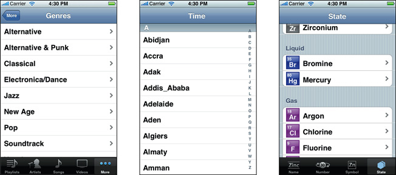

> 导航：[总目录](../../../README.md) · [documentation](../../../_indexes/documentation.md)

[Next](Table%20View%20Styles%20and%20Accessory%20Views.md)

# About Table Views in iOS Apps

Table views are versatile user interface objects frequently found in iOS apps. A table view presents data in a scrollable list of multiple rows that may be divided into sections.

Table views have many purposes:

- To let users navigate through hierarchically structured data
- To present an indexed list of items
- To display detail information and controls in visually distinct groupings
- To present a selectable list of options

__Figure I-1__  Table views of various kinds

A table view has only one column and allows vertical scrolling only. It consists of rows in sections. Each section can have a header and a footer that displays text or an image. However, many table views have only one section with no visible header or footer. Programmatically, the UIKit framework identifies rows and sections through their index number: Sections are numbered 0 through _n_ – 1 from the top of a table view to the bottom; rows are numbered 0 through _n_ – 1 within a section. A table view can have its own header and footer, distinct from any section; the table header appears before the first row of the first section, and the table footer appears after the last row of the last section.

## At a Glance

A table view is an instance of the [UITableView](https://developer.apple.com/documentation/uikit/uitableview) class in one of two basic styles, plain or grouped. A plain table view is an unbroken list; a grouped table view has visually distinct sections. A table view has a [data source and might have a delegate](https://developer.apple.com/library/archive/documentation/General/Conceptual/DevPedia-CocoaCore/Delegation.html#//apple_ref/doc/uid/TP40008195-CH14). The data source object provides the data for populating the sections and rows of the table view. The delegate object customizes its appearance and behavior.

__Related chapters:__ [Table View Styles and Accessory Views](Table%20View%20Styles%20and%20Accessory%20Views.md#apple-f4xwc4dqnrsv64tfmyxwi33df52wszbpkridimbqga3tinjrfvbuqmznknltc)

### Table Views Draw Their Rows Using Cells

A table view draws its visible rows using cells—that is, [UITableViewCell](https://developer.apple.com/documentation/uikit/uitableviewcell) objects. Cells are views that can display text, images, or other kinds of content. They can have background views for both normal and selected states. Cells can also have accessory views, which function as controls for selecting or setting an option.

The UIKit framework defines four standard cell styles, each with its own layout of the three default content elements: main label, detail label, and image. You may also create your own custom cells to acquire a distinctive style for your app’s table views.

When you configure the attributes of a table view in the storyboard editor, you choose between two types of cell content: static cells or dynamic prototypes.

- __Static cells__. Use static cells to design a table with a fixed number of rows, each with its own layout. Use static cells when you know what the table looks like at design time, regardless of the specific information it displays.
- __Dynamic prototypes__. Use dynamic prototypes to design one cell and then use it as the template for other cells in the table. Use a dynamic prototype when multiple cells in a table should use the same layout to display information. Dynamic prototype content is managed by the data source at runtime, with an arbitrary number of cells.

__Related Chapters:__ [Table View Styles and Accessory Views](Table%20View%20Styles%20and%20Accessory%20Views.md#apple-f4xwc4dqnrsv64tfmyxwi33df52wszbpkridimbqga3tinjrfvbuqmznknltc), [A Closer Look at Table View Cells](A%20Closer%20Look%20at%20Table%20View%20Cells.md#apple-f4xwc4dqnrsv64tfmyxwi33df52wszbpkridimbqga3tinjrfvbuqnznknltc)

### Responding to Selections of Rows

When users select a row (by tapping it), the delegate of the table view is informed via a message. The delegate is passed the indexes of the row and the section that the row is in. It uses this information to locate the corresponding item in the app’s data model. This item might be at an intermediate level in the hierarchy of data or it might be a “leaf node" in the hierarchy. If the item is at an intermediate level, the app displays a new table view. If the item is a leaf node, the app displays details about the selected item in a grouped-style table view or some other kind of view.

In table views that list a series of options, tapping a row simply selects its associated option. No subsequent view of data is displayed.

__Related Chapters:__ [Navigating a Data Hierarchy with Table Views](Navigating%20a%20Data%20Hierarchy%20with%20Table%20Views.md#apple-f4xwc4dqnrsv64tfmyxwi33df52wszbpkridimbqga3tinjrfvbuqnjnknlti), [Managing Selections](Managing%20Selections.md#apple-f4xwc4dqnrsv64tfmyxwi33df52wszbpkridimbqga3tinjrfvbuqojnknltm)

### In Editing Mode You Can Add, Delete, and Reorder Rows

Table views can enter an editing mode in which users can insert or delete rows, or relocate them within the table. In editing mode, rows that are marked for insertion or deletion display a green plus sign (insertion) or a red minus sign (deletion) near the left edge of the row. If users touch a deletion control or, in some table views, swipe across a row, a red Delete button appears, prompting users to delete that row. Rows that can be relocated display (near their right edge) an image consisting of several horizontal lines. When the table view leaves editing mode, the insertion, deletion, and reordering controls disappear.

When users attempt to insert, delete, or reorder rows, the table view sends a sequence of messages to its data source and delegate so that they can manage these operations.

__Related Chapters:__ [Inserting and Deleting Rows and Sections](Inserting%20and%20Deleting%20Rows%20and%20Sections.md#apple-f4xwc4dqnrsv64tfmyxwi33df52wszbpkridimbqga3tinjrfvbuqmjqfvjvomi), [Managing the Reordering of Rows](Managing%20the%20Reordering%20of%20Rows.md#apple-f4xwc4dqnrsv64tfmyxwi33df52wszbpkridimbqga3tinjrfvbuqmjrfvjvomi)

### To Create a Table View, Use a Storyboard

The easiest and recommended way to create and manage a table view is to use a custom [UITableViewController](https://developer.apple.com/documentation/uikit/uitableviewcontroller) object in a storyboard. If your app is based largely on table views, create your Xcode project using the Master-Detail Application template. This template includes an initial custom `UITableViewController` class and a storyboard for the scenes in the user interface, including the custom view controller and its table view. In the storyboard editor, choose one of the two styles for this table view and design its content.

At runtime, `UITableViewController` creates the table view and assigns itself as delegate and data source. Immediately after it’s created, the table view asks its data source for the number of sections, the number of rows in each section, and the table view cell to use to draw each row. The data source manages the application data used for populating the sections and rows of the table view.

__Related Chapters:__ [Navigating a Data Hierarchy with Table Views](Navigating%20a%20Data%20Hierarchy%20with%20Table%20Views.md#apple-f4xwc4dqnrsv64tfmyxwi33df52wszbpkridimbqga3tinjrfvbuqnjnknlti), [Creating and Configuring a Table View](Creating%20and%20Configuring%20a%20Table%20View.md#apple-f4xwc4dqnrsv64tfmyxwi33df52wszbpkridimbqga3tinjrfvbuqnrnknltcma)

## Prerequisites

Before reading this document, you should read _[Start Developing iOS Apps Today (Retired)](https://developer.apple.com/library/archive/referencelibrary/GettingStarted/RoadMapiOS-Legacy/index.html#//apple_ref/doc/uid/TP40011343)_ to understand the basic process for developing iOS apps. Then read _[View Controller Programming Guide for iOS](../../../featuredarticles/View%20Controller%20Programming%20Guide%20for%20iOS/index.md#apple-f4xwc4dqnrsv64tfmyxwi33df52wszbpkridimbqga3tinjx)_ for a comprehensive look at view controllers and storyboards. Finally, to gain valuable hands-on experience using table views in a storyboard, read the tutorial _[Your Second iOS App: Storyboards](../../iPhone/Your%20Second%20iOS%20App-%20Storyboards/About%20Creating%20Your%20Second%20iOS%20App.md#apple-f4xwc4dqnrsv64tfmyxwi33df52wszbpkridimbqgeytgmjy)_.

The information presented in this introduction and in [Table View Styles and Accessory Views](Table%20View%20Styles%20and%20Accessory%20Views.md#apple-f4xwc4dqnrsv64tfmyxwi33df52wszbpkridimbqga3tinjrfvbuqmznknltc) summarizes prescriptive information on table views presented in _iOS Human Interface Guidelines_. You can find a complete description of the styles and characteristics of table views, as well as their recommended uses, in the chapter Content Views.

## See Also

You will find the following sample code projects to be instructive models for your own table view implementations:

- _[SimpleDrillDown](../../../samplecode/SimpleDrillDown/SimpleDrillDown.md#apple-f4xwc4dqnrsv64tfmyxwi33df52wszbpirkfgnbqgaydonbrgy)_ project
- _[Table View Animations and Gestures](../../../samplecode/Table%20View%20Animations%20and%20Gestures/Table%20View%20Animations%20and%20Gestures.md#apple-f4xwc4dqnrsv64tfmyxwi33df52wszbpirkfgnbqgaytamjthe)_ project

For guidance on how to use the standard container view controllers provided by UIKit, see _[View Controller Catalog for iOS](../../Windows%20Views/View%20Controller%20Catalog%20for%20iOS/About%20View%20Controllers.md#apple-f4xwc4dqnrsv64tfmyxwi33df52wszbpkridimbqgeytgmjt)_. This document describes split view controllers and navigation controllers, which can both contain table view controllers as children.

[Next](Table%20View%20Styles%20and%20Accessory%20Views.md)
