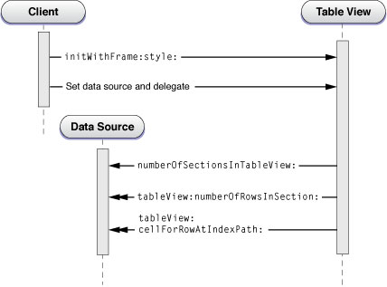
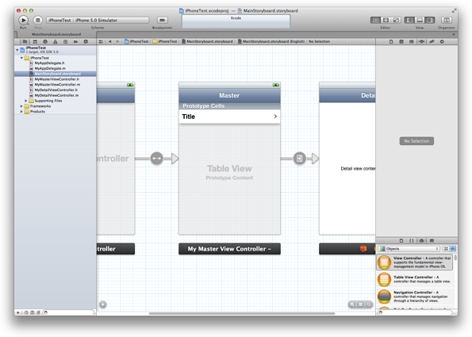
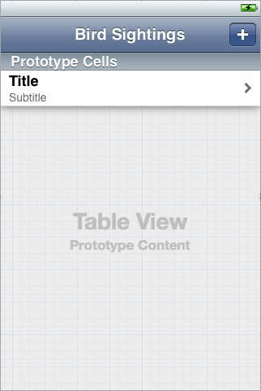
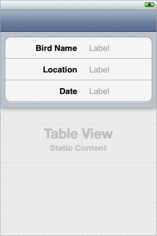

> 导航：[总目录](../../../README.md) · [documentation](../../../_indexes/documentation.md) · [Table View Programming Guide for iOS](About%20Table%20Views%20in%20iOS%20Apps.md)


[Next](A%20Closer%20Look%20at%20Table%20View%20Cells.md)[Previous](Navigating%20a%20Data%20Hierarchy%20with%20Table%20Views.md)

# Creating and Configuring a Table View

Your app must present a table view to users before it can manage it in response to taps on rows and other actions. This chapter shows what you must do to create a table view, configure it, and populate it with data.

Most of the code examples shown in this chapter come from the sample projects _[UITableView Fundamentals for iOS](../../../samplecode/UITableView%20Fundamentals%20for%20iOS/UITableView%20Fundamentals%20for%20iOS.md#apple-f4xwc4dqnrsv64tfmyxwi33df52wszbpirkfgnbqgaydomzrha)_ and _[TheElements](../../../samplecode/TheElements/TheElements.md#apple-f4xwc4dqnrsv64tfmyxwi33df52wszbpirkfgnbqgaydonbrhe)_.

## Basics of Table View Creation

To create a table view, several entities in an app must interact: the view controller, the table view itself, and the table view’s [data source and delegate](https://developer.apple.com/library/archive/documentation/General/Conceptual/DevPedia-CocoaCore/Delegation.html#//apple_ref/doc/uid/TP40008195-CH14). The view controller, data source, and delegate are usually the same object. The view controller starts the calling sequence, diagrammed in [Figure 4-1](#apple-f4xwc4dqnrsv64tfmyxwi33df52wszbpkridimbqga3tinjrfvbuqnrnknltc).

1. The view controller creates a [UITableView](https://developer.apple.com/documentation/uikit/uitableview) instance in a certain frame and style. It can do this either programmatically or in a storyboard. The frame is usually set to the screen frame, minus the height of the status bar or, in a navigation-based app, to the screen frame minus the heights of the status bar and the navigation bar. The view controller may also set global properties of the table view at this point, such as its autoresizing behavior or a global row height.

   To learn how to create table views in a storyboard and programmatically, see [Creating a Table View Using a Storyboard](#apple-f4xwc4dqnrsv64tfmyxwi33df52wszbpkridimbqga3tinjrfvbuqnrnknlte) and [Creating a Table View Programmatically](#apple-f4xwc4dqnrsv64tfmyxwi33df52wszbpkridimbqga3tinjrfvbuqnrnknlti).
2. The view controller sets the data source and delegate of the table view and sends a [reloadData](https://developer.apple.com/documentation/uikit/uitableview/1614862-reloaddata) message to it. The data source must adopt the [UITableViewDataSource](https://developer.apple.com/documentation/uikit/uitableviewdatasource) protocol, and the delegate must adopt the [UITableViewDelegate](https://developer.apple.com/documentation/uikit/uitableviewdelegate) protocol.
3. The data source receives a [numberOfSectionsInTableView:](https://developer.apple.com/documentation/uikit/uitableviewdatasource/1614860-numberofsectionsintableview) message from the [UITableView](https://developer.apple.com/documentation/uikit/uitableview) object and returns the number of sections in the table view. Although this is an optional protocol method, the data source must implement it if the table view has more than one section.
4. For each section, the data source receives a [tableView:numberOfRowsInSection:](https://developer.apple.com/documentation/uikit/uitableviewdatasource/1614931-tableview) message and responds by returning the number of rows for the section.
5. The data source receives a [tableView:cellForRowAtIndexPath:](https://developer.apple.com/documentation/uikit/uitableviewdatasource/1614861-tableview) message for each visible row in the table view. It responds by configuring and returning a [UITableViewCell](https://developer.apple.com/documentation/uikit/uitableviewcell) object for each row. The [UITableView](https://developer.apple.com/documentation/uikit/uitableview) object uses this cell to draw the row.

__Figure 4-1__  Calling sequence for creating and configuring a table view



The diagram in Figure 4-1 shows the required [protocol](https://developer.apple.com/library/archive/documentation/General/Conceptual/DevPedia-CocoaCore/Protocol.html#//apple_ref/doc/uid/TP40008195-CH45) methods as well as the [numberOfSectionsInTableView:](https://developer.apple.com/documentation/uikit/uitableviewdatasource/1614860-numberofsectionsintableview) method. Populating the table view with data occurs in steps 3 through 5. To learn how to implement the methods in these steps, see [Populating a Dynamic Table View with Data](#apple-f4xwc4dqnrsv64tfmyxwi33df52wszbpkridimbqga3tinjrfvbuqnrnknltk).

The data source and the delegate may implement other optional methods of their protocols to further configure the table view. For example, the data source might want to provide titles for each of the sections in the table view by implementing the [tableView:titleForHeaderInSection:](https://developer.apple.com/documentation/uikit/uitableviewdatasource/1614850-tableview) method. For more on some of these optional table view customizations, see [Optional Table View Configurations](#apple-f4xwc4dqnrsv64tfmyxwi33df52wszbpkridimbqga3tinjrfvbuqnrnknltg).

You create a table view in either the plain style ([UITableViewStylePlain](https://developer.apple.com/documentation/uikit/uitableview/style/plain)) or the grouped style ([UITableViewStyleGrouped](https://developer.apple.com/documentation/uikit/uitableview/style/grouped)). (You specify the style in a storyboard.) Although the procedure for creating a table view in either styles is identical, you may want to perform different kinds of configurations. For example, because a grouped table view generally presents item detail, you may also want to add custom accessory views (for example, switches and sliders) or custom content (for example, text fields). For an example, see [A Closer Look at Table View Cells](A%20Closer%20Look%20at%20Table%20View%20Cells.md#apple-f4xwc4dqnrsv64tfmyxwi33df52wszbpkridimbqga3tinjrfvbuqnznknltc).

## Recommendations for Creating and Configuring Table Views

There are many ways to put together a table view app. For example, you can use an instance of a custom `NSObject` subclass to create, configure, and manage a table view. However, you will find the task much easier if you adopt the classes, techniques, and design patterns that the UIKit framework offers for this purpose. The following approaches are recommended:

- Use an instance of a subclass of [UITableViewController](https://developer.apple.com/documentation/uikit/uitableviewcontroller) to create and manage a table view.

  Most apps use a custom `UITableViewController` object to manage a table view. As described in [Navigating a Data Hierarchy with Table Views](Navigating%20a%20Data%20Hierarchy%20with%20Table%20Views.md#apple-f4xwc4dqnrsv64tfmyxwi33df52wszbpkridimbqga3tinjrfvbuqnjnknlti), `UITableViewController` automatically creates a table view, assigns itself as both [delegate and data source](https://developer.apple.com/library/archive/documentation/General/Conceptual/DevPedia-CocoaCore/Delegation.html#//apple_ref/doc/uid/TP40008195-CH14) (and adopts the corresponding [protocols](https://developer.apple.com/library/archive/documentation/General/Conceptual/DevPedia-CocoaCore/Protocol.html#//apple_ref/doc/uid/TP40008195-CH45)), and initiates the procedure for populating the table view with data. It also takes care of several other “housekeeping” details of behavior. The behavior of `UITableViewController` (a subclass of [UIViewController](https://developer.apple.com/documentation/uikit/uiviewcontroller)) within the navigation controller architecture is described in [Table View Controllers](Navigating%20a%20Data%20Hierarchy%20with%20Table%20Views.md#apple-f4xwc4dqnrsv64tfmyxwi33df52wszbpkridimbqga3tinjrfvbuqnjnknltc).
- If your app is largely based on table views, select the Master-Detail Application template provided by Xcode when you create your project.

  As described in [Creating a Table View Using a Storyboard](#apple-f4xwc4dqnrsv64tfmyxwi33df52wszbpkridimbqga3tinjrfvbuqnrnknlte), the template includes stub code and a [storyboard](https://developer.apple.com/library/archive/documentation/General/Conceptual/Devpedia-CocoaApp/Storyboard.html#//apple_ref/doc/uid/TP40009071-CH99) defining an app delegate, the navigation controller, and the master [view controller](https://developer.apple.com/library/archive/documentation/General/Conceptual/DevPedia-CocoaCore/ControllerObject.html#//apple_ref/doc/uid/TP40008195-CH11) (which is an instance of a custom subclass of `UITableViewController`).
- For successive table views, you should implement custom `UITableViewController` objects. You can either load them from a storyboard or create the associated table views programmatically.

  Although either option is possible, the storyboard route is generally easier.

If the view to be managed is a composite view in which a table view is one of multiple subviews, you must use a custom subclass of [UIViewController](https://developer.apple.com/documentation/uikit/uiviewcontroller) to manage the table view (and other views). Do not use `UITableViewController`, because this controller class sizes the table view to fill the screen between the navigation bar and the tab bar (if either is present).

## Creating a Table View Using a Storyboard

Create an app with a table view using Xcode. When you create your project, select a template that contains stub code and a [storyboard](https://developer.apple.com/library/archive/documentation/General/Conceptual/Devpedia-CocoaApp/Storyboard.html#//apple_ref/doc/uid/TP40009071-CH99) that, by default, supply the structure for setting up and managing table views.

To create an app structured around table views

1. In Xcode, choose File > New > Project.
2. In the iOS section at the left side of the dialog, select Application.
3. In the main area of the dialog, select Master-Detail Application and then click Next.
4. Choose your project options (make sure Use Storyboard is selected), and then click Next.
5. Choose a save location for your project and then click Create.

Depending on which device family you chose in step 4, the project has one or two storyboards. To display the storyboard canvas, double-click a storyboard file in the project navigator. If the device family is iPhone, for example, your storyboard should contain a table view controller that looks similar to the one in Figure 4-2.

__Figure 4-2__  The master view controller in the Master-Detail Application storyboard

To make sure that the scene on the canvas represents the master view controller class in your code

1. On the canvas, click the scene’s title bar to select the table view controller.
2. Click the Identity button at the top of the utility area to open the Identity inspector.
3. Verify that the Class field contains the project’s custom subclass of `UITableViewController`.

### Choose the Table View’s Display Style

As described in [Table View Styles](Table%20View%20Styles%20and%20Accessory%20Views.md#apple-f4xwc4dqnrsv64tfmyxwi33df52wszbpkridimbqga3tinjrfvbuqmznknlti), every table view has a display style: plain or grouped.

To choose the display style of a table view in a storyboard

1. Click the center of the scene to select the table view.
2. In the utility area, display the Attributes inspector.
3. In the Table View section of the Attributes inspector, use the Style pop-up menu to choose Plain or Grouped.

### Choose the Table View’s Content Type

Storyboards introduce two convenient ways to design a table view’s content:

- __Dynamic prototypes__. Design a prototype cell and then use it as the template for other cells in the table. Use a dynamic prototype when multiple cells in a table should use the same layout to display information. Dynamic content is managed by the table view data source (the table view controller) at runtime, with an arbitrary number of cells. Figure 4-3 shows a plain table view with a one prototype cell.

  __Figure 4-3__  A dynamic table view

  

  __Note:__ If a table view in a storyboard is dynamic, the custom subclass of [UITableViewController](https://developer.apple.com/documentation/uikit/uitableviewcontroller) that contains the table view needs to implement the data source protocol. For more information, see [Populating a Dynamic Table View with Data](#apple-f4xwc4dqnrsv64tfmyxwi33df52wszbpkridimbqga3tinjrfvbuqnrnknltk).
- __Static cells__. Use static content to design the overall layout of the table, including the total number of cells. A table view with static content has a fixed set of cells that you can configure at design time. You can also configure other static data elements such as section headers. Use static cells when a table does not change its layout, regardless of the specific information it displays. Figure 4-4 shows a grouped table view with three static cells.

  __Figure 4-4__  A static table view

  

  __Note:__ If a table view in a storyboard is static, the custom subclass of [UITableViewController](https://developer.apple.com/documentation/uikit/uitableviewcontroller) that contains the table view should _not_ implement the data source protocol. Instead, the table view controller should use its [viewDidLoad](https://developer.apple.com/documentation/uikit/uiviewcontroller/1621495-viewdidload) method to populate the table view’s data. For more information, see [Populating a Static Table View With Data](#apple-f4xwc4dqnrsv64tfmyxwi33df52wszbpkridimbqga3tinjrfvbuqnrnknltgmi).

By default, when you add a table view controller to a storyboard, the controller contains a table view that uses prototype-based cells. If you want to use static cells:

1. Select the table view.
2. Display the Attributes inspector.
3. In the the Content pop-up menu, choose Static Cells.

If you’re designing a prototype cell, the table view needs a way to identify the prototype when the data source dequeues reusable cells for the table at runtime. You do this by assigning a reuse identifier to the cell. In the Table View Cell section of the Attributes inspector, enter a string in the Identifier text field, which you will also use when asking for a new cell of that type. To make understanding the code easier, a cell’s reuse identifier should describe what the cell contains. For example, a cell for displaying bird sightings might have an identifier of `@”BirdSightingCell”`.

### Design the Table View’s Rows

As described in [Standard Styles for Table View Cells](Table%20View%20Styles%20and%20Accessory%20Views.md#apple-f4xwc4dqnrsv64tfmyxwi33df52wszbpkridimbqga3tinjrfvbuqmznknltcna), UIKit defines four styles for the cells that a table view uses to draw its rows. You can use one of the four standard styles, design a custom style, or subclass [UITableViewCell](https://developer.apple.com/documentation/uikit/uitableviewcell) to define additional behavior or properties for the cell. This topic is covered in detail in [A Closer Look at Table View Cells](A%20Closer%20Look%20at%20Table%20View%20Cells.md#apple-f4xwc4dqnrsv64tfmyxwi33df52wszbpkridimbqga3tinjrfvbuqnznknltc).

A table view cell can also have an accessory, as described in [Accessory Views](Table%20View%20Styles%20and%20Accessory%20Views.md#apple-f4xwc4dqnrsv64tfmyxwi33df52wszbpkridimbqga3tinjrfvbuqmznknlte). An accessory is a standard user interface element that UIKit draws at the right end of a table cell. For example, the disclosure indicator, which looks similar to a right angle bracket (>), tells users that tapping an item reveals related information in a new screen. In the Attributes inspector, use the Accessory pop‐up menu to select a cell’s accessory.

### Create Additional Table Views

If your app displays and manages more than one table view, add those table views to your storyboard. You add a table view by adding a custom `UITableViewController` object, which contains the table view it manages.

To add custom class files to your project

1. In Xcode, choose File > New > File.
2. In the iOS section at the left side of the dialog, select Cocoa Touch.
3. In the main area of the dialog, select Objective-C class, and then click Next.
4. Enter a name for your new class, choose subclass of `UITableViewController`, and then click Next.
5. Choose a save location for your class files, and then click Create.
To add a table view controller to a storyboard

1. Display the storyboard to which you want to add the table view controller.
2. Drag a table view controller out of the object library and drop it on the storyboard.
3. With the new scene still selected on the canvas, click the Identity button in the utility area to open the Identity inspector.
4. In the Custom Class section, choose the new custom class in the Class pop-up menu.
5. Set the new table view’s style and cell content (dynamic or static).
6. Create a segue to the new scene.

The details of step 7 vary depending on the project. To learn more about adding segues, see _[Xcode Overview](../../Tools%20Languages/Xcode%20Overview/index.md#apple-f4xwc4dqnrsv64tfmyxwi33df52wszbpkridimbqgeydemjv)_.

__Note:__ Populating a table view with data and configuring a table view are discussed in [Populating a Dynamic Table View with Data](#apple-f4xwc4dqnrsv64tfmyxwi33df52wszbpkridimbqga3tinjrfvbuqnrnknltk) and [Optional Table View Configurations](#apple-f4xwc4dqnrsv64tfmyxwi33df52wszbpkridimbqga3tinjrfvbuqnrnknltg).

### Learn More by Creating a Sample App

The tutorial _[Your Second iOS App: Storyboards](../../iPhone/Your%20Second%20iOS%20App-%20Storyboards/About%20Creating%20Your%20Second%20iOS%20App.md#apple-f4xwc4dqnrsv64tfmyxwi33df52wszbpkridimbqgeytgmjy)_ shows how to create a sample app that is structured around table views. After you complete the steps in this tutorial, you’ll have a working knowledge of how to create both dynamic and static table views using a storyboard. The tutorial creates a basic navigation-based app called BirdWatching that uses table view controllers connected by both push and modal segues.

## Creating a Table View Programmatically

If you choose not to use [UITableViewController](https://developer.apple.com/documentation/uikit/uitableviewcontroller) for table view management, you must replicate what this class gives you “for free.”

### Adopt the Data Source and Delegate Protocols

The class creating the table view typically makes itself the [data source and delegate](https://developer.apple.com/library/archive/documentation/General/Conceptual/DevPedia-CocoaCore/Delegation.html#//apple_ref/doc/uid/TP40008195-CH14) by adopting the [UITableViewDataSource](https://developer.apple.com/documentation/uikit/uitableviewdatasource) and [UITableViewDelegate](https://developer.apple.com/documentation/uikit/uitableviewdelegate) [protocols](https://developer.apple.com/library/archive/documentation/General/Conceptual/DevPedia-CocoaCore/Protocol.html#//apple_ref/doc/uid/TP40008195-CH45). The adoption syntax appears just after the superclass in the `@interface` directive, as shown in Listing 4-1.

__Listing 4-1__  Adopting the data source and delegate protocols

```objc
@interface RootViewController : UIViewController <UITableViewDelegate, UITableViewDataSource>

@property (nonatomic, strong) NSArray *timeZoneNames;
@end
```

### Create and Configure a Table View

The next step is for the client to [allocate and initialize](https://developer.apple.com/library/archive/documentation/General/Conceptual/DevPedia-CocoaCore/ObjectCreation.html#//apple_ref/doc/uid/TP40008195-CH39) an instance of the [UITableView](https://developer.apple.com/documentation/uikit/uitableview) class. Listing 4-2 gives an example of a client that creates a [UITableView](https://developer.apple.com/documentation/uikit/uitableview) object in the plain style, specifies its autoresizing characteristics, and then sets itself to be both data source and delegate. Again, keep in mind that the [UITableViewController](https://developer.apple.com/documentation/uikit/uitableviewcontroller) does all of this for you automatically.

__Listing 4-2__  Creating a table view

```objc
- (void)loadView
{
    UITableView *tableView = [[UITableView alloc] initWithFrame:[[UIScreen mainScreen] applicationFrame] style:UITableViewStylePlain];
    tableView.autoresizingMask = UIViewAutoresizingFlexibleHeight|UIViewAutoresizingFlexibleWidth;
    tableView.delegate = self;
    tableView.dataSource = self;
    [tableView reloadData];

    self.view = tableView;
}
```

Because in this example the class creating the table view is a subclass of `UIViewController`, it assigns the created table view to its `view` property, which it inherits from that class. It also sends a [reloadData](https://developer.apple.com/documentation/uikit/uitableview/1614862-reloaddata) message to the table view, causing the table view to initiate the procedure for populating its sections and rows with data.

## Populating a Dynamic Table View with Data

Just after a table view object is created, it receives a [reloadData](https://developer.apple.com/documentation/uikit/uitableview/1614862-reloaddata) message, which tells it to start querying the [data source and delegate](https://developer.apple.com/library/archive/documentation/General/Conceptual/DevPedia-CocoaCore/Delegation.html#//apple_ref/doc/uid/TP40008195-CH14) for the information it needs for the sections and rows it displays. The table view immediately asks the data source for its logical dimensions—that is, the number of sections and the number of rows in each section. It then repeatedly invokes the [tableView:cellForRowAtIndexPath:](https://developer.apple.com/documentation/uikit/uitableviewdatasource/1614861-tableview) method to get a cell object for each visible row; it uses this [UITableViewCell](https://developer.apple.com/documentation/uikit/uitableviewcell) object to draw the content of the row. (Scrolling a table view also causes an invocation of [tableView:cellForRowAtIndexPath:](https://developer.apple.com/documentation/uikit/uitableviewdatasource/1614861-tableview) for each newly visible row.)

As noted in [Choose the Table View’s Content Type](#apple-f4xwc4dqnrsv64tfmyxwi33df52wszbpkridimbqga3tinjrfvbuqnrnknlteny), if the table view is dynamic then you need to implement the required data source methods. Listing 4-3 shows an example of how the data source and the delegate could configure a dynamic table view.

__Listing 4-3__  Populating a dynamic table view with data

```objc
- (NSInteger)numberOfSectionsInTableView:(UITableView *)tableView {
    return [regions count];
}

- (NSInteger)tableView:(UITableView *)tableView numberOfRowsInSection:(NSInteger)section {
    // Number of rows is the number of time zones in the region for the specified section.
    Region *region = [regions objectAtIndex:section];
    return [region.timeZoneWrappers count];
}

- (NSString *)tableView:(UITableView *)tableView titleForHeaderInSection:(NSInteger)section {
    // The header for the section is the region name -- get this from the region at the section index.
    Region *region = [regions objectAtIndex:section];
    return [region name];
}

- (UITableViewCell *)tableView:(UITableView *)tableView cellForRowAtIndexPath:(NSIndexPath *)indexPath {
    static NSString *MyIdentifier = @"MyReuseIdentifier";
    UITableViewCell *cell = [tableView dequeueReusableCellWithIdentifier:MyIdentifier];
    if (cell == nil) {
        cell = [[UITableViewCell alloc] initWithStyle:UITableViewCellStyleDefault  reuseIdentifier:MyIdentifier];
    }
    Region *region = [regions objectAtIndex:indexPath.section];
    TimeZoneWrapper *timeZoneWrapper = [region.timeZoneWrappers objectAtIndex:indexPath.row];
    cell.textLabel.text = timeZoneWrapper.localeName;
    return cell;
}
```

The data source, in its implementation of the [tableView:cellForRowAtIndexPath:](https://developer.apple.com/documentation/uikit/uitableviewdatasource/1614861-tableview) method, returns a configured cell object that the table view can use to draw a row. For performance reasons, the data source tries to reuse cells as much as possible. It first asks the table view for a specific reusable cell object by sending it a [dequeueReusableCellWithIdentifier:](https://developer.apple.com/documentation/uikit/uitableview/1614891-dequeuereusablecell) message. If no such object exists, the data source creates it, assigning it a reuse identifier. The data source sets the cell’s content (in this example, its text) and returns it. [A Closer Look at Table View Cells](A%20Closer%20Look%20at%20Table%20View%20Cells.md#apple-f4xwc4dqnrsv64tfmyxwi33df52wszbpkridimbqga3tinjrfvbuqnznknltc) discusses this data source method and [UITableViewCell](https://developer.apple.com/documentation/uikit/uitableviewcell) objects in more detail.

If the [dequeueReusableCellWithIdentifier:](https://developer.apple.com/documentation/uikit/uitableview/1614891-dequeuereusablecell) method asks for a cell that’s defined in a storyboard, the method always returns a valid cell. If there is not a recycled cell waiting to be reused, the method creates a new one using the information in the storyboard itself. This eliminates the need to check the return value for `nil` and create a cell manually.

The implementation of the `tableView:cellForRowAtIndexPath:` method in Listing 4-3 includes an [NSIndexPath](https://developer.apple.com/documentation/foundation/nsindexpath) argument that identifies the table view section and row. UIKit declares a [category](https://developer.apple.com/library/archive/documentation/General/Conceptual/DevPedia-CocoaCore/Category.html#//apple_ref/doc/uid/TP40008195-CH5) of the `NSIndexPath` class, which is defined in the Foundation framework. This category extends the class to enable the identification of table view rows by section and row number. For more information on this category, see _NSIndexPath UIKit Additions_.

## Populating a Static Table View With Data

As noted in [Choose the Table View’s Content Type](#apple-f4xwc4dqnrsv64tfmyxwi33df52wszbpkridimbqga3tinjrfvbuqnrnknlteny), if a table view is static then you should not implement any data source methods. The configuration of the table view is known at compile time, so UIKit can get this information from the storyboard at runtime. However, you still need to populate a static table view with data from your data model. Populating a Static Table View With Data shows an example of how a table view controller could load user data in a static table view. This example is adapted from _[Your Second iOS App: Storyboards](../../iPhone/Your%20Second%20iOS%20App-%20Storyboards/About%20Creating%20Your%20Second%20iOS%20App.md#apple-f4xwc4dqnrsv64tfmyxwi33df52wszbpkridimbqgeytgmjy)_.

__Listing 4-4__  Populating a static table view with data

```objc
- (void)viewDidLoad
{
    [super viewDidLoad];

    BirdSighting *theSighting = self.sighting;
    static NSDateFormatter *formatter = nil;
    if (formatter == nil) {
        formatter = [[NSDateFormatter alloc] init];
        [formatter setDateStyle:NSDateFormatterMediumStyle];
    }
    if (theSighting) {
        self.birdNameLabel.text = theSighting.name;
        self.locationLabel.text = theSighting.location;
        self.dateLabel.text = [formatter stringFromDate:(NSDate*)theSighting.date];
    }
}
```

The table view is populated with data in the [UIViewController](https://developer.apple.com/documentation/uikit/uiviewcontroller) method [viewDidLoad](https://developer.apple.com/documentation/uikit/uiviewcontroller/1621495-viewdidload), which is called after the view is loaded into memory. The data is passed to the table view controller in the `sighting` object, which is set in the previous view controller’s [prepareForSegue:sender:](https://developer.apple.com/documentation/uikit/uiviewcontroller/1621490-prepareforsegue) method. The properties `birdNameLabel`, `locationLabel`, and `dateLabel` are outlets connected to labels in the static table view (see [Figure 4-4](#apple-f4xwc4dqnrsv64tfmyxwi33df52wszbpkridimbqga3tinjrfvbuqnrnknltenq)).

## Populating an Indexed List

An indexed list (see [Figure 1-2](Table%20View%20Styles%20and%20Accessory%20Views.md#apple-f4xwc4dqnrsv64tfmyxwi33df52wszbpkridimbqga3tinjrfvbuqmznknltm)) is ideally suited for navigating large amounts of data organized by a conventional ordering scheme such as an alphabet. An indexed list is a table view in the plain style that is specially configured through three `UITableViewDataSource` methods:

- [sectionIndexTitlesForTableView:](https://developer.apple.com/documentation/uikit/uitableviewdatasource/1614857-sectionindextitles)

  Returns an array of the strings to use as the index entries (in order).
- [tableView:titleForHeaderInSection:](https://developer.apple.com/documentation/uikit/uitableviewdatasource/1614850-tableview)

  Maps these index strings to the titles of the table view’s sections (they don’t have to be the same).
- [tableView:sectionForSectionIndexTitle:atIndex:](https://developer.apple.com/documentation/uikit/uitableviewdatasource/1614933-tableview)

  Returns the section index related to the entry the user tapped in the index.

The data you use to populate an indexed list should be organized to reflect this indexing model. Specifically, you need to build an [array of arrays](https://developer.apple.com/library/archive/documentation/General/Conceptual/DevPedia-CocoaCore/Collection.html#//apple_ref/doc/uid/TP40008195-CH10). Each inner array corresponds to a section in the table. Section arrays are sorted (or collated) within the outer array according to the prevailing ordering scheme, which is often an alphabetical scheme (for example, A through Z). Additionally, the items in each section array are sorted. You can build and sort this array of arrays yourself, but fortunately the [UILocalizedIndexedCollation](https://developer.apple.com/documentation/uikit/uilocalizedindexedcollation) class greatly simplifies the tasks of building and sorting these data structures and providing data to the table view. The class also collates items in the arrays according to the current localization.

However you internally manage this array-of-arrays structure is up to you. The objects to be collated should have a [property](https://developer.apple.com/library/archive/documentation/General/Conceptual/DevPedia-CocoaCore/DeclaredProperty.html#//apple_ref/doc/uid/TP40008195-CH13) or method that returns a string value that the `UILocalizedIndexedCollation` class uses in collation; if it is a method, it should have no parameters. You might find it convenient to define a custom [model class](https://developer.apple.com/library/archive/documentation/General/Conceptual/DevPedia-CocoaCore/ModelObject.html#//apple_ref/doc/uid/TP40008195-CH31) whose instances represent the rows in the table view. These model objects not only return a string value but also define a property that holds the index of the section array to which the object is assigned. Listing 4-5 illustrates the definition of a class that declares a `name` property and a `sectionNumber` property.

__Listing 4-5__  Defining the model-object interface

```objc
@interface State : NSObject

@property(nonatomic,copy) NSString *name;
@property(nonatomic,copy) NSString *capitol;
@property(nonatomic,copy) NSString *population;
@property NSInteger sectionNumber;
@end
```

Before your table view [controller](https://developer.apple.com/library/archive/documentation/General/Conceptual/DevPedia-CocoaCore/ControllerObject.html#//apple_ref/doc/uid/TP40008195-CH11) is asked to populate the table view, you load the data to be used (from whatever source) and create instances of your model class from this data. The example in Listing 4-6 loads data defined in a property list and creates the model objects from that. It also obtains the shared instance of [UILocalizedIndexedCollation](https://developer.apple.com/documentation/uikit/uilocalizedindexedcollation) and [initializes](https://developer.apple.com/library/archive/documentation/General/Conceptual/DevPedia-CocoaCore/Initialization.html#//apple_ref/doc/uid/TP40008195-CH21) the [mutable](https://developer.apple.com/library/archive/documentation/General/Conceptual/DevPedia-CocoaCore/ObjectMutability.html#//apple_ref/doc/uid/TP40008195-CH42) array (`states`) that will contain the section arrays.

__Listing 4-6__  Loading the table-view data and initializing the model objects

```objc
- (void)viewDidLoad {
    [super viewDidLoad];
    UILocalizedIndexedCollation *theCollation = [UILocalizedIndexedCollation currentCollation];
    self.states = [NSMutableArray arrayWithCapacity:1];

    NSString *thePath = [[NSBundle mainBundle] pathForResource:@"States" ofType:@"plist"];
    NSArray *tempArray;
    NSMutableArray *statesTemp;
    if (thePath && (tempArray = [NSArray arrayWithContentsOfFile:thePath]) ) {
        statesTemp = [NSMutableArray arrayWithCapacity:1];
        for (NSDictionary *stateDict in tempArray) {
            State *aState = [[State alloc] init];
            aState.name = [stateDict objectForKey:@"Name"];
            aState.population = [stateDict objectForKey:@"Population"];
            aState.capitol = [stateDict objectForKey:@"Capitol"];
            [statesTemp addObject:aState];
        }
    } else  {
        return;
    }
```

After the [data source](https://developer.apple.com/library/archive/documentation/General/Conceptual/DevPedia-CocoaCore/Delegation.html#//apple_ref/doc/uid/TP40008195-CH14) has this “raw” array of model objects, it can process it with the facilities of the [UILocalizedIndexedCollation](https://developer.apple.com/documentation/uikit/uilocalizedindexedcollation) class. In Listing 4-7, the code is annotated with numbers.

__Listing 4-7__  Preparing the data for the indexed list

```
    // viewDidLoad continued...
    // (1)
    for (State *theState in statesTemp) {
        NSInteger sect = [theCollation sectionForObject:theState collationStringSelector:@selector(name)];
        theState.sectionNumber = sect;
    }
    // (2)
    NSInteger highSection = [[theCollation sectionTitles] count];
    NSMutableArray *sectionArrays = [NSMutableArray arrayWithCapacity:highSection];
    for (int i = 0; i < highSection; i++) {
        NSMutableArray *sectionArray = [NSMutableArray arrayWithCapacity:1];
        [sectionArrays addObject:sectionArray];
    }
    // (3)
    for (State *theState in statesTemp) {
        [(NSMutableArray *)[sectionArrays objectAtIndex:theState.sectionNumber] addObject:theState];
    }
    // (4)
    for (NSMutableArray *sectionArray in sectionArrays) {
        NSArray *sortedSection = [theCollation sortedArrayFromArray:sectionArray
            collationStringSelector:@selector(name)];
        [self.states addObject:sortedSection];
    }
} // end of viewDidLoad
```

Here's what the code in Listing 4-7 does:

1. The data source enumerates the array of model objects and sends [sectionForObject:collationStringSelector:](https://developer.apple.com/documentation/uikit/uilocalizedindexedcollation/1620378-section) to the collation manager on each iteration. This method takes as arguments a model object and a property or method of the object that it uses in collation. Each call returns the index of the section array to which the model object belongs, and that value is assigned to the `sectionNumber` property.
2. The data source source then creates a (temporary) outer mutable array and mutable arrays for each section; it adds each created section array to the outer array.
3. It then enumerates the array of model objects and adds each object to its assigned section array.
4. The data source enumerates the array of section arrays and calls [sortedArrayFromArray:collationStringSelector:](https://developer.apple.com/documentation/uikit/uilocalizedindexedcollation/1620382-sortedarray) on the collation manager to sort the items in each array. It passes in a section array and a property or method that is to be used in sorting the items in the array. Each sorted section array is added to the final outer array.

Now the data source is ready to populate its table view with data. It implements the methods specific to indexed lists as shown in Listing 4-8. In doing this it calls two [UILocalizedIndexedCollation](https://developer.apple.com/documentation/uikit/uilocalizedindexedcollation) methods: [sectionIndexTitles](https://developer.apple.com/documentation/uikit/uilocalizedindexedcollation/1620383-sectionindextitles) and [sectionForSectionIndexTitleAtIndex:](https://developer.apple.com/documentation/uikit/uilocalizedindexedcollation/1620380-sectionforsectionindextitleatind). Also note that in [tableView:titleForHeaderInSection:](https://developer.apple.com/documentation/uikit/uitableviewdatasource/1614850-tableview) it suppresses any headers from appearing in the table view when the associated section does not have any items.

__Listing 4-8__  Providing section-index data to the table view

```objc
- (NSArray *)sectionIndexTitlesForTableView:(UITableView *)tableView {
    return [[UILocalizedIndexedCollation currentCollation] sectionIndexTitles];
}

- (NSString *)tableView:(UITableView *)tableView titleForHeaderInSection:(NSInteger)section {
    if ([[self.states objectAtIndex:section] count] > 0) {
        return [[[UILocalizedIndexedCollation currentCollation] sectionTitles] objectAtIndex:section];
    }
    return nil;
}

- (NSInteger)tableView:(UITableView *)tableView sectionForSectionIndexTitle:(NSString *)title atIndex:(NSInteger)index
{
    return [[UILocalizedIndexedCollation currentCollation] sectionForSectionIndexTitleAtIndex:index];
}
```

__Accessibility Note:__ To change what VoiceOver reads aloud when the indexed list is selected, assign a localized string to the [accessibilityLabel](https://developer.apple.com/documentation/uikit/uiaccessibilityelement/1619577-accessibilitylabel) property of each item in the array that [sectionIndexTitlesForTableView:](https://developer.apple.com/documentation/uikit/uitableviewdatasource/1614857-sectionindextitles) returns.

Finally, the data source should implement the `UITableViewDataSource` methods that are common to all table views. Listing 4-9 gives examples of these implementations, and illustrates how to use the `section` and `row` properties of the table view–specific [category](https://developer.apple.com/library/archive/documentation/General/Conceptual/DevPedia-CocoaCore/Category.html#//apple_ref/doc/uid/TP40008195-CH5) of the [NSIndexPath](https://developer.apple.com/documentation/foundation/nsindexpath) class described in _NSIndexPath UIKit Additions_.

__Listing 4-9__  Populating the rows of an indexed list

```objc
- (NSInteger)numberOfSectionsInTableView:(UITableView *)tableView {
    return [self.states count];
}

- (NSInteger)tableView:(UITableView *)tableView numberOfRowsInSection:(NSInteger)section {
    return [[self.states objectAtIndex:section] count];
}

- (UITableViewCell *)tableView:(UITableView *)tableView cellForRowAtIndexPath:(NSIndexPath *)indexPath {
    static NSString *CellIdentifier = @"StateCell";
    UITableViewCell *cell;
    cell = [tableView dequeueReusableCellWithIdentifier:CellIdentifier];
    if (cell == nil) {
        cell = [[UITableViewCell alloc] initWithStyle:UITableViewCellStyleDefault reuseIdentifier:CellIdentifier];
    }
    State *stateObj = [[self.states objectAtIndex:indexPath.section] objectAtIndex:indexPath.row];
    cell.textLabel.text = stateObj.name;
    return cell;
}
```

For table views that are indexed lists, when the data source assigns cells for rows in [tableView:cellForRowAtIndexPath:](https://developer.apple.com/documentation/uikit/uitableviewdatasource/1614861-tableview), it should ensure that the [accessoryType](https://developer.apple.com/documentation/uikit/uitableviewcell/1623228-accessorytype) property of the cell is set to `UITableViewCellAccessoryNone`.

After initially populating the table view following the procedure outlined above, you can reload the contents of the index by calling the [reloadSectionIndexTitles](https://developer.apple.com/documentation/uikit/uitableview/1614932-reloadsectionindextitles) method.

## Optional Table View Configurations

The table view API allows you to configure various visual and behavioral aspects of a table view, including specific rows and sections. The following examples serve to give you some idea of the options available to you.

### Add a Custom Title

In the same block of code that creates the table view, you can apply global configurations using certain methods of the [UITableView](https://developer.apple.com/documentation/uikit/uitableview) class. The code example in Listing 4-10 adds a custom title for the table view (using a [UILabel](https://developer.apple.com/documentation/uikit/uilabel) object).

__Listing 4-10__  Adding a title to the table view

```objc
- (void)loadView
{
    CGRect titleRect = CGRectMake(0, 0, 300, 40);
    UILabel *tableTitle = [[UILabel alloc] initWithFrame:titleRect];
    tableTitle.textColor = [UIColor blueColor];
    tableTitle.backgroundColor = [self.tableView backgroundColor];
    tableTitle.opaque = YES;
    tableTitle.font = [UIFont boldSystemFontOfSize:18];
    tableTitle.text = [curTrail objectForKey:@"Name"];
    self.tableView.tableHeaderView = tableTitle;
    [self.tableView reloadData];
}
```

### Provide a Section Title

The example in Listing 4-11 returns a title string for a section.

__Listing 4-11__  Returning a title for a section

```objc
- (NSString *)tableView:(UITableView *)tableView titleForHeaderInSection:(NSInteger)section {
    // Returns section title based on physical state: [solid, liquid, gas, artificial]
    return [[[PeriodicElements sharedPeriodicElements] elementPhysicalStatesArray] objectAtIndex:section];
}
```

### Indent a Row

The code in Listing 4-12 moves a specific row to the next level of indentation.

__Listing 4-12__  Custom indentation of a row

```objc
- (NSInteger)tableView:(UITableView *)tableView indentationLevelForRowAtIndexPath:(NSIndexPath *)indexPath {
    if ( indexPath.section==TRAIL_MAP_SECTION && indexPath.row==0 ) {
        return 2;
    }
    return 1;
}
```

### Vary a Row’s Height

The example in Listing 4-13 varies the height of a specific row based on its index value.

__Listing 4-13__  Varying row height

```objc
- (CGFloat)tableView:(UITableView *)tableView heightForRowAtIndexPath:(NSIndexPath *)indexPath
{
    CGFloat result;

    switch ([indexPath row])
    {
        case 0:
        {
            result = kUIRowHeight;
            break;
        }
        case 1:
        {
            result = kUIRowLabelHeight;
            break;
        }
    }
    return result;
}
```

### Customize Cells

You can also affect the appearance of rows by returning custom [UITableViewCell](https://developer.apple.com/documentation/uikit/uitableviewcell) objects with specially formatted subviews for content in [tableView:cellForRowAtIndexPath:](https://developer.apple.com/documentation/uikit/uitableviewdatasource/1614861-tableview). Cell customization is discussed in [A Closer Look at Table View Cells](A%20Closer%20Look%20at%20Table%20View%20Cells.md#apple-f4xwc4dqnrsv64tfmyxwi33df52wszbpkridimbqga3tinjrfvbuqnznknltc).

[Next](A%20Closer%20Look%20at%20Table%20View%20Cells.md)[Previous](Navigating%20a%20Data%20Hierarchy%20with%20Table%20Views.md)
