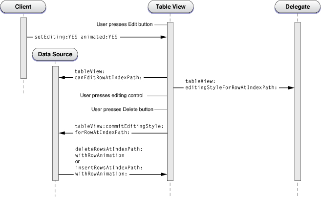
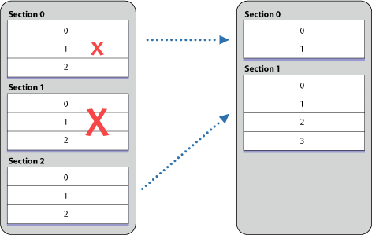

> 导航：[总目录](../../../README.md) · [documentation](../../../_indexes/documentation.md) · [Table View Programming Guide for iOS](About%20Table%20Views%20in%20iOS%20Apps.md)


[Next](Managing%20the%20Reordering%20of%20Rows.md)[Previous](Managing%20Selections.md)

# Inserting and Deleting Rows and Sections

A table view has an editing mode as well as its normal (selection) mode. When a table view goes into editing mode, it displays the editing and reordering controls associated with its rows. The editing controls, which are in the left side of the row, allow the user to insert and delete rows in the table view. The editing controls have distinctive appearances:

|  |  |
| --- | --- |
| deletion control | Deletion control |
| insertion control | Insertion control |

When a table view enters editing mode and when users click an editing control, the table view sends a series of messages to its [data source and delegate](https://developer.apple.com/library/archive/documentation/General/Conceptual/DevPedia-CocoaCore/Delegation.html#//apple_ref/doc/uid/TP40008195-CH14), but only if they implement these methods. These methods allow the data source and delegate to refine the appearance and behavior of rows in the table view; the messages also enable them to carry out the deletion or insertion operation.

Even if a table view is not in editing mode, you can insert or delete a number of rows or sections as a group and have those operations animated.

The first section below shows you how, when a table is in editing mode, to insert new rows and delete existing rows in a table view in response to user actions. The second section, [Batch Insertion, Deletion, and Reloading of Rows and Sections](#apple-f4xwc4dqnrsv64tfmyxwi33df52wszbpkridimbqga3tinjrfvbuqmjqfvjvooi), discusses how you can insert and delete multiple sections and rows animated as a group.

__Note:__ The procedure for reordering rows when in editing mode is described in [Managing the Reordering of Rows](Managing%20the%20Reordering%20of%20Rows.md#apple-f4xwc4dqnrsv64tfmyxwi33df52wszbpkridimbqga3tinjrfvbuqmjrfvjvomi).

## Inserting and Deleting Rows in Editing Mode

### When a Table View is Edited

A table view goes into editing mode when it receives a [setEditing:animated:](https://developer.apple.com/documentation/uikit/uitableview/1614876-setediting) message. Typically (but not necessarily) the message originates as an action message sent when the user taps an Edit button in the navigation bar. In editing mode, a table view displays any editing (and reordering) controls that its [delegate](https://developer.apple.com/library/archive/documentation/General/Conceptual/DevPedia-CocoaCore/Delegation.html#//apple_ref/doc/uid/TP40008195-CH14) has assigned to each row. The delegate assigns the controls as a result of returning the editing style for a row in the [tableView:editingStyleForRowAtIndexPath:](https://developer.apple.com/documentation/uikit/uitableviewdelegate/1614869-tableview) method.

__Note:__ If a [UIViewController](https://developer.apple.com/documentation/uikit/uiviewcontroller) object is managing the table view, it automatically receives a `setEditing:animated:` message when the Edit button is tapped. In its implementation of this message, it can update button state or do any other kind of task before invoking the table view’s version of the method.

When the table view receives [setEditing:animated:](https://developer.apple.com/documentation/uikit/uitableview/1614876-setediting), it sends the same message to the [UITableViewCell](https://developer.apple.com/documentation/uikit/uitableviewcell) object for each visible row. Then it sends a succession of messages to its data source and its delegate (if they implement the methods) as depicted in the diagram in Figure 7-1.

__Figure 7-1__  Calling sequence for inserting or deleting rows in a table view



After resending [setEditing:animated:](https://developer.apple.com/documentation/uikit/uitableview/1614876-setediting) to the cells corresponding to the visible rows, the sequence of messages is as follows:

1. The table view invokes the [tableView:canEditRowAtIndexPath:](https://developer.apple.com/documentation/uikit/uitableviewdatasource/1614900-tableview) method if its data source implements it. This method allows the application to exclude rows in the table view from being edited even when their cell’s [editingStyle](https://developer.apple.com/documentation/uikit/uitableviewcell/1623234-editingstyle) property indicates otherwise. Most applications do not need to implement this method.
2. The table view invokes the [tableView:editingStyleForRowAtIndexPath:](https://developer.apple.com/documentation/uikit/uitableviewdelegate/1614869-tableview) method if its delegate implements it. This method allows the application to specify a row’s editing style and thus the editing control that the row displays.

   At this point, the table view is fully in editing mode. It displays the insertion or deletion control for each eligible row.
3. The user taps an editing control (either the deletion control or the insertion control). If he or she taps a deletion control, a Delete button is displayed on the row. The user then taps that button to confirm the deletion.
4. The table view sends the [tableView:commitEditingStyle:forRowAtIndexPath:](https://developer.apple.com/documentation/uikit/uitableviewdatasource/1614871-tableview) message to the data source. Although this [protocol](https://developer.apple.com/library/archive/documentation/General/Conceptual/DevPedia-CocoaCore/Protocol.html#//apple_ref/doc/uid/TP40008195-CH45) method is marked as optional, the data source must implement it if it wants to insert or delete a row. It must do two things:

   - Send [deleteRowsAtIndexPaths:withRowAnimation:](https://developer.apple.com/documentation/uikit/uitableview/1614960-deleterowsatindexpaths) or [insertRowsAtIndexPaths:withRowAnimation:](https://developer.apple.com/documentation/uikit/uitableview/1614879-insertrowsatindexpaths) to the table view to direct it to adjust its presentation.
   - Update the corresponding data-model array by either deleting the referenced item from the array or adding an item to the array.

When the user swipes across a row to display the Delete button for that row, there is a variation in the calling sequence diagrammed in [Figure 7-1](#apple-f4xwc4dqnrsv64tfmyxwi33df52wszbpkridimbqga3tinjrfvbuqmjqfvjvomy). When the user swipes a row to delete it, the table view first checks to see if its data source has implemented the [tableView:commitEditingStyle:forRowAtIndexPath:](https://developer.apple.com/documentation/uikit/uitableviewdatasource/1614871-tableview) method; if that is so, it sends [setEditing:animated:](https://developer.apple.com/documentation/uikit/uitableview/1614876-setediting) to itself and enters editing mode. In this “swipe to delete” mode, the table view does not display the editing and reordering controls. Because this is a user-driven event, it also brackets the messages to the delegate inside of two other messages: [tableView:willBeginEditingRowAtIndexPath:](https://developer.apple.com/documentation/uikit/uitableviewdelegate/1614907-tableview) and [tableView:didEndEditingRowAtIndexPath:](https://developer.apple.com/documentation/uikit/uitableviewdelegate/1614963-tableview). By implementing these methods, the delegate can update the appearance of the table view appropriately.

__Note:__ The data source should not call `setEditing:animated:` from within its implementation of `tableView:commitEditingStyle:forRowAtIndexPath:`. If for some reason it must, it should invoke it after a delay by using the [performSelector:withObject:afterDelay:](https://developer.apple.com/library/archive/documentation/LegacyTechnologies/WebObjects/WebObjects_3.5/Reference/Frameworks/ObjC/Foundation/Classes/NSObject/Description.html#//apple_ref/occ/instm/NSObject/performSelector:withObject:afterDelay:) method.

Although you can use an insertion control as the trigger to insert a new row in a table view, an alternative approach is to have an Add (or plus sign) button in the navigation bar. Tapping the button sends an action message to the view controller, which overlays the table view with a modal view for entering the new item. Once the item is entered, the controller adds it to the data-model array and reloads the table. [An Example of Adding a Table-View Row](#apple-f4xwc4dqnrsv64tfmyxwi33df52wszbpkridimbqga3tinjrfvbuqmjqfvjvoni) discusses this approach.

### An Example of Deleting a Table-View Row

This section gives a guided tour through the parts of a project that work together to set up a table view for editing mode and delete rows from it. This project uses the navigation controller and [view controller](https://developer.apple.com/library/archive/documentation/General/Conceptual/DevPedia-CocoaCore/ControllerObject.html#//apple_ref/doc/uid/TP40008195-CH11) architecture to manage its table views. In its [loadView](https://developer.apple.com/documentation/uikit/uiviewcontroller/1621454-loadview) method, the custom view controller creates the table view and sets itself to be the [data source and delegate](https://developer.apple.com/library/archive/documentation/General/Conceptual/DevPedia-CocoaCore/Delegation.html#//apple_ref/doc/uid/TP40008195-CH14). It also sets the right item of the navigation bar to be the standard Edit button.

```
self.navigationItem.rightBarButtonItem = self.editButtonItem;
```

This button is preconfigured to send [setEditing:animated:](https://developer.apple.com/documentation/uikit/uitableview/1614876-setediting) to the view controller when tapped; it toggles the button title (between Edit and Done) and the Boolean _editing_ parameter on alternating taps. In its implementation of the method, as shown in Listing 7-1, the view controller invokes the superclass invocation of the method, sends the same message to the table view, and updates the enabled state of the other button in the navigation bar (a plus-sign button, for adding items).

__Listing 7-1__  View controller responding to `setEditing:animated:`

```objc
- (void)setEditing:(BOOL)editing animated:(BOOL)animated {
    [super setEditing:editing animated:animated];
    [tableView setEditing:editing animated:YES];
    if (editing) {
        addButton.enabled = NO;
    } else {
        addButton.enabled = YES;
    }
}
```

When its table view enters editing mode, the view controller specifies a deletion control for every row except the last, which has an insertion control. It does this in its implementation of the [tableView:editingStyleForRowAtIndexPath:](https://developer.apple.com/documentation/uikit/uitableviewdelegate/1614869-tableview) method (Listing 7-2).

__Listing 7-2__  Customizing the editing style of rows

```objc
- (UITableViewCellEditingStyle)tableView:(UITableView *)tableView editingStyleForRowAtIndexPath:(NSIndexPath *)indexPath {
    SimpleEditableListAppDelegate *controller = (SimpleEditableListAppDelegate *)[[UIApplication sharedApplication] delegate];
    if (indexPath.row == [controller countOfList]-1) {
        return UITableViewCellEditingStyleInsert;
    } else {
        return UITableViewCellEditingStyleDelete;
    }
}
```

The user taps the deletion control in a row and the view controller receives a [tableView:commitEditingStyle:forRowAtIndexPath:](https://developer.apple.com/documentation/uikit/uitableviewdatasource/1614871-tableview) message from the table view. As shown in Listing 7-3, it handles this message by removing the item corresponding to the row from a model array and sending [deleteRowsAtIndexPaths:withRowAnimation:](https://developer.apple.com/documentation/uikit/uitableview/1614960-deleterowsatindexpaths) to the table view.

__Listing 7-3__  Updating the data-model array and deleting the row

```objc
- (void)tableView:(UITableView *)tableView commitEditingStyle:(UITableViewCellEditingStyle)editingStyle forRowAtIndexPath:(NSIndexPath *)indexPath {
    // If row is deleted, remove it from the list.
    if (editingStyle == UITableViewCellEditingStyleDelete) {
        SimpleEditableListAppDelegate *controller = (SimpleEditableListAppDelegate *)[[UIApplication sharedApplication] delegate];
        [controller removeObjectFromListAtIndex:indexPath.row];
        [tableView deleteRowsAtIndexPaths:[NSArray arrayWithObject:indexPath] withRowAnimation:UITableViewRowAnimationFade];
    }
}
```

### An Example of Adding a Table-View Row

This section shows project code that inserts a row in a table view. Instead of using the insertion control as the trigger for inserting a row, it uses an Add button (visually a plus sign) in the navigation bar above the table view. This code also is based on the navigation controller and view controller architecture. In its [loadView](https://developer.apple.com/documentation/uikit/uiviewcontroller/1621454-loadview) method implementation, the view controller assigns the Add button as the right-side item of the navigation bar using the code shown in Listing 7-4.

__Listing 7-4__  Adding an Add button to the navigation bar

```
    addButton = [[UIBarButtonItem alloc] initWithBarButtonSystemItem:UIBarButtonSystemItemAdd target:self action:@selector(addItem:)];
    self.navigationItem.rightBarButtonItem = addButton;
```

Note that the view controller sets the control states for the title as well as the action [selector](https://developer.apple.com/library/archive/documentation/General/Conceptual/DevPedia-CocoaCore/Selector.html#//apple_ref/doc/uid/TP40008195-CH48) and the target object. When the user taps the Add button, the `addItem:` message is sent to the target (the view controller). It responds as shown in Listing 7-5. It creates a navigation controller with a single view controller whose view is put onscreen modally—it animates upward to overlay the table view. The [presentModalViewController:animated:](https://developer.apple.com/documentation/uikit/uiviewcontroller/1621465-presentmodalviewcontroller) method to do this.

__Listing 7-5__  Responding to a tap on the Add button

```objc
- (void)addItem:sender {
    if (itemInputController == nil) {
        itemInputController = [[ItemInputController alloc] init];
    }
    UINavigationController *navigationController = [[UINavigationController alloc] initWithRootViewController:itemInputController];
    [[self navigationController] presentModalViewController:navigationController animated:YES];
}
```

The modal, or overlay, view consists of a single custom text field. The user enters text for the new table-view item and then taps a Save button. This button sends a `save:` action message to its target: the view controller for the modal view. As shown in Listing 7-6, the view controller extracts the string value from the text field and updates the application’s data-model array with it.

__Listing 7-6__  Adding the new item to the data-model array

```objc
- (void)save:sender {

    UITextField *textField = [(EditableTableViewTextField *)[tableView cellForRowAtIndexPath:[NSIndexPath indexPathForRow:0 inSection:0]] textField];

    SimpleEditableListAppDelegate *controller = (SimpleEditableListAppDelegate *)[[UIApplication sharedApplication] delegate];
    NSString *newItem = textField.text;
    if (newItem != nil) {
            [controller insertObject:newItem inListAtIndex:[controller countOfList]];
    }
    [self dismissModalViewControllerAnimated:YES];
}
```

After the modal view is dismissed the table view is reloaded, and it now reflects the added item.

## Batch Insertion, Deletion, and Reloading of Rows and Sections

The [UITableView](https://developer.apple.com/documentation/uikit/uitableview) class allows you to insert, delete, and reload a group of rows or sections at one time, animating the operations simultaneously in specified ways. The eight methods shown in Listing 7-7 pertain to batch insertion and deletion. Note that you can call these insertion and deletion methods outside of an animation block (as you do in the data source method [tableView:commitEditingStyle:forRowAtIndexPath:](https://developer.apple.com/documentation/uikit/uitableviewdatasource/1614871-tableview) as discussed in [Inserting and Deleting Rows in Editing Mode](#apple-f4xwc4dqnrsv64tfmyxwi33df52wszbpkridimbqga3tinjrfvbuqmjqfvjvomjz)).

__Listing 7-7__  Batch insertion and deletion methods

```objc
- (void)beginUpdates;
- (void)endUpdates;

- (void)insertSections:(NSIndexSet *)sections withRowAnimation:(UITableViewRowAnimation)animation;
- (void)deleteSections:(NSIndexSet *)sections withRowAnimation:(UITableViewRowAnimation)animation;
- (void)reloadSections:(NSIndexSet *)sections withRowAnimation:(UITableViewRowAnimation)animation;

- (void)insertRowsAtIndexPaths:(NSArray *)indexPaths withRowAnimation: (UITableViewRowAnimation)animation;
- (void)deleteRowsAtIndexPaths:(NSArray *)indexPaths withRowAnimation: (UITableViewRowAnimation)animation;
- (void)reloadRowsAtIndexPaths:(NSArray *)indexPaths withRowAnimation:(UITableViewRowAnimation)animation;
```

__Note:__ The [reloadSections:withRowAnimation:](https://developer.apple.com/documentation/uikit/uitableview/1614954-reloadsections) and [reloadRowsAtIndexPaths:withRowAnimation:](https://developer.apple.com/documentation/uikit/uitableview/1614935-reloadrowsatindexpaths) methods, which were introduced in iOS 3.0, allow you to request the table view to reload the data for specific sections and rows instead of loading the entire visible table view by calling [reloadData](https://developer.apple.com/documentation/uikit/uitableview/1614862-reloaddata).

To animate a batch insertion, deletion, and reloading of rows and sections, call the corresponding methods within an animation block defined by successive calls to [beginUpdates](https://developer.apple.com/documentation/uikit/uitableview/1614908-beginupdates) and [endUpdates](https://developer.apple.com/documentation/uikit/uitableview/1614890-endupdates). If you don’t call the insertion, deletion, and reloading methods within this block, row and section indexes may be invalid. Calls to `beginUpdates` and `endUpdates` can be nested; all indexes are treated as if there were only the outer update block.

At the conclusion of a block—that is, after `endUpdates` returns—the table view queries its [data source and delegate](https://developer.apple.com/library/archive/documentation/General/Conceptual/DevPedia-CocoaCore/Delegation.html#//apple_ref/doc/uid/TP40008195-CH14) as usual for row and section data. Thus the [collection](https://developer.apple.com/library/archive/documentation/General/Conceptual/DevPedia-CocoaCore/Collection.html#//apple_ref/doc/uid/TP40008195-CH10) objects backing the table view should be updated to reflect the new or removed rows or sections.

### An Example of Batched Insertion and Deletion Operations

To insert and delete a group of rows and sections in a table view, first prepare the array (or arrays) that are the source of data for the sections and rows. After rows and sections are deleted and inserted, the resulting rows and sections are populated from this data store.

Next, call the [beginUpdates](https://developer.apple.com/documentation/uikit/uitableview/1614908-beginupdates) method, followed by invocations of [insertRowsAtIndexPaths:withRowAnimation:](https://developer.apple.com/documentation/uikit/uitableview/1614879-insertrowsatindexpaths), [deleteRowsAtIndexPaths:withRowAnimation:](https://developer.apple.com/documentation/uikit/uitableview/1614960-deleterowsatindexpaths), [insertSections:withRowAnimation:](https://developer.apple.com/documentation/uikit/uitableview/1614892-insertsections), or [deleteSections:withRowAnimation:](https://developer.apple.com/documentation/uikit/uitableview/1614922-deletesections). Conclude the animation block by calling [endUpdates](https://developer.apple.com/documentation/uikit/uitableview/1614890-endupdates). Listing 7-8 illustrates this procedure.

__Listing 7-8__  Inserting and deleting a block of rows in a table view

```objc
- (IBAction)insertAndDeleteRows:(id)sender {
    // original rows: Arizona, California, Delaware, New Jersey, Washington

    [states removeObjectAtIndex:4]; // Washington
    [states removeObjectAtIndex:2]; // Delaware
    [states insertObject:@"Alaska" atIndex:0];
    [states insertObject:@"Georgia" atIndex:3];
    [states insertObject:@"Virginia" atIndex:5];

    NSArray *deleteIndexPaths = [NSArray arrayWithObjects:
                                [NSIndexPath indexPathForRow:2 inSection:0],
                                [NSIndexPath indexPathForRow:4 inSection:0],
                                nil];
    NSArray *insertIndexPaths = [NSArray arrayWithObjects:
                                [NSIndexPath indexPathForRow:0 inSection:0],
                                [NSIndexPath indexPathForRow:3 inSection:0],
                                [NSIndexPath indexPathForRow:5 inSection:0],
                                nil];
    UITableView *tv = (UITableView *)self.view;

    [tv beginUpdates];
    [tv insertRowsAtIndexPaths:insertIndexPaths withRowAnimation:UITableViewRowAnimationRight];
    [tv deleteRowsAtIndexPaths:deleteIndexPaths withRowAnimation:UITableViewRowAnimationFade];
    [tv endUpdates];

    // ending rows: Alaska, Arizona, California, Georgia, New Jersey, Virginia
}
```

This example removes two strings from an array (and their corresponding rows) and inserts three strings into the array (along with their corresponding rows). The next section, Ordering of Operations and Index Paths, explains particular aspects of the row (or section) insertion and deletion behavior.

### Ordering of Operations and Index Paths

You might have noticed something in the code shown in Listing 7-8 that seems peculiar. The code calls the [deleteRowsAtIndexPaths:withRowAnimation:](https://developer.apple.com/documentation/uikit/uitableview/1614960-deleterowsatindexpaths) method after it calls [insertRowsAtIndexPaths:withRowAnimation:](https://developer.apple.com/documentation/uikit/uitableview/1614879-insertrowsatindexpaths). However, this is not the order in which [UITableView](https://developer.apple.com/documentation/uikit/uitableview) completes the operations. It defers any insertions of rows or sections until after it has handled the deletions of rows or sections. The table view behaves the same way with reloading methods called inside an update block—the reload takes place with respect to the indexes of rows and sections before the animation block is executed. This behavior happens regardless of the ordering of the insertion, deletion, and reloading method calls.

Deletion and reloading operations within an animation block specify which rows and sections in the original table should be removed or reloaded; insertions specify which rows and sections should be added to the resulting table. The index paths used to identify sections and rows follow this model. Inserting or removing an item in a mutable array, on the other hand, may affect the array index used for the successive insertion or removal operation; for example, if you insert an item at a certain index, the indexes of all subsequent items in the array are incremented.

An example is useful here. Say you have a table view with three sections, each with three rows. Then you implement the following animation block:

1. Begin updates.
2. Delete row at index 1 of section at index 0.
3. Delete section at index 1.
4. Insert row at index 1 of section at index 1.
5. End updates.

Figure 7-2 illustrates what takes place after the animation block concludes.

__Figure 7-2__  Deletion of section and row and insertion of row



[Next](Managing%20the%20Reordering%20of%20Rows.md)[Previous](Managing%20Selections.md)
