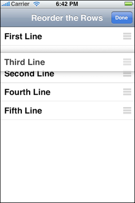
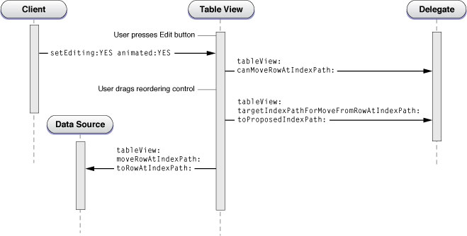

> 导航：[总目录](../../../README.md) · [documentation](../../../_indexes/documentation.md) · [Table View Programming Guide for iOS](About%20Table%20Views%20in%20iOS%20Apps.md)


[Next](Document%20Revision%20History.md)[Previous](Inserting%20and%20Deleting%20Rows%20and%20Sections.md)

# Managing the Reordering of Rows

A table view has an editing mode as well as its normal (selection) mode. When a table view goes into editing mode, it displays the editing and reordering controls associated with its rows. The reordering control allows the user to move a row to a different location in the table. As shown in Figure 8-1, the reordering control appears on the right side of the row.

__Figure 8-1__  Reordering a row



When a table view enters editing mode and when users drag a reordering control, the table view sends a series of messages to its [data source and delegate](https://developer.apple.com/library/archive/documentation/General/Conceptual/DevPedia-CocoaCore/Delegation.html#//apple_ref/doc/uid/TP40008195-CH14), but only if they implement these methods. These methods allow the data source and delegate to restrict whether and where a row can be moved as well to carry out the actual move operation. The following sections show you how to move rows around in a table view.

## What Happens When a Row is Relocated

A table view goes into editing mode when it receives a [setEditing:animated:](https://developer.apple.com/documentation/uikit/uitableview/1614876-setediting) message. This normally happens when the user taps an Edit button in the navigation bar, but you can implement your own controls if you wish. In editing mode, a table view displays any reordering and editing controls that its delegate has assigned to each row. The delegate assigns the controls in [tableView:cellForRowAtIndexPath:](https://developer.apple.com/documentation/uikit/uitableviewdatasource/1614861-tableview) by setting the [showsReorderControl](https://developer.apple.com/documentation/uikit/uitableviewcell/1623243-showsreordercontrol) property of [UITableViewCell](https://developer.apple.com/documentation/uikit/uitableviewcell) objects to `YES`. In order for reorder controls to appear, the data source must support reordering by implementing the [tableView:moveRowAtIndexPath:toIndexPath:](https://developer.apple.com/documentation/uikit/uitableviewdatasource/1614867-tableview) method.

__Note:__ If a [UIViewController](https://developer.apple.com/documentation/uikit/uiviewcontroller) object is managing the table view, it automatically receives a `setEditing:animated:` message when the Edit button is tapped. [UITableViewController](https://developer.apple.com/documentation/uikit/uitableviewcontroller), a subclass of `UIViewController`, implements this method to update button state and invoke the table view’s version of the method. If you are using `UIViewController` to manage a table view, you need to implement the same behavior.

When the table view receives [setEditing:animated:](https://developer.apple.com/documentation/uikit/uitableview/1614876-setediting), it sends the same message to the [UITableViewCell](https://developer.apple.com/documentation/uikit/uitableviewcell) object for each visible row. Then it sends a succession of messages to its data source and its delegate (if they implement the methods) as depicted in the diagram in Figure 8-2.

__Figure 8-2__  Calling sequence for reordering a row in a table view



When the table view receives the [setEditing:animated:](https://developer.apple.com/documentation/uikit/uitableview/1614876-setediting) message, it resends the same message to the cell objects corresponding to its visible rows. After that, the sequence of messages is as follows:

1. The table view sends a [tableView:canMoveRowAtIndexPath:](https://developer.apple.com/documentation/uikit/uitableviewdatasource/1614927-tableview) message to its data source (if it implements the method). In this method the delegate may selectively exclude certain rows from showing the reordering control.
2. The user drags a row by its reordering control up or down the table view. As the dragged row hovers over a part of the table view, the underlying row slides downward to show where the destination would be.
3. Every time the dragged row is over a destination, the table view sends [tableView:targetIndexPathForMoveFromRowAtIndexPath:toProposedIndexPath:](https://developer.apple.com/documentation/uikit/uitableviewdelegate/1614953-tableview) to its delegate (if it implements the method). In this method the delegate may reject the current destination for the dragged row and specify an alternative one.
4. The table view sends [tableView:moveRowAtIndexPath:toIndexPath:](https://developer.apple.com/documentation/uikit/uitableviewdatasource/1614867-tableview) to its data source (if it implements the method). In this method the data source updates the data-model array that is the source of items for the table view, moving the item to a different location in the array.

## Examples of Moving a Row

This section comments on some sample code that illustrates the reordering steps enumerated in [What Happens When a Row is Relocated](#apple-f4xwc4dqnrsv64tfmyxwi33df52wszbpkridimbqga3tinjrfvbuqmjrfvjvomq). Listing 8-1 shows an implementation of [tableView:canMoveRowAtIndexPath:](https://developer.apple.com/documentation/uikit/uitableviewdatasource/1614927-tableview) that excludes the first row in the table view from being reordered (this row does not have a reordering control).

__Listing 8-1__  Excluding a row from relocation

```objc
- (BOOL)tableView:(UITableView *)tableView canMoveRowAtIndexPath:(NSIndexPath *)indexPath {
    if (indexPath.row == 0) // Don't move the first row
      return NO;

   return YES;
}
```

When the user finishes dragging a row, it slides into its destination in the table view, which sends [tableView:moveRowAtIndexPath:toIndexPath:](https://developer.apple.com/documentation/uikit/uitableviewdatasource/1614867-tableview) to its [data source](https://developer.apple.com/library/archive/documentation/General/Conceptual/DevPedia-CocoaCore/Delegation.html#//apple_ref/doc/uid/TP40008195-CH14). Listing 8-2 shows an implementation of this method.

__Listing 8-2__  Updating the data-model array for the relocated row

```objc
- (void)tableView:(UITableView *)tableView moveRowAtIndexPath:(NSIndexPath *)sourceIndexPath toIndexPath:(NSIndexPath *)destinationIndexPath {
    NSString *stringToMove = [self.reorderingRows objectAtIndex:sourceIndexPath.row];
    [self.reorderingRows removeObjectAtIndex:sourceIndexPath.row];
    [self.reorderingRows insertObject:stringToMove atIndex:destinationIndexPath.row];
}
```

The delegate can also retarget the proposed destination for a move to another row by implementing the [tableView:targetIndexPathForMoveFromRowAtIndexPath:toProposedIndexPath:](https://developer.apple.com/documentation/uikit/uitableviewdelegate/1614953-tableview) method. The following example restricts rows to relocation in their own group and prevents moves to the last row of a group (which is reserved for the add-item placeholder).

__Listing 8-3__  Retargeting the destination row of a move operation

```objc
- (NSIndexPath *)tableView:(UITableView *)tableView
        targetIndexPathForMoveFromRowAtIndexPath:(NSIndexPath *)sourceIndexPath
        toProposedIndexPath:(NSIndexPath *)proposedDestinationIndexPath {
    NSDictionary *section = [data objectAtIndex:sourceIndexPath.section];
    NSUInteger sectionCount = [[section valueForKey:@"content"] count];
    if (sourceIndexPath.section != proposedDestinationIndexPath.section) {
        NSUInteger rowInSourceSection =
             (sourceIndexPath.section > proposedDestinationIndexPath.section) ?
               0 : sectionCount - 1;
        return [NSIndexPath indexPathForRow:rowInSourceSection inSection:sourceIndexPath.section];
    } else if (proposedDestinationIndexPath.row >= sectionCount) {
        return [NSIndexPath indexPathForRow:sectionCount - 1 inSection:sourceIndexPath.section];
    }
    // Allow the proposed destination.
    return proposedDestinationIndexPath;
}
```

[Next](Document%20Revision%20History.md)[Previous](Inserting%20and%20Deleting%20Rows%20and%20Sections.md)
