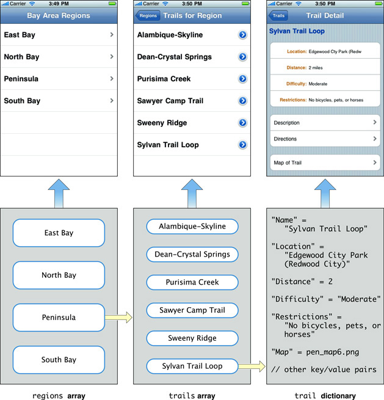
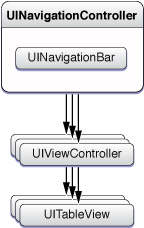
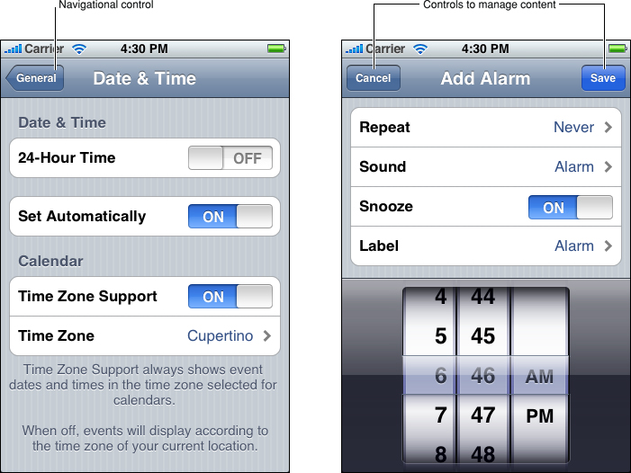
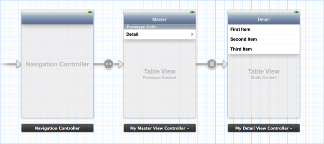

> 导航：[总目录](../../../README.md) · [documentation](../../../_indexes/documentation.md) · [Table View Programming Guide for iOS](About%20Table%20Views%20in%20iOS%20Apps.md)


[Next](Creating%20and%20Configuring%20a%20Table%20View.md)[Previous](Overview%20of%20the%20Table%20View%20API.md)

# Navigating a Data Hierarchy with Table Views

A common use of table views—and one to which they’re ideally suited—is to navigate hierarchies of data. A table view at a top level of the hierarchy lists categories of data at the most general level. Users select a row to “drill down” to the next level in the hierarchy. At the bottom of the hierarchy is a view (often a table view) that presents details about a specific item (for example, an address book record) and may allow users to edit the item. This section explains how you can map the levels of the data model hierarchy to a succession of table views and describes how you can use the facilities of the UIKit framework to help you implement such navigation-based apps.

## Hierarchical Data Models and Table Views

For a navigation-based app, you typically design your app data as a graph of [model objects](https://developer.apple.com/library/archive/documentation/General/Conceptual/DevPedia-CocoaCore/ModelObject.html#//apple_ref/doc/uid/TP40008195-CH31) that is sometimes referred to as the app’s _data model_. You can then implement the model layer of your app using various mechanisms or technologies, including Core Data, [property lists](https://developer.apple.com/library/archive/documentation/General/Conceptual/DevPedia-CocoaCore/PropertyList.html#//apple_ref/doc/uid/TP40008195-CH44), or [archives](https://developer.apple.com/library/archive/documentation/General/Conceptual/DevPedia-CocoaCore/Archiving.html#//apple_ref/doc/uid/TP40008195-CH1) of custom objects. Regardless of the approach, the traversal of your app’s data model follows patterns that are common to all navigation-based apps. The data model has hierarchical depth, and objects at various levels of this hierarchy should be the source for populating the rows of a table view.

__Note:__ To learn about the Core Data technology and framework, see _Core Data Starting Point_.

### The Data Model as a Hierarchy of Model Objects

A well-designed app factors its classes and objects in a way that conforms to the [Model-View-Controller](https://developer.apple.com/library/archive/documentation/General/Conceptual/DevPedia-CocoaCore/MVC.html#//apple_ref/doc/uid/TP40008195-CH32) (MVC) design pattern. The app’s data model consists of the model objects in this pattern. You can describe model objects (using the terminology provided by the [object modeling](https://developer.apple.com/library/archive/documentation/General/Conceptual/DevPedia-CocoaCore/ObjectModeling.html#//apple_ref/doc/uid/TP40008195-CH41) pattern) in terms of their properties. These properties are of two general kinds: attributes and relationships.

__Note:__ The notion of “property” here is abstractly related to, but not identical with, the [declared property](https://developer.apple.com/library/archive/documentation/General/Conceptual/DevPedia-CocoaCore/DeclaredProperty.html#//apple_ref/doc/uid/TP40008195-CH13) feature of Objective-C. A [class definition](https://developer.apple.com/library/archive/documentation/General/Conceptual/DevPedia-CocoaCore/ClassDefinition.html#//apple_ref/doc/uid/TP40008195-CH6) typically represents properties programmatically through instance variables and declared properties.

Attributes represent elements of model-object data. Attributes can range from [an instance of a primitive class](https://developer.apple.com/library/archive/documentation/General/Conceptual/DevPedia-CocoaCore/ValueObject.html#//apple_ref/doc/uid/TP40008195-CH51) (for example, an [NSString](https://developer.apple.com/library/archive/documentation/LegacyTechnologies/WebObjects/WebObjects_3.5/Reference/Frameworks/ObjC/Foundation/Classes/NSStringClassCluster/Description.html#//apple_ref/occ/cl/NSString), [NSDate](https://developer.apple.com/library/archive/documentation/LegacyTechnologies/WebObjects/WebObjects_3.5/Reference/Frameworks/ObjC/Foundation/Classes/NSDateClassCluster/Description.html#//apple_ref/occ/cl/NSDate), or [UIColor](https://developer.apple.com/documentation/uikit/uicolor) object) to a C structure or a simple scalar value. Attributes are generally what you use to populate a table view that represents a “leaf node” of the data hierarchy and that presents a detail view of that item.

A model object may also have relationships with other model objects. It is through these relationships that a data model acquires hierarchical depth by composing an object graph. Relationships are of two general kinds in terms of cardinality: to-one and to-many. To-one relationships define an object’s relationship with another object (for example, a parent relationship). A to-many relationship, on the other hand, defines an object’s relationship with multiple objects of the same kind. The to-many relationship is characterized by containment and can be programmatically represented by [collections](https://developer.apple.com/library/archive/documentation/General/Conceptual/DevPedia-CocoaCore/Collection.html#//apple_ref/doc/uid/TP40008195-CH10) such as [NSArray](https://developer.apple.com/library/archive/documentation/LegacyTechnologies/WebObjects/WebObjects_3.5/Reference/Frameworks/ObjC/Foundation/Classes/NSArrayClassCluster/Description.html#//apple_ref/occ/cl/NSArray) objects (or, simply, arrays). An array might contain other arrays, or it could contain multiple dictionaries, which are collections that identify their contained values through keys. Dictionaries, in turn, can contain one or more other collections, including arrays, sets, and even other dictionaries. As collections nest in other collections, your data model can acquire hierarchical depth.

### Table Views and the Data Model

The rows of a plain table view are typically backed by [collection objects](https://developer.apple.com/library/archive/documentation/General/Conceptual/DevPedia-CocoaCore/Collection.html#//apple_ref/doc/uid/TP40008195-CH10) of the app’s data model; these objects are usually arrays. Arrays contain strings or other elements that a table view can use when displaying row content. When you create a table view (described in [Creating and Configuring a Table View](Creating%20and%20Configuring%20a%20Table%20View.md#apple-f4xwc4dqnrsv64tfmyxwi33df52wszbpkridimbqga3tinjrfvbuqnrnknltcma)), it immediately queries its [data source](https://developer.apple.com/library/archive/documentation/General/Conceptual/DevPedia-CocoaCore/Delegation.html#//apple_ref/doc/uid/TP40008195-CH14) for its dimensions—that is, it requests the number of sections and the number of rows per section—and then asks for the content of each row. The data source fetches this content from an array in the appropriate level of the data-model hierarchy.

In many of the methods defined for a table view’s data source and [delegate](https://developer.apple.com/library/archive/documentation/General/Conceptual/DevPedia-CocoaCore/Delegation.html#//apple_ref/doc/uid/TP40008195-CH14), the table view passes in an index path to identify the section and row that is the focus of the current operation—for example, fetching content for a row or indicating the row the user tapped. An index path is an instance of the Foundation framework’s [NSIndexPath](https://developer.apple.com/documentation/foundation/nsindexpath) class that you can use to identify an item in a tree of nested arrays. The UIKit framework extends `NSIndexPath` to add a [section](https://developer.apple.com/documentation/foundation/nsindexpath/1528298-section) and a [row](https://developer.apple.com/documentation/foundation/nsindexpath/1614853-row) [property](https://developer.apple.com/library/archive/documentation/General/Conceptual/DevPedia-CocoaCore/DeclaredProperty.html#//apple_ref/doc/uid/TP40008195-CH13) to the class. The data source should use these properties to map a section and row of the table view to a value at the corresponding index of the array being used as the table view’s source of data.

__Note:__ The UIKit framework extension of the `NSIndexPath` class is described in _NSIndexPath UIKit Additions_.

In the sequence of table views in Figure 3-1, the top level of the data hierarchy is an array of four arrays, with each inner array containing objects representing the trails for a particular region. When the user selects one of these regions, the next table view lists names identifying the trails within the selected array. When the user selects a particular trail, the next table view describes that trail using a grouped table view.

__Figure 3-1__  Mapping levels of the data model to table views



__Note:__ You could easily redesign the app in [Figure 3-1](#apple-f4xwc4dqnrsv64tfmyxwi33df52wszbpkridimbqga3tinjrfvbuqnjnknlte) to have only two table views. The first table view would be an indexed list of trails by region. The second table view would display the detail for a selected trail.

## View Controllers and Navigation-Based Apps

The UIKit framework provides a number of view controller classes for managing common user interface patterns in iOS. View controllers are [controller objects](https://developer.apple.com/library/archive/documentation/General/Conceptual/DevPedia-CocoaCore/ControllerObject.html#//apple_ref/doc/uid/TP40008195-CH11) that inherit from the [UIViewController](https://developer.apple.com/documentation/uikit/uiviewcontroller) class. They are an essential tool for view management, especially when an app uses those views to present successive levels of its data hierarchy. This section describes how two subclasses of [UIViewController](https://developer.apple.com/documentation/uikit/uiviewcontroller), navigation controllers and table view controllers, present and manage a succession of table views.

__Note:__ This section gives an overview of view controllers to provide some background for the coding tasks discussed later in this document. To learn about view controllers in depth, see _[View Controller Programming Guide for iOS](../../../featuredarticles/View%20Controller%20Programming%20Guide%20for%20iOS/index.md#apple-f4xwc4dqnrsv64tfmyxwi33df52wszbpkridimbqga3tinjx)_.

### Navigation Controllers

The [UINavigationController](https://developer.apple.com/documentation/uikit/uinavigationcontroller) class inherits from [UIViewController](https://developer.apple.com/documentation/uikit/uiviewcontroller), a base class that defines the common programmatic interface and behavior for [controller objects](https://developer.apple.com/library/archive/documentation/General/Conceptual/DevPedia-CocoaCore/ControllerObject.html#//apple_ref/doc/uid/TP40008195-CH11) that manage views in iOS. Through inheritance from this base class, a view controller acquires an interface for general view management. After it implements parts of this interface, a view controller can autorotate its view, respond to low-memory notifications, overlay “modal” views, respond to taps on the Edit button, and otherwise manage the view.

A navigation controller maintains a stack of view controllers, one for each of the table views displayed (see Figure 3-2). It begins with what’s known as the _root view controller_. When the user taps a row of the table view (often on a detail disclosure button), the root view controller pushes the next view controller onto the stack. The new view controller’s table view visually slides into place from the right, and the navigation bar items are updated appropriately. When users tap the back button in the navigation bar, the current view controller is popped off the stack. As a consequence, the navigation controller displays the table view managed by the view controller that is now at the top of the stack.

__Figure 3-2__  Navigation controller and view controllers in a navigation-based app



### Navigation Bars

Navigation bars are a user-interface device that enables users to navigate a hierarchy of data. Users start with general, top-level items and “drill down” the hierarchy to detailed views showing specific properties of leaf-node items. The view below the navigation bar presents the current level of data. A navigation bar includes a title for the current view and, if that view is lower in the hierarchy than the top level, a back button on the left side of the bar; the back button is a navigation control that the user taps to return to the previous level. (The back button by default displays the title for the previous view.) A navigation bar may also have an Edit button—used to enter editing mode for the current view—or custom buttons for functions that manage content (see Figure 3-3).

__Figure 3-3__  Navigation bars and common control items



A [UINavigationController](https://developer.apple.com/documentation/uikit/uinavigationcontroller) manages the navigation bar, including the items that are displayed in the bar for the view below it. A `UIViewController` object manages a view displayed below the navigation bar. For this view controller, you create a subclass of `UIViewController` or a subclass of a view controller class that the UIKit framework provides for managing a particular type of view. For table views, this view controller class is [UITableViewController](https://developer.apple.com/documentation/uikit/uitableviewcontroller). For a navigation controller that displays a sequence of table views reflecting levels within a data hierarchy, you need to create a separate custom table view controller for each table view.

The `UIViewController` class includes methods that let view controllers access and set the navigation items displayed in the navigation bar for the currently displayed table view. This class also declares a [title](https://developer.apple.com/documentation/uikit/uiviewcontroller/1621364-title) [property](https://developer.apple.com/library/archive/documentation/General/Conceptual/DevPedia-CocoaCore/DeclaredProperty.html#//apple_ref/doc/uid/TP40008195-CH13) through which you can set the title of the navigation bar for the current table view.

### Table View Controllers

Although you could manage a table view using a direct subclass of `UIViewController`, you save yourself a lot of work if instead you subclass `UITableViewController`. The `UITableViewController` class takes care of many of the details you would have to implement if you created a direct subclass of `UIViewController` to manage a table view.

The recommended way to create a table view controller is to specify it in a storyboard. The associated table view is loaded from the storyboard, along with the table view’s attributes, size, and autoresizing characteristics. The table view controller sets itself as the data source and the delegate of the table view.

__Note:__ You can create a table view controller programmatically by [allocating](https://developer.apple.com/library/archive/documentation/General/Conceptual/DevPedia-CocoaCore/ObjectCreation.html#//apple_ref/doc/uid/TP40008195-CH39) memory for it and [initializing](https://developer.apple.com/library/archive/documentation/General/Conceptual/DevPedia-CocoaCore/Initialization.html#//apple_ref/doc/uid/TP40008195-CH21) it with the [initWithStyle:](https://developer.apple.com/documentation/uikit/uitableviewcontroller/1614754-init) method, passing in either [UITableViewStylePlain](https://developer.apple.com/documentation/uikit/uitableview/style/plain) or [UITableViewStyleGrouped](https://developer.apple.com/documentation/uikit/uitableview/style/grouped) for the required table view style.

When the table view is about to appear for the first time, the table view controller sends [reloadData](https://developer.apple.com/documentation/uikit/uitableview/1614862-reloaddata) to the table view, which prompts it to request data from its data source. The data source tells the table view how many sections and rows per section it wants, and then gives the table view the data to display in each row. This process is described in [Creating and Configuring a Table View](Creating%20and%20Configuring%20a%20Table%20View.md#apple-f4xwc4dqnrsv64tfmyxwi33df52wszbpkridimbqga3tinjrfvbuqnrnknltcma).

The `UITableViewController` class also performs other common tasks. It clears selections when the table view is about to be displayed and flashes the scroll indicators when the table finishes displaying. In addition, it responds properly when users tap the Edit button by putting the table view into editing mode (or taking it out of editing mode if users tap Done). The class exposes one property, [tableView](https://developer.apple.com/documentation/uikit/uitableviewcontroller/1614753-tableview), which gives you access to the managed table view.

__Note:__ A table view controller supports inline editing of table view rows; if, for example, rows have embedded text fields in editing mode, it scrolls the row being edited above the virtual keyboard that is displayed. It also supports the [NSFetchedResultsController](https://developer.apple.com/documentation/coredata/nsfetchedresultscontroller) class for managing the results returned from a Core Data fetch request.

The `UITableViewController` class implements the foregoing behavior by overriding `loadView`, [viewWillAppear:](https://developer.apple.com/documentation/uikit/uiviewcontroller/1621510-viewwillappear), and other methods inherited from `UIViewController`. In your subclass of `UITableViewController`, you may also override these methods to acquire specialized behavior. If you do override these methods, be sure to invoke the superclass implementation of the method, usually as the first method call, to get the default behavior.

__Note:__ You should use a `UIViewController` subclass rather than a subclass of `UITableViewController` to manage a table view if the view to be managed is composed of multiple subviews, only one of which is a table view. The default behavior of the `UITableViewController` class is to make the table view fill the screen between the navigation bar and the tab bar (if either are present).

If you decide to use a `UIViewController` subclass rather than a subclass of `UITableViewController` to manage a table view, you should perform a couple of the tasks mentioned above to conform to the human interface guidelines. To clear any selection in the table view before it’s displayed, implement the [viewWillAppear:](https://developer.apple.com/documentation/uikit/uiviewcontroller/1621510-viewwillappear) method to clear the selected row (if any) by calling [deselectRowAtIndexPath:animated:](https://developer.apple.com/documentation/uikit/uitableview/1614989-deselectrow). After the table view has been displayed, you should flash the scroll view’s scroll indicators by sending a [flashScrollIndicators](https://developer.apple.com/documentation/uikit/uiscrollview/1619435-flashscrollindicators) message to the table view; you can do this in an override of the [viewDidAppear:](https://developer.apple.com/documentation/uikit/uiviewcontroller/1621423-viewdidappear) method of `UIViewController`.

### Managing Table Views in a Navigation-Based App

A `UITableViewController` object—or any other object that assumes the roles of [data source and delegate](https://developer.apple.com/library/archive/documentation/General/Conceptual/DevPedia-CocoaCore/Delegation.html#//apple_ref/doc/uid/TP40008195-CH14) for a table view—must respond to messages sent by the table view in order to populate its rows, configure it, respond to selections, and manage editing sessions. In the rest of this document, you learn how to do these things. However, there are certain other things you need to do to ensure the proper display of a sequence of table views in a navigation-based app.

__Note:__ This section summarizes view-controller and navigation-controller tasks, with a focus on table views. For a thorough discussion of view controllers and navigation controllers, including the complete details of their implementation, see _[View Controller Programming Guide for iOS](../../../featuredarticles/View%20Controller%20Programming%20Guide%20for%20iOS/index.md#apple-f4xwc4dqnrsv64tfmyxwi33df52wszbpkridimbqga3tinjx)_ and _[View Controller Catalog for iOS](../../Windows%20Views/View%20Controller%20Catalog%20for%20iOS/About%20View%20Controllers.md#apple-f4xwc4dqnrsv64tfmyxwi33df52wszbpkridimbqgeytgmjt)_.

At this point, let’s assume that a table view managed by a table view controller presents a list to the user. How does the app display the next table view in the sequence?

When a user taps a row of the table view, the table view calls the [tableView:didSelectRowAtIndexPath:](https://developer.apple.com/documentation/uikit/uitableviewdelegate/1614877-tableview) or [tableView:accessoryButtonTappedForRowWithIndexPath:](https://developer.apple.com/documentation/uikit/uitableviewdelegate/1614996-tableview) method implemented by the delegate. (That latter method is invoked if the user taps a row’s detail disclosure button.) The delegate creates the table view controller managing the next table view in the sequence, sets the data it needs to populate its table view, and pushes this new view controller onto the navigation controller’s stack of view controllers. A storyboard provides the specification that allows UIKit to perform most of this work for you.

Storyboards represent the screens in an app and the transitions between them. The storyboard in a basic app may contain just a few screens, but a more complex app might have multiple storyboards, each of which represents a different subset of its screens. The storyboard example in Figure 3-4 presents a graphical representation of each scene, its contents, and its connections.

__Figure 3-4__  A storyboard with two table view controllers



A _scene_ represents an onscreen content area that is managed by a view controller. (In the context of a storyboard, scene and view controller are synonymous terms.) The leftmost scene in the default storyboard represents a navigation controller. A navigation controller is a container view controller because, in addition to its views, it also manages a set of other view controllers. For example, the navigation controller in [Figure 3-4](#apple-f4xwc4dqnrsv64tfmyxwi33df52wszbpkridimbqga3tinjrfvbuqnjnknltcny) manages the master and detail view controllers, in addition to the navigation bar and the back button that you see when you run the app.

A _relationship_ is a type of connection between scenes. In Figure 3-4, there is a relationship between the navigation controller and the master scene. In this case, the relationship represents the containment of the master and detail scenes by the navigation controller. When the app runs, the navigation controller automatically loads the master scene and displays the navigation bar at the top of the screen.

A _segue_ represents a transition from one scene (called the source) to the next scene (called the destination). For example, in Figure 3-4, the master scene is the source and the detail scene is the destination. When you select the Detail item in the master list, you trigger a segue from the source to the destination. In this case, the segue is a push segue, which means that the destination scene slides over the source scene from right to left. As the detail screen is revealed, a back button appears at the left end of the navigation bar, titled with the previous screen’s title (in this case, “Master”). The back button is provided automatically by the navigation controller that manages the master-detail hierarchy.

Storyboards make it easy to pass data from one scene to another via the [prepareForSegue:sender:](https://developer.apple.com/documentation/uikit/uiviewcontroller/1621490-prepareforsegue) method of the `UIViewController` class. This method is called when the first scene (the source) is about to transition to the next scene (the destination). The source view controller can implement `prepareForSegue:sender:` to perform setup tasks, such as passing information to the destination view controller about what it should display in its table view. Listing 3-1 shows one implementation of this method.

__Listing 3-1__  Passing data to a destination view controller

```objc
- (void)prepareForSegue:(UIStoryboardSegue *)segue sender:(id)sender
{
  if ([[segue identifier] isEqualToString:@"ShowDetails"]) {
    MyDetailViewController *detailViewController = [segue destinationViewController];
    NSIndexPath *indexPath = [self.tableView indexPathForSelectedRow];
    detailViewController.data = [self.dataController objectInListAtIndex:indexPath.row];
  }
}
```

A segue represents a one-way transition from a source scene to a destination scene. One of the consequences of this design is that you can use a segue to pass data to a destination, but you can’t use a segue to send data from a destination to its source. To solve this problem, you create a delegate protocol that declares methods that the destination view controller calls when it needs to pass back some data.

Listing 3-2 shows one implementation of a protocol for passing data back to a source view controller.

__Listing 3-2__  Passing data to a source view controller

```objc
@protocol MyAddViewControllerDelegate <NSObject>
- (void)addViewControllerDidCancel:(MyAddViewController *)controller;
- (void)addViewControllerDidFinish:(MyAddViewController *)controller data:(NSString *)item;
@end

- (void)addViewControllerDidCancel:(MyAddViewController *)controller {
  [self dismissViewControllerAnimated:YES completion:NULL];
}

- (void)addViewControllerDidFinish:(MyAddViewController *)controller data:(NSString *)item {
  if ([item length]) {
    [self.dataController addData:item];
    [[self tableView] reloadData];
  }
  [self dismissViewControllerAnimated:YES completion:NULL];
}
```

__Note:__ The full details of creating storyboards are described in _[Xcode Overview](../../Tools%20Languages/Xcode%20Overview/index.md#apple-f4xwc4dqnrsv64tfmyxwi33df52wszbpkridimbqgeydemjv)_. To learn more about using view controllers in storyboards, see _[View Controller Programming Guide for iOS](../../../featuredarticles/View%20Controller%20Programming%20Guide%20for%20iOS/index.md#apple-f4xwc4dqnrsv64tfmyxwi33df52wszbpkridimbqga3tinjx)_.

## Design Pattern for Navigation-Based Apps

A navigation-based app with table views should follow these design best practices:

- A [view controller](https://developer.apple.com/library/archive/documentation/General/Conceptual/DevPedia-CocoaCore/ControllerObject.html#//apple_ref/doc/uid/TP40008195-CH11) (typically a subclass of [UITableViewController](https://developer.apple.com/documentation/uikit/uitableviewcontroller)), acting in the role of [data source](https://developer.apple.com/library/archive/documentation/General/Conceptual/DevPedia-CocoaCore/Delegation.html#//apple_ref/doc/uid/TP40008195-CH14), populates its table view with data from an object representing a level of the data hierarchy.

  When the table view displays a list of items, the object is typically an array. When the table view displays item detail (that is, a leaf node of the data hierarchy), the object can be a custom model object, a Core Data managed object, a dictionary, or something similar.
- The view controller stores the data it needs for populating its table view.

  The view controller can use this data directly for populating the table view, or it can use it to fetch or otherwise obtain the necessary data. When you design your view controller subclass, you should define a property to hold this data.

  View controllers should _not_ obtain the data for their table view through a global variable or a [singleton](https://developer.apple.com/library/archive/documentation/General/Conceptual/DevPedia-CocoaCore/Singleton.html#//apple_ref/doc/uid/TP40008195-CH49) object such as the app [delegate](https://developer.apple.com/library/archive/documentation/General/Conceptual/DevPedia-CocoaCore/Delegation.html#//apple_ref/doc/uid/TP40008195-CH14). Such direct dependencies make your code less reusable and more difficult to test and debug.
- The current view controller on top of the navigation-controller stack creates the next view controller in the sequence and, before it pushes it onto the stack, sets the data that this view controller, acting as data source, needs to populate its table view.

[Next](Creating%20and%20Configuring%20a%20Table%20View.md)[Previous](Overview%20of%20the%20Table%20View%20API.md)
