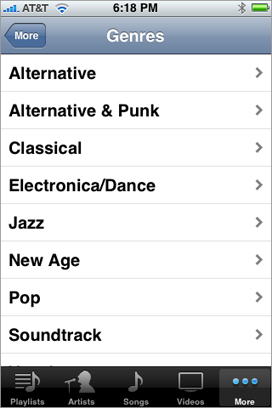
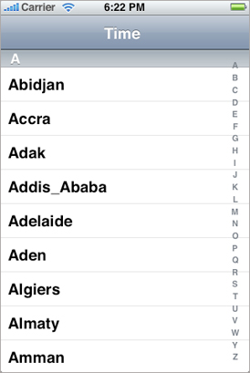
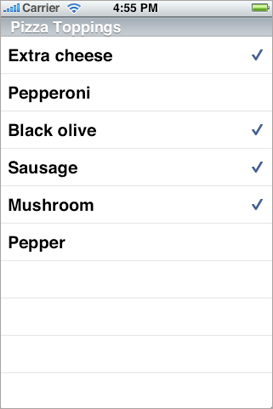
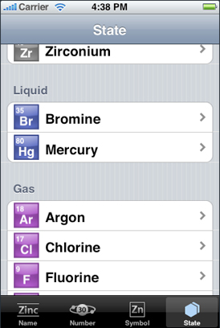
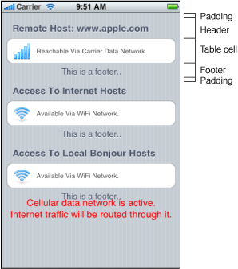
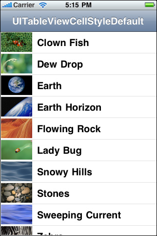
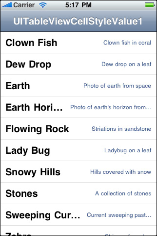
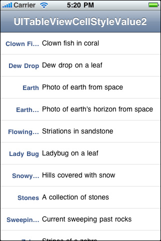

> 导航：[总目录](../../../README.md) · [documentation](../../../_indexes/documentation.md) · [Table View Programming Guide for iOS](About%20Table%20Views%20in%20iOS%20Apps.md)

[Next](Overview%20of%20the%20Table%20View%20API.md)[Previous](About%20Table%20Views%20in%20iOS%20Apps.md)

# Table View Styles and Accessory Views

Table views come in distinctive styles that are suitable for specific purposes. In addition, the UIKit framework provides standard styles for the cells used to draw the rows of table views. It also gives you standard accessory views (that is, controls) that you can include in cells.

## Table View Styles

There are two major styles of table views: plain and grouped. The two styles are distinguished mainly by appearance.

### Plain Table Views

A table view in the plain (or regular) style displays rows that stretch across the screen and have a creamy white background (see Figure 1-1). A plain table view can have one or more sections, sections can have one or more rows, and each section can have its own header or footer title. (A header or footer may also have a custom view, for instance one containing an image). When the user scrolls through a section with many rows, the header of the section floats to the top of the table view and the footer of the section floats to the bottom.

__Figure 1-1__  A table view in the plain style

A variation of plain table views associates an index with sections for quick navigation; Figure 1-2 shows an example of this kind of table view, which is called an _indexed list_. The index runs down the right edge of the table view. Entries in the index correspond to section header titles. Touching an item in the index scrolls the table view to the associated section. For example, the section headings could be two-letter state abbreviations, and the rows for a section could be the cities in that state; touching at a certain spot in the index displays the cities for the selected state. The rows in indexed lists should not have disclosure indicators or detail disclosure buttons, because these interfere with the index.

__Figure 1-2__  A table view configured as an indexed list

The simplest kind of table view is a selection list (see Figure 1-3). A selection list is a plain table view that presents a menu of options that users can select. It can limit the selection to one row or allow multiple selections. A selection list marks a selected row with a checkmark (see Figure 1-3).

__Figure 1-3__  A table view configured as a selection list

### Grouped Table Views

A grouped table view also displays a list of information, but it groups related rows in visually distinct sections. As shown in Figure 1-4, each section has rounded corners and by default appears against a bluish-gray background. Each section may have text or an image for its header or footer to provide some context or summary for the section. A grouped table works especially well for displaying the most detailed information in a data hierarchy. It allows you to separate details into conceptual groups and provide contextual information to help users understand it quickly.

__Figure 1-4__  A table view in the grouped style

The headers and footers of sections in a grouped table view have relative locations and sizes as indicated in Figure 1-5.

__Figure 1-5__  Header and footer of a section

On iPad devices, a grouped table view automatically gets wider margins when the table view itself is wide.

## Standard Styles for Table View Cells

In addition to defining two styles of table views, the UIKit framework defines four styles for the cells that a table view uses to draw its rows. You may create custom table view cells with different appearances if you want, but these four predefined cell styles are suitable for most purposes. The techniques for creating table view cells in a predefined style and for creating custom cells are described in [A Closer Look at Table View Cells](A%20Closer%20Look%20at%20Table%20View%20Cells.md#apple-f4xwc4dqnrsv64tfmyxwi33df52wszbpkridimbqga3tinjrfvbuqnznknltc).

The default style for table view rows uses a simple cell style that has a single title and an optional image (Figure 1-6). This style is associated with the [UITableViewCellStyleDefault](https://developer.apple.com/documentation/uikit/uitableviewcell/cellstyle/default) constant.

__Figure 1-6__  Default table row style

The cell style for the rows in Figure 1-7 left-aligns the main title and puts a gray subtitle under it. It also permits an image in the default image location. This style is associated with the [UITableViewCellStyleSubtitle](https://developer.apple.com/documentation/uikit/uitableviewcellstyle/uitableviewcellstylesubtitle) constant.

__Figure 1-7__  Table row style with a subtitle under the title

The cell style for the rows in Figure 1-8 left-aligns the main title. It puts the subtitle in blue text and right-aligns it on the right side of the row. Images are not permitted. This style is used in the Settings app, where the subtitle indicates the current setting for a preference. It is associated with the [UITableViewCellStyleValue1](https://developer.apple.com/documentation/uikit/uitableviewcellstyle/uitableviewcellstylevalue1) constant.

__Figure 1-8__  Table row style with a right-aligned subtitle

The cell style for the rows in Figure 1-9 puts the main title in blue and right-aligns it at a point that’s indented from the left side of the row. The subtitle is left aligned at a short distance to the right of this point. This style does not allow images. It is used in the Contacts part of the Phone app and is associated with the [UITableViewCellStyleValue2](https://developer.apple.com/documentation/uikit/uitableviewcellstyle/uitableviewcellstylevalue2) constant.

__Figure 1-9__  Table row style in Contacts format

## Accessory Views

There are three standard kinds of accessory views (shown with their accessory-type constants):

| Standard accessory views | Description |
| --- | --- |
| Disclosure indicator | __Disclosure indicator__—[UITableViewCellAccessoryDisclosureIndicator](https://developer.apple.com/documentation/uikit/uitableviewcellaccessorytype/uitableviewcellaccessorydisclosureindicator). You use the disclosure indicator when selecting a cell results in the display of another table view reflecting the next level in the data model hierarchy. |
| Detail disclosure button | __Detail disclosure button__—[UITableViewCellAccessoryDetailDisclosureButton](https://developer.apple.com/documentation/uikit/uitableviewcell/accessorytype/detaildisclosurebutton). You use the detail disclosure button when selecting a cell results in a detail view of that item (which may or may not be a table view). |
| Check mark | __Checkmark__—[UITableViewCellAccessoryCheckmark](https://developer.apple.com/documentation/uikit/uitableviewcell/accessorytype/checkmark). You use a checkmark when a touch on a row results in the selection of that item. This kind of table view is known as a selection list, and it is analogous to a pop-up list. Selection lists can limit selections to one row, or they can allow multiple rows with checkmarks. |

Instead of the standard accessory views, you may specify a control (for example, a switch) or a custom view as the accessory view.

[Next](Overview%20of%20the%20Table%20View%20API.md)[Previous](About%20Table%20Views%20in%20iOS%20Apps.md)
