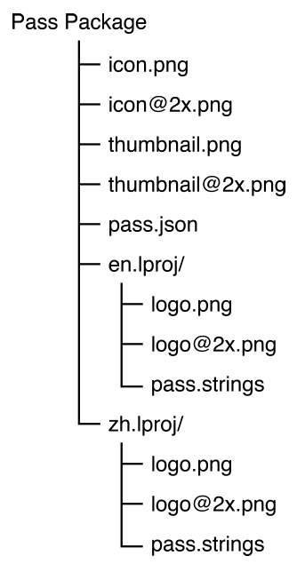
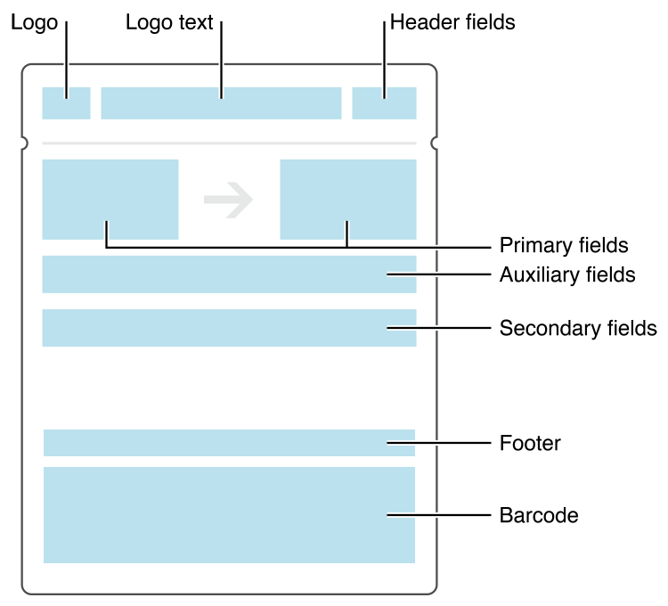
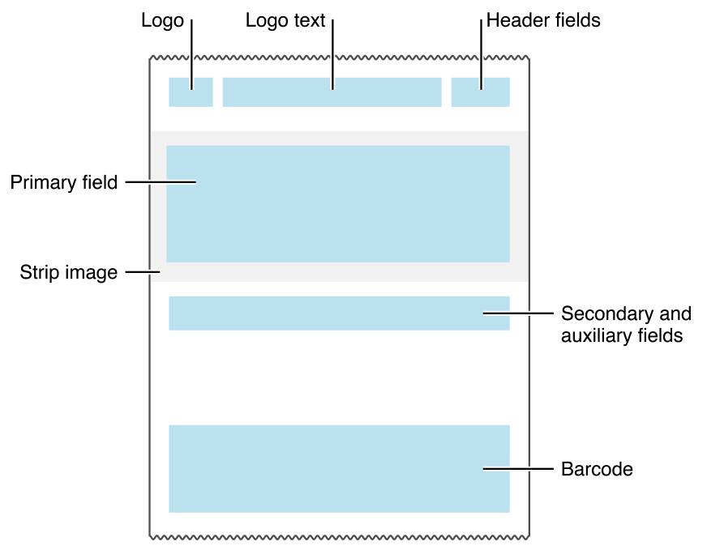
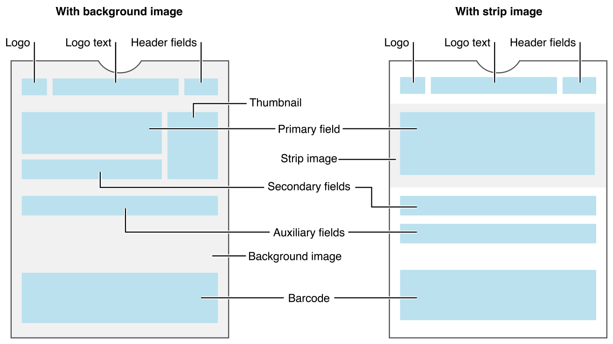
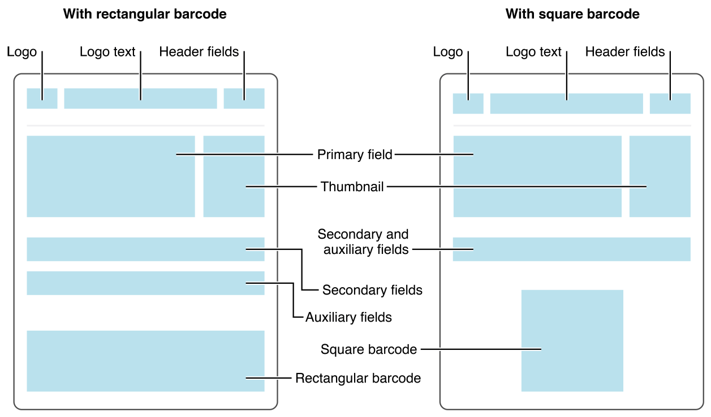
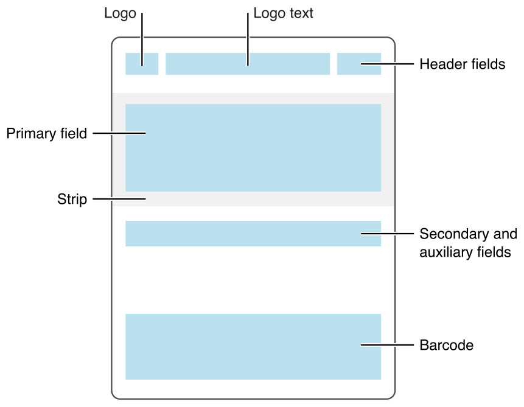
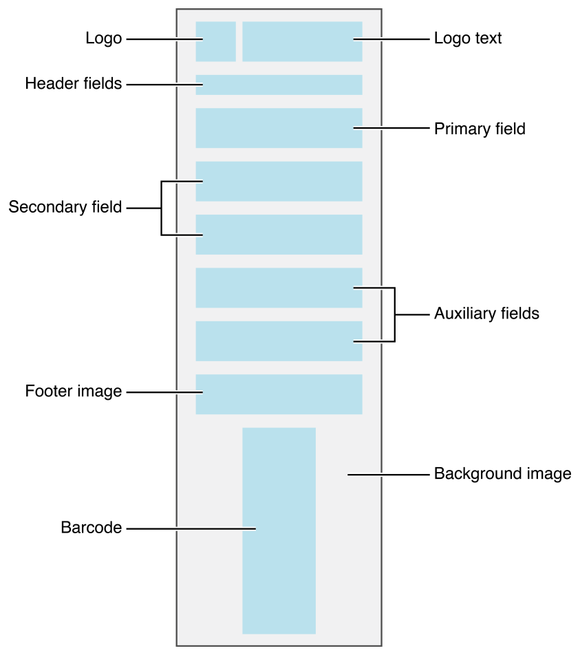
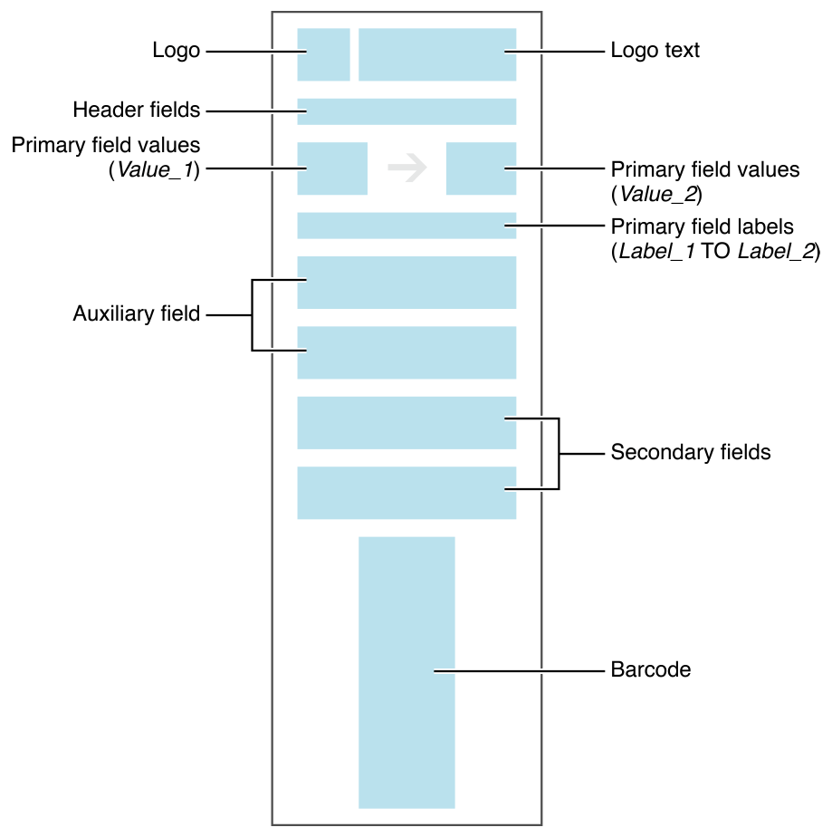

> 导航：[总目录](../../../README.md) · [documentation](../../../_indexes/documentation.md) · [Wallet Developer Guide](index.md)

## Pass Design and Creation

The files that make up a pass are arranged in a package (also referred to as a [bundle](https://developer.apple.com/library/archive/documentation/General/Conceptual/DevPedia-CocoaCore/Bundle.html#//apple_ref/doc/uid/TP40008195-CH4)) called the _pass package_. At the center of the pass is a JSON file named `pass.json`, which defines the pass. The JSON file contains information that identifies the pass, text that appears on the pass, and other information about the pass. Additionally, the package contains images and localization data. Figure 4-1 shows the directory structure for a sample pass that provides an icon, a logo, and a thumbnail. The pass is localized in English and Chinese, it has both at Retina and non-Retina sizes of the image assets, and the logo is localized.

__Figure 4-1__Directory structure of a sample pass

Pass creation consists mostly of writing the `pass.json` file and designing the required images. As a developer, you will spend most of your time editing the `pass.json` file. For more information, see _[PassKit Package Format Reference](https://developer.apple.com/library/archive/documentation/UserExperience/Reference/PassKit_Bundle/Chapters/Introduction.html#//apple_ref/doc/uid/TP40012026)_.

### Passes Are Identified by Pass Type Identifier and Serial Number

The _pass type identifier_ is conceptually similar to a bundle identifier or a class name. The value for the `passTypeIdentifier` key specifies the pass type identifier. It is a string you choose to define a class or category of passes. It always begins with `pass.` and uses reverse DNS style—for example, `pass.com.example.membership-card`. Use the Certificates, Identifiers & Profiles area of Member Center to register a pass type identifier. The pass type identifier must match the certificate used to sign the pass.

You determine the exact meaning of each pass type identifier. And because each app’s entitlements specify the pass types that the app can interact with, you can control which of your apps interact with which of your passes. You also use a different certificate for signing passes with different pass type identifiers. This means that different groups inside your company can work on their own passes without having to share infrastructure, certificates, or private keys.

The _serial number_ is a string that uniquely identifies the pass within the scope of its pass type. The value for the `serialNumber` key in the pass specifies the serial number. The serial number is opaque to PassKit—you are free to assign it in whatever way makes sense. A monotonically increasing integer or a UUID are convenient ways to assign the serial number.

The combination of pass type identifier and serial number is used throughout PassKit to uniquely identify a pass. Two passes of the same type with the same serial number are understood to be the same pass, even if other information on them differs. For example, when a pass is updated, the new version has the same pass type identifier and serial number as the old version, so the new version replaces the old version.

The difference between pass type identifiers and serial numbers is similar to the difference between classes and instances of a class. Pass type identifiers designate an abstract kind of thing, and serial numbers identify a specific concrete thing. For example, suppose an airline is creating passes for boarding passes and for its loyalty card program. All of the boarding passes you create have the same pass type identifier because they’re all the same type of pass, but each one has its own serial number. Loyalty cards have a different pass type identifier than boarding passes, because they’re a different type of pass.

### Required Information Is Provided by Top-Level Keys

In addition to the pass type identifier and serial number, there are several other keys that every pass contains.

The version of the file format is specified by the `formatVersion` key; its value is the number 1.

The _team identifier_ is a series of letters and numbers issued to you by Apple. The value for the `teamIdentifier` key in the pass specifies the team identifier. It must match the Team ID of the certificate used to sign the pass. You can find your Team ID in Member Center, or you can find it in Keychain Access by looking at the Organizational Unit field of your certificate.

The _organization name_ is displayed on the lock screen when your pass is relevant and by apps such as Mail which act as a conduit for passes. The value for the `organizationName` key in the pass specifies the organization name. Choose a name that users recognize and associate with your organization or company.

The _description_ lets VoiceOver make your pass accessible to blind and low-vision users. The value for the `description` key in the pass specifies the description. The description should start with a high-level term such as “Membership card,” “Weekly coupon,” or “Bus ticket” followed by one or two small pieces of information, such as the coupon’s offer and the store where it’s valid. Don’t try to summarize the entire contents of the pass, but include enough detail to let users distinguish between passes of the same type.

### Pass Style Sets the Overall Visual Appearance

The pass’s style determines the overall visual appearance of the pass and the template for placement of information on the pass. The most distinctive visual indication of the style is at the top edge of the pass. Event tickets have a small cutout, coupons have a perforated edge, and so on.

Unlike pass type identifiers, which you define, pass styles are part of the API, and so is their meaning. You can’t change them or add new ones. Pass type identifiers categorize passes in a very specific way; pass styles categorize passes in a much more general, high-level way.

You specify the pass style by providing the corresponding key at the top level of the `pass.json` file:

- Boarding passes use the key `boardingPass`. This pass style is appropriate for passes used with transit systems such as train tickets, airline boarding passes, and other types of transit. Typically, each pass corresponds to a single trip with a specific starting and ending point.
- Coupons use the key `coupon`. This pass style is appropriate for coupons, special offers, and other discounts.
- Event tickets use the key `eventTicket`. This pass style is appropriate for passes used to gain entry to an event like a concert, a movie, a play, or a sporting event. Typically, each pass corresponds to a specific event, but you can also use a single pass for several events as in a season ticket.
- Store cards use the key `storeCard`. This pass style is appropriate for store loyalty cards, discount cards, points cards, and gift cards. Typically, a store identifies an account the user has with your company that can be used to make payments or receive discounts. When the account carries a balance, show the current balance on the pass.
- Generic passes use the key `generic`. This pass style is appropriate for any pass that doesn’t fit into one of the other more specific styles—for example, gym membership cards, coat-check claim tickets, and metro passes that carry a balance.

The value of the pass style key is a dictionary containing the fields that hold the pass content. Listing 4-1 shows a pass that uses the boarding pass style, with a placeholder for the field dictionaries.

__Listing 4-1__Partial pass showing top-level keys

1. `{`
2. `"description" : "Boarding pass for October 4, San Francisco to London",`
3. `"formatVersion" : 1,`
4. `"passTypeIdentifier" : "pass.com.example.boarding-pass",`
5. `"serialNumber" : "123456",`
6. `"boardingPass" : {`
7. `<<field dictionaries>>`
8. `}`
9. `}`

The pass style controls how fields are laid out and which images can be used. Table 4-1 shows the images supported by each pass style and the number and placement of fields for each pass style. Pass style also affects relevance information—for details, see [Relevance Information Displays Passes on the Lock Screen](#apple-f4xwc4dqnrsv64tfmyxwi33df52wszbpkridimbqgezdcojvfvbuqnbnknltkmy).

__Table 4-1__Pass styles, images, and layout

| Pass style | Supported images | Layout |
| --- | --- | --- |
| Boarding pass | logo, icon, footer | See [Figure 4-2](#apple-f4xwc4dqnrsv64tfmyxwi33df52wszbpkridimbqgezdcojvfvbuqnbnknltq). |
| Coupon | logo, icon, strip | See [Figure 4-3](#apple-f4xwc4dqnrsv64tfmyxwi33df52wszbpkridimbqgezdcojvfvbuqnbnknlto). |
| Event ticket | logo, icon, strip, background, thumbnail  If you specify a strip image, do not specify a background image or a thumbnail. | See [Figure 4-4](#apple-f4xwc4dqnrsv64tfmyxwi33df52wszbpkridimbqgezdcojvfvbuqnbnknltm). |
| Generic | logo, icon, thumbnail | See [Figure 4-5](#apple-f4xwc4dqnrsv64tfmyxwi33df52wszbpkridimbqgezdcojvfvbuqnbnknlti). |
| Store card | logo, icon, strip | See [Figure 4-6](#apple-f4xwc4dqnrsv64tfmyxwi33df52wszbpkridimbqgezdcojvfvbuqnbnknltk). |

__Figure 4-2__Layout of a boarding pass

__Figure 4-3__Layout of a coupon

__Figure 4-4__Layout of an event ticket

__Figure 4-5__Layout of a generic pass

__Figure 4-6__Layout of a store card

The pass style determines the maximum number of fields that can appear on the front of a pass:

- In general, a pass can have up to three header fields, a single primary field, up to four secondary fields, and up to four auxiliary fields.
- Boarding passes can have up to two primary fields and up to five auxiliary fields.
- Coupons, store cards, and generic passes with a square barcode can have a total of up to four secondary and auxiliary fields, combined.

The number of fields displayed on the pass also depends on the length of the text in each field. If there is too much text, some fields may not be displayed.

> [!NOTE]
> 

### Designing Passes for Apple Watch

Even if you’re not creating watch-specific apps, users can add any passes you create to their Apple Watch. So you need to understand how Apple Watch handles passes, in order to create passes that function properly on both iPhone and Apple Watch.

Apple Watch presents a subset of the information available on iPhone. The following items are not available:

- A strip image is not displayed.
- A thumbnail image is not displayed.
- The user cannot access the back side of the pass.

When laying out coupon, event ticket, store card, or generic passes, Apple Watch performs the following steps (see [Figure 4-7](#apple-f4xwc4dqnrsv64tfmyxwi33df52wszbpkridimbqgezdcojvfvbuqnbnknltenq)). If a pass does not provide (or does not support) a particular item, that item is skipped.

1. At the top of the pass, Apple Watch displays the logo and logo text. It attempts to degrade gracefully if both items do not fit. Specifically, if the pass has a logo, it always displays the logo, but it displays the logo text only when the text fits without being truncated. If the pass does not have a logo, it always displays the logo text, even if the text is truncated.
2. It displays header fields immediately under the logo and/or logo text in thin strips, one line per header field.
3. Apple Watch lays out all primary, secondary, and auxiliary fields from top to bottom, placing two fields on a line if possible. All primary fields appear first, followed by all secondary fields, followed by all auxiliary fields.

   Apple Watch places two fields on the same line only if they belong to the same field type. For example, a primary and secondary field never appear on the same line.
4. Apple Watch places the footer image below all the fields. It crops white space from the footer image before positioning it.
5. Apple Watch places the barcode at the bottom of the pass. Note that rectangular barcodes are rotated to a portrait orientation to better fit on the watch face. The barcode is always the last item in the pass.
6. Apple Watch scales and blurs the background image so that it fills the pass. It then positions this image behind the other content.

__Figure 4-7__Layout of a coupon, event ticket, store card, or generic pass

Apple Watch uses a slightly different procedure when laying out boarding passes (see [Figure 4-8](#apple-f4xwc4dqnrsv64tfmyxwi33df52wszbpkridimbqgezdcojvfvbuqnbnknlteny)):

1. When laying out the primary fields, Apple Watch takes the fields’ values and places them on the same line, separated by an appropriate transit icon. For example, passes using the `PKTransitTypeAir` transit type display an airplane icon.
2. Apple Watch combines the labels from the primary fields, joining them using the word “TO”—for example, SAN FRANCISCO TO NEW YORK. It places this text on the next line.
3. Apple Watch positions the auxiliary fields above the secondary fields.

__Figure 4-8__Layout of a boarding pass

> [!NOTE]
> 

Users interact with notifications differently on iPhone and on Apple Watch.

- On iPhone, both relevancy and update notifications appear on the Lock screen. Users swipe the notification to open the pass.
- On Apple Watch, for relevancy notifications, users swipe down to see the notification in the Notification Center. If the user taps on the notification, the full pass is displayed inline.
- On Apple Watch, update notifications present a message that describes the update and a button to view the pass. Users tap the button to open the full pass. Update notifications can also appear in Notification Center.

For more information, see Notifications in _Apple Watch Human Interface Guidelines_.

### Fields Contain Text Displayed on the Pass

The information shown on a pass is broken up into _fields_. Each field is defined by a dictionary, which gives it a value and label (which are displayed to the user), a unique key, and optional information about how its value should be formatted. Listing 4-2 shows a pass with a few simple fields.

The primary fields contain the most important information and are shown prominently on the pass. Secondary fields are less important and less prominent, and auxiliary fields are even less so. Header fields contain highly salient information, and they are the only field that is visible when the passes are stacked up in Wallet, so use them sparingly.

__Listing 4-2__Pass with simple fields

1. `{`
2. `"description" : "Boarding pass for October 4, San Francisco to London",`
3. `"formatVersion" : 1,`
4. `"passTypeIdentifier" : "pass.com.example.boarding-pass",`
5. `"serialNumber" : "123456",`
6. `"boardingPass" : {`
7. `"primaryFields" : [`
8. `{`
9. `"key" : "origin",`
10. `"label" : "San Francisco",`
11. `"value" : "SFO"`
12. `},`
13. `{`
14. `"key" : "destination",`
15. `"label" : "London",`
16. `"value" : "LHR"`
17. `}`
18. `],`
19. `"secondaryFields" : [`
20. `{`
21. `"key" : "boarding-gate",`
22. `"label" : "Gate",`
23. `"value" : "F12"`
24. `}`
25. `],`
26. `"auxiliaryFields" : [`
27. `{`
28. `"key" : "seat",`
29. `"label" : "Seat",`
30. `"value" : "7A"`
31. `},`
32. `{`
33. `"key" : "passenger-name",`
34. `"label" : "Passenger",`
35. `"value" : "John Appleseed"`
36. `}`
37. `],`
38. `"transitType" : "PKTransitTypeAir"`
39. `}`
40. `}`

The ordering between the lists of fields is not significant, but the ordering of fields within the list is significant. For example, putting the primary fields before or after the secondary fields doesn’t change where the primary and secondary fields appear, but putting the seat assignment before or after the passenger name changes the ordering of those two fields on the pass. This is because the key-value pairs in a dictionary aren’t ordered, but lists are.

For a complete list of the keys used in a field dictionary and their possible values, see [Field Dictionary Keys](https://developer.apple.com/library/archive/documentation/UserExperience/Reference/PassKit_Bundle/Chapters/FieldDictionary.html#//apple_ref/doc/uid/TP40012026-CH4).

### Fields Support Formatting

There are three kinds of formatting you can apply to a field: alignment, date formatters, and number formatters:

- To set the alignment for a field, specify a value for the `alignment` key in the field dictionary.
- To format a date, specify a value for the `dateStyle` and `timeStyle` keys in the field dictionary.
- To format a currency amount or other number, specify a value for the `currencyCode` or `numberStyle` key in the field dictionary.

Letting Wallet handle dates, times, and currency amounts ensures the right display formatting based on the user’s locale. Listing 4-3 shows an example of date and number formatting.

__Listing 4-3__Partial pass with date and number formatting

1. `{`
2. `...`
4. `"description" : "Concert ticket to see The Hectic Glow",`
5. `"eventTicket" : {`
6. `"primaryFields" : [`
7. `{`
8. `"key" : "event-name",`
9. `"label" : "Event",`
10. `"value" : "The Hectic Glow in concert"`
11. `}`
12. `],`
13. `"secondaryFields" : [`
14. `{`
15. `"dateStyle" : "PKDateStyleMedium",`
16. `"isRelative" : true,`
17. `"key" : "doors-open",`
18. `"label" : "Doors open",`
19. `"timeStyle" : "PKDateStyleShort",`
20. `"value" : "2013-08-10T19:30-06:00"`
21. `},`
22. `{`
23. `"key" : "seating-section",`
24. `"label" : "Seating section",`
25. `"numberStyle" : "PKNumberStyleSpellOut",`
26. `"textAlignment" : "PKTextAlignmentRight",`
27. `"value" : 5`
28. `}`
29. `]`
30. `}`
31. `}`

### The Back of the Pass Provides Additional Space for Text

Space on the front of the pass is at a premium, so the number of fields is limited, and the contents of fields must be brief. In contrast, the back of the pass can have as many fields as needed and the contents of fields can be much longer. If there is too much content fit on the screen at once, let the users scroll through it on the back. As the contents of each field on the back gets longer, the field’s font size is reduced.

The back of the pass gives you a place to put information that is too long to fit on the front of the pass, including extra information that isn’t as important and general information that may be helpful for your users. Examples of back-field information includes terms and conditions, the full address of a venue, your customer service phone number, and the URL for your website.

> [!NOTE]
> 

Listing 4-4 shows examples of back fields. These fields go in the same place in the pass file as the rest of the fields—this key is a sibling to `primaryFields` and `auxiliaryFields`.

__Listing 4-4__Partial pass with back fields

1. `{`
2. `...`
4. `"backFields" : [`
5. `{`
6. `"key" : "frequent-flier-number",`
7. `"label" : "Frequent flier number",`
8. `"value" : "1234-5678"`
9. `},`
10. `{`
11. `"key" : "website",`
12. `"label" : "Track my checked bags",`
13. `"value" : "http://www.example.com/track-bags/XYZ123"`
14. `},`
15. `{`
16. `"key" : "customer-service",`
17. `"label" : "Customer service",`
18. `"value" : "(800) 555-0199"`
19. `},`
20. `{`
21. `"key" : "terms",`
22. `"label" : "Terms and Conditions",`
23. `"value" : "O Fortuna velut luna statu variabilis, semper crescis aut decrescis; vita detestabilis nunc obdurat et tunc curat ludo mentis aciem, egestatem, potestatem dissolvit ut glaciem.\n\n Sors immanis et inanis, rota tu volubilis, status malus, vana salus semper dissolubilis, obumbrata et velata michi quoque niteris; nunc per ludum dorsum nudum fero tui sceleris.\n\n Sors salutis et virtutis michi nunc contraria, est affectus et defectus semper in angaria. Hac in hora sine mora corde pulsum tangite; quod per sortem sternit fortem, mecum omnes plangite!"`
24. `}`
25. `]`
26. `}`

The text of the back fields is run through data detectors for URLs and phone numbers, which appear as live links. Users can tap the URL to launch it in Safari and can tap phone numbers to dial them. Text on the back of the card can include line breaks, escaped in the JSON file as `\n`.

To provide a link to an app, provide a list of iTunes Store item identifiers as the value of the `associatedStoreIdentifiers` key at the top level of the `pass.json` file.

### Barcodes Link Passes to Your Records

Your server has the up-to-date records about your business, and the pass is just a copy of those records from some time in the past. The most common use for a barcode is to contain a unique ID that points to corresponding records on your server. This ID lets you consult your server to update a balance, void a coupon, or confirm that a ticket is valid.

To add a barcode to a pass, provide a value for the `barcodes` key at the top level of the `pass.json` file. The value is an array of dictionaries that describes the barcode you want to display. This allows you to specify fallbacks for your barcode. PassKit displays the first supported barcode in this array. Note that the `PKBarcodeFormatQR`, `PKBarcodeFormatPDF417`, `PKBarcodeFormatAztec`, and `PKBarcodeFormatCode128` formats are all valid on iOS 9 and later; therefore, they do not need fallbacks. watchOS does not support the `PKBarcodeFormatCode128` format. If a `PKBarcodeFormatCode128` barcode is included in the `barcodes` array, an alternative barcode is used as fallback; if a `PKBarcodeFormatCode128` barcode is the only barcode you supply, no barcode is displayed.

> [!NOTE]
> 

Each barcode dictionary specifies the barcode format and provides the message to be displayed and the encoding used by the message. The optional alternative text is rendered near the barcode and contains a code to be entered manually if the barcode can’t be scanned. Listing 4-5 shows part of an example pass that contains a barcode.

__Listing 4-5__Partial pass with a barcode

1. `{`
2. `...`
4. `"barcodes" : [`
5. `{`
6. `"message" : "ABCD 123 EFGH 456 IJKL 789 MNOP",`
7. `"format" : "PKBarcodeFormatPDF417",`
8. `"messageEncoding" : "iso-8859-1"`
9. `}`
10. `]`
11. `}`

Barcode scanners and software typically use the ISO 8859-1 encoding (also known as Latin-1) or the Windows-1252 encoding (sometimes incorrectly labeled Latin-1). Unicode is poorly supported by most systems. PassKit supports all encodings supported by the `NSString` class.

> [!NOTE]
> 

Because the barcode message is just data, there’s nothing limiting you from using it to store additional information. For added security, you can even sign the data with a private key, and store the result directly in the barcode. When the pass is scanned, the scanner can validate the signature, allowing you to trust the barcode’s data. Although this approach doesn’t let you modify the data stored in the barcode (making it inappropriate for one-time-use coupons or passes that carry a balance), it can be useful for passes that are valid for a predictable period of time. Additionally, you do not need to connect to your database to process the passes, letting the scanners operate in locations where network access is unavailable.

The amount of data that you can include in a barcode depends on the barcode format and the conditions under which the barcode is scanned. The barcode format defines a hard maximum that it supports, but scanning conditions often lower this limit. For example, consider a barcode displayed on Apple Watch under poor lighting and scanned by an inexpensive barcode scanner. The barcode’s small size and the poor scanning condition both limit the amount of data you can retrieve. Test your passes in real-world conditions on a variety of devices to ensure that the barcode can be scanned reliably. In fact, you may want to optimize your barcodes for Apple Watch’s smaller screen, by using square-sized barcodes, like QR codes.

### Pass Colors Can Be Customized

By default, Wallet chooses the colors for your pass background and text. To override a color, provide a value for the appropriate key at the top level of the `pass.json` file. Colors are specified as RGB values—for example, `rgb(0, 255, 0)` is bright green. You can customize three colors:

- The background color, used for the background of the front and back of the pass. If you provide a background image, any background color is ignored. The key for the background color is `backgroundColor`.
- The foreground color, used for the values of fields shown on the front of the pass. The key for the foreground color is `foregroundColor`.
- The label color, used for the labels of fields shown on the front of the pass. The key for the label color is `labelColor`.

### Images Fill Their Allotted Space

The pass layout allots a certain area on the front of the pass for each image. Images are scaled (preserving aspect ratio) to fill this allotted space. Images with a different aspect ratio than their allotted space are cropped after being scaled. The space allotted is as follows:

- The background image (`background.png`) is displayed behind the entire front of the pass. The expected dimensions are 180 x 220 points. The image is cropped slightly on all sides and blurred. Depending on the image, you can often provide an image at a smaller size and let it be scaled up, because the blur effect hides details. This lets you reduce the file size without a noticeable difference in the pass.
- The footer image (`footer.png`) is displayed near the barcode. The allotted space is 286 x 15 points.
- The icon (`icon.png`) is displayed when a pass is shown on the lock screen and by apps such as Mail when showing a pass attached to an email. The icon should measure 29 x 29 points.
- The logo image (`logo.png`) is displayed in the top left corner of the pass, next to the logo text. The allotted space is 160 x 50 points; in most cases it should be narrower.
- The strip image (`strip.png`) is displayed behind the primary fields.

  __On iPhone 6 and 6 Plus__ The allotted space is 375 x 98 points for event tickets, 375 x 144 points for gift cards and coupons, and 375 x 123 in all other cases.

  __On prior hardware__ The allotted space is 320 x 84 points for event tickets, 320 x 110 points for other pass styles with a square barcode on devices with 3.5 inch screens, and 320 x 123 in all other cases.
- The thumbnail image (`thumbnail.png`) displayed next to the fields on the front of the pass. The allotted space is 90 x 90 points. The aspect ratio should be in the range of 2:3 to 3:2, otherwise the image is cropped.

> [!NOTE]
> 

### Relevance Information Displays Passes on the Lock Screen

Passes let your users take some action in the real world, so accessing them needs to be easy and fast. Wallet makes relevant passes immediately accessible by integrating them with the lock screen. To take advantage of this feature, add information about where and when your pass is relevant. A pass’s relevancy can be based on the time and/or the place in which the user can use the pass. For example, a gym membership is relevant at the gym, while a boarding pass is relevant at the time the flight begins boarding.

Inside the pass, you provide a point in time and points in space. Wallet then determines whether the pass should appear on the lock screen based on these settings. It calculates when the user is close enough to the specified time and locations based on the pass’s style. Don’t try to manipulate the pass’s presence on the lock screen by providing inaccurate relevance information.

Relevance information is passive—it helps users find passes when they need them by putting relevant passes right on the lock screen. It doesn’t present alerts or post notifications. This is in contrast to the notification posted when a pass updates, as described in [Updating a Pass](Updating.md#apple-f4xwc4dqnrsv64tfmyxwi33df52wszbpkridimbqgezdcojvfvbuqnjnknltc).

To provide a relevant date, add the `relevantDate` key at the top level of the pass. A pass can have up to one relevant date. Its value is a W3C timestamp, either a complete date plus hours and minutes or a complete date plus hours, minutes, and seconds. For more information about the timestamp format, see [Time and Date Formats](http://www.w3.org/TR/NOTE-datetime) on the W3C website.

To provide relevant locations, add the `locations` key at the top level of the pass. A pass can have up to ten relevant locations. Its value is an array of dictionaries with longitude, latitude, and optional altitude information. Listing 4-6 shows part of an example pass, which provides both a relative date and three relevant locations.

__Listing 4-6__Partial pass with relevance information

1. `{`
2. `...`
4. `"description" : "Example pass showing relevance information",`
5. `"locations" : [`
6. `{"latitude" : 37.3229, "longitude" : -122.0323},`
7. `{"latitude" : 37.3286, "longitude" : -122.0143},`
8. `{`
9. `"altitude" : 10.0,`
10. `"latitude" : 37.331,`
11. `"longitude" : -122.029,`
12. `"relevantText" : "Store nearby on 3rd and Main."`
13. `}`
14. `],`
15. `"relevantDate" : "2014-12-05T09:00-08:00"`
16. `}`

A pass can have up to ten relevant locations. In many cases, you have more than ten relevant locations, so you have to pick the best ten. There are a variety of ways to do this. For example, you can have settings in your account management system to let customers add their favorite stores or the stores that they frequently visit. Like other data in the pass, relevance data can be changed when a pass is updated. A pass can initially have very generic relevance information, which is replaced over time with relevant locations tailored by the user.

You can also provide relevancy information using iBeacons. A pass is relevant when the device is brought into proximity of an iBeacon with a matching UUID. You can add up to ten unique beacon UUIDs to the pass. Beacons can optionally include relevancy text, as well as the major and minor Bluetooth identifiers. The system uses the relevancy text from the most-specific matching beacon (the beacon matching the most of the UUID, minor, and major identifiers).

1. `"beacons": [`
2. `{`
3. `"proximityUUID":"F8F589E9-C07E-58B0-AEAB-A36BE4D48FAC",`
4. `"relevantText":"You're near my store",`
5. `"name" : "My Store"`
6. `} ],`

You define what your beacons’ UUIDs mean within the context of your pass. You can use different UUIDs to represent different locations—for example, providing different relevancy text for different stores. Alternatively, you can have a large number of beacons with the same UUID—for example, one beacon per store for a large retail chain. This lets you exceed the ten-location limit for relevant locations. You can also use major and minor identifiers to further refine your relevancy text. For example, identifying different departments within a store.

Depending on the pass style, the relevance information is interpreted in slightly different ways, as listed in Table 4-2. When the location is interpreted with a small radius, the current location must be on the order of a hundred meters or closer; with a large radius, on the order of a thousand meters or closer. In both cases, the exact relevance radius is an implementation detail and may change.

If you provide relevance information, the pass style also impacts what kind of information is required, recommended, optional, or not supported. For example, a coupon that provides relevance information must specify a relevant location. Boarding passes and event tickets almost always specify a relevant date, so

they appear only on the valid date and not each time the user is near the location. All pass styles support leaving off relevance information completely.

__Table 4-2__Pass style and relevance information

| Pass style | Relevant date | Relevant locations | Relevance |
| --- | --- | --- | --- |
| Boarding pass | Recommended.  Include the relevant date unless the pass is relevant for an extended period of time, such as for a month-long bus pass. | Optional.  Interpreted with a large radius. | Relevant if the date _and_ any location matches.  Prior to iOS 6.1, relevant if the date _or_ any location matches.    Without a relevant date, pass is relevant if the location matches. |
| Coupon | Not supported. | Required if relevance information is provided.  Interpreted with a small radius. | Relevant if any location matches. |
| Event ticket | Recommended.  Include the relevant date unless the pass is relevant for an extended period of time, such as for a multi-day event.  Prior to iOS 7.1, required if relevance information is provided. | Optional.  Interpreted with a large radius. | Relevant if the date _and_ any location matches.  Without a relevant location, relevant if the date matches. |
| Generic | Optional. | Required if relevance information is provided.  Interpreted with a small radius. | Relevant if the date _and_ any location matches.  Without a relevant date, relevant if any location matches. |
| Store card | Not supported. | Required if relevance information is provided.  Interpreted with a small radius. | Relevant if any location matches. |

The system provides the relevant text for passes that have time-based relevance. For passes with relevant locations, you provide a description of why the pass is relevant at a given location. This wording can be as simple as “Store nearby” or it can include a brief description of how to find the relevant location, such as cross streets or landmarks. Don’t include your organization name in the relevant text, and don’t include instructions to the user, such as “Redeem this pass at XYZ.”

> [!NOTE]
> 

### Passes Support Localization

You can localize a pass in three ways: Display numbers and dates using the localized format, provide localized strings, and provide localized images.

Before you include localizations in a pass, consider whether you need it. You generate a pass for each user, and you have information about your users. If you let users tell you their preferred localizations through account settings, or if you can infer the localization from the geographic region, you can often include a small number of localizations or even produce a pass only in the preferred localization. Limiting the number of localizations helps keep pass size small by not providing localized images.

Use field formatters to display numbers and dates in the user’s preferred format and language. For more information about formatters, see [Fields Support Formatting](#apple-f4xwc4dqnrsv64tfmyxwi33df52wszbpkridimbqgezdcojvfvbuqnbnknltioa).

Use a strings file to provide localized strings. A strings file lists strings that appear in the `pass.json` file and the string to display for a particular language. For example, given the following pass fragment from an airline ticket:

1. `{`
2. `...`
4. `"primaryFields" : [`
5. `{`
6. `"key" : "origin",`
7. `"label" : "Seville",`
8. `"value" : "SVQ"`
9. `},`
10. `{`
11. `"key" : "destination",`
12. `"label" : "London",`
13. `"value" : "LHR"`
14. `}`
15. `]`
16. `}`

To localize this pass into Spanish and English, do the following:

1. Change pass file to factor out the text being localized.

   1. `{`
   2. `...`
   4. `"primaryFields" : [`
   5. `{`
   6. `"key" : "origin",`
   7. `"label" : "origin_SVQ",`
   8. `"value" : "SVQ"`
   9. `},`
   10. `{`
   11. `"key" : "destination",`
   12. `"label" : "destination_LHR",`
   13. `"value" : "LHR"`
   14. `}`
   15. `]`
   16. `}`

   The field values are no longer the text to be displayed—now they indicate which entry in the strings file should be used.
2. Create an `es.lproj` directory in the pass package. Create a strings file named `pass.strings` containing these Spanish strings:

   1. `"origin_SVQ" = "Sevilla";`
   2. `"destination_LHR" = "Londres";`
3. Create an `en.lproj` directory in the pass package. Create a strings file named `pass.strings` containing these English strings:

   1. `"origin_SVQ" = "Seville";`
   2. `"destination_LHR" = "London";`

> [!NOTE]
> 

If there is more than one localization, each localization needs its own `.lproj` directory, as shown earlier in [Figure 4-1](#apple-f4xwc4dqnrsv64tfmyxwi33df52wszbpkridimbqgezdcojvfvbuqnbnknltena). If the text in the pass is left in English, and Spanish text is provided in a strings file, the pass displays in Spanish only. For more information about strings files, see Localizing String Resources.

Images that need to be localized appear in the `.lproj` directories for their respective languages. Images that don’t need localization appear at the top level of the pass. Don’t include an image at the top level and inside a `.lproj` directory. For more information about localizing images, see [Localized Resource Files](https://developer.apple.com/library/archive/documentation/iPhone/Conceptual/iPhoneOSProgrammingGuide/Inter-AppCommunication/Inter-AppCommunication.html#//apple_ref/doc/uid/TP40007072-CH6-SW8).

### Passes Are Cryptographically Signed and Compressed

Passes are cryptographically signed and compressed before being distributed. This process establishes the identity of the signer and lets your customers be sure the pass hasn’t been modified since being signed.

> [!NOTE]
> 

To create the manifest file, recursively list the files in the package (except the manifest file and signature), calculate the SHA-1 hash of the contents of those files, and store the data in a dictionary. The keys are relative paths to the file from the pass package. The values are the SHA-1 hash (hex encoded) of the data at that path. Write this dictionary to the file `manifest.json` at the top level of the pass package.

To create the signature file, make a PKCS #7 detached signature of the manifest file, using the private key associated with your signing certificate. Include the WWDR intermediate certificate as part of the signature. You can download this certificate from [Apple’s website](http://www.apple.com/certificateauthority/). Write the signature to the file `signature` at the top level of the pass package. Include the date and time that the pass was signed using the S/MIME `signing-time` attribute.

To compress the pass, create a ZIP archive of the _contents_ of the pass package. This ZIP archive is what you distribute to users.

### Debugging Passes

If the pass isn’t displayed and added to Wallet, check the log for a description of what went wrong. When testing in the iOS Simulator app, errors are logged to the system log, which you can view with the Console app. When testing on a device, errors are logged to the device’s console which you can view from the Xcode organizer window. Common errors include malformed JSON files, misspelled keys or values, pass type identifiers that don’t match your certificate, and signatures that omit the WWDR intermediate certificate.

[Building Your First Pass](YourFirst.md#apple-f4xwc4dqnrsv64tfmyxwi33df52wszbpkridimbqgezdcojvfvbuqmrnknltc)

[Distributing Passes](DistributingPasses.md#apple-f4xwc4dqnrsv64tfmyxwi33df52wszbpkridimbqgezdcojvfvbuqmjrfvjvomi)
