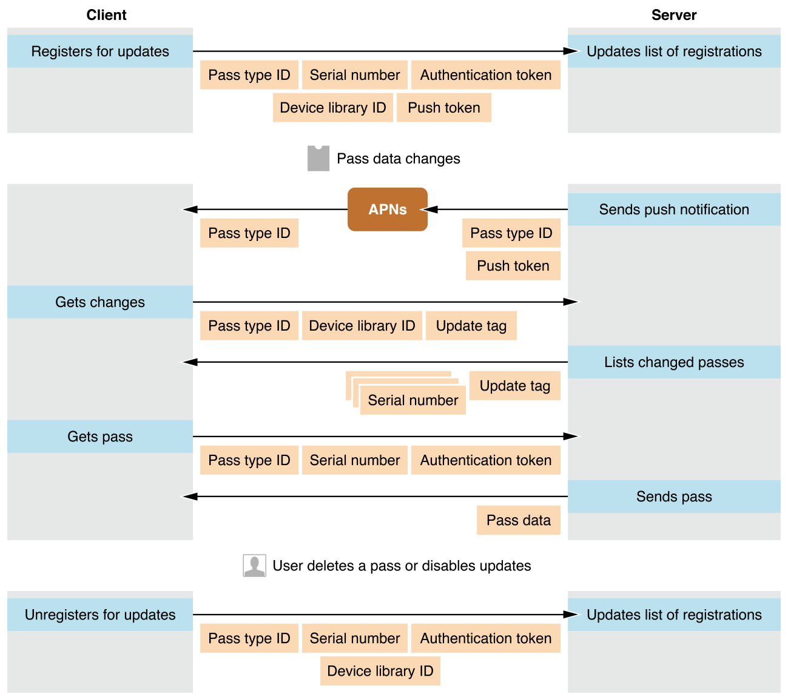

> 导航：[总目录](../../../README.md) · [documentation](../../../_indexes/documentation.md) · [Wallet Developer Guide](index.md)

## Updating a Pass

Passes allow the user to take real-world actions, and they reflect real-world state. When something in the real world changes, such as a delay to a departure, you can update the pass. You can also update a pass when it represents multiple real-world actions. For example, a season ticket gains access to every game of the season and is updated before each game.

Any field on a pass can be updated except for the authentication token and serial number. All types of passes can be updated.

### Overview of the Communication

Updating a pass is a cooperative effort between the user’s device, Apple’s servers, and your servers. At a high level, it consists of the following steps, shown in Figure 6-1:

1. A pass that supports updates is installed, and the user’s device registers with your server to get updates.
2. Some change triggers an update, and your server sends a push notification.
3. The user’s device receives the notification, and it queries your server to get a list of changes.
4. The user’s device asks your server for the latest version of each pass that has changed.

__Figure 6-1__Interaction between the client and your server

The update process uses the following pieces of information:

| Information | Source | Purpose |
| --- | --- | --- |
| Web service URL | You define in the pass | Tells Wallet how to contact your web server |
| Pass type identifier  Serial number | You define both in the pass | Together, uniquely identify the pass |
| Device library identifier | Device defines | Identifies the device and authorizes requests |
| Authentication token | You define in the pass | Authorizes requests |
| Push token | Device defines | Allows the server to send push notifications to the device |
| Update tag | Your server defines | Describes state |

Your server implements a specific web service API, which allows this communication to happen. This differs from most uses of push notifications, in which you provide an app that is free to communicate with your server however you prefer. In this case, you provide only a pass, so Wallet needs a standardized way to communicate with your server.

The _web service URL_ tells Wallet how to contact your server during the update process. It must include the protocol, and it can include an optional port number. Wallet requires an HTTPS connection to your server for all communication. During development, you can use the developer settings to allow plain HTTP connections.

Before responding to a request, you server always checks that the request is authorized. Two shared secrets are used to authorize requests. The _device library identifier_ is a PassKit-specific shared secret between the user’s device and your web server. It is not related to the device identifier (UDID). The device identifies itself with a different ID to different servers and it may change its ID at any time. Its purpose is to allow efficient communication between the device and your server, not to let your server keep a list of of what passes are currently installed on a device. The device library identifier uniquely identifies a device _and_ indicates that the entity making the request is authorized to make such a request.

The _authentication token_ is a shared secret between the user’s device and your server. It shows that the request for an update to a pass is coming from the user who has the pass and not from a third party. For more information about shared secrets, see _[Security Overview](../../Security/Security%20Overview/About%20Software%20Security.md#apple-f4xwc4dqnrsv64tfmyxwi33df52wszbpkridgmbqgaydsnzw)_.

Your server needs to remember certain information between requests. There are two entities—devices and passes—and one relationship, registrations. Assuming that your server stores data in a traditional relational database, it needs to maintain the following tables:

__Device table.__ A device is identified by its device library identifier; it also has a push token.

__Passes table.__ A pass is identified by pass type ID and serial number. This table includes a last-update tag (such as a time stamp) for when the pass was last updated, and typically includes whatever data you need to generate the actual pass.

__Registrations table.__ A registration is a relationship between a device and a pass. You need to be able to look up information in both directions: to find the passes that a given device has registered for, and to find the devices that have registered for a given pass. Registration is a many-to-many relationship: a single device can register for updates to multiple passes, and a single pass can be registered by multiple devices.

> [!NOTE]
> 

### Devices Register for Updates

After installing a pass, the iOS device registers with your server, asking to receive updates. Your server saves the device’s library ID and its push token.

The device sends the following pieces of information:

- Device library identifier (in the URL)
- Push token (in JSON payload)
- Pass type ID (in the URL)
- Serial number (in the URL)
- Authentication token (in the header)

To handle the device registration, do the following:

1. Verify that the authentication token is correct. If it doesn’t match, immediately return the HTTP status 401 Unauthorized and disregard the request.
2. Store the mapping between the device library identifier and the push token in the devices table.
3. Store the mapping between the pass (by pass type identifier and serial number) and the device library identifier in the registrations table.

When a device removes a registration, it uses the same endpoint and sends the same data. The difference is that the device sends a DELETE request instead of a POST request, and your server removes (or invalidates) data from its tables instead of adding it. When a device removes a registration, you can immediately remove the entry from the registrations table. When there are no entries for a device in the registrations table, you can remove the entry for the device from the devices table.

### Your Server Sends a Push Notification When Something Changes

When a pass needs to be updated, your server sends a push notification to inform devices of the change. Send pushes only to the devices that have registered for updates for that pass, and only when the pass has changed. Don’t send unnecessary pushes.

Your server sends the following pieces of information:

- The pass type identifier (in the certificate)
- The push token (in the communication to the Apple Push Notification service)

To send the push notification, do the following:

1. Update the passes table with the new pass information, and get the pass type identifier and serial number for the pass that changed.
2. Consult the registrations table, and get the list of devices that registered for updates for that pass.
3. Consult the devices table, and get the push token for each device.
4. Send a push notification with an empty JSON dictionary as its payload to each push token.

You may wonder why your server doesn’t include more information in the push notification. That’s because push notifications are not guaranteed to be delivered and because multiple push notifications from the same source are coalesced into a single notification. If more information is included, it might be lost. The push notification just indicates that some passes with a given pass type identifier changed, so no information is lost if they are coalesced.

The Apple Push Notification service (APNs) provides feedback to your server that may require specific actions. For example, if APNs tells you that a push token is invalid, remove that device and its registrations from your server.

You use the same certificate and private key for sending push notifications as for signing passes. For more information about push notifications, see _[Local and Remote Notification Programming Guide](https://developer.apple.com/library/archive/documentation/NetworkingInternet/Conceptual/RemoteNotificationsPG/index.html#//apple_ref/doc/uid/TP40008194)_.

### Devices Ask for Changed Serial Numbers

When a device gets a push notification, it asks your server for the serial numbers of passes that have changed since a specific point in time.

The device sends the following pieces of information:

- The device ID (in the URL)
- The pass type ID from the push notification (in the URL)
- The latest update tag that it’s seen from this pass type ID (as an optional query)

Authorization tokens are specified by each pass, so there is no appropriate token in this case. The device identifier is sufficient to prove that the request is valid.

Your server determines which passes have changed since that update tag. It returns the serial numbers of those passes and a new update tag to store.

To send the list of serial numbers, do the following:

1. Look at the registrations table, and determine which passes the device is registered for.
2. Look at the passes table, and determine which passes have changed since the given tag. Don’t include serial numbers of passes that the device didn’t register for. If no update tag is provided, return all the passes that the device is registered for. For example, you return all registered passes the very first time a device communicates with your server.
3. Compare the update tags for each pass that has changed and determine which one is the latest. Return the latest update tag to the device.
4. Respond with this list of serial numbers and the latest update tag in a JSON payload. For example:

   1. `{`
   2. `"serialNumbers" : ["001", "020", "3019"],`
   3. `"lastUpdated" : "1351981923"`
   4. `}`

As far as PassKit is concerned, update tags are just an opaque piece of data. Your server must be able to compare any two tags to determine which one comes before the other, and the later tag must also be later than every earlier tag.

The tag system is similar to the standard HTTP If-Modified-Since mechanism, but different in an important way. The standard HTTP mechanism is for a single monolithic resource; if the resource has changed, the entire resource is returned. The tag system used here is for a _collection_ of passes; only the passes that have changed are returned, not the entire collection.

### Devices Ask for Latest Version of Passes

The device asks your server for the latest version of each updated pass. To prove that the request is valid, the device includes the pass’s authorization token.

The device sends the following pieces of information:

- Pass type identifier (in the URL)
- Serial number (in the URL)
- Authentication token (in the header)

Your server returns the pass data or the HTTP status 304 Not Modified if the pass hasn’t changed. Support the If-Modified-Since caching mechanism on this endpoint.

### Devices Display Change Messages

The device compares the latest version of the pass against the version it had before to determine which fields have changed. If the value of a field has changed and the field specifies a change message, the device shows the message to inform the user about the change.

Change messages interrupt the user and must be read immediately. They are typically appropriate only for information that is time sensitive. For example, if the concert tonight has been delayed by an hour and has moved across town, that’s important to know about that right away. However, updating a season ticket for the next game or changing your customer service phone number would not merit a change message.

### Best Practices

As you implement your web service, keep the following best practices in mind:

- Always make a backup of your private key and certificate, and keep them in a secure place.
- Avoid storing your private keys on your web server, because web servers typically have a larger attack surface. A more secure approach is to have a different server handle creating and signing passes, and push the finished passes to your web server.
- The serial number, pass type identifier, and last-update tag all get included in a URL when talking to your web service. Making them excessively long could cause problems with systems that impose a restriction on the length of a URL.
- Don’t change the authentication token in an update. Because passes are not guaranteed to be updated, there may still be devices with the old pass and the old authentication token. Your server would have to check the authentication token against the list of every token that has ever been valid.

[Distributing Passes](DistributingPasses.md#apple-f4xwc4dqnrsv64tfmyxwi33df52wszbpkridimbqgezdcojvfvbuqmjrfvjvomi)

[Interacting with Passes in Your App](Apps.md#apple-f4xwc4dqnrsv64tfmyxwi33df52wszbpkridimbqgezdcojvfvbuqnrnknltc)
