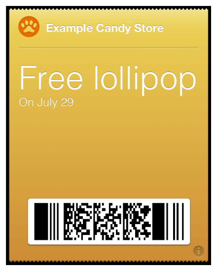

> 导航：[总目录](../../../README.md) · [documentation](../../../_indexes/documentation.md) · [Wallet Developer Guide](index.md)

## Building Your First Pass

In this tutorial, you download and edit a sample pass, build it, and view it in the iOS Simulator app.

### Case Study: A Very Simple Coupon

As a candy shop owner, you want to email your customers a coupon for a free lollipop. You trust most of your customers, and you’re running the promotion only until the giant bucket of lollipops runs out, so you won’t need to prevent customers from using their coupons more than once. You just want to create a pass with the same information that you would include on a printed coupon—a description of the offer and some information about your store.

In this tutorial, you set up your environment for pass development, sign one of the sample passes, and then make some minor changes to that pass.

### Creating and Populating the Pass Package

Passes are created as a package (also referred to as a [bundle](https://developer.apple.com/library/archive/documentation/General/Conceptual/DevPedia-CocoaCore/Bundle.html#//apple_ref/doc/uid/TP40008195-CH4)) containing a `pass.json` file that defines the pass, and image assets such as the logo and the icon.

To create the pass package for your pass, do the following:

1. Make a new directory in the Documents folder called `Lollipop.pass`. Using the `.pass` extension is a best practice, showing that the directory is a pass package.
2. Download this book’s companion file (from the [developer downloads area](https://developer.apple.com/services-account/download?path=/iOS/Wallet_Support_Materials/WalletCompanionFiles.zip) (未归档：ZIP 按安全策略跳过)), and locate the coupon in the Sample Passes directory.
3. Open the raw pass package, and copy the files it contains to your `Lollipop.pass` directory.

### Setting the Pass Type Identifier and Team ID

Every pass has a pass type identifier associated with a developer account. Pass type identifiers are managed in Member Center by a team admin. To build this pass, request and configure a pass type identifier. (You can’t use the pass type identifier that is already in the pass because it isn’t associated with your developer account.)

To register a pass type identifier, do the following:

1. In [Certificates, Identifiers & Profiles](https://developer.apple.com/account), select Identifiers.
2. Under Identifiers, select Pass Type IDs.
3. Click the plus (+) button.
4. Enter the description and pass type identifier, and click Submit.

To find your Team ID, do the following:

1. Open Keychain Access, and select your certificate.
2. Select File > Get Info, and find the Organizational Unit section under Details. This is your Team ID.

   The pass type identifier appears in the certificate under the User ID section.

> [!NOTE]
> 

Edit the `pass.json` file, and change the pass type identifier to the identifier you just set up. Then change the Team ID to match the values you just found (see Listing 3-1).

__Listing 3-1__Setting the pass type ID and Team ID

1. `{`
2. `...`
3. `"passTypeIdentifier" : "`
4. `your pass type identifier`
5. `",`
6. `"teamIdentifier" : "`
7. `your Team ID`
8. `",`
9. `...`
10. `}`

### Signing and Compressing the Pass

As part of building your production environment, you will need to set up a system for automatically signing and compressing passes as described in [Passes Are Cryptographically Signed and Compressed](Creating.md#apple-f4xwc4dqnrsv64tfmyxwi33df52wszbpkridimbqgezdcojvfvbuqnbnknltkni). For this tutorial, a very simple tool for signing passes is included.

To download your pass signing certificate, do the following:

1. In [Certificates, Identifiers & Profiles](https://developer.apple.com/account), select Identifiers.
2. Under Identifiers, select Pass Type IDs.
3. Select the pass type identifier, then click Edit.
4. If there is a certificate listed under Production Certificates, click the Download button next to it.

   If there are no certificates listed, click the Create Certificate button, then follow the instructions to create a pass signing certificate.

To get the `signpass` tool, do the following:

1. Download this book’s companion file (from the [developer downloads area](https://developer.apple.com/services-account/download?path=/iOS/Wallet_Support_Materials/WalletCompanionFiles.zip) (未归档：ZIP 按安全策略跳过)), and locate the `signpass` project.
2. Open the project in Xcode, and build it.
3. Right-click on the `signpass` executable (in the Products folder in Xcode) and select Show in Finder.
4. Move the `signpass` executable to the Documents folder.

To sign and compress the pass, use the `signpass` tool to sign the pass package. In Terminal, run the following commands:

1. `cd ~/Documents`
2. `./signpass -p Lollipop.pass`

These commands create a signed and compressed pass named `Lollipop.pkpass` in the Documents folder. If the `signpass` command fails, make sure you are using your correct pass type identifier and check that the `pass.json` file contains valid JSON.

### Changing the Offer

The sample pass is already a coupon, but it doesn’t have the right details for a candy store. First, change the description and organization name. In the `pass.json` file, find the keys from Listing 3-2 and change their values as shown.

__Listing 3-2__Setting the description and organization name

1. `{`
2. `...`
3. `"description" : "Coupon for a free lollipop at Example Candy Store",`
4. `"logoText" : "Example Candy Store",`
5. `...`
6. `}`

Next, the pass needs to describe the actual offer. This description requires three levels of keys, as shown in Listing 3-3. At the top level, find the `coupon` key, which indicates that this pass is a coupon. Its value is a dictionary that describes the coupon. At the second level, find the `primaryFields` key, which shows text on the front of the pass for the offer. Its value is a dictionary that describes the contents of the field. At the third level, the key is a string that uniquely identifies the field within the pass, and the value and label contain text that appears on the pass. Change their values as shown in Listing 3-3.

__Listing 3-3__Describing the offer

1. `{`
2. `...`
3. `"description" : "Coupon for a free lollipop at Example Candy Store",`
4. `"logoText" : "Example Candy Store",`
6. `"coupon" : {`
7. `"primaryFields" : [`
8. `{`
9. `"key": "offer",`
10. `"value": "Free lollipop"`
11. `"label": "On July 29"`
12. `}`
13. `]`
14. `},`
15. `...`
16. `}`

At the second level of the pass, find the `auxiliaryFields` and `backFields` keys. Delete these keys and their values.

### Viewing the Pass

The simplest way to see what a pass looks like during development is in the iOS Simulator app. To view the pass, launch Simulator and drag the `Lollipop.pkpass` file into the Simulator window. It displays the pass and offers to add it to Wallet, as shown in Figure 3-1.

__Figure 3-1__Viewing the finished pass

When you’re testing in the iOS Simulator app, errors are logged to the system log, which you can view with the Console app. If the pass isn’t displayed or if the system fails to add the pass to Wallet, check the log for a description of what went wrong.

[Wallet Ecosystem Design](Ecosystem.md#apple-f4xwc4dqnrsv64tfmyxwi33df52wszbpkridimbqgezdcojvfvbuqmznknltc)

[Pass Design and Creation](Creating.md#apple-f4xwc4dqnrsv64tfmyxwi33df52wszbpkridimbqgezdcojvfvbuqnbnknltc)
