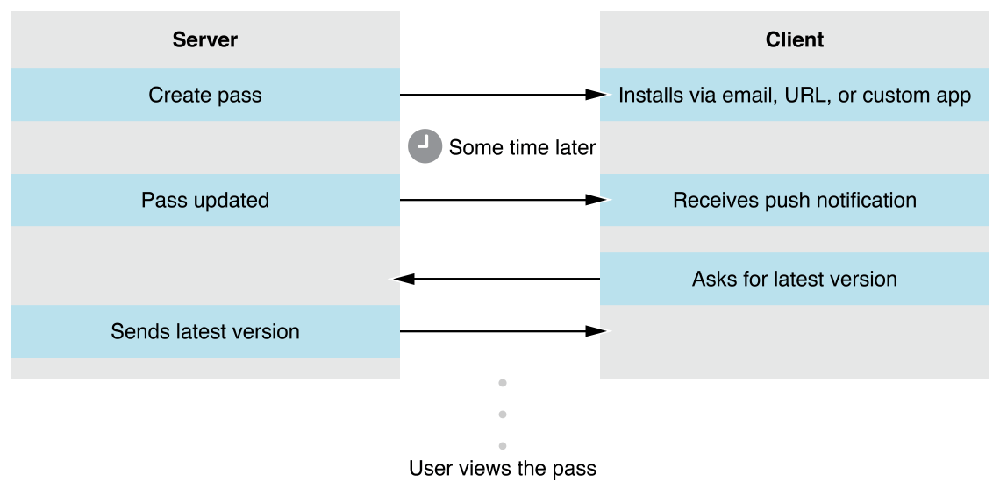

> 导航：[总目录](../../../README.md) · [documentation](../../../_indexes/documentation.md)

## Introducing Wallet

Passes are a digital representation of information that might otherwise be printed on small pieces of paper or plastic. They let users take an action in the physical world. Passes can contain images and a barcode, and you can update passes using push notifications. The pass library contains the user’s passes, and users view and manage their passes using the Wallet app.

This technology consists of three main components:

- A package format for creating passes.
- A web service API for updating passes, implemented on your server.
- An API used by your apps to interact with the user’s pass library.

The PassKit support materials are available in the [developer downloads area](https://developer.apple.com/services-account/download?path=/iOS/Wallet_Support_Materials/WalletCompanionFiles.zip) (未归档：ZIP 按安全策略跳过). They contain fully worked example passes, a command-line tool to help you sign passes during development, and a sample implementation of the web service.

[Wallet Ecosystem Design](Ecosystem.md#apple-f4xwc4dqnrsv64tfmyxwi33df52wszbpkridimbqgezdcojvfvbuqmznknltc)
