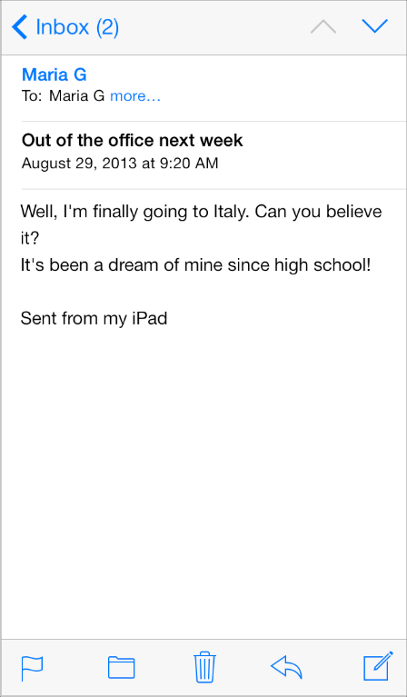
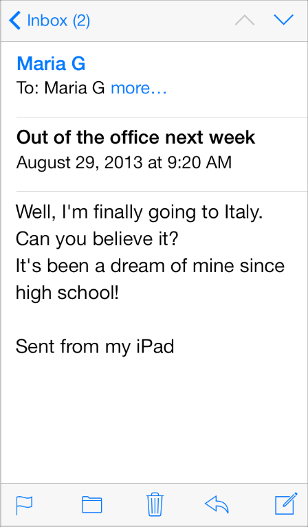

> 导航：[总目录](../../../README.md) · [documentation](../../../_indexes/documentation.md) · [iOS 7 UI Transition Guide](index.md)

## Appearance and Behavior

iOS 7 brings several changes to how you lay out and customize the appearance of your UI. The changes in view-controller layout, tint color, and font affect all the UIKit objects in your app. In addition, enhancements to gesture recognizer APIs give you finer grained control over gesture interactions.

### Using View Controllers

In iOS 7, view controllers use full-screen layout. At the same time, iOS 7 gives you more granular control over the way a view controller lays out its views. In particular, the concept of full-screen layout has been refined to let a view controller specify the layout of each edge of its view.

The [wantsFullScreenLayout](https://developer.apple.com/documentation/uikit/uiviewcontroller/1621390-wantsfullscreenlayout) view controller property is deprecated in iOS 7. If you currently specify `wantsFullScreenLayout = NO`, the view controller may display its content at an unexpected screen location when it runs in iOS 7.

To adjust how a view controller lays out its views, `UIViewController` provides the following properties:

- [edgesForExtendedLayout](https://developer.apple.com/documentation/uikit/uiviewcontroller/1621515-edgesforextendedlayout)

  The `edgesForExtendedLayout` property uses the `UIRectEdge` type, which specifies each of a rectangle’s four edges, in addition to specifying none and all.

  Use `edgesForExtendedLayout` to specify which edges of a view should be extended, regardless of bar translucency. By default, the value of this property is `UIRectEdgeAll`.
- [extendedLayoutIncludesOpaqueBars](https://developer.apple.com/documentation/uikit/uiviewcontroller/1621404-extendedlayoutincludesopaquebars)

  If your design uses opaque bars, refine `edgesForExtendedLayout` by also setting the `extendedLayoutIncludesOpaqueBars` property to `NO``false`. (The default value of `extendedLayoutIncludesOpaqueBars` is `NO``false`.)
- [automaticallyAdjustsScrollViewInsets](https://developer.apple.com/documentation/uikit/uiviewcontroller/1621372-automaticallyadjustsscrollviewin)

  If you don’t want a scroll view’s content insets to be automatically adjusted, set `automaticallyAdjustsScrollViewInsets` to `NO``false`. (The default value of `automaticallyAdjustsScrollViewInsets` is `YES``true`.)
- [topLayoutGuide](https://developer.apple.com/documentation/uikit/uiviewcontroller/1621367-toplayoutguide), [bottomLayoutGuide](https://developer.apple.com/documentation/uikit/uiviewcontroller/1621504-bottomlayoutguide)

  The `topLayoutGuide` and `bottomLayoutGuide` properties indicate the location of the top or bottom bar edges in a view controller’s view. If bars should overlap the top or bottom of a view, you can use Interface Builder to position the view relative to the bar by creating constraints to the bottom of `topLayoutGuide` or to the top of `bottomLayoutGuide`. (If no bars should overlap the view, the bottom of `topLayoutGuide` is the same as the top of the view and the top of `bottomLayoutGuide` is the same as the bottom of the view.) Both properties are lazily created when requested.

In iOS 7, view controllers can support custom animated transitions between views. In addition, you can use iOS 7 APIs to support user interaction during an animated transition. To learn more, see _[UIViewControllerAnimatedTransitioning Protocol Reference](https://developer.apple.com/documentation/uikit/uiviewcontrolleranimatedtransitioning)_ and _[UIViewControllerInteractiveTransitioning Protocol Reference](https://developer.apple.com/documentation/uikit/uiviewcontrollerinteractivetransitioning)_.

iOS 7 gives view controllers the ability to adjust the style of the status bar while the app is running. A good way to change the status bar style dynamically is to implement `preferredStatusBarStyle` and—within an animation block—update the status bar appearance and call `setNeedsStatusBarAppearanceUpdate`.

> [!NOTE]
> 

### Using Tint Color

In iOS 7, tint color is a property of [UIView](https://developer.apple.com/documentation/uikit/uiview). iOS 7 apps often use a tint to define a key color that indicates interactivity and selection state for UI elements throughout the app.

When you specify a tint for a view, the tint is automatically propagated to all subviews in the view’s hierarchy. Because [UIWindow](https://developer.apple.com/documentation/uikit/uiwindow) inherits from `UIView`, you can specify a tint color for the entire app by setting the window’s tint property using code like this:

1. `window.tintColor = [UIColor purpleColor];`

> [!TIP]
> 

If you don’t specify a tint for the window, it uses the system default color.

By default, a view’s tint color is `nil`, which means that the view uses its parent’s tint. It also means that when you ask a view for its tint color, it always returns a color value, even if you haven’t set one.

In general, it’s best to change a view’s tint color while the view is offscreen. To cause a view to revert to using its parent’s tint, set the tint color to `nil`.

> [!IMPORTANT]
> 

When an alert or action sheet appears, iOS 7 automatically dims the tint color of the views behind it. To respond to this color change, a custom view subclass that uses `tintColor` in its rendering should override `tintColorDidChange` to refresh the rendering when appropriate.

> [!NOTE]
> 

### Using Fonts

iOS 7 introduces Dynamic Type, which makes it easy to display great-looking text in your app.

A message at the smallest size

A message at the largest non Accessibility size

When you adopt Dynamic Type, you get:

- Automatic adjustments to letter spacing and line height for every font size.
- The ability to specify different text styles for semantically distinct blocks of text, such as `Body`, `Footnote`, or `Headline`.
- Text that responds appropriately when users change their preferred text size in Settings.

To take advantage of these features, be prepared to respond to the notifications that get sent when users change the text size setting. Then, use the [UIFont](https://developer.apple.com/documentation/uikit/uifont) method `preferredFontForTextStyle` to get the new font to use in your UI. iOS 7 optimizes fonts that are specified by this method for maximum legibility at every size. To learn more about text styles and using fonts in your app, see [Text Styles](../../Strings%20Text%20Fonts/Text%20Programming%20Guide%20for%20iOS/Using%20Text%20Kit%20to%20Draw%20and%20Manage%20Text.md#apple-f4xwc4dqnrsv64tfmyxwi33df52wszbpkridimbqga4tknbsfvbuqnbnknltmni).

### Using Gesture Recognizers

Prior to iOS 7, if a gesture recognizer requires another gesture recognizer to fail, you use [requireGestureRecognizerToFail:](https://developer.apple.com/documentation/uikit/uigesturerecognizer/1624203-requiregesturerecognizertofail) to set up a permanent relationship between the two objects at creation time. This works fine when gesture recognizers aren’t created elsewhere in the app—or in a framework—and the set of gesture recognizers remains the same.

In iOS 7, [UIGestureRecognizerDelegate](https://developer.apple.com/documentation/uikit/uigesturerecognizerdelegate) introduces two methods that allow failure requirements to be specified at runtime by a gesture recognizer delegate object:

- `gestureRecognizer:gestureRecognizer shouldRequireFailureOfGestureRecognizer:otherGestureRecognizer`
- `gestureRecognizer:gestureRecognizer shouldBeRequiredToFailByGestureRecognizer:otherGestureRecognizer`

> [!NOTE]
> 

For both methods, the gesture recognizer delegate is called once per recognition attempt, which means that failure requirements can be determined lazily. It also means that you can set up failure requirements between recognizers in different view hierarchies.

An example of a situation where dynamic failure requirements are useful is in an app that attaches a screen-edge pan gesture recognizer to a view. In this case, you might want all other relevant gesture recognizers associated with that view's subtree to require the screen-edge gesture recognizer to fail so you can prevent any graphical glitches that might occur when the other recognizers get canceled after starting the recognition process. To do this, you could use code similar to the following:

1. `UIScreenEdgePanGestureRecognizer *myScreenEdgePanGestureRecognizer;`
2. `...`
3. `myScreenEdgePanGestureRecognizer = [[UIScreenEdgePanGestureRecognizer alloc] initWithTarget:self action:@selector(handleScreenEdgePan:)];`
4. `myScreenEdgePanGestureRecognizer.delegate = self;`
5. `// Configure the gesture recognizer and attach it to the view.`
6. `...`
7. `- (BOOL)gestureRecognizer:(UIGestureRecognizer *)gestureRecognizer shouldBeRequiredToFailByGestureRecognizer:(UIGestureRecognizer *)otherGestureRecognizer {`
8. `BOOL result = NO;`
9. `if ((gestureRecognizer == myScreenEdgePanGestureRecognizer) && [[otherGestureRecognizer view] isDescendantOfView:[gestureRecognizer view]]) {`
10. `result = YES;`
11. `}`
12. `return result;`
13. `}`

[Supporting iOS 6](SupportingEarlieriOS.md#apple-f4xwc4dqnrsv64tfmyxwi33df52wszbpkridimbqgeztcnzufvbuqmjufvjvomi)

[Bars and Bar Buttons](Bars.md#apple-f4xwc4dqnrsv64tfmyxwi33df52wszbpkridimbqgeztcnzufvbuqobnknltc)
