> 导航：[总目录](../../../README.md) · [documentation](../../../_indexes/documentation.md) · [iOS 7 UI Transition Guide](index.md)

## Bars and Bar Buttons

In iOS 7, the status bar is transparent, and other bars—that is, navigation bars, tab bars, toolbars, search bars, and scope bars—are translucent. As a general rule, you want to make sure that content fills the area behind the bars in your app.

Most bars also draw a blur behind them, unless you provide a custom background image for the bar.

iOS 7 introduces the `barPosition` property for identifying bar position, which helps you specify when a custom background image should extend behind the status bar. The `UIBarPositionTopAttached` value means that a bar is at the top of the screen and its background extends upward into the status bar area. In contrast, the `UIBarPositionTop` value means that a bar is at the top of its local context—for example, at the top of a popover—and that it doesn’t provide a background for the status bar.

By default, all bar buttons are borderless. For details, see [Bar Buttons](#apple-f4xwc4dqnrsv64tfmyxwi33df52wszbpkridimbqgeztcnzufvbuqobnknltm).

### The Status Bar

Because the status bar is transparent, the view behind it shows through. The style of the status bar refers to the appearance of its content, which includes items such as time, battery charge, and Wi-Fi signal. Use a `UIStatusBarStyle` constant to specify whether the status bar content should be dark (`UIStatusBarStyleDefault`) or light (`UIStatusBarStyleLightContent`):

`UIStatusBarStyleDefault` displays dark content. Use when light content is behind the status bar. 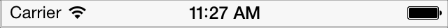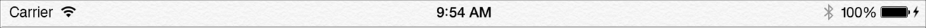

`UIStatusBarStyleLightContent` displays light content. Use when dark content is behind the status bar. 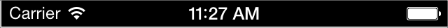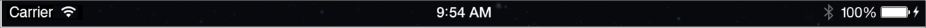

In some cases, the background image for a navigation bar or a search bar can extend up behind the status bar (for details, see [Navigation Bar](#apple-f4xwc4dqnrsv64tfmyxwi33df52wszbpkridimbqgeztcnzufvbuqobnknltg) and [Search Bar and Scope Bar](#apple-f4xwc4dqnrsv64tfmyxwi33df52wszbpkridimbqgeztcnzufvbuqobnknltcna)). If there are no bars below the status bar, the content view should use the full height of the screen. To learn how to ensure that a view controller lays out its views properly, see [Using View Controllers](AppearanceCustomization.md#apple-f4xwc4dqnrsv64tfmyxwi33df52wszbpkridimbqgeztcnzufvbuqmjvfvjvomq).

In iOS 7, you can control the style of the status bar from an individual view controller and change it while the app runs. If you prefer to opt out of this behavior and set the status bar style by using the `UIApplication` [statusBarStyle](https://developer.apple.com/documentation/uikit/uiapplication/1622988-statusbarstyle) method, add the `UIViewControllerBasedStatusBarAppearance` key to an app’s `Info.plist` file and give it the value `NO``false`.

### Navigation Bar

A navigation bar helps users navigate through an information hierarchy and, optionally, manage screen contents.

iOS 7 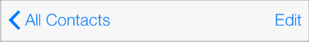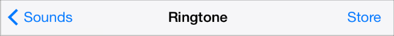

iOS 6 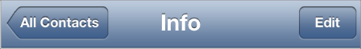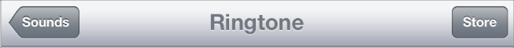

|  | iOS 7 | iOS 6 |
| --- | --- | --- |
| Bar style | Translucent light (default) or translucent dark.  By default, the `translucent` property is `YES``true`. | Opaque gradient blue (default) or opaque black.  By default, the `translucent` property is `NO``false`. |
| Appearance | A one-pixel hairline appears at the bottom edge. | A drop shadow appears at the bottom edge. |
| Tinting | Use `tintColor` to tint bar button items.  Use `barTintColor` to tint the bar background. | Use `tintColor` to tint the bar background. |
| Back button | The Back control is a chevron plus the title of the previous screen. \* | The Back button is a bordered button that contains the title of the previous screen. |

\* If you want to use a custom image to replace the default chevron, you also need to create a custom mask image. iOS 7 uses the mask to make the previous screen’s title appear to emerge from—or disappear into—the chevron during navigation transitions. To learn about the properties that control the Back button and mask image, see _[UINavigationBar Class Reference](https://developer.apple.com/documentation/uikit/uinavigationbar)_.

iOS 7 makes it easy to add a search bar to a navigation bar. For details, see [Search Bar and Scope Bar](#apple-f4xwc4dqnrsv64tfmyxwi33df52wszbpkridimbqgeztcnzufvbuqobnknltcna).

If you create a background image for a navigation bar that uses the `UIBarPositionTopAttached` bar position—or for a navigation bar within a navigation controller—make sure the image includes the status bar area. Specifically, create a background image that has a height of 64 points.

The following table describes how iOS 7 treats resizable navigation bar background images of various heights. (To learn how to specify a resizing mode for an image, see _[UIImage Class Reference](https://developer.apple.com/documentation/uikit/uiimage)_.)

__Table 5-1__Treatment of resizable background images for bars at the top of the screen

| Height | Resizing treatment | Status bar background appearance |
| --- | --- | --- |
| 44 points | Horizontally resized as appropriate (the image is not vertically tiled or stretched). | Black, if using `UIBarPositionTopAttached`.  Provided by the window background, if using `UIBarPositionTop`. |
| Less than 44 points | Vertically resized to 64 points if using `UIBarPositionTopAttached` or 44 points if using `UIBarPositionTop`.  Horizontally resized as appropriate. | Provided by the bar background. |
| 64 points | Horizontally resized as appropriate. | Provided by the bar background. |
| 1 point | Vertically resized to 64 points if using `UIBarPositionTopAttached` or if using a navigation controller. Vertically resized to 44 points if using `UIBarPositionTop`.  Horizontally resized as appropriate. | Provided by the bar background. |

Avoid using an extra-tall background image to display a custom drop shadow below the navigation bar. This technique won’t work in iOS 7, because the extra height extends into the status bar area instead of below the navigation bar. If you want to add a drop shadow to your navigation bar, create a custom background image and use the [shadowImage](https://developer.apple.com/documentation/uikit/uinavigationbar/1624963-shadowimage) property to specify a custom shadow image.

### Search Bar and Scope Bar

A search bar accepts users’ text, which can be used as input for a search. A search bar can have a scope bar attached below it.

iOS 7

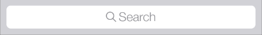

iOS 6

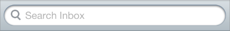

|  | iOS 7 | iOS 6 |
| --- | --- | --- |
| Bar style | Translucent light (default) or translucent dark.  By default, the `translucent` property is `YES``true`. | Opaque gradient blue (default) or opaque black.  By default, the `translucent` property is `NO``false`. |
| Search bar style | Prominent (default) or minimal.  A prominent search bar has a translucent background and an opaque search field.  A minimal search bar has no background and a translucent search field. | – |
| Appearance | A one-pixel hairline appears at the bottom edge. | A drop shadow appears at the bottom edge. |
| Tinting | Use `tintColor` to tint foreground elements.  Use `barTintColor` to tint the bar background. | Use `tintColor` to tint the bar background. |

If you create a background image for a search bar that uses the `UIBarPositionTopAttached` bar position, make sure the image height includes the height of the status bar. If you create a resizable background image, see [Table 5-1](#apple-f4xwc4dqnrsv64tfmyxwi33df52wszbpkridimbqgeztcnzufvbuqobnknltq) for details on how iOS 7 resizes images of various sizes.

In iOS 7, [UISearchDisplayController](https://developer.apple.com/documentation/uikit/uisearchdisplaycontroller) includes the `displaysSearchBarInNavigationBar` property, which you can use to put a search bar in a navigation bar, similar to the one in Calendar on iPhone:

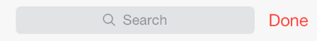

A scope bar lets users define the scope of a search.

> [!NOTE]
> 

iOS 7

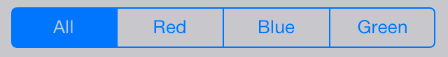

iOS 6

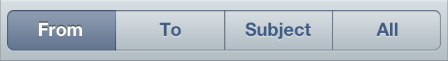

|  | iOS 7 | iOS 6 |
| --- | --- | --- |
| Bar style | Translucent light (default) or translucent dark.  By default, the `translucent` property is `YES``true`. | Opaque gradient blue (default) or opaque black.  By default, the `translucent` property is `NO``false`. |
| Appearance | A one-pixel hairline appears at the bottom edge. | A drop shadow appears at the bottom edge. |
| Tinting | Use `tintColor` to tint scope button contents.  Use `barTintColor` to tint the bar background. | Use `tintColor` to tint the bar background. |

### Tab Bar

A tab bar gives people the ability to switch between different subtasks, views, and modes.

iOS 7 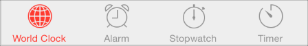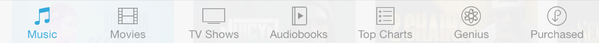

iOS 6 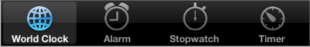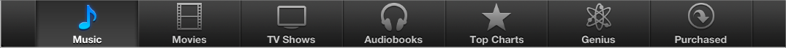

> [!NOTE]
> 

|  | iOS 7 | iOS 6 |
| --- | --- | --- |
| Bar style | `UITabBar` includes the `barStyle` property.  Translucent light (default) or translucent dark.  By default, the `translucent` property is `YES``true`. | Opaque gradient black (default). In iOS 6, the tab bar doesn’t include the `barStyle` or `translucent` properties. |
| Appearance | If provided, a custom selection indicator image is used. | A selection indicator image is drawn behind the tab icon. |
| Item positioning | Use `itemPositioning` to change tab layout. By default, tabs fill the width of a tab bar on iPhone; on iPad, tabs are centered by default.  In a centered-item bar, you can use `itemWidth` and `itemSpacing` to customize tab layout. | In iOS 6, the tab bar doesn’t include the `itemPositioning`, `itemWidth`, or `itemSpacing` properties. |
| Tinting | Use `tintColor` to tint selected tab bar items.  Use `barTintColor` to tint the bar background. | Use `tintColor` to tint the bar background. |

If you create a custom icon for a tab bar item, you should also use the `selectedImage` property of [UITabBarItem](https://developer.apple.com/documentation/uikit/uitabbaritem) to specify a second icon that represents the selected state of the item. If you don’t provide a selected version of a custom icon, the same icon is used in both states. For some design guidance on creating a custom tab bar icon, see Bar Button Icons.

### Toolbar

A toolbar contains controls that perform actions related to objects in the current screen or view.

iOS 7 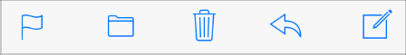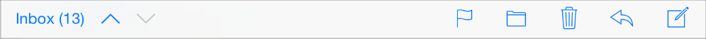

iOS 6 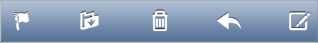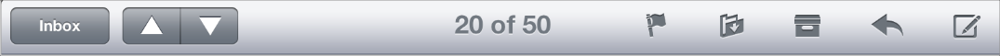

|  | iOS 7 | iOS 6 |
| --- | --- | --- |
| Bar style | Translucent light (default) or translucent dark.  By default, the `translucent` property is `YES``true`. | Opaque gradient blue (default) or opaque black.  By default, the `translucent` property is `NO``false`. |
| Appearance | A one-pixel hairline appears at the top edge. | A drop shadow appears at the top edge. |
| Tinting | Use `tintColor` to tint bar button items.  Use `barTintColor` to tint the bar background. | Use `tintColor` to tint the bar background. |
| Related information | `UIToolbarPosition` constants are deprecated; use `UIBarPosition` constants instead. | – |

If you create a resizable background image, see [Table 5-1](#apple-f4xwc4dqnrsv64tfmyxwi33df52wszbpkridimbqgeztcnzufvbuqobnknltq) for details on how iOS 7 resizes images of various sizes.

### Bar Buttons

In iOS 6, bar buttons are either bordered or borderless. In iOS 7, all bar buttons are borderless.

Navigation bar buttons in iOS 7

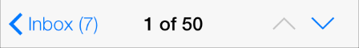

Navigation bar buttons in iOS 6

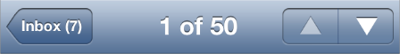

For clarity, iOS 7 apps sometimes use titles in bar buttons instead of icons. For example, Calendar in iOS 7 uses Inbox instead of a custom icon:

iOS 7

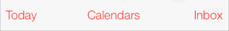

iOS 6

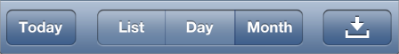

In earlier versions of iOS, custom bar button art was automatically treated as a template image. (A template image is used as a mask to create the final image.) In iOS 7, you can use the following `UIImage` properties to specify whether custom art should be treated as a template image or be fully rendered:

- `UIImageRenderingModeAlwaysTemplate`. The image should be treated as a template image.
- `UIImageRenderingModeAlwaysOriginal`. The image should be rendered as is.

If you don’t specify a treatment for your image—or you opt out of a treatment in a particular situation—the image receives the default treatment defined by the enclosing view. For example, by default bars use the template treatment, whereas by default a slider uses the fully rendered treatment.

> [!NOTE]
> 

[Appearance and Behavior](AppearanceCustomization.md#apple-f4xwc4dqnrsv64tfmyxwi33df52wszbpkridimbqgeztcnzufvbuqmjvfvjvomi)

[Content Views](ContentViews.md#apple-f4xwc4dqnrsv64tfmyxwi33df52wszbpkridimbqgeztcnzufvbuqmjqfvjvomi)
