> 导航：[总目录](../../../README.md) · [documentation](../../../_indexes/documentation.md) · [iOS 7 UI Transition Guide](index.md)

## Content Views

Content views display custom app content. Because the look of most content views is not provided by the system, visual changes in iOS 7 have almost no effect on them. The main exception is the grouped-style table view, which has a significantly changed default appearance in iOS 7.

### Activity

An activity represents a system-provided or custom feature that can act on the currently selected content. Users can access these features in the system-provided activity view controller that appears when they tap the Share button.

System-provided activities can use either of two icon styles:

- A style that looks like a fully rendered app icon, such as the Mail icon shown below
- A style that looks similar to a bar button item, such as the Copy and Print icons shown below

Third-party features always use the second style.

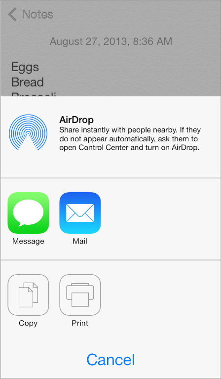

To offer a service within your app, create a simple, streamlined template image that represents it and a short title that describes it. Follow these guidelines to create a template image that looks good in the activity view controller:

- Use black or white with appropriate alpha transparency.
- Don’t include a drop shadow.
- Use anti-aliasing.

Center an activity template image in an area that measures about 70 x 70 pixels (high resolution).

### Collection View

A collection view manages an ordered collection of items and presents them in a customizable layout.

In iOS 7, collection views support custom animated transitions between layouts. To learn more, see _[UICollectionViewTransitionLayout Class Reference](https://developer.apple.com/documentation/uikit/uicollectionviewtransitionlayout)_.

Photos uses collection views to display groups of photos and support transitions between them.

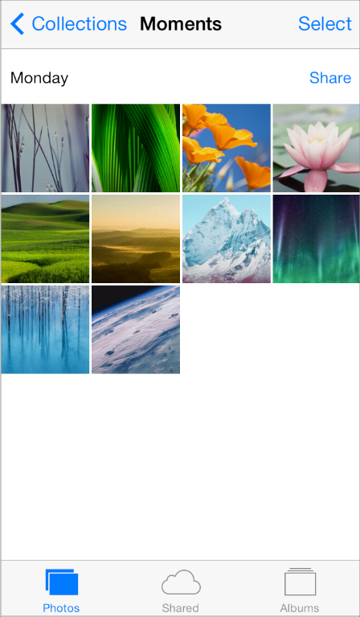

### Image View

An image view displays a single image or an animated series of images.

In iOS 7, [UIImageView](https://developer.apple.com/documentation/uikit/uiimageview) includes the `tintColor` property. When the image view contains a template image—that is, an image that specifies the `UIImageRenderingModeAlwaysTemplate` rendering mode—`tintColor` is applied to the image.

### Map View

A map view presents geographical data and supports most of the features provided by the built-in Maps app.

Photos uses a map view to help users view location information for a photo.

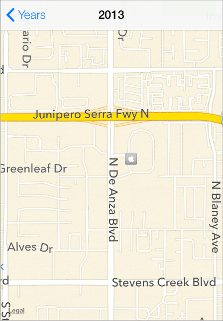

In iOS 7, use the new [MKOverlayRenderer](https://developer.apple.com/documentation/mapkit/mkoverlayrenderer) class to create an overlay to draw on top of a map view.

To add a 3D appearance to a map view, assign a camera object—that is, an instance of [MKMapCamera](https://developer.apple.com/documentation/mapkit/mkmapcamera)—to a map view’s `camera` property. To learn more, see _[MKMapView Class Reference](https://developer.apple.com/documentation/mapkit/mkmapview)_.

### Page View Controller

A page view controller manages multipage content using either a scrolling or page-curl transition style.

In iOS 7, use the `pageViewControllerPreferredInterfaceOrientationForPresentation` and `pageViewControllerSupportedInterfaceOrientations` methods to specify preferred and supported orientations, respectively.

Below, you can see the default appearance of a page view controller in iOS 7 Simulator:

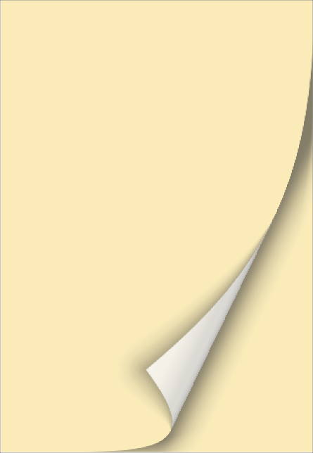

### Popover (iPad Only)

A popover is a transient view that can be revealed when people tap a control or an onscreen area.

In iOS 7, the popover background is a white blur, which means that the background of the popover’s content view can be transparent. A table view inside a popover automatically uses a translucent appearance; custom content inside a popover should use a translucent appearance.

iOS 7

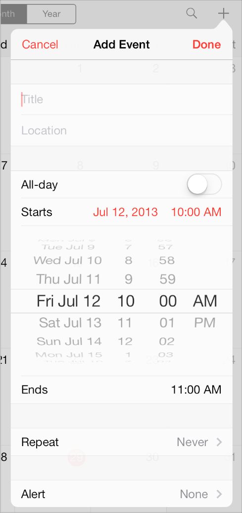

iOS 6

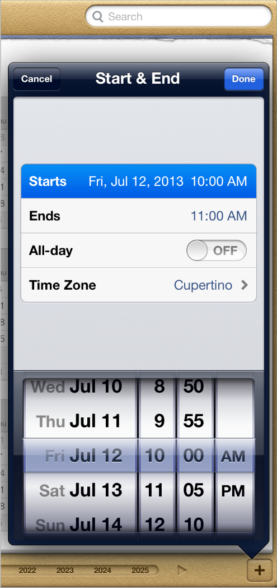

### Scroll View

A scroll view helps people see content that is larger than the scroll view’s boundaries.

The only visual difference in the scroll view between iOS 7 and iOS 6 is the appearance of the scroller.

iOS 7

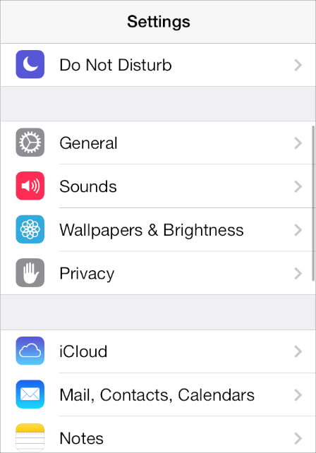

iOS 6

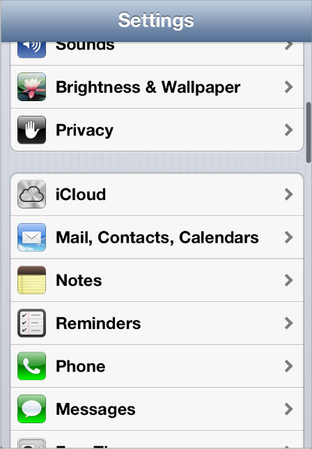

In iOS 7, you can manage scroll view insets yourself by using the `automaticallyAdjustsScrollViewInsets` property of [UIViewController](https://developer.apple.com/documentation/uikit/uiviewcontroller).

### Split View Controller (iPad Only)

A split view controller is a full-screen view controller that manages the presentation of two side-by-side view controllers.

The appearance of a split view controller is provided by the views of its child view controllers, which may be affected by the iOS 7 UI.

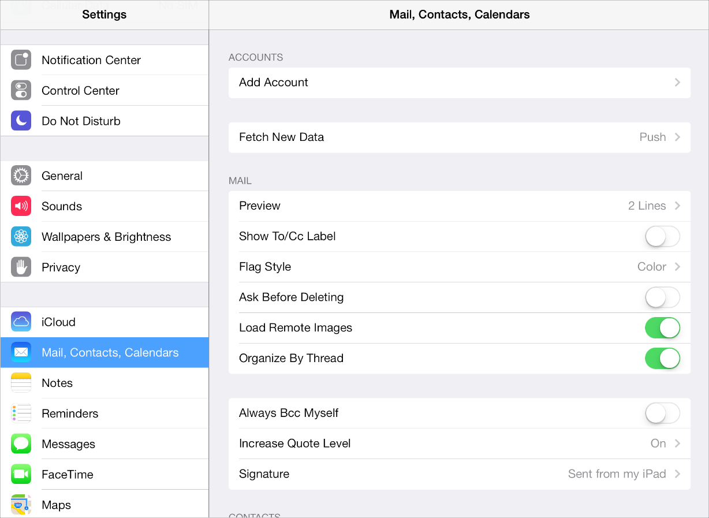

### Table View

A table view presents data in a single-column list of multiple rows.

iOS 7 introduces several changes to the appearances of both plain and grouped table views.

iOS 7 (grouped table)

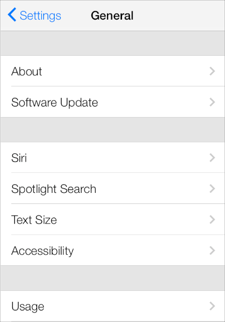

iOS 6 (grouped table)

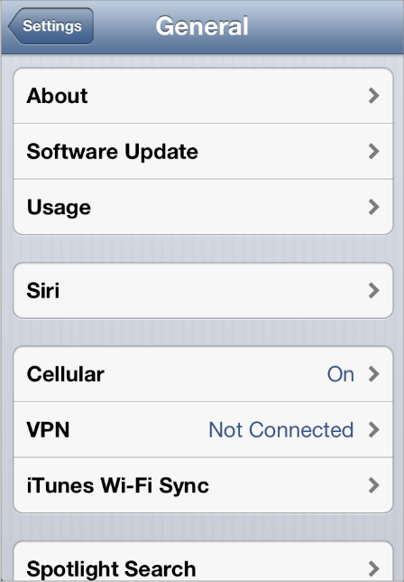

| Feature | Appearance in iOS 7 |
| --- | --- |
| Cell separator (both styles) | Separators in iOS 7 are thinner, narrower, and lighter in color than separators in iOS 6.  By default, the separator is inset from the left edge of the table view. \* |
| Section index (plain style) | By default, the section index includes a translucent white background (use the `sectionIndexBackgroundColor` property to specify a different color). |
| Header and footer text (both styles) | By default, headers display text using all capital letters; footers display text using sentence-style capitalization.  You can use a custom [UITableViewHeaderFooterView](https://developer.apple.com/documentation/uikit/uitableviewheaderfooterview) object to provide a different look. |
| Cell group (grouped style) | Each group extends the full width of the screen. |
| Cell selection appearance (both styles) | Noninverted content is displayed on a subtle gray background. |
| Background appearance (grouped style) | The background is a solid light gray. |

\* If every cell in a table contains an image view of the same size, by default iOS vertically aligns the leading edge of all separators. In a table that mixes text-only cells with cells that contain image views, you can use the `separatorInset` property to ensure that the separators are vertically aligned.

> [!NOTE]
> 

Table-view elements also have a different appearance in iOS 7.

| Table-view element | Appearance in iOS 7 | Appearance in iOS 6 |
| --- | --- | --- |
| Checkmark | image: ../Art/check_7_2x.png | image: ../Art/check_6_2x.png |
| Disclosure indicator | image: ../Art/disclosure_indicator_7_2x.png | image: ../Art/disclosure_6_2x.png |
| Detail Disclosure button | image: ../Art/detail_disclosure_7_2x.png | image: ../Art/detail_disclosure_6_2x.png |
| Row reorder | image: ../Art/row_reorder_7_2x.png | image: ../Art/row_reorder_6.jpg |
| Row insert | image: ../Art/row_insert_7_2x.png | image: ../Art/row_insert_6_2x.png |
| Delete button control | image: ../Art/delete_control_7_2x.png | image: ../Art/delete_control_6_2x.png |
| Delete button | image: ../Art/delete_button_7_2x.png | image: ../Art/delete_button_6.jpg |

### Text View

A text view accepts and displays multiple lines of text.

Be sure to use the [UIFont](https://developer.apple.com/documentation/uikit/uifont) method `preferredFontForTextStyle` to get the text for display in a text view.

### Web View

A web view is a region that can display rich HTML content.

In iOS 7, [UIWebView](https://developer.apple.com/documentation/uikit/uiwebview) supports displaying content in a paginated layout.

[Bars and Bar Buttons](Bars.md#apple-f4xwc4dqnrsv64tfmyxwi33df52wszbpkridimbqgeztcnzufvbuqobnknltc)

[Controls](Controls.md#apple-f4xwc4dqnrsv64tfmyxwi33df52wszbpkridimbqgeztcnzufvbuqojnknltc)
