> 导航：[总目录](../../../README.md) · [documentation](../../../_indexes/documentation.md) · [iOS 7 UI Transition Guide](index.md)

## Controls

Controls are UI elements that users either view (to get information) or interact with (to perform an action). All iOS 7 controls have an updated appearance, and most of them also have different metrics.

Because [UIControl](https://developer.apple.com/documentation/uikit/uicontrol) inherits from [UIView](https://developer.apple.com/documentation/uikit/uiview), you can use a control’s `tintColor` property to tint the control. For more information about tinting views, see [Using Tint Color](AppearanceCustomization.md#apple-f4xwc4dqnrsv64tfmyxwi33df52wszbpkridimbqgeztcnzufvbuqmjvfvjvomy).

By default, system-provided controls support system-defined animations and appearance changes that indicate highlighted and selected states.

### Date Picker

A date picker displays components of date and time, such as minutes, hours, days, and years.

The overall size of a date picker is the same in iOS 7 as it is in iOS 6.

iOS 7

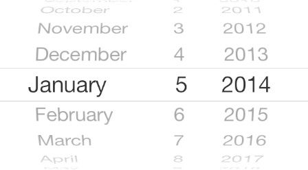

iOS 6

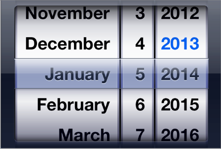

iOS 7 apps tend to embed date pickers within the content instead of displaying them in a different view. For example, Calendar dynamically expands a table row to let users specify a time without leaving the event-creation view:

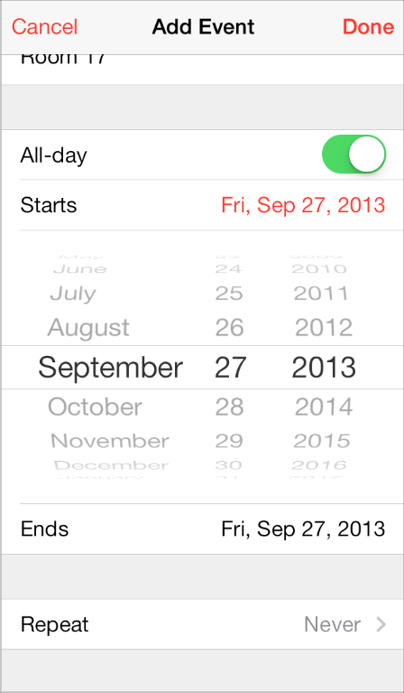

### Contact Add Button

A Contact Add button—that is, a [UIButton](https://developer.apple.com/documentation/uikit/uibutton) object of type `UIButtonTypeContactAdd`—lets users add a contact’s information to a text field or other text-based view.

The size and appearance of a Contact Add button have changed in iOS 7.

iOS 7

iOS 6

### Detail Disclosure Button

A Detail Disclosure button—that is, a [UIButton](https://developer.apple.com/documentation/uikit/uibutton) object of type `UIButtonTypeDetailDisclosure`—reveals additional details or functionality related to an item in a table or other view. In iOS 7, a Detail Disclosure button uses the same symbol as the Info button.

The size and appearance of a Detail Disclosure button has changed in iOS 7:

iOS 7

iOS 6

When a Detail Disclosure button appears in a table row, tapping elsewhere in the row doesn’t activate the button; instead, it selects the row item or triggers app-defined behavior.

### Info Button

An Info button—that is, a [UIButton](https://developer.apple.com/documentation/uikit/uibutton) object of type `UIButtonTypeInfoLight` or `UIButtonTypeInfoDark`—reveals configuration details about an app, sometimes on the back of the current view. In iOS 7, an Info button uses the same symbol as a Detail Disclosure button.

The size and appearance of an Info button have changed in iOS 7.

iOS 7

iOS 6 (shown in Weather)

### Label

A label displays static text.

By default a label uses the system font, so it looks different in iOS 7 than it does in iOS 6.

iOS 7

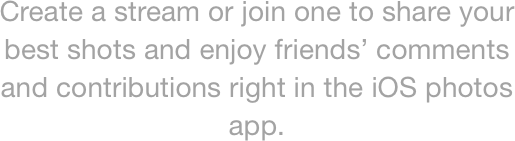

iOS 6

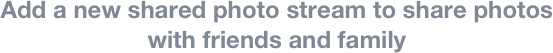

Be sure to use the [UIFont](https://developer.apple.com/documentation/uikit/uifont) method `preferredFontForTextStyle` to get the text for display in a label.

### Page Control

A page control indicates how many views are open and which one is currently visible.

The size and appearance of a page control have changed in iOS 7.

iOS 7 (control shown in Weather)

iOS 6 (control shown in Weather)

### Picker

A picker displays a set of values from which a user can choose.

The overall size of a picker is the same in iOS 7 as it is in iOS 6; its appearance and behavior in iOS 7 are similar to the appearance and behavior of a date picker.

iOS 7

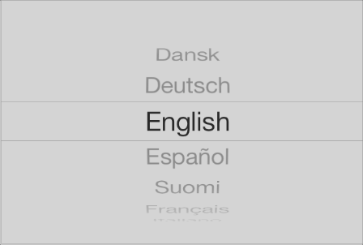

iOS 6

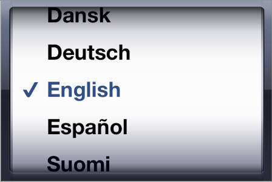

### Progress View

A progress view shows the progress of a task or process that has a known duration.

The size and appearance of a progress view—shown here in the Mail toolbar—have changed in iOS 7.

iOS 7

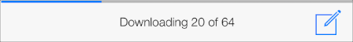

iOS 6

If you currently use the [trackTintColor](https://developer.apple.com/documentation/uikit/uiprogressview/1619841-tracktintcolor) property to specify a tint for a progress view’s track, the track continues to use this tint in iOS 7. If you set `trackTintColor` to `nil`, the track uses the tint of its parent.

### Refresh Control

A refresh control performs a user-initiated content refresh, typically in a table.

The size and appearance of a refresh control have changed in iOS 7.

iOS 7

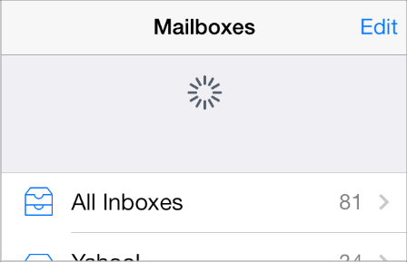

iOS 6

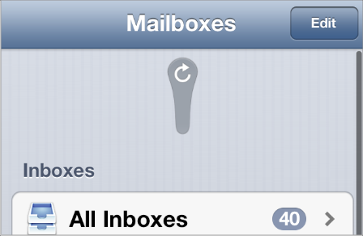

### Rounded Rectangle Button

The rounded rectangle button is deprecated in iOS 7. Instead, use a system button—that is, a [UIButton](https://developer.apple.com/documentation/uikit/uibutton) object of type `UIButtonTypeSystem`.

iOS 7 system buttons don’t include a bezel or a background appearance. A system button can contain a graphical symbol or a text title, and it can specify a tint color or receive its parent’s color.

iOS 7 system button

iOS 6 rounded rectangle button

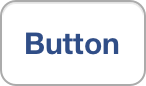

> [!NOTE]
> 

If you need to display a button that includes a bezel, use a button of type `UIButtonTypeCustom` and supply a custom background image.

### Segmented Control

A segmented control is a linear set of segments, in which each segment functions as a button that can display a different view.

The size and appearance of the segmented control have changed in iOS 7.

iOS 7

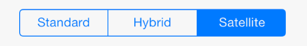

iOS 6

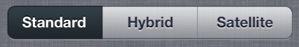

In iOS 7, the segmented control uses a single style, and the [segmentedControlStyle](https://developer.apple.com/documentation/uikit/uisegmentedcontrol/1618577-segmentedcontrolstyle) property is unused.

### Slider

A slider lets users make adjustments to a value or process throughout a range of allowed values.

The size and appearance of the slider have changed in iOS 7.

iOS 7

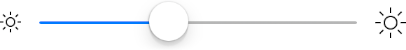

iOS 6

iOS 7 continues to use the tints you specify for the minimum and maximum track images and for the thumb, using the properties [minimumTrackTintColor](https://developer.apple.com/documentation/uikit/uislider/1621348-minimumtracktintcolor), [maximumTrackTintColor](https://developer.apple.com/documentation/uikit/uislider/1621334-maximumtracktintcolor), and [thumbTintColor](https://developer.apple.com/documentation/uikit/uislider/1621332-thumbtintcolor). If you set the `minimumTrackColor` property to `nil`, the area uses the tint of its parent; if you set the `maximumTrackTintColor` or `thumbTintColor` properties to `nil`, both areas use their default color.

### Stepper

A stepper increases or decreases a value by a constant amount.

The size and appearance of the stepper have changed in iOS 7.

iOS 7

iOS 6

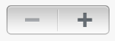

In iOS 7, by default, a stepper treats custom increment and decrement images as template images.

### Switch

A switch presents two mutually exclusive choices or states (typically used only in table views).

The size and appearance of the switch have changed in iOS 7.

iOS 7

iOS 6

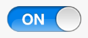

iOS 7 continues to use the tints you specify for the on and off—or disabled—states and for the thumb, using the properties [onTintColor](https://developer.apple.com/documentation/uikit/uiswitch/1623687-ontintcolor), [tintColor](https://developer.apple.com/documentation/uikit/uiswitch/1623688-tintcolor), and [thumbTintColor](https://developer.apple.com/documentation/uikit/uiswitch/1623684-thumbtintcolor).

In iOS 7, by default, custom on and off images are ignored.

### Text Field

A text field accepts a single line of user input.

The size and appearance of the text field have changed in iOS 7.

iOS 7 (two text fields shown in Maps)

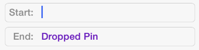

iOS 6 (two text fields shown in Maps)

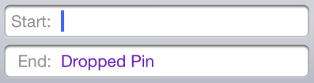

Be sure to use the [UIFont](https://developer.apple.com/documentation/uikit/uifont) method `preferredFontForTextStyle` to get the text for display in a text view.

[Content Views](ContentViews.md#apple-f4xwc4dqnrsv64tfmyxwi33df52wszbpkridimbqgeztcnzufvbuqmjqfvjvomi)

[Temporary Views](TempViews.md#apple-f4xwc4dqnrsv64tfmyxwi33df52wszbpkridimbqgeztcnzufvbuqmjrfvjvomi)
