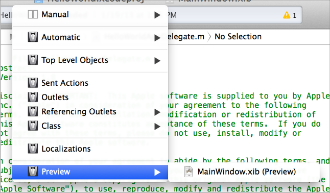
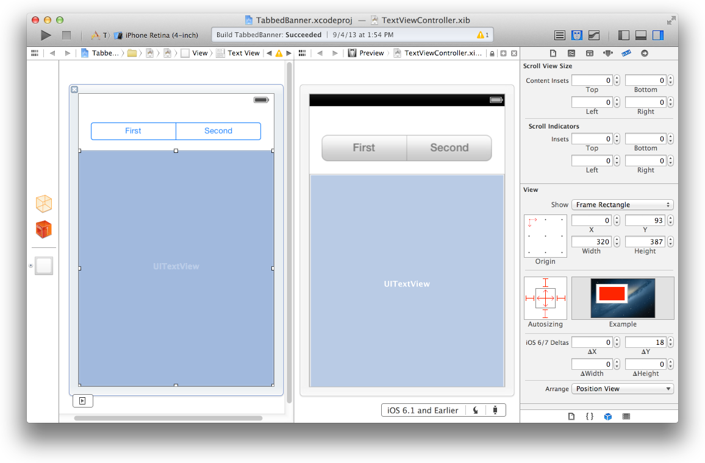

> 导航：[总目录](../../../README.md) · [documentation](../../../_indexes/documentation.md) · [iOS 7 UI Transition Guide](index.md)

## Supporting iOS 6

If business reasons require you to continue supporting iOS 6 or earlier, you need to choose the most practical way to update the app for iOS 7. The techniques you choose can differ, but the overall advice remains the same: First, focus on redesigning the app for iOS 7. Then—if the redesign includes navigational or structural changes—bring these changes to the iOS 6 version as appropriate (don’t restyle the iOS 6 version of the app to use iOS 7 design elements, such as translucent bars or borderless bar buttons).

> [!NOTE]
> 

### Using Interface Builder to Support Multiple App Versions

Interface Builder in Xcode 5 includes new features that help you transition an app to iOS 7 while continuing to support earlier versions.

__Get a preview of how the UI updates you make affect an earlier version.__ Using the assistant editor, you can make changes to an iOS 7 storyboard or XIB file on the canvas and simultaneously see how those changes look in the iOS 6 version of the file.

Follow these steps to preview an earlier storyboard or XIB file:

1. While viewing the iOS 7 storyboard or XIB file on the canvas, open the assistant editor.
2. Open the Assistant pop-up menu. (The Assistant pop-up menu is the first item to the right of the back and forward arrows in the assistant editor jump bar.)
3. In the menu, scroll to the Preview item and choose the storyboard or XIB file.

   

__Toggle between viewing app UI in iOS 7 and iOS 6.1 or earlier.__ If your app needs to support iOS 6.1 or earlier, use this feature to make sure the UI looks correct in all versions of the app.

Follow these steps to switch between two versions of the UI:

1. Open the File inspector in Interface Builder.
2. Open the “View as” menu.
3. Choose the version of the UI you want to view.

For more information about new Interface Builder features in Xcode 5, see _[What’s New in Xcode](../../Developer%20Tools/What%E2%80%99s%20New%20in%20Xcode/What%27s%20New%20in%20Xcode%209.md#apple-f4xwc4dqnrsv64tfmyxwi33df52wszbpkridimbqga2dmmrw)_.

### Supporting Two Versions of a Standard App

If both versions of a standard app should have a similar layout, use Auto Layout to create a UI that works correctly in both versions of iOS. To support multiple versions of iOS, specify a single set of constraints that Auto Layout can use to adjust the views and controls in the storyboard or XIB files (to learn more about constraints, see [Constraints Express Relationships Between Views](../Auto%20Layout%20Guide/index.md#apple-f4xwc4dqnrsv64tfmyxwi33df52wszbpkridimbqgeydqnjtfvbuqmq)).

If both versions of a standard app should have a similar layout and you’re not using Auto Layout, use offsets. To use offsets, first update the UI for iOS 7. Next, use the assistant editor to get a preview of how the changes affect the earlier version (to open the preview, select the Preview item in the Assistant pop-up menu as described in [Using Interface Builder to Support Multiple App Versions](#apple-f4xwc4dqnrsv64tfmyxwi33df52wszbpkridimbqgeztcnzufvbuqmjufvjvona)). Then, specify values that define the origin, height, and width of each element in the earlier UI as offsets from the element’s new position in the iOS 7 UI. For example, the y position of the text view shown below would have to change by 18 points in the earlier version of the UI to accommodate the greater height of the iOS 6 segmented control.

To learn more about Auto Layout, see _[Auto Layout Guide](https://developer.apple.com/library/archive/documentation/UserExperience/Conceptual/AutolayoutPG/index.html#//apple_ref/doc/uid/TP40010853)_.

### Managing Multiple Images in a Hybrid App

Hybrid apps often include custom image assets, such as bar button icons, and background views for bars or other controls. Apps can use one or more asset catalogs to manage these resources. (To learn more about asset catalogs, see _Asset Catalog Help_.)

> [!NOTE]
> 

In a hybrid app that must support multiple versions of iOS, you manage the images yourself. Images that differ depending on an app’s version should have unique names; otherwise, you can use the same image in both versions.

If your storyboard or XIB file contains an embedded image, consider creating an outlet to the image view and loading the appropriate resource as needed. To learn how to load different assets in code, see Loading Resources Conditionally.

### Loading Resources Conditionally

In some cases, you need to determine the iOS version your app is currently running in so you can respond to version differences appropriately in code. For example, if different versions of an app use significantly different layouts, you can load different storyboard or XIB files for each version. You may also need to use different code paths to handle API differences, such using `barTintColor` instead of `tintColor` to tint a bar’s background.

> [!NOTE]
> 

If you need to load different resources for different app versions—and you currently identify a storyboard or XIB file in your `Info.plist` file—you can use the version of the Foundation framework to determine the current system version and load the appropriate resource in [application:didFinishLaunchingWithOptions:](https://developer.apple.com/documentation/uikit/uiapplicationdelegate/1622921-application). The code below shows how to check the Foundation framework version:

1. `if (floor(NSFoundationVersionNumber) <= NSFoundationVersionNumber_iOS_6_1) {`
2. `// Load resources for iOS 6.1 or earlier`
3. `} else {`
4. `// Load resources for iOS 7 or later`
5. `}`

[Scoping the Project](Scoping.md#apple-f4xwc4dqnrsv64tfmyxwi33df52wszbpkridimbqgeztcnzufvbuqnznknltc)

[Appearance and Behavior](AppearanceCustomization.md#apple-f4xwc4dqnrsv64tfmyxwi33df52wszbpkridimbqgeztcnzufvbuqmjvfvjvomi)
