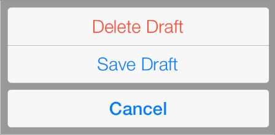
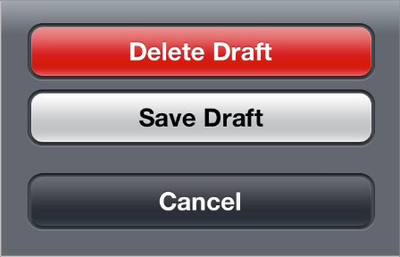
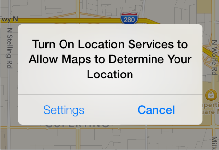
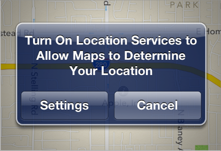
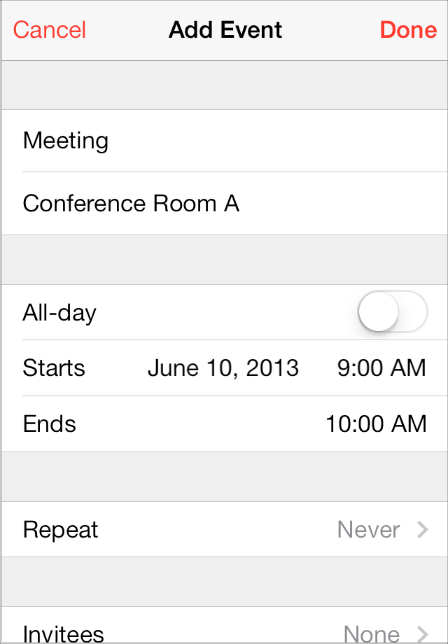
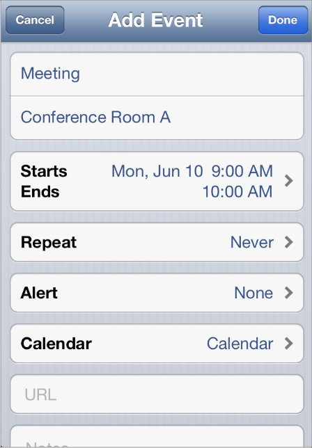

> 导航：[总目录](../../../README.md) · [documentation](../../../_indexes/documentation.md) · [iOS 7 UI Transition Guide](index.md)

## Temporary Views

Action sheets, alerts, and modal views are temporary views that appear when something requires a user’s attention or when additional choices or functionality need to be offered.

Although action sheets and alerts can display custom content, only a few modifications can be made to their appearance. For this reason, you have little to do to make sure these elements look good in your iOS 7 app.

Because a modal view is just a view that’s presented modally, you may want to redesign the modal views in your app so that they look appropriate in iOS 7.

> [!NOTE]
> 

### Action Sheet

An action sheet displays a set of choices related to a task the user initiates.

In iOS 7, by default an action sheet has a translucent background and contains borderless buttons.

iOS 7

iOS 6

The `UIActionSheetStyle` constants are unused in iOS 7. On an iOS 7 device, system-provided UI—such as an action sheet—uses the iOS 7 appearance regardless of the appearance of the currently running app.

Note that a potentially dangerous option in an action sheet—specified by the `destructiveButtonTitle` parameter in [initWithTitle:delegate:cancelButtonTitle:destructiveButtonTitle:otherButtonTitles:](https://developer.apple.com/documentation/uikit/uiactionsheet/1622875-initwithtitle)—automatically uses the system red color.

### Alert

An alert gives people important information that affects their use of the app or the device.

The appearance of an alert has changed in iOS 7.

iOS 7

iOS 6

On an iOS 7 device, system-provided UI—such as an alert—uses the iOS 7 appearance regardless of the appearance of the currently running app.

If you supply a third button for an alert, this button is displayed above the two primary buttons at the bottom of the alert.

### Modal View

A modal view—that is, a view presented modally—provides self-contained functionality in the context of the current task or workflow.

System-provided modal views use the same appearances as other, similar views in iOS 7.

iOS 7

iOS 6

In iOS 7, you can use a custom animator object and an optional interactive controller object to manage modal presentation. To learn more about custom view controller transitions, see _[UIViewControllerAnimatedTransitioning Protocol Reference](https://developer.apple.com/documentation/uikit/uiviewcontrolleranimatedtransitioning)_ and _[UIViewControllerInteractiveTransitioning Protocol Reference](https://developer.apple.com/documentation/uikit/uiviewcontrollerinteractivetransitioning)_.

[Controls](Controls.md#apple-f4xwc4dqnrsv64tfmyxwi33df52wszbpkridimbqgeztcnzufvbuqojnknltc)
