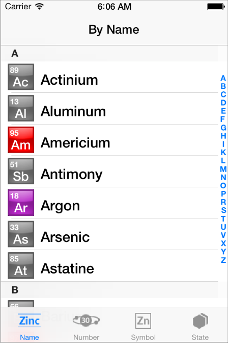
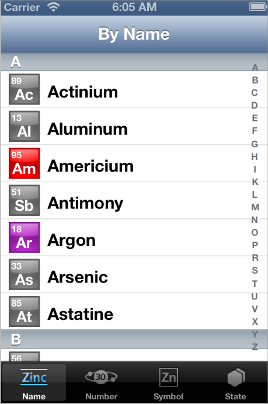

> 导航：[总目录](../../../README.md) · [documentation](../../../_indexes/documentation.md)

## Before You Start

> [!IMPORTANT]
> 

iOS 7 introduces many UI changes, such as borderless buttons, translucent bars, and full-screen layout for view controllers. Using Xcode 5, you can build a project for iOS 7 and run it in iOS 7 Simulator to get a first glimpse of the way the app looks with iOS 7 UI.

For example, the only differences between the two versions of _[TheElements](../../../samplecode/TheElements/TheElements.md#apple-f4xwc4dqnrsv64tfmyxwi33df52wszbpirkfgnbqgaydonbrhe)_ sample project shown below are the deployment target and the simulator.

TheElements sample app in iOS 7 Simulator

TheElements sample app in iOS 6 Simulator

It’s tempting to dive straight into the work of updating your app, but there are a few things to think about before beginning the process.

As you interact with the built-in apps, it becomes clear that the changes in iOS 7 are both subtle and profound. Familiar UI elements are easily recognizable but look very different. Visual touches of physicality and realism are muted and refined, while realism in motion is enhanced.

> [!NOTE]
> 

As you continue to explore, you begin to discern the main themes of iOS 7:

- __Deference.__ The UI helps users understand and interact with the content, but never competes with it.
- __Clarity.__ Text is legible at every size, icons are precise and lucid, adornments are subtle and appropriate, and a sharpened focus on functionality motivates the design.
- __Depth.__ Visual layers and realistic motion heighten users’ delight and understanding.

By bringing fundamental and pervasive changes to the iOS experience, iOS 7 provides a rare opportunity to revisit the way apps communicate their core purpose and functionality to users. Although you might not be prepared to take full advantage of this opportunity today, keep it in mind as you update your app to run in iOS 7. (If you are ready to revisit your app design—or you’re beginning a new project—read Designing for iOS 7 for some guidance.)

### Characterizing Your App

Whether you decide to redesign an app or update its current design, you need to know how the app’s characteristics can influence the process. First, use the following questions to help shape your strategy:

- __Did you use Auto Layout to design the app?__

  If your app uses Auto Layout, your job is easier. In Xcode 5, Auto Layout can help an app accommodate new UI element metrics and respond appropriately to dynamic changes in text size. Auto Layout is particularly helpful if you’re transitioning an iOS 6 app or you need to support both iOS 6 and iOS 7.

  If you didn’t use Auto Layout, now may be the perfect time to start, especially if you need to support more than one version of an app. If you use manual or programmatic layout techniques, you're responsible for ensuring that the layout adjusts appropriately when text size changes.
- __Does the app need to support iOS 6?__

  Remember that iOS users tend to be very quick to update their devices, and they expect their favorite apps to follow suit.

  If business reasons require you to support iOS 6, it’s still best to begin by updating the current app for iOS 7. Then, if appropriate, apply some of the design changes to the iOS 6 version of the app. For some details of this process, see [Supporting iOS 6](SupportingEarlieriOS.md#apple-f4xwc4dqnrsv64tfmyxwi33df52wszbpkridimbqgeztcnzufvbuqmjufvjvomi).

The next step in shaping a transition strategy is to examine the ways in which the app is customized. The amount of customization—and the specific customization techniques you use—impact the type of work you have to do.

Think of apps as being divided into the following three types:

- __Standard.__ The app contains only standard, uncustomized UI elements provided by UIKit.
- __Custom.__ The app presents a completely custom UI that doesn’t include any UIKit UI elements.
- __Hybrid.__ The app contains a mix of standard and custom elements, including standard elements that you customized using UIKit tinting and appearance-customization APIs.

For a standard app, you need to decide whether your visual and user experience designs still make sense in the iOS 7 environment. If you decide to keep the current layout and interaction model, most of the work involves making minor adjustments and ensuring that the app handles the new systemwide gestures correctly.

Custom apps—that is, apps that use no UIKit UI elements—require a more nuanced approach. For example, if you feel that the current UI and experience of the app is still appropriate, there may be very little to do. On the other hand, if you feel that the app’s personality and user experience should change in order to delight iOS 7 users, you have more work to do.

Hybrid apps vary in the amount of work required, depending on the customizations you did and how you combined custom and standard elements. In addition to revisiting the overall design of a hybrid app, you need to make sure that your customizations still work well and look good when they’re integrated with standard elements.

> [!NOTE]
> 

[Scoping the Project](Scoping.md#apple-f4xwc4dqnrsv64tfmyxwi33df52wszbpkridimbqgeztcnzufvbuqnznknltc)
