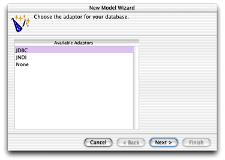
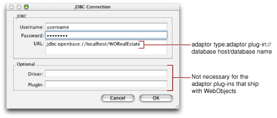
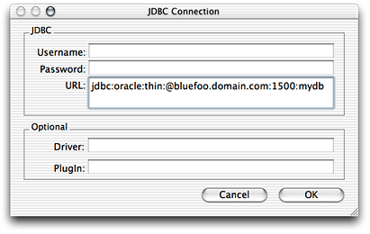
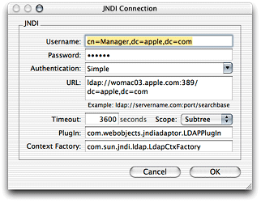
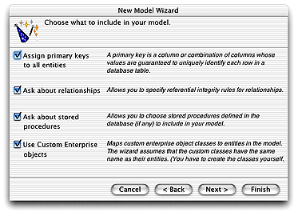
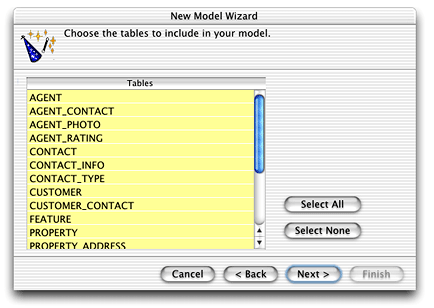
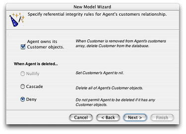
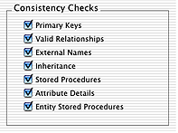

> 导航：[总目录](../../../README.md) · [documentation](../../../_indexes/documentation.md) · [EOModeler User Guide](Introduction%20to%20EOModeler%20User%20Guide.md)

[Next](Using%20EOModeler.md)[Previous](Introduction%20to%20EOModeler%20User%20Guide.md)

# Data Modeling and EOModeler

This chapter introduces the concept of _data modeling_. It also introduces the WebObjects data modeling tool, called EOModeler. It then leads you through the process of building a simple model. It is divided into the following sections:

- [Why Model Your Data?](#apple-f4xwc4dqnrsv64tfmyxwi33df52wszbpkridgmbqgaytamjyfvbuqmrqgiwviucykjcummjsgy) addresses that question.
- [When to Model Data](#apple-f4xwc4dqnrsv64tfmyxwi33df52wszbpkridgmbqgaytamjyfvbuqmrqgiwviucykjcummjsg4) suggests where in the development cycle data modeling should occur.
- [EOModeler Features](#apple-f4xwc4dqnrsv64tfmyxwi33df52wszbpkridgmbqgaytamjyfvbuqmrqgiwviucykjcummjsha) discusses the tool WebObjects provides to model data.
- [Entity-Relationship Modeling Fundamentals](#apple-f4xwc4dqnrsv64tfmyxwi33df52wszbpkridgmbqgaytamjyfvbuqmrqgiwueqkcircugskf) introduces some of the main concepts of this data modeling paradigm.
- [Creating a Model From an Existing Data Source](#apple-f4xwc4dqnrsv64tfmyxwi33df52wszbpkridgmbqgaytamjyfvbuqmrqgiwviucykjcummjtga) leads you through the process of creating a simple model.
- [What a New Model Includes](#apple-f4xwc4dqnrsv64tfmyxwi33df52wszbpkridgmbqgaytamjyfvbuqmrqgiwviucykjcummjuge) describes what you get from a new model.
- [Checking for Consistency](#apple-f4xwc4dqnrsv64tfmyxwi33df52wszbpkridgmbqgaytamjyfvbuqmrqgiwviucykjcummjugi) discusses EOModeler’s consistency-checking feature.

While it may seem obvious, data modeling is perhaps the most important phase of WebObjects application development. Data models form the foundation of your business logic and business logic forms the core of your application. Good business logic is essential to building effective applications, so it follows that good data models are essential to the success of the applications you build. Most importantly, data modeling plays a crucial role in object-relational mapping, the process in which database records are transposed into Java objects.

Using data models to develop data-driven applications provides you a unique advantage: applications are isolated from the idiosyncrasies of the data sources they access. This separation of an application’s business logic from database logic allows you to change the database an application accesses without needing to change the application.

Also, WebObjects provides a rapid development environment that enables the creation of full-featured Web and desktop applications based on data models. So if you build well-designed data models, WebObjects gives you usable applications for free without any code.

Whenever possible, data modeling should occur in the earliest phases of application design and development. In data-driven applications, data modeling almost always influences an application’s goals. That is, you cannot define an application’s goals outside of the context of the application’s data models.

Data models in Enterprise Objects reflect the earliest decisions about what data users see and how they are allowed to interact with data. This is because an important part of data modeling is deciding which entities and attributes are visible to clients and editable by clients. So by including data modeling as an early part of the design process, you can simplify future implementation details.

This doesn’t imply, however, that you need to lock down a model before you begin other phases of application development. Although it’s easier to start with a model that is fairly complete, you can revise models after you’ve started other phases of application development.

WebObjects provides you with a great tool for object-relational mapping called EOModeler. It allows you to

- build data models either from scratch or by analyzing preexisting data sources using reverse engineering
- add and customize entities (tables) and attributes (columns)
- form relationships between entities
- form relationships across multiple models
- generate SQL from a model to create or update a data-source schema based on the model
- generate Java classes from a model in which you can add custom business logic
- use stored procedures within data models
- graphically build fetch specifications for retrieving data
- flatten attributes and relationships
- define derived attributes
- build database queries in raw SQL
- synchronize changes made in the data source schema or in the data model using schema synchronization

How you use EOModeler greatly depends on the control you have over an application’s data sources. For instance, if you are not allowed to define new database tables or edit database columns, you have less control over modeling the data; instead your responsibility is to define parameters for object-relational mapping.

You’ll create better models if you’re empowered to change the database schema, but you can still create effective models if you can’t.

The most important thing EOModeler does is to provide a foundation with which to define the mapping between data source schemas and Java objects. EOModeler produces many things, the most important being EOModel files that provide the concrete mapping definition. The industry-standard term for the mapping between data-source schemas and objects is _Entity-Relationship modeling_.

A data source stores data in the structures it defines: A relational database uses tables, an object-oriented database uses objects, a file system uses files, and so on. Entity-Relationship modeling provides terminology and methodology to describe how a data source’s data structures can be mapped to Java objects or other multidimensional data structures. Enterprise Objects uses a modified version of Entity-Relationship modeling.

When working with relational-database systems, you can use EOModeler to define the mapping between relational-database data structures and Java objects. The product of EOModeler, a model file, describes the database’s data structures in terms that the Enterprise Object technology can understand and work with.

In an Entity-Relationship model, distinguishable things are known as _entities_, each entity is defined by its component _attributes_, and the affiliations, or _relationships_ between entities, are identified (together, attributes and relationships are known as _properties_). From these three simple modeling objects—entities, attributes, and relationships—arbitrarily complex systems can be modeled.

Entities and attributes represent structures that contain data. In a relational database data model, entities represent tables and an entity’s attributes represent columns.

Each row in the table can be thought of as an instance of an entity. So, a customer record is called an instance of the Customer entity. Each instance of an entity typically maps to one object, but more complex mappings are possible.

Contained within an entity is a list of attributes of the thing that’s being modeled. The Customer entity could contain attributes such as a customer’s first name, last name, phone number, and so on.

In traditional Entity-Relationship mapping, each entity represents all or part of one database table. However, Enterprise Objects allows you to go beyond this by adding attributes to an entity that actually reflect data in other related tables (this type of attribute is known as a _flattened attribute_). So, in Enterprise Objects, an entity can map to one or more database tables.

Entities can also have _derived attributes,_ which do not directly correspond to any of the columns in the database table to which the entity maps. These attributes are usually computed from one or more attributes in the entity. For example, a derived attribute could represent the total amount of money spent by a customer by adding the amounts of all a customer’s purchases together.

Entities and attributes in data models derive their names based on the database elements they represent. A CUSTOMER table in a database, for example, would likely map to an entity named “Customer,” though this is not strictly required. In your application, you refer to the CUSTOMER table not by its database name but by using its entity name, Customer.

This allows you to build data models that are largely independent of any particular data source. Different data sources enforce different naming conventions for their data structures, so providing a mapping between those names allows you to build reusable data models that can be used with different data sources.

End users don’t care if the Customer entity maps to a table named CUSTOMER or CUST or _CUSTOMER, so the mapping also helps make the earliest decisions about how data structures appear in the end-user application.

Every database column is assigned a data type such as `int`, `varchar`, `float`, or `blob`. These data types map to primitive Java types such as `int` and `float` but also to Java objects such as `java.lang.String` and `java.lang.Object`. The data model defines the data-type mapping between columns and attributes just as it defines the naming mapping between them.

When data is fetched from a data source into an enterprise object, the value of each attribute is converted from its external data type into a Java-specific data type. Likewise, when the data in an enterprise object is pushed back to a data source, each attribute is converted from its Java data type to the data type specified in the model.

In the relational-database paradigm, a relationship expresses the affiliation between two tables in the data source. Relationships allow one table to access related information in another table. In more complex data modeling, relationships can express the affinity between multiple tables.

At the data-source level, the two tables in a relationship are linked together using primary and foreign keys. How the table pair is related (that is, what kind of relationship is expressed) depends on the configuration of primary and foreign keys in each table.

At the Enterprise Objects level, relationships are mapped to a particular kind of object that includes not only information about the tables involved in a particular relationship but also the rules of the relationship between the two tables.

Relationships are a complex concept in the Entity-Relationship model. The chapter [Working With Relationships](Working%20With%20Relationships.md#apple-f4xwc4dqnrsv64tfmyxwi33df52wszbpkridgmbqgaytamjyfvbuqmrqguwviubr) provides a more thorough introduction to the concept of relationships and also introduces the additional features you get when using relationships with Enterprise Objects.

In Enterprise Objects, data models describe the data source–to–enterprise object mapping by using these objects:

- `com.webobjects.eoaccess.EOModel`
- `com.webobjects.eoaccess.EOEntity`
- `com.webobjects.eoaccess.EOAttribute`
- `com.webobjects.eoaccess.EORelationship`

The following table describes the object-relational mapping provided by Enterprise Object models. The column titled “Database/directory element” lists elements as they are named in relational databases and then elements as they are named in LDAP directories, if applicable.

__Table 1-1__  Object-relational mapping

| Database/directory element | Model object | Object mapping |
| Schema | EOModel | Enterprise object model |
| Table/object class | EOEntity | Enterprise object class |
| Row/entry | EOEnterpriseObject | Enterprise object instance |
| Column/attribute | EOAttribute | Enterprise object instance variable |
| Referential constraint/foreign key | EORelationship | Reference to another enterprise object |

While the modeling classes correspond to elements in a data source, a model represents a level of abstraction above the data source. Consequently, mapping between modeling classes and database components doesn’t have to be one-to-one. So, for example, while an EOEntity object described in a model corresponds to a single database table, it can contain references to multiple tables. In that sense, a model is more analogous to a database view.

Similarly, an EOAttribute can either correspond directly to a column in the root entity or it can be derived or flattened. A derived attribute typically has no corresponding database column while a flattened attribute is added to one entity from another entity.

Although models can be programmatically generated at runtime, you typically create models using EOModeler and then add them to your project as model files or as part of a framework your project includes.

This section describes how to create a new model from an existing data source. It is organized in the following sections:

- [Selecting an Adaptor](#apple-f4xwc4dqnrsv64tfmyxwi33df52wszbpkridgmbqgaytamjyfvbuqmrqgiwueqkcjfbeqrsh)
- [Choosing What to Include](#apple-f4xwc4dqnrsv64tfmyxwi33df52wszbpkridgmbqgaytamjyfvbuqmrqgiwueqkcjbdemrcf)
- [Choosing the Tables to Include](#apple-f4xwc4dqnrsv64tfmyxwi33df52wszbpkridgmbqgaytamjyfvbuqmrqgiwueqkcincekq2j)

EOModeler is installed in `/Developer/Applications`.

To create a new model, choose New from the Model menu. EOModeler starts the New Model Wizard, which helps you configure the new model.

An adaptor is an object that connects your application to a particular data source. Since data sources use different connection protocols (JDBC, JNDI, ERP, and so forth), you need a specialized adaptor for each type of data source you use. Also, since vendors build different features into their data sources, you also need an adaptor plug-in for each data source you use.

In WebObjects 5.2, adaptors are provided for JDBC and JNDI connectivity and adaptor plug-ins are provided for the following data sources:

- Oracle (JDBC)
- Microsoft SQL Server 2000 (JDBC)
- MySQL (JDBC)
- OpenBase (JDBC)
- Sybase (JDBC)
- OpenLDAP (JNDI)
- iPlanet (JNDI)

Refer to the document _Post Installation Guide_ for exact specifications on which data sources are qualified for WebObjects.

The Enterprise Objects adaptor architecture is modular so you can write adaptor plug-ins for other types of data sources and for other data-source vendors (see Apple Technical Note TN2027). However, this is a very advanced feature so it’s best to use a data source that’s officially supported by WebObjects, such as those listed above.

WebObjects provides two adaptor types out of the box: JDBC and JNDI. The first pane that appears in the New Model Wizard allows you to choose the adaptor you want to use in the model, as shown in Figure 1-1.

__Figure 1-1__  Choose an adaptor

After you select an adaptor, EOModeler displays a window prompting you to enter login and other information to connect to the data source. Figure 1-2 shows the JDBC Connection window that appears if you select the JDBC adaptor. Figure 1-4 shows the JNDI Connection window that appears if you select the JNDI adaptor. For this example, use the JDBC adaptor.

If necessary, supply the correct login information for the data source. You must also supply the URL of the data source. Depending on the data source and adaptor you want to use, you may also need to supply information in the Driver and Plugin fields.

For this example, use the WORealEstate database that is installed with WebObjects. The example databases uses OpenBase, so the URL you enter in the JDBC Connection window is specific to that particular database. When you create models from other vendor’s databases, you may need to use a different URL format. [Figure 1-3](#apple-f4xwc4dqnrsv64tfmyxwi33df52wszbpkridgmbqgaytamjyfvbuqmrqgiwueqkcijeueq2j) shows the URL format Oracle uses.

__Figure 1-2__  JDBC Connection window with OpenBase connection information

__Figure 1-3__  JDBC Connection window with Oracle connection information

__Figure 1-4__  JNDI Connection window

After you log in to the data source, the wizard asks you what you want to include in the model, as shown in Figure 1-5. The options available here largely depend on how complete the schema information in the data store is. For example, the wizard includes relationships in your model only if the server’s schema information specifies foreign key constraints.

__Figure 1-5__  Choose what to include

Using the options in this page, you tell EOModeler that you want to supplement the model with additional information. Keep in mind that the wizard does not modify the data source. Also note that you can do everything the wizard does to a model manually after the initial model is created—but using the wizard saves you time.

Enterprise Objects uses primary keys to create unique identifiers (`com.webobjects.eocontrol.EOGlobalID` objects) for enterprise objects and also to map enterprise objects to the appropriate database rows. Therefore, every entity in a model must be assigned a primary key.

If you select this option in the New Model Wizard, primary keys are assigned to entities in the model if the wizard finds primary key constraints in the data store’s schema information. If the data store’s schema does not include primary key information, the wizard first asks you to select the primary key for each entity before it assigns it to an entity in the model.

If a data store’s schema includes foreign key constraints, the wizard creates corresponding relationships in the model. However, foreign key definitions in a schema may not provide enough information for the wizard to set all of a relationship’s options (such as delete rule and optionality). Selecting this option causes the wizard to prompt you to provide the additional information it needs to configure the relationships, if necessary.

Selecting this option causes the wizard to read stored procedures from the data source’s schema information, display them, and allows you to choose which to include in the model. See [Stored Procedure Inspector](Working%20With%20Entities.md#apple-f4xwc4dqnrsv64tfmyxwi33df52wszbpkridgmbqgaytamjyfvbuqmrqgywueqkci5begssf) for more information.

When deciding what class to map a table to, the wizard offers two choices: EOGenericRecord or a custom class (a subclass of EOGenericRecord or EOCustomObject). EOGenericRecord is a class that implements the `com.webobjects.eocontrol.EOEnterpriseObject` interface. Its instances store key-value pairs that correspond to an entity’s properties and the data associated with each property.

If you do not select this option in the New Model Wizard, the wizard maps all your database tables to EOGenericRecord. If you do select this option, the wizard maps all your database tables to custom classes that you write. The wizard assumes that each entity is to be represented by a custom class with the same name. For example, a table named LISTING corresponds to an entity named Listing, which corresponds to an EOGenericRecord or EOCustomObject subclass named `Listing.java`.

If you choose to use EOGenericRecord rather than custom classes, you do not generate Java files for the entities in your model. This means that you have less opportunity to add business logic to perform validation, insert initial values, or otherwise manipulate enterprise objects programmatically. For some entities, this may be what you want. A common design pattern is to use custom classes only for entities in which you need to implement custom business logic and to use EOGenericRecord for other entities.

In this section of the wizard, you are prompted to choose the tables to include in the model. By default all tables are selected, as shown in Figure 1-6, but you can select only certain tables if you want. The wizard creates entities only for the selected tables. Keep in mind that if you want a join to be reflected in the model as a relationship, you must select the source table and the destination table of the join.

__Figure 1-6__  Select tables to include in model

If you are using a data source that stores primary key information in its schema information, the wizard skips this step. It has already read primary key information from the schema and assigned primary keys to entities in the model.

However, if primary key information isn’t specified in the data source’s schema or if the adaptor can’t read it, the wizard asks you to specify a primary key for each entity.

If an entity’s primary key is compound; that is, if it’s composed of more than one attribute, Command-click to select multiple attributes to use as a compound primary key. You usually use a compound primary key when any single attribute isn’t sufficient to identify a row uniquely. That is, you should need to use a compound primary key only if no single attribute can uniquely identify a row.

If foreign key constraints aren’t specified in the data source’s schema information or if the adaptor can’t read that information, the wizard doesn’t create relationships in the model so it skips this step. If this is the case, you can add relationships later as described in [Working With Relationships](Working%20With%20Relationships.md#apple-f4xwc4dqnrsv64tfmyxwi33df52wszbpkridgmbqgaytamjyfvbuqmrqguwviubr).

However, if you’re using a data source that stores foreign key constraints in its schema information, the wizard reads them and creates corresponding relationships in the model.

At this point, if you specified that the wizard ask about relationships, it now asks you to provide additional information about the relationships so it can further configure them. Figure 1-7 shows the wizard asking about the `customers` relationship in the Agent entity.

__Figure 1-7__  Specify referential integrity rules for a relationship

This option lets you specify whether the relationship’s source owns its destination objects. If a source object owns its destination object, for example, as when an Agent object owns its Customer objects, then when something happens so that a destination object (Customer) is removed from the relationship, it is also removed from the data source. Ownership implies that an owned object cannot exist without its owner.

The options in this section of the window specify what to do when the source object of a relationship is deleted. There are four options, which are described in [Delete Rule](Working%20With%20Relationships.md#apple-f4xwc4dqnrsv64tfmyxwi33df52wszbpkridgmbqgaytamjyfvbuqmrqguwviucykjcummjtg4).

If you asked the wizard to include stored procedures in your model, in this window it asks you to specify which stored procedures to include. By default, all stored procedures are selected. If you later decide that you want to include a stored procedure in the model that you didn’t select here, you can always add it later. See [Stored Procedure Inspector](Working%20With%20Entities.md#apple-f4xwc4dqnrsv64tfmyxwi33df52wszbpkridgmbqgaytamjyfvbuqmrqgywueqkci5begssf) for more information.

After using the wizard to create the initial model, save the model. If there are any warnings indicating problems with the model, go ahead and continue with the save, then go back and fix the model. You can check for problems at any time by choosing Check Consistency from the File menu.

When you create a new model, the information it includes depends on how complete the underlying data source is and also on the choices you made in the New Model Wizard. EOModeler can read all of the following from a data source and compose a model from it:

- table and column names
- column data types, including the width constraint of string data types
- primary keys
- constraints defined in the database such as “NOT NULL” and “UNIQUE”
- foreign key constraints (which are expressed in models as relationships)
- stored procedures

A model contains not only the information it reads from a data source, but also values it derives from that information, including

- entity and attribute names
- a mapping between the data type of a data column and a corresponding value class (object type), such as String (`java.lang.String`), Number (`java.lang.Number`), and Data (`com.webobjects.foundation.NSData`)

EOModeler derives entity names by taking a data-source table name and making all of it lowercase except for the first letter. It then removes underscore characters and capitalizes the first character following each removed underscore. Table 1-2 gives an example.

__Table 1-2__  Table name to entity name mapping

| Data-source table name | Model entity name |
| PERSON | Person |
| PERSON_PHOTO | PersonPhoto |
| PERSON_REVIEW_NOTES | PersonReviewNotes |

Attribute names are based on corresponding database columns. They are derived in the same way as entity names except that EOModeler doesn’t capitalize the first character. EOModeler follows the Java convention for naming methods and instance variables. An example appears in Table 1-3.

__Table 1-3__  Column name to attribute name mapping

| Data-source column name | Model attribute name |
| NAME | `name` |
| LAST_NAME | `lastName` |
| FINAL_IMAGE_NAME | `finalImageName` |

Although default entity and attribute names follow a naming convention, you can choose to use arbitrary names. All that really matters is that the external names of the entities match the table names in the schema and that the external names of the attributes match the column names in the tables. However, since business objects are Java objects, your code will be more readable and manageable if you follow the default naming convention for entities and attributes which follows standard Java naming conventions.

EOModeler provides consistency checking to confirm that your model is valid. For example, a model that has entities without primary keys or relationships without joins is not valid.

You can check your model at any time by choosing Check Consistency from the Model menu. Consistency checking is also invoked automatically whenever you save a model. When a consistency check occurs and inconsistencies are found, the Consistency Check window appears with a list of diagnostic messages.

You can choose what consistency checking looks for in EOModeler’s Preferences pane, as shown in Figure 1-8.

__Figure 1-8__  Consistency-checking options

[Next](Using%20EOModeler.md)[Previous](Introduction%20to%20EOModeler%20User%20Guide.md)

