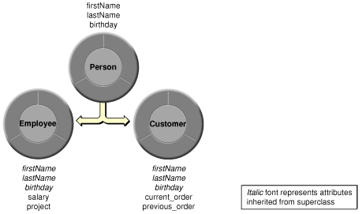
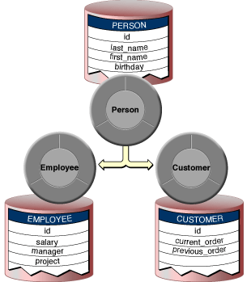
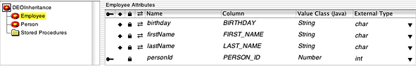
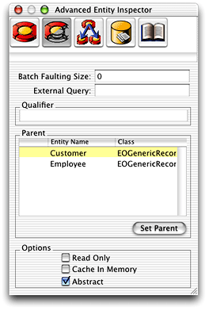
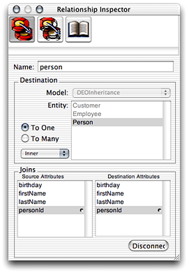
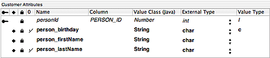
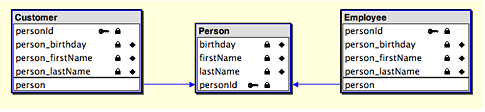
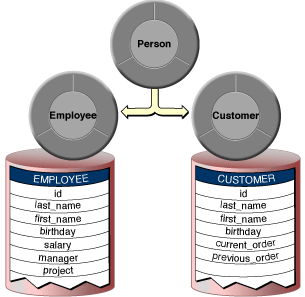
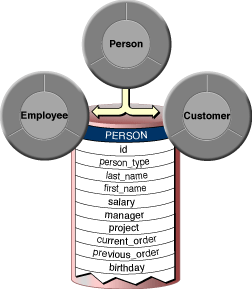
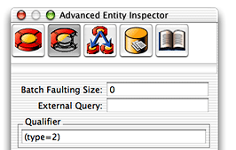

> 导航：[总目录](../../../README.md) · [documentation](../../../_indexes/documentation.md) · [EOModeler User Guide](Introduction%20to%20EOModeler%20User%20Guide.md)


[Next](Working%20With%20Fetch%20Specifications.md)[Previous](Working%20With%20Entities.md)

# Modeling Inheritance

One of the issues that may arise in designing your enterprise objects—whether you’re creating a schema from scratch or working with an existing database schema—is the modeling of inheritance relationships.

In object-oriented programming, it’s natural to think of data in terms of inheritance. A Customer object, for example, naturally inherits certain characteristics from a Person object, such as name, address, and phone number. In inheritance hierarchies, the parent object or superclass is usually rather generic so that less generic subclasses of a related type can easily be added. So, in addition to the Customer object, a Client object also naturally derives from a Person object.

While this kind of thinking is inherent in object-oriented design, relational databases have no explicit support for inheritance. However, using Enterprise Objects, you can build data models that reflect object hierarchies. That is, you can design database tables to support inheritance by also designing enterprise objects that map to multiple tables or particular views of a database table.

This chapter discusses when to use inheritance, the different kinds of inheritance supported by Enterprise Objects, and how to implement inheritance. It is divided into the following sections:

- [Deciding to Use Inheritance](#apple-f4xwc4dqnrsv64tfmyxwi33df52wszbpkridgmbqgaytamjyfvbuqmrqg4wugqkdizceqrkc) discusses the issues involved when deciding to use inheritance.
- [Vertical Mapping](#apple-f4xwc4dqnrsv64tfmyxwi33df52wszbpkridgmbqgaytamjyfvbuqmrqg4wugqkdivduuqsb), [Horizontal Mapping](#apple-f4xwc4dqnrsv64tfmyxwi33df52wszbpkridgmbqgaytamjyfvbuqmrqg4wugqkdirdueqkh), and [Single-Table Mapping](#apple-f4xwc4dqnrsv64tfmyxwi33df52wszbpkridgmbqgaytamjyfvbuqmrqg4wugqkdijbeorkc) discuss the three approaches to inheritance that are supported by the Enterprise Object technology.

Using inheritance adds another level of complexity to your data model, data source, and thus to your application. While it has its advantages, you should use it only if you really need to. This section provides information that will help you make that decision.

Suppose you’re designing an application that includes Employee and Customer objects. Employees and customers share certain characteristics such as name and address, but they also have specialized characteristics. For example, an employee has a salary and a manager whereas a customer has account information and a sales contact.

Based on these data requirements, you might design a class hierarchy that has a Person superclass and Employee and Customer subclasses. As subclasses of Person, Employee and Customer inherit Person’s attributes (name and address), but they also implement attributes and behaviors that are specific to their classes, as illustrated in Figure 7-1.

__Figure 6-1__  A simple object hierarchy



In addition to designing a class hierarchy, you need to decide how to structure your data source so that when objects of the classes are instantiated, the appropriate data is retrieved. These are some of the issues you need to weigh in deciding on an approach:

- Are fetches usually directed at the leaves or the root of the class hierarchy?

  When a class hierarchy is mapped onto a relational database, data is accessed in two different ways: by fetching just the leaves (for example, Employee or Customer) or by fetching at the root (Person) to get instances of all levels of the class hierarchy (which includes Employees and Customers).
- How deep is the class hierarchy?

  While deep class hierarchies can be a useful technique in object-oriented programming, you should try to avoid them for enterprise objects. When you attempt to map a deep class hierarchy onto a relational database, the result is likely to be poor performance and a database that’s difficult to maintain.
- What is the database storage cost for `null` attributes?

  Some approaches to inheritance result in many `null` rows of data.
- Will I need to modify my schema frequently?

  Depending on the inheritance approach you take, changes to your database schema can result in maintenance headaches for your enterprise object classes.
- Will other tools be accessing the database?

  If other tools write to the data source to which an inheritance hierarchy maps, those tools may not write data in a way that supports the inheritance hierarchy. If this is the case, you should avoid using inheritance to prevent conflicts that may compromise the integrity of your data.
- Can I ensure unique primary keys across inheritance hierarchies?

  Within a given inheritance hierarchy, all the primary keys in all the tables must be unique. For example, a primary key value of 36 can occur _only_ in one table in an inheritance hierarchy. This may be an issue if you want to apply an inheritance hierarchy to a collection of preexisting database tables that do not have unique primary keys between them.
- Do I need to use inheritance at all?

  Don’t use inheritance if you’re not sure you need it. While a compelling feature, inheritance adds complexity to your application and these costs may outweigh the benefits of using it. In short, use inheritance only if you _need_ to—don’t use it just because you _want_ to.

In object-oriented programming, when a subclass inherits from a superclass, the instantiation of the subclass implies that all the superclass’ data is available for use by the subclass. When you instantiate objects of a subclass from database data, all the database tables that contain the data held in each class (whether subclass or superclass) must be accessed so that the data can be retrieved and put in the appropriate enterprise objects.

There are different approaches to storing the data in databases for entities that are a part of an inheritance hierarchy. The three approaches supported by Enterprise Objects are

- vertical mapping
- horizontal mapping
- single-table mapping

These approaches, along with the advantages and disadvantages of each, are discussed in the following sections. None of them represents a perfect solution—which one is appropriate depends on the needs of your application. Also keep in mind that you can mix inheritance strategies within a model.

In this approach, each class is associated with a separate table. There is a Person table, an Employee table, and a Customer table. Each table contains only the attributes defined by that class.

__Figure 6-2__  Vertical mapping



This method of storage directly reflects the class hierarchy. If an object of the Employee class is retrieved, data for the Employee’s Person attributes must be fetched along with Employee data. The relationship between Employee and Person is resolved through a join to give Employee access to its Person data. This is also the case for Customer. Vertical mapping requires a restricting qualifier if you want to fetch records from a parent entity (Person in this example).

Assuming that the entities for each of the participating tables do not yet exist, follow these steps to easily create subentities from a parent entity:

1. Select the entity you want to be the parent entity (the superclass).
2. To create a subentity of the parent entity, choose Create Subclass from the Property menu while the parent entity is selected. Provide a class name and table name for the subentity. In this example, two subentities are added to the model, Employee and Customer, which correspond to two tables you’ll create in the database called EMPLOYEE and CUSTOMER, respectively. The attributes a subentity inherits from its parent are displayed in italics, as shown in Figure 6-3.

   __Figure 6-3__  Inherited attributes appear in italics

   
3. In the Advanced Entity Inspector, mark the parent entity as abstract if you won’t ever instantiate Person objects, as shown in Figure 6-4.

   If you need to instantiate the parent entity (Person objects), however, don’t mark the parent entity as abstract. If you want to instantiate objects of the parent entity, you also need to assign a restricting qualifier to it. You need to assign a restricting qualifier to any entity in a vertical inheritance hierarchy that is not abstract and that has subentities (leaf nodes).

   This is necessary so you can fetch objects of the parent type without also fetching the characteristics of the parent’s subentities. That is, when fetching Person objects, you don’t also want to fetch attributes in Person’s subclasses, Employee and Customer. You do this by assigning a restricting qualifier to the Person entity. See [Implementing a Restricting Qualifier](#apple-f4xwc4dqnrsv64tfmyxwi33df52wszbpkridgmbqgaytamjyfvbuqmrqg4wugqkdjjdecscc) to learn how to do this.

   __Figure 6-4__  Mark parent entities as abstract if they won’t ever be instantiated

   

Assuming that the entities for each of the participating tables already exist, do the following to implement vertical mapping in an EOModel:

1. Create a to-one relationship from each of the child entities (Employee and Customer) to the parent entity (Person) joining on the primary keys. Set the relationships so they are not class properties. Refer to Figure 6-5 for clarity.

   __Figure 6-5__  To-one relationships to parent entity shown in inspector

   
2. Flatten the Person parent attributes into each child entity (Employee and Customer) and set the flattened attributes as class properties if they are class properties in the Person entity. Do not flatten the primary key. See [Flattening an Attribute](Working%20With%20Attributes.md#apple-f4xwc4dqnrsv64tfmyxwi33df52wszbpkridgmbqgaytamjyfvbuqmrqgqwueqkcizbeersg) to learn how to flatten an attribute.

   If you created the child entities by choosing Create Subclass from the Property menu, you now need to delete the attributes that are inherited from the parent entity. This is necessary to avoid redundancy since the attributes you just flattened reflect the same attributes as the inherited attributes do.

   Figure 6-6 shows the result of flattening Person’s attributes into the Employee entity. The flattened attributes appear in bold typeface in the table view.

   __Figure 6-6__  Flattened attributes in table view

   
3. Flatten the Person parent entity’s relationships into each child entity (Employee and Customer) if it has any relationships, and set them as class properties if they are class properties in the Person entity. In this example, the Person entity has no relationships, so there are none to flatten into its child entities. In diagram view, the three entities should appear as in Figure 6-7.

   __Figure 6-7__  Vertical inheritance hierarchy in diagram view

   
4. Set the parent entity for each child entity (Employee and Customer) to Person in the Advanced Entity Inspector. This step isn’t necessary if you created the Employee and Customer entities using the Create Subclass command from the Property menu.
5. Finally, add attributes to each child entity (Employee and Customer) that are specific to those entities (such as `manager` and `customerSince` in this case).
6. Generate SQL for the Employee and Customer entities to create the EMPLOYEE and CUSTOMER tables in the database.

With vertical mapping, a subclass can be added at any time without modifying the Person table. Existing subclasses can also be modified without affecting the other classes in the inheritance hierarchy. The primary virtue of this approach is its clean, “normalized” design.

Vertical mapping is the least efficient of all the approaches. Every layer of the class hierarchy requires a join table to resolve the relationships. For example, if you want to perform a deep fetch from Person, three fetches are performed: a fetch from Employee (with a join to Person), a fetch from Customer (with a join to Person), and a fetch from Person to retrieve all the Person attributes. If Person is an abstract superclass for which no objects are ever instantiated, the last fetch is not performed.

In this approach, you have separate tables for Employee and Customer that each contain columns for Person. The Employee and Customer tables contain not only their own attributes, but all of the Person attributes as well. If instances of Person exist that are not classified as Employees or as Customers, a third table would be required. In other words, with horizontal mapping, every concrete class has a self-contained database table that includes all of the attributes necessary to instantiate objects of the class.

__Figure 6-8__  Horizontal inheritance mapping



This mapping technique entails the same fetching pattern as vertical mapping except that no joins are performed. Horizontal mapping does not require restricting qualifiers.

Assuming that the entities for each of the participating tables do not yet exist, follow these steps to easily create subentities from a parent entity:

1. Select the entity you want to be the parent entity (the superclass).
2. To create a subentity of the parent entity, chose Create Subclass from the Property menu while the parent entity is selected. Provide a class name and table name for the subentity. Refer to [Implementing Vertical Mapping in a Model](#apple-f4xwc4dqnrsv64tfmyxwi33df52wszbpkridgmbqgaytamjyfvbuqmrqg4wviucykjcummjsgy) for a more concrete example.
3. In the Advanced Entity Inspector, mark the parent entity as abstract if you won’t ever instantiate Person objects, as shown in [Figure 6-4](#apple-f4xwc4dqnrsv64tfmyxwi33df52wszbpkridgmbqgaytamjyfvbuqmrqg4wugqkdizbusrck). Refer to [Implementing Vertical Mapping in a Model](#apple-f4xwc4dqnrsv64tfmyxwi33df52wszbpkridgmbqgaytamjyfvbuqmrqg4wviucykjcummjsgy) for a more concrete example.
4. Add attributes to each child entity (Employee and Customer) that are specific to those entities (such as `manager` and `customerSince` in this case).
5. Generate SQL for the Employee and Customer entities to create the EMPLOYEE and CUSTOMER tables in the database.

Unlike vertical mapping, you don’t need to flatten any of Person’s attributes into Employee and Customer since they already include all of its attributes.

Similar to vertical mapping, a subclass can be added at any time without modifying other tables. Existing subclasses can also be modified without affecting the other classes in the class hierarchy.

This approach works well for deep class hierarchies as long as the fetch occurs against the leaves of the class hierarchy (Employee and Customer) rather than against the root (Person). In the case of a deep fetch, horizontal mapping is more efficient than vertical mapping since no joins are performed. It’s the most efficient mapping approach if you fetch instances of only one leaf subclass at a time.

Problems may occur when attributes need to be added to the Person superclass. The number of tables that need to be altered is equal to the number of subclasses—the more subclasses you have, the more effort is required to maintain the superclass.

If, for example, you need to add an attribute called `middleName` to the Person class, you then need to alter its subclasses, Employee and Customer. So if you have deep inheritance hierarchies or many subclasses, this can be tedious. However, if table maintenance happens far less often than fetches, this might be a viable approach for your application.

With single-table mapping, you put all of the data in one table that contains all superclass and subclass attributes. Each row contains all of the columns for the superclass as well as for all of the subclasses. The attributes that don’t apply for each object have `null` values. You fetch an Employee or Customer by using a query that returns just objects of the specified type (the table includes a type column to distinguish records of one type from the other).

__Figure 6-9__  Single-table inheritance mapping



Assuming that the entities for each of the participating tables do not yet exist, follow these steps to easily create subentities from a parent entity:

1. Select the entity you want to be the parent entity (the superclass).
2. Add an attribute to the parent entity called “type” of External Type `int` and of Internal Data Type Integer. This serves to distinguish each row of data by type. Make this attribute a class property so you can set its value when you insert new objects. Also make sure to add the corresponding column in the database table.
3. To create a subentity of the parent entity, choose Create Subclass from the Property menu while the parent entity is selected. Provide a class name and table name for the subentity. Refer to [Implementing Vertical Mapping in a Model](#apple-f4xwc4dqnrsv64tfmyxwi33df52wszbpkridgmbqgaytamjyfvbuqmrqg4wviucykjcummjsgy) for a more concrete example.
4. In the Advanced Entity Inspector, mark the parent entity as abstract if you won’t ever instantiate Person objects, as shown in [Figure 6-4](#apple-f4xwc4dqnrsv64tfmyxwi33df52wszbpkridgmbqgaytamjyfvbuqmrqg4wugqkdizbusrck).
5. In the Advanced Entity Inspector, assign a restricting qualifier to the Employee entity that distinguishes its rows from the rows of other entities. Similarly, assign a restricting qualifier to the Customer entity. In this example, you can use `type = 2` for Customer and `type = 9` for Employee. (In [Implementing a Restricting Qualifier](#apple-f4xwc4dqnrsv64tfmyxwi33df52wszbpkridgmbqgaytamjyfvbuqmrqg4wugqkdjjdecscc) you’ll learn why those two integers are used in this example.

   __Figure 6-10__  Assign a restricting qualifier

   

Unlike vertical mapping, you don’t need to flatten any of Person’s attributes into Employee and Customer since these entities already have all of Person’s attributes. Each subentity maps to the same table and contains attributes only for the properties that are relevant for that class.

When multiple entities are mapped to a single database table, you must set a restricting qualifier on each entity to distinguish its rows from the rows of other entities. A restricting qualifier maps an entity to a subset of rows in a table. This means that this qualifier is always used when fetches are performed on the entity, as well as any other qualifiers used during the fetch.

The syntax and semantics for restricting qualifiers are the same as for the qualifiers you build in EOModeler. You can use the qualifier builder feature of the fetch specification builder to generate well-formed qualifiers. See [Building a Qualifier](Working%20With%20Fetch%20Specifications.md#apple-f4xwc4dqnrsv64tfmyxwi33df52wszbpkridgmbqgaytamjyfvbuqmrqhawueqkcijbumrsc).

Finally, for the restricting qualifier to do any good, you need to provide a value for the `type` attribute you added in step 2 for each object you insert (that is, for each record you add to the table). The restricting qualifier uses the `type` attribute, so this example assumes that. (If you use an attribute with a different name to identify rows of data in the table, make the necessary substitutions in this example.)

To provide a value for the `type` attribute for every new object that is inserted in an inheritance hierarchy, you need to:

- define constants for each type
- override `awakeFromInsertion` in a parent enterprise object class
- set the type in `awakeFromInsertion`
- return a type in each enterprise object subclass

Consider the Person enterprise object parent class. It is an abstract class that has two concrete subclasses, Employee and Customer. You need to provide constants in the Person class to identify these two subclasses:

```
public static final Integer CustomerUserType = new Integer(2);
public static final Integer EmployeeUserType = new Integer(9);
```

Then, you need to override `awakeFromInsertion` in the Person subclasses to set the type for each inserted record. An example appears in Listing 6-1.

__Listing 6-1__  Set type in `awakeFromInsertion`

```
public void awakeFromInsertion (EOEditingContext editingContext) {
    super.awakeFromInsertion(context);
    setType(_userType());
}
```

A subclass (such as Employee or Customer in this example) must implement the `_userType` method to return an Integer representing the object’s type:

```
Integer _userType() {
    return CustomerUserType;
}
```

Listing 6-1 assumes that the entity corresponding to the enterprise object class in which the method `awakeFromInsertion` exists includes an attribute named “type” that is a class property. So whenever a new enterprise object is created, its `type` attribute is automatically set to the name of the class.

So if the name of the class is Customer, the `type` attribute is set to the integer 2 as soon as the object is created. Then, when a fetch is performed on the Customer entity (which is performed on the Person table since only one table exists in the database for the objects in this inheritance hierarchy), the restricting qualifier helps to return only those records whose type is “Customer.”

See the WebObjects Examples (`/Developer/Examples/JavaWebObjects/`) for a real implementation of this and the other types of inheritance.

This approach is faster than the other two methods for deep fetches. Unlike vertical or horizontal mapping, you can retrieve superclass objects with a single fetch, without performing joins. Adding a subclass or modifying the superclass requires changes to just one table.

Single-table mapping results in tables that have columns for all of the attributes of each entity in the inheritance hierarchy. It also results in many `null` row values. While these aren’t really disadvantages, they may conflict with some database design philosophies.

[Next](Working%20With%20Fetch%20Specifications.md)[Previous](Working%20With%20Entities.md)

